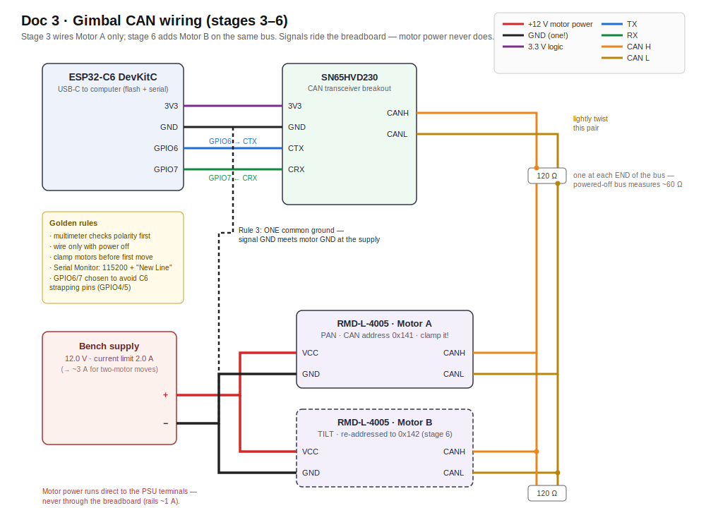

# Doc 3 · Build the Gimbal — Bench Plan, Step by Step

**Engineered Lighting prototype series · July 2026**
For a first-time gimbal builder with limited electronics experience. Ten stages; each is one bench session with a "you're done when" checkpoint. Motors move on command by stage 4 — no mechanical work needed until stage 7.

## Bill of Materials — buy this, ~$340–385 total

*"Est." = total price for the quantity shown in that row.*

| # | Part | Qty | Est. | Where | Notes / traps |
|---|---|---|---|---|---|
| 1 | **MyActuator RMD-L-5005-100-C** (CAN variant; the -R twin is RS485) | 2 (+1 spare recommended — see note) | $215 for 2 / $322.50 for 3 | [Dings Motion USA](https://www.dingsmotionusa.com/rmd-l-5005), $107.50 ea | The smart pan/tilt actuators — motor, absolute encoder, and tuned controller in one 92 g, Ø49 mm puck; [Doc 2](02-choosing-the-motors.md) is the full story, and its availability addendum covers this exact part swap. Order the **-C (CAN)** variant explicitly. Ask the seller to include mating cables for the 4-pin port (VCC/GND/CANL/CANH) — one per motor plus a spare — and keep the protocol PDF that ships in the box: it's the authority on byte layouts for your unit's firmware. Why 3: this motor family sells out episodically; the third unit is the permanent bench-dev unit and feeds the future second fixture |
| 2 | ESP32-C6 dev board (ESP32-C6-DevKitC-1) | 1 | $9–15 | Amazon, Adafruit, DigiKey | Same chip as the fixture — everything learned transfers |
| 3 | SN65HVD230 CAN transceiver breakout (Waveshare "CAN Board") | 2 (1+spare) | $8 | Amazon | The ESP32 has the CAN *brain* on-chip but not the line driver — this little board is the voice, converting chip signals to the differential CAN wire pair. 3.3 V logic, breadboard-friendly. Bus termination gets measured and set in stage 3 |
| 4 | 120 Ω resistors, ¼ W | few | $1 | any resistor kit | CAN bus termination |
| 5 | Bench power supply, **≥3 A continuous, adjustable current limit** | 1 | $45–60 | Amazon (any 30 V/5 A unit) | Powers the motors and, later, the whole bench. The adjustable current limit is smoke insurance for a first build, and the 3 A rating covers the motors' real appetite (~1–1.5 A running, 5–8 A instantaneous peaks) |
| 6 | Multimeter | 1 | $20 | Amazon | Non-negotiable — polarity check before every first power-up |
| 7 | Breadboard + jumper wires | 1 kit | $10 | Amazon | Signals only — power never routes through it |
| 8 | USB-C data cable | 1 | — | you own one | Charge-only cables are a classic trap |
| 9 | M2.5 + M3 screw assortment | 1 box | $10 | Amazon | Confirm sizes against the motor drawing ([myactuator.com](https://www.myactuator.com) downloads) |
| 10 | USB-to-CAN adapter ("CANable" or clone) — *optional but recommended* | 1 | $20–25 | Amazon | Lets your laptop eavesdrop on the bus; turns "nothing happens" into readable evidence |
| 11 | PETG filament + access to any FDM 3D printer & slicer; 6804 or 608 bearings | — | $20 | Amazon / local makerspace | For stage 7's three frame parts. No printer at home? A library, makerspace, or online print service works — the parts are small |
| 12 | C-clamp or small bench vise | 1 | $10 | hardware store | Stage 4 clamps the bare motor before its first move; stages 7–8 clamp the assembled rig |
| 13 | Payload stand-in: small flashlight or ~100 g weight | 1 | — | — | Real LED head comes from [Doc 4](04-full-fixture-bench.md) |

*Family sold out again? [CubeMars GL40 II](https://www.digikey.com/en/products/detail/cubemars/GL-40/16705289) ($134, DigiKey, direct-drive, CAN) is the buy-today alternative at the cost of a protocol port; [M5Stack RollerCAN](https://shop.m5stack.com/products/rollercan-unit-with-bldc-motor-stm32) ($44) is the dev bridge while waiting.*

## Concepts in six terms

- **CAN bus:** a two-wire intercom line. Every device has an address (ours: pan = 0x141, tilt = 0x142 — hex numbers are just house numbers). Messages are always **8 data bytes** — short frames get silently ignored (a documented real-user bug).
- **Transceiver & termination:** the ESP32 has the CAN *brain* on-chip but not the *voice* — the SN65HVD230 chip is the voice. The wire pair needs a 120 Ω resistor at each end (termination) so signals don't echo.
- **Current limit:** a bench supply setting that caps output current. Set low, a wiring mistake fizzles instead of smoking. Our bring-up setting: **2.0 A** (enough for one motor to run; still safe).
- **Common ground:** two power sources (USB-powered ESP32, 12 V motor supply) must share one ground wire, or signals have no reference and *nothing works*. The #1 "why is it dead" cause.
- **Absolute encoder:** the motor knows its angle the instant power arrives — within one revolution (it can't count full turns made while off, so the frame gets hard stops).
- **0xA4:** the workhorse command of this build — "go to angle X, no faster than Y°/s," packed in 8 bytes. The motor does all trajectory math onboard. (A few housekeeping commands appear too: 0x92 read-angle, 0x79 set-address, 0x63/0x64 set-zero.)

---

## Stage 1 — Bench setup and the three rules

Set the supply to **12.0 V, current limit 2.0 A** *before* connecting anything (12 V is gentler for bring-up; motors accept 12–24 V; raise toward 3 A in stage 6 for two-motor moves).

The rules that prevent 90% of beginner damage: **(1)** multimeter checks polarity before every first power-up; **(2)** wire only with power off; **(3)** one common ground between ESP32 and motor supply.

**Done when:** supply reads 12.0 V / 2.0 A limit and you can explain rule 3.

## Stage 2 — Hello, ESP32 (and exactly how code gets onto the board)

!!! agent-prompt "🤖 Give this to your agent"

    ```text
    You're my bench agent for the Engineered Lighting gimbal build
    (chapter: engineering.engineered.lighting/03-build-the-gimbal/, stage 2).
    An ESP32-C6-DevKitC-1 is plugged into this computer by USB-C. Start by
    proposing a plan and wait for my approval before executing anything.
    Then: install arduino-cli if missing, install the esp32 core (>=3.x),
    detect the board's port, compile and upload the stock Blink example
    (FQBN esp32:esp32:esp32c6), then open a serial monitor at 115200 and
    show me 10 seconds of output. Done when: the LED blinks and you've shown
    me serial output. If upload fails at "Connecting…", tell me to hold the
    BOOT button and retry rather than guessing. Report back: the exact
    commands you ran and the captured output.
    ```

    *[How to run this prompt →](00b-ai-native-workflow.md)*

Every sketch in this doc reaches the board the same way — learn it once here:

<details markdown="1">
<summary>Do it by hand — understand what the agent did</summary>

1. Download **Arduino IDE 2.x** from arduino.cc and install.
2. Open **Boards Manager** (second icon in the left sidebar) → search "esp32" → install **"esp32 by Espressif Systems," version 3.x or newer** (this teaches the IDE about the C6). Takes a few minutes.
3. Plug the dev board in with a **USB-C data cable**.
4. **Tools → Board → esp32 → "ESP32C6 Dev Module"**, then **Tools → Port →** the entry that appeared when you plugged in (Windows: `COM5`-style; Mac: `/dev/cu.usbmodem…`). Not sure which? Unplug, note the list, replug — the new one is yours.
5. Open **File → Examples → 01.Basics → Blink**. Click the **✓ (Verify)** button to compile, then the **→ (Upload)** arrow. The black console below should march through `Writing at 0x… (100%)` and end with `Hard resetting…`.
6. To *see* what the board says: open **Serial Monitor** (magnifying-glass icon, top right), set the dropdown to **115200 baud**, and set the line-ending dropdown beside it to **"New Line"** (the sketches read commands terminated by a newline — with the wrong setting, typed commands sit there doing nothing). This window is your conversation with the microcontroller — every stage-4+ command gets typed here, every reply appears here.
7. From now on: **File → New Sketch → paste the code from this doc → Upload → open Serial Monitor.** That's the whole workflow.

</details>

**Done when:** LED blinks and text appears in Serial Monitor.
**If stuck:** port never appears = charge-only cable (swap it). Upload dies at `Connecting…` = hold the board's **BOOT** button until writing starts. Gibberish in the monitor = baud isn't 115200.

## Stage 3 — Wire the CAN line

*Hands-on stage — no agent lane; the level-3 wiring photo check applies.*



*Color diagram (covers stages 3–6; stage 3 wires Motor A only — Motor B is the dashed box). Plain-text version below for quick bench reference:*

<details markdown="1">
<summary>Plain-text wiring (quick bench reference)</summary>

```
ESP32-C6                SN65HVD230 board          RMD-L-5005 motor
--------                ----------------          ----------------
3V3  ──────────────────  3V3
GND  ──────────────────  GND ───────┬───────────  GND (power minus)
GPIO6 (TX) ────────────  CTX        │
GPIO7 (RX) ────────────  CRX        │
                          CANH ─────┼───────────  CAN H     ← lightly twist
                          CANL ─────┼───────────  CAN L     ← these two
                                    │
Bench supply +12V ──────────────────┼───────────  VCC (power plus)
Bench supply GND ───────────────────┘
```

</details>

Annotations:

- **Why GPIO6/7:** many online examples use GPIO4/5, which are *strapping pins* on the C6 (read by the chip at boot). They usually work; avoiding them removes a category of weird boot behavior for free.
- **Termination check:** with everything unpowered, measure resistance CANH↔CANL. ~120 Ω = one resistor present somewhere; ~60 Ω = two (correct); open = none. Add external 120 Ω resistors until the bus reads ~60 Ω.
- **Motor power never touches the breadboard** (rails are ~1 A). Motor + and − go directly to the supply terminals; only thin signal wires (CAN pair, signal ground) touch the breadboard.

**Done when:** wired, powered, nothing warm.

## Stage 4 — First contact: read, then move

!!! agent-prompt "🤖 Give this to your agent"

    ```text
    You're my bench agent for the Engineered Lighting gimbal build
    (chapter: engineering.engineered.lighting/03-build-the-gimbal/, stage 4).
    The stage-3 wiring is live on the bench: ESP32-C6 and SN65HVD230 on the
    breadboard, one RMD-L-5005 motor clamped to the bench, supply at 12.0 V
    with the 2.0 A current limit set. Start by proposing a plan and wait for
    my approval before executing anything. Then: compile and upload the
    stage-4 sketch in the chapter (FQBN esp32:esp32:esp32c6, TX=GPIO6,
    RX=GPIO7, CAN at 1 Mbit/s), open serial at 115200 with newline line
    endings, and send r to read the angle (command 0x92) BEFORE any motion —
    any reply at all is the win. Only after I confirm the read: one small
    watched move, a10 (command 0xA4 at 30 deg/s). Traps: CAN frames are
    always 8 data bytes — short frames are silently ignored; the first
    absolute move can sweep up to a half-turn because factory zero is
    arbitrary; if upload dies at "Connecting…", tell me to hold the BOOT
    button and retry rather than guessing; if there is no CAN reply, print
    the twai_get_status_info error counters after a send — climbing counters
    mean wiring, not code.
    SAFETY — non-negotiable: never command motor motion unless I confirm
    I'm watching with a hand near the supply switch. The bench current limit
    stays as set. Announce each motion command before sending it and wait
    for my explicit go.
    Done when: commanded angles work and the power-cycle trick passes.
    Report back: the exact commands you ran and the captured serial output,
    including the raw 0x92 reply frames.
    ```

    *[How to run this prompt →](00b-ai-native-workflow.md)*

**Clamp the motor to the bench first** — a commanded motor twists its own body as hard as its shaft; unclamped motors jump.

Upload:

```cpp
#include "driver/twai.h"

void setup() {
  Serial.begin(115200);
  twai_general_config_t g = TWAI_GENERAL_CONFIG_DEFAULT(
      (gpio_num_t)6, (gpio_num_t)7, TWAI_MODE_NORMAL);   // TX=GPIO6, RX=GPIO7
  twai_timing_config_t t = TWAI_TIMING_CONFIG_1MBITS();  // RMD motors talk at 1 Mbit/s
  twai_filter_config_t f = TWAI_FILTER_CONFIG_ACCEPT_ALL();
  twai_driver_install(&g, &t, &f);
  twai_start();
  Serial.println("CAN up. r = read angle, a<deg> = move (a45), z = go to 0");
}

void send8(uint32_t id, uint8_t d0,uint8_t d1,uint8_t d2,uint8_t d3,
                        uint8_t d4,uint8_t d5,uint8_t d6,uint8_t d7) {
  twai_message_t m = {}; m.identifier = id; m.data_length_code = 8;   // ALWAYS 8 bytes
  uint8_t d[8] = {d0,d1,d2,d3,d4,d5,d6,d7}; memcpy(m.data, d, 8);
  twai_transmit(&m, pdMS_TO_TICKS(100));
}

// 0xA4 = "go to <deg> absolute, max <dps> deg/sec". deg → hundredths, little-endian.
void moveTo(float deg, uint16_t dps) {
  int32_t p = (int32_t)(deg * 100.0f);
  send8(0x141, 0xA4, 0x00, dps & 0xFF, dps >> 8,
        p & 0xFF, (p >> 8) & 0xFF, (p >> 16) & 0xFF, (p >> 24) & 0xFF);
}

void loop() {
  if (Serial.available()) {
    String c = Serial.readStringUntil('\n'); c.trim();
    if (c == "r")      send8(0x141, 0x92,0,0,0,0,0,0,0);   // read angle
    else if (c == "z") moveTo(0, 30);
    else if (c.startsWith("a")) moveTo(c.substring(1).toFloat(), 30);
  }
  twai_message_t rx;
  if (twai_receive(&rx, 0) == ESP_OK) {
    Serial.printf("reply id=0x%03X data=", (unsigned)rx.identifier);
    for (int i = 0; i < 8; i++) Serial.printf("%02X ", rx.data[i]);
    Serial.println();
  }
}
```

The session: type `r` — **any reply is the win** (proves wiring, transceiver, bitrate, motor). Then `a10` — the motor turns to absolute 10° and holds (it resists a gentle hand). Heads-up on the very first move: the factory zero is wherever assembly left it, so the first absolute command may sweep up to a half-turn — calm at the 30°/s limit, but that's why the motor is clamped. Play with `a45`, `a-30`, `z`.

**The no-homing party trick:** move to `a45`, kill motor power, nudge the shaft (less than a full turn), power on, type `r` — it still knows its angle. That's the product's silent-wake feature. Fine print: single-turn encoder, so the frame gets hard stops making a full off-power revolution impossible.

**Done when:** commanded angles work and the power-cycle trick passes.
**If stuck (no reply):** first check the software non-bug — Serial Monitor line-ending set to "New Line" (stage 2, step 6)? Then hardware, in order: CANH/CANL swapped → missing common ground → motor unpowered → termination. The driver fails *silently* on a broken bus; print `twai_get_status_info` error counters after a send (climbing counters = wiring, not code). This is where the $20 USB-CAN dongle earns its keep.

## Stage 5 — Characterize (the measurements everything depends on)

!!! agent-prompt "🤖 Give this to your agent"

    ```text
    You're my bench agent for the Engineered Lighting gimbal build
    (chapter: engineering.engineered.lighting/03-build-the-gimbal/, stage 5).
    The stage-4 rig is live: one clamped motor answering 0x92/0xA4 over CAN,
    and I'm standing by with a phone dB app and the supply ammeter — I call
    out every meter reading, you log it. Start by proposing a plan and wait
    for my approval before executing anything. Then drive the stage's
    measurement sweeps using the stage-4 sketch in the chapter: noise at
    hold and during moves at 10 / 30 / 60 / 90 deg/s (phone at 30 cm, same
    app throughout so stage-10 numbers compare); hold current unloaded and
    then with ~100 g hung 4 cm off-axis; warmth after 30 minutes holding;
    and the resolution steps a10.00, a10.50, a10.05 with a flashlight taped
    on while I watch the wall. Pause after each condition, prompt me for the
    reading, and build the noise/current table as we go. The fast rows
    matter most: follow-me needs 54–80 deg/s on close passes, so they decide
    whether tracking stays silent or gets speed-capped.
    SAFETY — non-negotiable: never command motor motion unless I confirm
    I'm watching with a hand near the supply switch. The bench current limit
    stays as set. Announce each motion command before sending it and wait
    for my explicit go.
    Done when: the numbers are written down.
    Report back: the completed noise/current table and the serial log of
    every command you sent.
    ```

    *[How to run this prompt →](00b-ai-native-workflow.md)*

- **Noise** (phone dB app — pick one and stick with it so stage-10 numbers compare, e.g. NIOSH SLM on iOS or Sound Meter on Android; 30 cm distance): at hold, and during moves at **10 / 30 / 60 / 90 °/s**. Quiet room ≈ 30–40 dB. Two verdicts ride on this: whine *at hold* (the sealed loop can't be retuned — this is the RMD bet's one risk), and the speed where motion becomes audible — **follow-me needs 54–80°/s on close passes** ([Doc 5](05-teach-it-to-aim.md)), so the fast rows decide whether tracking stays silent or gets speed-capped.
- **Hold current** (supply ammeter): unloaded, then with ~100 g hung 4 cm off-axis — previews why the balanced head matters.
- **Warmth** after 30 min holding: warm fine; too-hot-to-touch is thermal-budget data.
- **Resolution feel:** step `a10.00 → a10.50 → a10.05` with a flashlight taped on; watch the wall (0.05° ≈ 2 mm at 2.4 m).

**Done when:** the numbers are written down.

## Stage 6 — Second motor, one bus

!!! agent-prompt "🤖 Give this to your agent"

    ```text
    You're my bench agent for the Engineered Lighting gimbal build
    (chapter: engineering.engineered.lighting/03-build-the-gimbal/, stage 6).
    Motor B is on the bench at the factory address, connected ALONE on the
    CAN pair; motor A is disconnected for the re-address step. Start by
    proposing a plan and wait for my approval before executing anything.
    Then: change motor B's ID to 2 with command 0x79 per the manual's "CAN
    ID setting" section — send that write exactly once, never in a loop
    (it's a persistent flash write, so wear is real, and it only takes
    effect after a reboot), have me power-cycle the motor, and verify it
    now answers at 0x142. Next I'll daisy-chain both motors on one
    CANH/CANL pair and raise the supply current limit toward 3 A; then
    extend the stage-4 sketch in the chapter with a b<deg> command for
    motor 0x142 and a combined p<deg> t<deg> command that sends the two
    0xA4 frames back-to-back (~0.1 ms apart — simultaneous for a
    spotlight).
    SAFETY — non-negotiable: never command motor motion unless I confirm
    I'm watching with a hand near the supply switch. The bench current limit
    stays as set. Announce each motion command before sending it and wait
    for my explicit go.
    Done when: combined pan+tilt commands move both motors; each still
    answers alone.
    Report back: the sketch diff and serial captures showing replies from
    both 0x141 and 0x142.
    ```

    *[How to run this prompt →](00b-ai-native-workflow.md)*

Motors ship with the same address, so: connect motor B **alone**, change its ID to 2 (command 0x79 per the manual's "CAN ID setting" section, or MyActuator's PC tool), power-cycle, verify it answers at 0x142. Then daisy-chain both on one CANH/CANL pair, raise the current limit toward 3 A, extend the sketch with `b<deg>` and a combined command (two frames back-to-back ≈ 0.1 ms apart — simultaneous for a spotlight).

> From here on, some stages describe *what* to add rather than printing every line — deliberately: this is where the **AI-as-lab-partner workflow (below)** takes over. "Extend the stage-4 sketch with a `b<deg>` command for motor 0x142 and a combined `p<deg> t<deg>` command" is a one-prompt job.

**Done when:** combined pan+tilt commands move both motors; each still answers alone.

## Stage 7 — Print the frame, balance the head

*Hands-on stage — no agent lane; the level-3 wiring photo check applies.*

Three printed parts (design against the L-5005 STEP files from [myactuator.com](https://www.myactuator.com); PETG, 4+ perimeters):

1. **Pan base** — clamps to a shelf so the assembly hangs downward; pan motor body bolts to it (the motor's output flange *is* the pan bearing).
2. **Yoke** — U-bracket on the pan flange; one arm carries the tilt motor, the other a bearing pin. **Include hard stops** (see stage 4 fine print).
3. **Head shell** — flashlight/LED on the tilt flange, with a **counterweight slot** (slide coins/a bolt).

**Never designed a part before?** This is a genuinely good first CAD project (three simple brackets), and it's also prime AI-partner territory: **OpenSCAD** is CAD written as code, which means Claude can draft all three parts for you — give it the motor's flange dimensions from the L-5005 drawing (bolt-circle diameter, hole size, body diameter) and this stage's descriptions, print, measure what's off, iterate. Two or three print cycles is normal; the parts are 20-minute prints. Geometry references if you want to see how others shaped a yoke: [isaac879's Pan-Tilt-Mount](https://github.com/isaac879/Pan-Tilt-Mount) and the [Visaging ESP32-Gimbal](https://github.com/Visaging/ESP32-Gimbal) (both printable designs).

Wire routing: motor pigtails (power + CAN) cross each joint as a loose **service loop** — droopy, never taut across full travel.

**Balancing (the important 20 minutes):** power OFF, the head should stay wherever you pose it. If it flops, slide the counterweight. Balanced head = near-zero hold current = silent and cool. Verify: hold current at 0°/45°/90° tilt barely differs from the unloaded stage-5 reading.

**Done when:** the powered-off head stays posed anywhere; powered moves are smooth, no cable snags.

## Stage 8 — Aim at the room

!!! agent-prompt "🤖 Give this to your agent"

    ```text
    You're my bench agent for the Engineered Lighting gimbal build
    (chapter: engineering.engineered.lighting/03-build-the-gimbal/, stage 8).
    The balanced rig from stage 7 is clamped at a measured height h above
    the desk, with a desk-corner origin and taped target marks measured in
    meters. Start by proposing a plan and wait for my approval before
    executing anything. Then: extend the stage-6 sketch in the chapter with
    a goto x y serial command implementing the stage's math — pan =
    atan2(y_t - y_f, x_t - x_f), tilt = atan(horizontal_distance / h) —
    using the h and fixture position (x_f, y_f) I give you. Upload, then
    walk the beam between the taped marks one goto at a time, logging
    commanded target vs. where the beam actually lands so we can see the
    systematic error (mount lean, zero offsets) — in the product that
    becomes a one-time install calibration.
    SAFETY — non-negotiable: never command motor motion unless I confirm
    I'm watching with a hand near the supply switch. The bench current limit
    stays as set. Announce each motion command before sending it and wait
    for my explicit go.
    Done when: goto 0.5 0.3 lands within a few cm, repeatably.
    Report back: the sketch diff, the goto commands you sent, and the
    logged table of commanded vs. actual landings with the systematic
    offset noted.
    ```

    *[How to run this prompt →](00b-ai-native-workflow.md)*

Clamp the rig at height *h* above the desk. Pick an origin (a desk corner), measure in meters. For a target at (x_t, y_t) with the fixture at (x_f, y_f): `pan = atan2(y_t − y_f, x_t − x_f)`, `tilt = atan(horizontal_distance / h)`. Add a `goto x y` serial command implementing that; walk the beam between taped marks; note the systematic error (mount lean, zero offsets) — in the product this becomes a one-time install calibration.

**Done when:** `goto 0.5 0.3` lands within a few cm, repeatably.

## Stage 9 — Hand the keys to the network

!!! agent-prompt "🤖 Give this to your agent"

    ```text
    You're my bench agent for the Engineered Lighting gimbal build
    (chapter: engineering.engineered.lighting/03-build-the-gimbal/, stage 9).
    The aimed rig from stage 8 is on the bench, and a Home Assistant
    machine running the Mosquitto broker add-on is on the LAN — I'll give
    you its IP and the WiFi details. Start by proposing a plan and wait for
    my approval before executing anything. Then: add WiFi + MQTT to the
    stage-8 sketch in the chapter using the PubSubClient and ArduinoJson
    libraries. Subscribe to spotlight/target and parse the Doc 6 envelope
    {"v":1,"ts":1784150000000,"pan":32.5,"tilt":-14,"rate":10} — v and ts
    are the contract's mandatory envelope fields — into the two CAN frames,
    and publish read-back angles every few seconds. Then test end to end:
    publish a target from this laptop (mosquitto_pub or MQTT Explorer),
    watch the read-back topic confirm the move, and do the final check with
    the USB cable unplugged.
    SAFETY — non-negotiable: never command motor motion unless I confirm
    I'm watching with a hand near the supply switch. The bench current limit
    stays as set. Announce each motion command before sending it and wait
    for my explicit go.
    Done when: an MQTT publish from your laptop aims the beam, no USB
    attached.
    Report back: the sketch diff and a mosquitto_sub -t 'spotlight/#' -v
    capture showing the published target and the read-back angles that
    followed.
    ```

    *[How to run this prompt →](00b-ai-native-workflow.md)*

Add WiFi + MQTT: install the **PubSubClient** and **ArduinoJson** libraries (Sketch → Include Library → Manage Libraries, search by name). The broker is the **Mosquitto add-on in Home Assistant** ([Doc 4's prerequisites box](04-full-fixture-bench.md#prerequisites)) — point the sketch at your HA machine's IP. Behavior: subscribe to **`spotlight/target`**, parse `{"v":1,"ts":1784150000000,"pan":32.5,"tilt":-14,"rate":10}` (`v`/`ts` are the contract's mandatory envelope fields — [Doc 6](06-message-contract.md)) → two CAN frames; publish read-back angles every few seconds. Note: this MQTT lane is the *bench* interface — production replaces it with a direct native-API action ([Doc 6 §1](06-message-contract.md#1-spotlighttarget-aim-commands-gpu-box-fixture-stream-15-hz)). (Another one-prompt AI-partner job: "add WiFi+MQTT to this sketch per this paragraph.") Test from MQTT Explorer or a Home Assistant automation.

**Done when:** an MQTT publish from your laptop aims the beam, no USB attached.

## Stage 10 — Verdict checklist

- [ ] Hold noise, balanced head, several angles — indistinguishable from the room (<~35 dB)
- [ ] Sweep noise at 10–90°/s (the speed-vs-silence decision)
- [ ] Repeatability: same `goto` mark 20×, scatter ≤ 1 cm at 1 m (≈0.5°)
- [ ] Power-loss recovery: correct angle knowledge, zero homing motion
- [ ] 4-hour hold: current, temperature, no intermittent whine
- [ ] 50 full-travel sweeps: service loops intact
- [ ] Total power draw at 24 V — record it for the fixture power budget (external design doc: the fixture brief's ~60 W mode-based table)

**Pass** → the architecture graduates to the fixture's lower-module PCB (C6 TWAI + $2 transceiver, actuators as-is). **Whine or heat at hold** → try the other supply voltage (24 V vs 12 V), re-balance harder, then fall back to the DIY FOC path ([Doc 2](02-choosing-the-motors.md), "The DIY path and its documented pain") where you own the loop.

## AI as your lab partner

The Serial Monitor output, compiler errors, and CAN frames in this build are all text — which makes every debugging step here something an AI can read, reason about, and often fix. Four levels, in order of setup effort:

**Level 0 — paste the evidence (zero setup).** When something misbehaves, paste into Claude: the *entire* sketch, the *entire* Serial Monitor output (not excerpts — the boring lines are often the clue), and one sentence on what you expected. Compiler errors especially: ESP32 toolchain errors are verbose and AI-friendly. This alone resolves most beginner walls.

**Level 1 — let the agent drive the board (Claude Code + arduino-cli).** Arduino has a command-line twin, `arduino-cli`, which means a coding agent with shell access can run the whole loop itself:

```bash
arduino-cli compile --fqbn esp32:esp32:esp32c6 gimbal_sketch/ --upload -p /dev/cu.usbmodem101
arduino-cli monitor -p /dev/cu.usbmodem101 -c baudrate=115200
```

Run Claude Code in the folder holding your sketch (keep it in git so edits are reviewable) and ask things like: *"Upload this, send `r` over serial, capture 30 seconds of output, and tell me why the reply frames don't decode as angles."* (For scripted send-and-capture the agent will typically write itself a five-line pyserial helper rather than use the interactive monitor — let it.) The agent edits, recompiles, re-uploads, and re-reads output in a loop — the same iteration you'd do by hand, minus the hand. Give it these docs as context so it knows the pins, addresses, and protocol.

**Level 2 — let the agent see the bus and the telemetry.** The optional USB-CAN dongle (BoM #10) turns raw bus traffic into text an agent can decode. On a Mac bench (yours), that's a small **python-can** script with the dongle in `slcan` mode streaming every frame as text; on a Linux box it's one command (`candump can0`). Either way, Claude can diff what's on the wire against the RMD protocol PDF — far better than a human squinting at hex. Once stage 9 adds MQTT, `mosquitto_sub -t 'spotlight/#' -v` gives an agent live telemetry to watch while it commands test moves and checks the reported angles match.

**Level 3 — let it see the bench.** Photograph the breadboard and ask Claude to check the wiring against this doc's stage-3 diagram before first power-up. Cheap, catches swapped CANH/CANL and missing grounds surprisingly well.

**One hard rule:** the agent never commands motion unattended. Current limit stays set, your hand stays near the supply switch, and any agent-driven test that moves the motor happens while you watch. Agents are excellent at reading; keep the physical-safety authority human.

## Reference card

| Thing | Value |
|---|---|
| CAN bitrate / frame size | 1 Mbit/s · always 8 data bytes |
| Motor addresses | pan 0x141 · tilt 0x142 (set via cmd 0x79) |
| Move command | 0xA4: `[A4 00 spdLo spdHi pos0..pos3]`, pos = deg×100, int32 little-endian |
| Read angle / set zero | 0x92 · 0x63/0x64 (zero write needs reboot; do once, never in a loop — flash wear) |
| Pins | TX=GPIO6→CTX, RX=GPIO7←CRX (GPIO4/5 avoided: strapping pins) |
| Supply | 12 V bring-up @ 2.0 A limit (→~3 A two-motor); 24 V test in stage 10; motor power direct to PSU, never via breadboard |
| Golden rules | multimeter first · wire cold · one ground · twist CANH/CANL · balanced head = silent head |

## Risk register

- **Hold whine.** A balanced head should hold silently; audible whine at hold means current is fighting gravity — rebalance (stage 7's counterweight slot) before blaming the motor. Stage 5's hold-noise row is the baseline; stage 10 re-checks it at several angles.
- **Protocol drift.** Byte layouts vary across RMD firmware revisions — the protocol PDF that ships in the box is the authority for *your* unit, over anything online (including this doc's frame examples). When replies don't decode, diff against the PDF first.
- **Single-turn absolute encoder.** The motor knows its angle within one revolution but can't count full turns made while powered off — the frame's hard stops (stage 7) are what make power-loss recovery unambiguous. Don't delete them to save print time.
- **Supply volatility.** This motor family sells out episodically at retail (the 4005 did exactly that in July 2026 — see Doc 2's addendum). The third-unit spare in the BoM is the insurance; the alternates line under the BoM is the fallback path.
- **Speed vs. silence.** The 54–80 °/s band that follow-me needs (stage 5) may not be silent on your unit. If it isn't, the perception layer speed-caps close passes — losing some tracking snappiness — rather than accepting audible sweeps. Decide with stage-10 data, not hope.

## Further reading

- [MyActuator RMD-L-5005 downloads](https://www.myactuator.com) — the STEP files (stage 7 frame design) and the protocol PDF that is the authority on your unit's byte layouts.
- [isaac879's Pan-Tilt-Mount](https://github.com/isaac879/Pan-Tilt-Mount) — printable pan/tilt geometry worth studying before designing the yoke.
- [Visaging ESP32-Gimbal](https://github.com/Visaging/ESP32-Gimbal) — an ESP32-class gimbal build; different goals (stabilization), same mechanical vocabulary.
