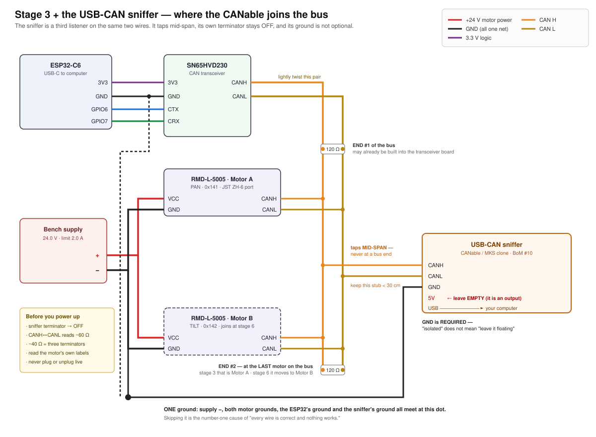

# Doc 3a · Wire It For Real — Connectors, Grounds, and the CAN Sniffer

**Engineered Lighting prototype series · July 2026**

The chapter [Doc 3](03-build-the-gimbal.md) stage 3 points at. Stage 3's diagram is a *schematic* — it shows which signal meets which signal. This is the other half: what those connections look like when you are holding the actual parts, which do not have bare wires hanging off them.

Four things bite first-time builders here, and none of them are in the schematic:

- The motor has a **6-pin connector**, not four wires, and it is a connector most people have never crimped.
- "One common ground" is a sentence until you are looking at a bench supply wondering where the wire goes.
- Some wires must split three ways; the rules for *how* differ depending on whether it is a signal or motor power.
- The optional USB-CAN adapter (BoM #10) is not in the stage-3 diagram at all.

Everything below is verified against the manufacturer's own manuals, and where two official documents disagree — they do, twice — this chapter says so instead of picking one.

---

## The motor's connector

The RMD-L-5005 has **one** power-and-comms port. It is a **JST ZH, 1.5 mm pitch, 6 position** — header `S6B-ZR-SM4A-TF` on the motor, mating housing `ZHR-6`, crimps `SZH-002T-P0.5` (AWG 28–26).

!!! trap "It is ZH, not XH"
    JST XH is 2.5 mm pitch — nearly twice the size — and it is what most hobby parts bins are full of. Order XH housings and nothing will fit. The pitch is the whole difference: **ZH = 1.5 mm**.

Six positions carry only four signals, because power is doubled up:

| Position | Signal |
|---|---|
| 1 | VCC |
| 2 | VCC |
| 3 | GND |
| 4 | GND |
| 5 | CANH |
| 6 | CANL |

The 70/90-size motors use an 8-position version of the same connector with three VCC and three GND. The `-R` (RS485) variant of your motor is identical except positions 5/6 are 485B and 485A.

### Read your own motor, not this table

**The housing is laser-marked with the signal names, right beside the connector.** That marking is the authority. Two reasons not to trust any table, including this one:

1. **Nobody documents which physical end is position 1.** Both official manuals give a left-to-right *order* as seen in a photo. Neither numbers the circuits. A pre-made pigtail can therefore land backwards.
2. **The two manuals disagree about CANH and CANL.** The RMD-L user manual says CANH then CANL; the MC-series driver manual says CAN_L then CAN_H. They agree completely on the power positions, which is the part that matters — and a swapped CAN pair is harmless, it just refuses to communicate.

Confirm with a multimeter on continuity before you power anything: **the two VCC contacts beep to each other, and the two GND contacts beep to each other.** That identifies both pairs with certainty, no power required.

Then check the connection that must *not* exist: **VCC↔GND must not beep.** Test it at the bare ends and again at the connector face once the joins are made and the heat-shrink is on. A single stray strand at a join is the most common way this harness fails, and it fails into the one fault the drive is not protected against.

!!! danger "Reverse polarity is documented as fatal"
    MC-series manual §4.1: *"It is strictly forbidden to reverse the interface… the circuit board will be burned."* The same manual's feature list claims "anti-reverse protection," but its own specification table does not list reverse-polarity among the protections. **Do not rely on it.** Ring out the harness first and bring it up current-limited.

    Also from the manual: *"Connect and then turn on the power, do not plug and unplug the terminal with power."* No hot-plugging, ever.

### Making the harness

The motors ship with cables terminated on **both** ends, and there is no official breakout for the L series. You will be making an adapter. The pragmatic route:

1. Keep the end that plugs into the motor. Cut the far connector off.
2. Strip **all six** conductors — both VCC wires and both GND wires, not one of each. Halving the contacts halves an already-marginal current budget.
3. Within a few centimetres of the connector, join the two VCC wires into one heavier lead and the two GND wires into another — 20 AWG is right for the run to the supply. A **WAGO 221 lever nut** does this without an iron (see *Motor power*, below); thin stranded wire at motor current makes a poor first soldering job.
4. Terminate however your bench likes: bare tinned ends, ferrules, or banana plugs.

Hand-crimping ZH at 1.5 mm pitch is genuinely difficult, which is why reusing the factory-crimped end beats starting from a bag of loose contacts.

!!! warning "The connector is the weak link, and it is not close"
    JST ZH is rated **1.0 A per contact** — roughly 2 A per rail with both contacts populated. The L-Series product manual rates this motor's driver at **5 A continuous, 8 A instantaneous**. (The MC-series manual says 3 A / 6 A for the same pairing — the two official documents conflict.)

    Either way the connector is far below the drive's ceiling. The model number's `100` is watts: at 24 V that is roughly 4 A, and at the 12 V we bring up on it is roughly 8 A — both well past what the connector can carry. **The connector, not the drive, sets your ceiling.**

    So keep the bench limit at **2.0 A** through stage 5, keep the ZH pigtail short, and set an explicit current ceiling in the configuration software rather than trusting the drive to stay modest. That 2.0 A is a connector limit, not a convenience setting: if the supply trips into current limit, find out why — do not raise it.

### One port, no daisy-chain

The RMD-**X** series has two identical ports so motors chain motor-to-motor. The **L** series does not — it has a single port, and both motors **T-tap off one trunk**. Stage 6 adds Motor B as a second tap, not as a link in a chain.

---

## One common ground, with a screwdriver in your hand

Stage 1's rule 3 says the ESP32 and the motor supply must share a ground. Here is what that means physically.

Think of voltage as height, always measured from some floor. Your ESP32 judges "is this signal high or low?" against *its* floor. The motor judges against *its* floor. If those two floors are not physically bolted together, neither one knows what the other means by 3.3 volts — and the bus sits there dead, with every individual wire perfectly correct. This is the number-one cause of a build that looks right and does nothing.

It is one wire, and it must be **clamped, not touched**:

1. Cut about 30 cm of wire and strip 10 mm off each end.
2. Push one end into the breadboard's ground rail — the same rail carrying the ESP32's GND pin and the transceiver's GND pin.
3. Take the other end to the bench supply's **black (−) terminal**. Binding post: unscrew the collar, wrap the bare wire clockwise around the post, screw it back down. Spring clip: press, insert, release.
4. Tug it. If it moves, do it again.

The supply's black terminal is now the single floor the whole bench measures against: supply −, both motor grounds, the ESP32's ground, and — once you add it — the sniffer's ground.

!!! trap "One exception to the single floor"
    The drive's serial debug port has its own ground, galvanically isolated from power ground. The manual is explicit: *"the GND of the serial port communication interface and the GND of the power supply are not the same and cannot be mixed."*

    Do not bond it to the bench floor, and never use a debug-port pin to find power ground. It is the only thing on the bench that does not belong to the star above.

---

## Where wires may split, and how

The rule that governs this is stage 3's third annotation: **signals may ride the breadboard, motor power may not.** Breadboard rails give up around 1 A; the motor's instantaneous rating is 6 A or 8 A depending on which manual you believe (see the connector warning above). Either figure is several times what a rail will carry.

### Signals: the breadboard *is* the splitter

That is what a breadboard does. Each row of five holes is one internally-connected node. CANH has three wires to join at stage 3 — one in from the transceiver, one out to the motor, one out to the sniffer — so push all three into different holes of the same row. No pigtails, no soldering, no connectors.

Same for CANL on its own row. This is why the CAN pair is allowed on the breadboard and motor power is not.

### Motor power: lever nuts, not pigtails

**Stage 3 needs no power splitting at all** — one motor, one feed. It first arrives at stage 6, when Motor B joins.

When it does, use **WAGO 221 lever nuts** (the same part [Doc 4](04-full-fixture-bench.md) uses for the fixture bench). A 3-way takes the supply's + in one port and feeds both motors from the other two; a second 3-way does the same for −.

1. Strip about 11 mm — the block has a strip gauge moulded into its side.
2. Lift the orange lever fully.
3. Insert the bare wire until it stops.
4. Close the lever. Tug-test.

Reusable, no iron, no heat-shrink, and openable when you change your mind. Soldered pigtails work too, but they are a poor first soldering job: thin stranded wire, high current, and no mechanical support. Many bench supplies will also accept two wires under one binding post, which is fine for two motors.

---

## Adding the USB-CAN sniffer

BoM #10 — a CANable or clone — is the difference between "nothing happens" and readable evidence. Stage 4's troubleshooting ladder is where it earns its price. It is a **third listener on the same two wires**.



Three rules, all of which the diagram shows:

**Tap mid-span, never at an end.** The two terminated nodes have to be the physical ends of the run. Hang the sniffer past one of them and the wire out to it becomes an unterminated leg that reflects. TI's application note puts the maximum un-terminated stub at **0.3 m** at 1 Mbit/s — keep the tap short.

**Its own terminator stays OFF.** Your bus already has two. Every CANable variant has a switch or jumper for this, and **no vendor documents the as-shipped position** — so set it off deliberately, then prove it with the resistance check below.

**Its ground must be connected.** This is the counterintuitive one. canable.io is explicit: *"You must connect ground for the CAN bus to function properly."* On an isolated "Pro" adapter, isolation separates the USB side from the CAN side — the CAN side still needs a ground reference shared with the bus it is listening to. **Isolated does not mean floating.** If your adapter has a 5 V pin — the 4-pin variants do, the 3-pin ones do not — leave it empty; it is an output.

!!! trap "Check which board you actually have"
    Openlight Labs sells the CANable, CANable 2.0, CANable Pro, and CANable Pro 1.1 — there is no "CANable 2.0 Pro" in their lineup. A board sold under that name is most likely the **MKS (Makerbase) CANable V2.0 Pro**, a different design built on an STM32G431.

    It matters twice. **Pin order:** no source documents the MKS board's terminal labels — read the silkscreen on the board in your hand. **Firmware:** mainline candleLight_fw states outright that *"STM32G431-based devices (e.g. CANable-MKS 2.0) are not supported by this project yet,"* and the MKS board uses a 64 KB flash variant while Openlight's firmware builds for the 128 KB part. Do not cross-flash them casually.

### Which firmware is on your board

Plug it in and look before installing anything. A **serial device** means slcan firmware; a **USB device with no serial port** means candleLight. Windows: Device Manager, look for a COM port. Mac: `ls /dev/cu.usb*`. Linux: `lsusb`, then `dmesg | tail`. That single observation picks your software path:

```python
# slcan build. Channel is COM4@115200 on Windows,
# /dev/cu.usbmodem14201@115200 on a Mac.
import can
bus = can.Bus(interface="slcan", channel="COM4@115200", bitrate=1000000)
for msg in bus:
    print(msg)
```

Use `interface=`, not the older `bustype=` — `bustype=` is deprecated in current python-can, and canable.io's own example is stale on this point. For a candleLight build, install `python-can[gs-usb]` and use `interface="gs_usb"` instead. On Linux, [Doc 3's](03-build-the-gimbal.md) lab-partner section notes `candump can0` does the same job in one command.

---

## The micro-USB board in the motor box

Some RMD orders include a small board with a micro-USB socket and a short keyed cable. **It is a USB-to-UART adapter for the motor's separate 4-pin debug port — not a USB-CAN adapter.** It has no CAN transceiver and cannot replace BoM #10.

What it is for is the vendor's Windows configuration GUI: setting the CAN ID, tuning the current/speed/position loops, running position calibration, and reading live telemetry. That overlaps usefully with stage 6, which sets the motor's address by broadcasting command `0x79` on the bus — doing it through the vendor tool instead avoids broadcasting anything.

!!! danger "Three things before you plug it in"
    **Do not connect the 5 V wire.** The vendor manual prints it in red: *"the wire need to connect to TX, RX, GND. MUST NOT to connect 5V."* A widely-copied community wiring table connects 5 V anyway — it is for a different motor family. Follow the vendor.

    **Use the supplied cable exactly as it shipped.** The board's pad order and the drive's pin order are not the same, so pin-1-to-pin-1 is wrong, and no document resolves whether the board's TX pad needs a crossover. Do not re-pin it.

    **The debug port's logic level is undocumented, and you must measure it against the right ground.** Put the black probe on the **debug port's own GND pin** — never on the supply's − terminal. Those two grounds are isolated from each other (see [One common ground](#one-common-ground-with-a-screwdriver-in-your-hand)), so referencing power ground gives you a meaningless floating number rather than an answer. With the drive powered and the debug connector unmated, read the drive's TX pin against the debug port's GND: an idle UART rests high, so a good reading is close to either 3.3 V or 5 V. Anything else means your reference is wrong — stop and re-check it rather than interpreting it. A 5 V adapter into a 3.3 V-only input is how these get damaged.

    Brace the probe or use a hooked test lead. Slipping across a 1.25 mm pitch connector shorts two pins together, which is its own way to end the afternoon.

One further caution: the configuration software version that lists the L-5005 (Setup Software V4.0) connects over **USB-CAN**, not serial. The only tool with a documented serial path is the older GUI 2.1, whose manual is written for the X series. So this board may not be sufficient on its own for an L-series motor — try it, but expect the CAN adapter to be the reliable path.

---

## Before you switch on

- [ ] Motor's laser-marked labels read, and the harness rung out against them
- [ ] Continuity confirms the two VCC contacts beep together, and the two GND contacts beep together
- [ ] **VCC↔GND does not beep**, measured at the finished harness
- [ ] Supply set to **12.0 V, limit 2.0 A** — before anything is connected
- [ ] One ground wire clamped from the breadboard rail to the supply's − terminal
- [ ] Powered-off resistance across CANH↔CANL reads **~60 Ω** (~120 Ω = one terminator, open = none, ~40 Ω = three)
- [ ] Nothing is plugged or unplugged from here on with the power on

*If you have the sniffer:* its terminator switched **off**, its ground connected, its 5 V pin empty.

**Done when:** the bench measures 60 Ω cold, VCC and GND are not shorted, polarity checks out at the motor plug, and you can point at the single place every ground meets.

Then go back to [Doc 3 stage 3](03-build-the-gimbal.md#stage-3-wire-the-can-line), switch on, and watch the supply's ammeter: a few tens of milliamps and nothing warm is stage 3 done. [Stage 4](03-build-the-gimbal.md#stage-4-first-contact-read-then-move) makes it talk.

---

## Sources

Verified against primary documents rather than forum lore:

- **RMD-L Series Servo Actuator User Manual** Rev 1.01, §3.1–3.5 — connector part number, signal order, debug header, DIP switch
- **MC Series Brushless Servo Driver Manual** V3.0 — the MC-L-100-O board integrated into this motor: pad layout, serial isolation, reverse-polarity and hot-plug warnings
- **L Series Product Manual** 251029 — L-5005 electrical ratings and the model-number decode (`100` is watts, not a gear ratio)
- **JST ZH series datasheet** — 1.0 A per contact, AWG 28–26, ZHR-6 and SZH-002T-P0.5
- **TI SLLA270**, *Controller Area Network Physical Layer Requirements* — 0.3 m stub limit, 40 m at 1 Mbit/s, single-point grounding
- **canable.io** getting-started, **Openlight Labs** product pages, **candleLight_fw** README

Where those sources conflict — CANH/CANL order, and the drive's current rating — this chapter reports both rather than choosing.
