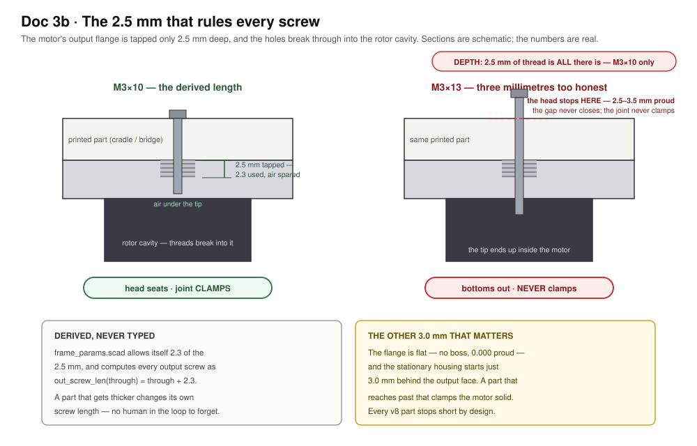

# Doc 3b · Print the Frame — Four Parts, Three Test Pieces, No Guesswork

**Engineered Lighting prototype series · July 2026**

The frame chapter [Doc 3](03-build-the-gimbal.md) stage 7 points at. Context, fixed: the motors are **RMD-L-5005** (Ø49 × 23.9 mm, 92 g), the spotlight payload is the **DLH-3UP-EH aluminium LED housing** (Ø0.99″ barrel, 1.26″ overall, flush front, hollow ½″-14 NPT rear stub the wires come out of), the printer is a **Bambu Lab X1C**, and the material is **PETG Basic**.

!!! note "This scaffold is reference, not the frame being built"
    The OpenSCAD in this chapter was machine-generated, and it is published as **worked reference** — a documented set of constraints, measured-from-STEP motor geometry, and a boolean test suite showing what a frame has to satisfy. **The frame actually going on this bench is being designed by hand**, with the scaffold as inspiration rather than a source of parts.

    Read the numbers here as *requirements* — the 2.5 mm tapped depth, the 3.0 mm of axial room before the stator, the 0.505 N and 0.0146 N·m the tilt axis carries, the unpublished bearing rating that argument rests on. Those hold for any frame. The specific parts, print orientations and gram counts describe one solution to them.

This is **frame v8**, and it is a ground-up rebuild. Two things drove it.

## What changed, and why it matters

**The motor is now read, not guessed.** Earlier revisions were built on an invented output flange — six holes on a Ø30 circle, an M4 rear mount on Ø43, a 4 mm output boss. None of those exist. The vendor's own STEP file is now in the repo at [`ref/RMD-L-5005-S.STEP`](https://github.com/hooterjackson/engineered-lighting-site/blob/main/ref/RMD-L-5005-S.STEP), parsed by [`ref/step_dump.py`](https://github.com/hooterjackson/engineered-lighting-site/blob/main/ref/step_dump.py), and written up in [`ref/RMD-L-5005-S.md`](https://github.com/hooterjackson/engineered-lighting-site/blob/main/ref/RMD-L-5005-S.md). What it says:

| | |
|---|---|
| Output face | **Flat.** A Ø47 annulus, then a 1 mm 45° chamfer out to Ø49. **There is no boss** — stand-proud is 0.000 mm |
| Output bolts | 4 × M3 on **Ø25**, tapped only **2.500 mm deep**, breaking through into the rotor cavity |
| Stationary housing | begins **3.000 mm** back from the output face |
| Rear mount | 4 × M2.5 on a **20 × 20 mm square** (Ø28.284 at 45°), 10.7 mm deep |
| Through bore | **Ø8.1** ("S" variant) |
| Anything protruding past Ø49 | **Nothing.** Max radius anywhere is exactly R24.5. The connectors are recesses cut *into* the casting |

That 2.5 mm thread depth is the single most constraining number in the design. Every M3 into an output flange is **M3 × 10**, derived from it. The previous revision's assembly drawing called for M3 × 13 and M3 × 14 — both bottom out 2.5–3.5 mm before the head seats, so the joint never clamps and the screw tip ends up inside the motor.



**The idle side of the tilt axis is gone.** No trunnion, no bearing carrier, no 608, six fewer screws, one fewer yoke arm. The head cantilevers off the tilt motor's own output.

That deletes 62 g from a 177 g machine to carry **0.505 N and 0.0146 N·m** — about 3.5% of the motor's peak torque, with 0.58 N of prying on the output bolts against an M3 proof load near 2000 N. It also removes an *over-constrained* twin-bearing axis: two bearings on one axis need the printed parts to be coaxial with the motor's own bearing, which printed parts cannot guarantee, and which the old design papered over with a build-time "leave three screws loose, swing the head, then tighten" ritual. A misaligned second bearing loads the motor's bearing sideways — it can make worse the thing it is supposed to protect.

!!! warning "One number here is unverified, and it is the important one"

    **The RMD-L manual publishes no bearing load ratings at all.** There is no radial or moment figure for the output. The case for the cantilever is an argument from load magnitude and from the journal diameter — the STEP shows the rotor running in a Ø46.6 bore, and moment capacity scales with that — **not** from a datasheet. The load numbers are echoed on every render so that if the head ever grows, the change is visible instead of silent. If a rating ever surfaces, check it against 0.505 N and 0.0146 N·m.

## The four parts

| Part | What it is | Mass |
|---|---|---|
| `base_plate` | The only part that touches the world. The pan motor's rear bolts up into it, heads counterbored flush; a tongue reaches aft for the C-clamp; a buttressed post hangs down as the pan hard stop | 33.4 g |
| `yoke` | Bridge disc and **one** arm, one piece. Prints standing on its bridge with the arm pointing up — zero supports, and no joint to align because there is no joint | 47.0 g |
| `cradle` | The head's saddle. Bolts flat to the tilt motor's output face and holds the lower half of the housing bore | 23.2 g |
| `cradle_cap` | The other half of the clamp. Four screws pinch the housing between the halves | 21.0 g |
| | **printed machine** | **124.6 g** |

Masses are measured off the exported STLs at PETG density by [`tools/meshcheck.py`](https://github.com/hooterjackson/engineered-lighting-site/blob/main/tools/meshcheck.py), which computes volume and centre of mass twice — once from a hand-rolled divergence-theorem sum, once from `trimesh` — and refuses to report a centre of mass without a stated coordinate frame. v7 was 177.1 g across six parts.

Plus three test pieces that exist to be wrong cheaply, in the order you print them:

**`tol_coupon`** (14.9 g) measures *your printer*. FDM gets holes and shafts wrong in opposite directions — a hole comes out undersize, a post oversize — and every fit here derives from three constants that say by how much. Find which test hole your M3 drops through, which drilled-sideways hole it drops through, and which post measures nominal. Type three numbers into `frame_params.scad` and the whole set resizes itself.

**`fit_coupon`** (11.4 g) checks the *motor*: **two separate tiles**, one per bolt circle. They are separate on purpose — drawn concentrically, the Ø25 and Ø28.284 circles overlap into merged slots, and an M3 and an M2.5 both drop through the same hole, so the coupon proves neither circle.

**`bore_gauge`** (14.2 g) checks the *housing*: a 12 mm slice of the real clamp, both halves lying flat on the bed, the cap half crown-down so its bore prints as a valley exactly as the real cap does.

## The rules the design follows

**Every joint is a bolt you can see.** No tabs, no captive nuts, nothing friction-fit. Printed-to-motor joints use the motor's own threads; printed-to-printed self-taps into printed pilot holes.

**Every fit is derived, never typed.** Three measured constants and the fit functions built on them. Horizontal (bridged) holes get their own class, because a sideways hole prints with a sagging roof and comes out worse than a vertical one.

**The part lands flat on a flat face.** There is no boss to register on, so the four M3 locate it. A plate laid on the output face sits on the Ø47 annulus and has **3.0 mm of axial room at full Ø49** before it touches the stator — which is what would clamp the motor solid.

**Nothing bridges.** The hard stop is a post and a lug that *collide*, not a post in an arc groove: the old groove was 1565 mm² of flat roof with 45 mm unsupported runs printed over a 0.6 mm clearance. There is no groove now, so the whole failure mode is deleted rather than mitigated. The clamp bore is two valleys. Horizontal round holes are hexagons with a vertex up, so the roof is a 60° peak.

!!! note "A trick that only works in one direction"

    The hexagon-vertex-up trick helps a hole whose **axis is horizontal**, where the hexagon's apex becomes the roof. A pocket cut straight down into a face has a flat roof whatever its plan shape. The cap's crown pocket was removed rather than hexagonalised, because the cap prints crown-down and any pocket there is a 32.7 mm bridge directly under the clamp.

**Balance is drawn in, on the axis where it matters.** The tilt axis sits **1.75 mm above** the housing's axis, which puts the measured centre of mass of the whole head — saddle, cap and barrel — on it, leaving 6.9 × 10⁻⁶ N·m of standing torque. Solved from measured geometry by [`tools/solve_balance.py`](https://github.com/hooterjackson/engineered-lighting-site/blob/main/tools/solve_balance.py), in **model** coordinates.

The **pan** axis is deliberately *not* balanced, and the reason is worth stating: the pan axis is vertical and gravity is parallel to it, so a centre-of-mass offset along the arm produces **no torque about the pan axis at all**. The motor holds any heading on zero current whatever that offset is. All it does is load the output bearing with 0.0128 N·m. Nulling it would cost about 7 mm of arm reach, a bigger bridge disc and ~12 g. Reported, not engineered away.

## The parametric scaffold

Four OpenSCAD files. [`cad/frame_params.scad`](cad/frame_params.scad) holds **every number, once**, and every number carries a provenance tag — `[STEP]`, `[MANUAL]`, `[DRAWING]`, `[STD]`, `[CHOICE]`, `[MEASURE]`, `[UNVERIFIED]` — so an invented dimension is visible in the source instead of in a failed build. [`cad/frame.scad`](cad/frame.scad) is nothing but geometry. [`cad/assembly.scad`](cad/assembly.scad) draws the whole machine. [`cad/checks.scad`](cad/checks.scad) is the test suite.

```scad
/* [Motor interface — all [STEP], read out of the vendor's own solid model] */
motor_d          = 49;    // body OD. Also the max radius ANYWHERE: R24.5
motor_len        = 23.9;
out_flat_od      = 47;    // the flat annulus you land on
stator_x         = 3.0;   // ** the stationary housing starts here **
out_bcd          = 25;    // 4 x M3
out_thread_depth = 2.5;   // ** and they break into the rotor cavity **
out_thread_use   = 2.3;   // what we allow ourselves, so there is air under the tip
out_boss_h       = 0;     // there is no boss. 0.000 mm proud.
rear_bcd         = rear_sq * sqrt(2);   // 28.284 — a 20x20 square, at 45 deg

// screw lengths that CANNOT bottom out in the motor, derived not chosen
function out_screw_len(through) = through + out_thread_use;
```

Render or export any part from the CLI. `orient` picks the frame:

```bash
openscad -o tol_coupon.stl -D 'part="tol_coupon"' cad/frame.scad   # print this first
openscad -o yoke.stl       -D 'part="yoke"'       cad/frame.scad   # print orientation
openscad -o yoke_model.stl -D 'part="yoke"' -D 'orient="model"' cad/frame.scad
openscad -o plate.stl      -D 'part="all"'        cad/frame.scad
```

Use `orient="model"` for anything you intend to *measure*. A centre of mass read off a print-orientation export is a rigid transform away from every other number in the project, and reading one as the other is a mistake that has already shipped here once.

## The test suite

`checks.scad` and [`tools/run_checks.py`](https://github.com/hooterjackson/engineered-lighting-site/blob/main/tools/run_checks.py) run **34 checks** of three kinds. Run them after any change:

```bash
python tools/run_checks.py
```

**`hole:` — a hole that must exist.** The probe is the *ideal* hole, intersected with the *finished* part. Empty means the material really was removed. This inversion is the only thing that sees a cut which missed: such a cut removes nothing, changes no mass, and renders as a clean solid. The previous revision's cradle had **no output-flange bolt holes at all** — the cut was a centred cylinder 2.865 mm short of the plate — and nothing but a boolean could see it.

**`clash:` — two things that must not touch**, positioned exactly as assembled: head against both motors and against the yoke at tilt 0 and ±90°, the payload through its sweep, nothing entering the stator zone, the hard-stop post against the bridge and the arm at every heading.

**`bed:` — the exported STL's minimum Z**, measured rather than asserted. The old `p_cradle` put its part 1.740 mm *below* the bed, where a slicer silently clips away the keel's entire first-layer footprint, and `bore_gauge` floated its second half 16 mm in the air.

Both boolean kinds are proven to fail when they should — reintroduce the old centred-cut bug and `hole:yoke_arm_bolts` reports 158.270 mm³; pull `drop` to 12 and `clash:cradle_v_yoke_0` reports 525.1 mm³. A suite that cannot fail is worse than no suite, because it gets believed.

## X1C print settings, per part

| Part | Material | Walls / infill / layer | Orientation | Mass |
|---|---|---|---|---|
| `tol_coupon` | PETG Basic | 3 / 15% / 0.2 mm | flat, as emitted | 14.9 g |
| `fit_coupon` | PETG Basic | 4 / 30% / 0.2 mm | flat, as emitted | 11.4 g |
| `bore_gauge` | PETG Basic | 4 / 40% / 0.2 mm | flat, both halves | 14.2 g |
| `base_plate` | PETG Basic | 4 / 40% gyroid / 0.2 mm | flipped, post UP | 33.4 g |
| `yoke` | PETG-CF if on hand | 5 / 40% gyroid / 0.2 mm | bridge on the bed, arm UP | 47.0 g |
| `cradle` | PETG Basic | 4 / 40% gyroid / 0.2 mm | as emitted, bore a valley | 23.2 g |
| `cradle_cap` | PETG Basic | 4 / 40% / 0.2 mm | crown down, bore a valley | 21.0 g |

Masses are measured off the STLs, not estimated. Print times are not listed because they depend on your profile more than on the geometry — the yoke is the long one at 59.6 mm tall.

`part="all"` lays the whole set flat in **207.5 × 169.7 mm**, which fits a 256 mm X1C bed in **one job**. Those offsets are computed from each part's measured bounding box, not eyeballed. There is not a single support in the set and no overhang past 60°.


## How it all goes together

Open [`cad/assembly.scad`](cad/assembly.scad) and press F5. `view` flips exploded ↔ assembled, `pan` and `tilt` pose it, `show_cap` unchecks to look inside the clamp, and `clip` sections it.

!!! danger "If the version banner prints `undef`, stop"

    `assembly.scad` echoes `cad_version` on load. If that says `undef`, your `frame_params.scad` is not the file these were written against — and OpenSCAD does not fail loudly. It prints `WARNING: Ignoring unknown variable`, collapses the missing names to `undef`, silently **drops the geometry those names positioned**, writes a valid-looking STL and exits 0. A slicer will happily accept it.

    That is the whole explanation for "only some of the parts render". If you have downloaded these files more than once, check what is actually in the folder you opened: a browser saves a second copy as `frame_params_1.scad`, which nothing includes, leaving the *stale* `frame_params.scad` as the one being read. Work in the repo clone, not in a downloads folder.

## Build order

Each step leaves the next step's fasteners reachable — that ordering is a property of the geometry, not a hope.

1. **`tol_coupon` first, before anything else.** Set `hole_comp`, `hole_comp_h` and `shaft_comp` from what it tells you. *Done when three numbers in `frame_params.scad` came off a part you printed.*
2. **Then the other two coupons.** *Done when the output bolts thread one tile, the rear bolts thread the other, and the real housing slides into the bore gauge and locks when you nip its screws.* Fix parameters here; a 20-minute reprint beats a 6-hour one.
3. **Cradle onto the tilt motor**, on the bench, motor loose. Turn the output until two holes sit above the split line, then **two M3 × 10** through the plate. *Done when the cradle is rigid and the motor still turns freely by hand.* Do it now, while a driver reaches straight in.
4. **Tilt motor onto the yoke arm, from outside the arm** — four **M2.5 × 16** through the arm into the rear square. The head is already on and hangs inboard; nothing is trapped. *Done when the head swings freely and falls under its own weight from any angle.*
5. **Yoke onto the pan motor** — four **M3 × 10** up through the bridge.
6. **Base plate down onto the pan motor's rear** — four **M2.5 × 16** through the counterbores. **The connector clocking is decided here**, not earlier: the rear square offers exactly four positions, so turn the motor *now* so its connector faces the cable trough. (The old chapter put this instruction on a step where turning the motor cannot change it, which costs up to three teardowns.) *Done when the plate sits flat and the yoke swings to the stop both ways.*
7. **Wires**, then **housing in, cap on, balance.** Lay the housing into the saddle, slide it until the powered-off head stays where you leave it, *then* pull the four cap screws down.

## Two things worth knowing before you print

**The clamp must never bottom out, and it doesn't.** The barrel is Ø25.15 **± 0.38** — the drawing's own two-place-decimal tolerance, a 0.76 mm spread on the one dimension the clamp depends on. The bore is cut for the *largest* barrel allowed, and the cap's bore sits 0.79 mm above the split line, against a worst case of 0.48 mm of travel needed to reach the *smallest*. So the screws set the grip and any barrel inside tolerance is actually held. Get this backwards and the ears land plastic-on-plastic and clamp air.

There are **9.4 mm of slide** for trim, and it is trim — the balance is drawn in. But note the sleeve length behind it (0.89″ = 22.6 mm) is **unverified**: the drawing carries 0.89, 0.80 and 0.70 and states what none of them measure. Measure yours before relying on the grip length.

**The pan hard stop is mechanical because the whole cable bundle passes through the pan axis.** A post on the base plate and a lug on the bridge's rim collide, giving **329.8°** of travel with the dead wedge aft. Worst case is the motor driving into it at peak torque: 0.42 N·m at a 38.1 mm radius is about 11 N, which puts under 1 MPa in the post's root — roughly 25× margin even across layer lines, and it carries a tapered buttress on top of that because a hard stop is the one feature that gets *hit*.

**Tilt is limited in firmware, not by a stop.** The head's swing radius is 24.3 mm against a 32 mm drop — checked by intersecting the posed head with the yoke as solids at 0 and ±90°, not by eye.

## BoM delta

Against [Doc 3's BoM](03-build-the-gimbal.md#bill-of-materials-buy-this-350405-total): **digital calipers ($10–20)**, because the chapter runs on measurements, and a **small hardware handful (~$10)** — about eight M3 × 10 socket cap screws, eight M2.5 × 16, and four M3 × 25 for the clamp.

**No bearings.** Row 11 of Doc 3 used to list "683 or 608 bearings"; there was never a 683 in the design, and as of v8 there is no bearing at all. No square nuts, no captive hardware, no counterweight.
