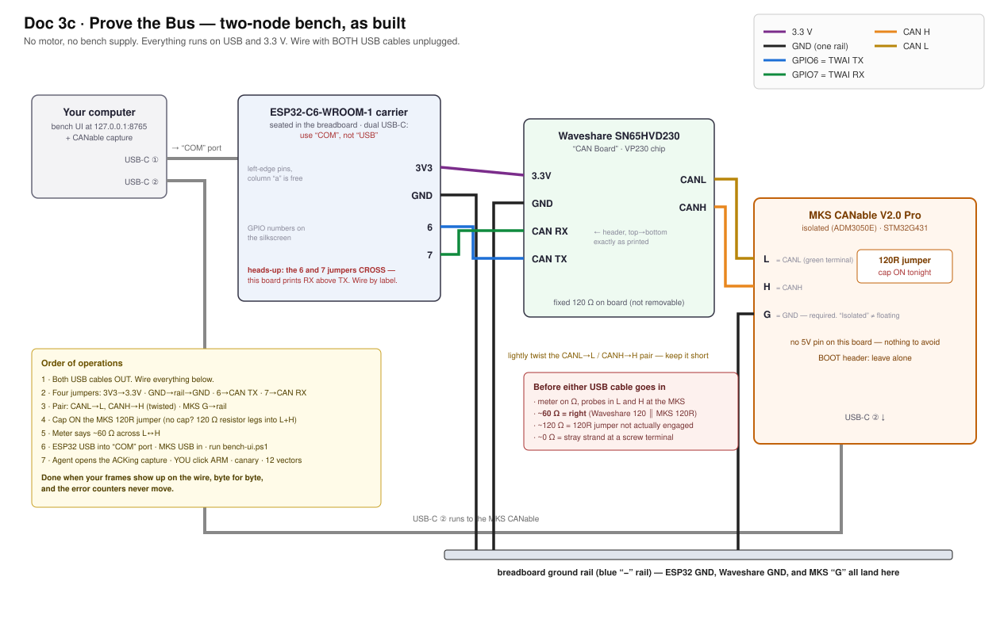

# Doc 3c · Prove the Bus — Two Nodes, No Motor

**Engineered Lighting prototype series · July 2026**

Between [Doc 3](03-build-the-gimbal.md) stage 2 (the board talks) and stage 3 (the motor joins)
there is an optional session that buys a disproportionate amount of certainty: wire the
transceiver and the USB-CAN adapter (BoM #10) into a **two-node bus** and watch your own command
frames arrive on the wire. No motor, no bench supply — the transceiver runs on the ESP32's 3.3 V,
the adapter on USB.

What it proves, all at once: the TWAI driver config, the 1 Mbit/s bit timing, the transceiver,
the CAN wiring, and the exact bytes leaving the board. What that's worth: when a motor doesn't
answer at stage 4, the debugging ladder starts with *half its rungs already checked*.

Skipped BoM #10? Skip this chapter — it stays optional, and stage 4's ladder still works. It's
just longer.

## Why a listener is required, not nice-to-have

CAN transmitters demand an audience. Every frame must be acknowledged by at least one other node
in the same instant it's sent; a transmitter alone on the bus reads back silence, counts it as an
error, and retries — the error counters climb until the controller takes itself off the bus, and
this chip doesn't come back without a power cycle. That's also why the bench firmware boots
**SAFE** and transmits nothing until armed: an armed board with no listener isn't dangerous,
but it *is* self-wedging.

The adapter, with its channel open in normal mode, is that audience. It acknowledges every frame
it hears — which is precisely what makes arming safe in this session.

!!! trap "Two nodes means the terminator rule flips"
    [Doc 3a's sniffer rules](03a-wire-the-bench.md#adding-the-usb-can-sniffer) — tap mid-span,
    terminator **OFF** — describe the stage-4-and-later bus, where the motor is one physical end.
    Today there is no motor: the transceiver and the adapter *are* the two ends, so the adapter's
    terminator goes **ON**. The Waveshare transceiver board carries a fixed onboard 120 Ω;
    the adapter's makes two; the meter reads ~60 Ω.

    It flips back OFF the moment the motor joins. The tell if you forget: the stage-3 bus reads
    **~40 Ω** instead of 60 — three terminators.

## Wire it

*Hands-on stage — no agent lane; the level-3 wiring photo check applies.*



*As-built diagram for this bench's exact boards. Yours may differ — which is what step 1 below exists to catch. Note the 6/7 jumpers **cross**: the Waveshare header prints RX above TX, so wiring by position instead of by label swaps the pair.*

"Power off" here means: **ESP32 USB cable out, adapter USB cable out.** There's no supply in
this session at all.

1. **Photograph two things and get them checked** (level 3): the adapter's screw-terminal
   silkscreen, and your dev board's pin labels — both sides. Neither pin order is documented
   anywhere except the board in your hand — this is doubly true if either is a third-party
   variant, and per [Doc 3a](03a-wire-the-bench.md#adding-the-usb-can-sniffer), "CANable 2.0
   Pro" boards usually are. Don't wire until the map is confirmed.
2. **Set the adapter's terminator ON** — switch or jumper, per its silkscreen. If it turns out
   to be a solder pad: don't solder. Take a 120 Ω resistor (BoM #4), bend the legs, and clamp
   one leg into the CANH screw terminal and the other into CANL alongside the bus wires in
   step 4 — termination with zero soldering.
3. **Seat the transceiver on the breadboard** so each header pin gets its own five-hole row.
   Four jumpers, **straight through — CAN is not UART, nothing crosses**: ESP32 `3V3` → `3V3`,
   ESP32 `GND` → ground rail → `GND`, `GPIO6` → `CTX`, `GPIO7` → `CRX`.
4. **The pair:** two ~25 cm wires, stripped 5 mm, lightly twisted around each other (about a
   turn every 2 cm). Transceiver `CANH` → adapter `CANH`; `CANL` → `CANL`. Screw terminals:
   loosen, bare copper only under the screw, tighten, tug. One more wire: adapter `GND` → the
   breadboard ground rail — *isolated does not mean floating*. A 5V pin, if present, stays
   empty; it's an output.
5. **Measure before power.** Multimeter on Ω, probes on CANH and CANL at the adapter's
   terminals, everything still unplugged: **~60 Ω**.

**Done when:** 60 Ω cold, the adapter's ground is on the rail, and the photos came back clean.
**If stuck:** ~120 Ω = step 2's terminator isn't actually engaged. Open = a screw terminal
clamped insulation instead of copper. ~0 Ω = a stray strand bridging the pair at a terminal —
unscrew, re-strip, redo.

## Validate it

!!! agent-prompt "🤖 Give this to your agent"

    ```text
    You're my bench agent for the Engineered Lighting gimbal build
    (chapter: engineering.engineered.lighting/03c-prove-the-bus/). The
    two-node bench bus is wired and measures 60 ohms cold: ESP32-C6 +
    SN65HVD230 on one end, a USB-CAN adapter (terminator ON) on the other.
    No motor exists yet. Start by proposing a plan and wait for my approval
    before executing anything. Then: identify the adapter's firmware
    (serial device = slcan; USB device with no serial port = candleLight/
    gs_usb), open a capture in NORMAL mode - never listen-only, the whole
    point is that you ACK my frames - at 1 Mbit/s, and confirm the channel
    is open. Tell me when to arm; ARMING IS MY CLICK, NOT YOURS. Then send
    ONE canary command and read the firmware's error counters: the frame
    must appear in your capture AND tx_err must read 0. Only then replay
    the full test-vector set, including the deliberate out-of-range values
    that prove the firmware clamps on the wire. If counters climb at the
    canary: tell me to disarm, reopen your channel non-listen-only, and
    have me power-cycle the ESP32 - a no-ACK frame keeps retrying even
    after disarm, and reboot is the only clear.
    Done when: every vector appears on the wire byte-identical with the
    right CAN id, and the counters stay at zero.
    Report back: the capture, the counter readings, and any vector that
    differed.
    ```

    *[How to run this prompt →](00b-ai-native-workflow.md)*

<details markdown="1">
<summary>Do it by hand — understand what the agent did</summary>

1. Plug the adapter in and look before installing anything: a new **COM port** (Windows) or
   `/dev/cu.usb*` node (Mac) means slcan firmware; a USB device with *no* serial port means
   candleLight. [Doc 3a has the software for both](03a-wire-the-bench.md#which-firmware-is-on-your-board).
2. Open the capture at 1 Mbit/s in normal mode. In Cangaroo that's the default — just don't
   tick "listen only."
3. Plug the ESP32 in, open the Serial Monitor (115200, "New Line"), and type `arm` — the bench
   sketch from stage 4 boots safe and transmits nothing until you say so.
4. Type `a10`. The capture shows id `0x141`, data `A4 00 1E 00 E8 03 00 00` — the same bytes
   the serial log printed. Type `status`: every error counter reads 0.
5. Try `a200`. The wire shows 170.00° — the firmware clamped it before encoding. That's the
   soft limit doing its job where you can see it.

</details>

## Before you power up

- [ ] Both photos confirmed against the wiring above
- [ ] Adapter terminator **ON** (or the 120 Ω resistor clamped across its terminals)
- [ ] Transceiver wired straight through — 3V3, GND, `GPIO6→CTX`, `GPIO7→CRX`
- [ ] Twisted pair to the adapter; adapter GND on the ground rail; 5V pin empty
- [ ] CANH↔CANL reads **~60 Ω**, everything unplugged
- [ ] Capture open in normal mode *before* anyone arms

**Done when:** your frames appear on the wire byte-for-byte, out-of-range commands arrive
clamped, and the error counters never move.

Then head back to [Doc 3 stage 3](03-build-the-gimbal.md#stage-3-wire-the-can-line) and wire the
motor — remembering the adapter's terminator **flips OFF** as it moves to a mid-span tap
([Doc 3a shows where](03a-wire-the-bench.md#adding-the-usb-can-sniffer)). When stage 4's first
`r` gets no reply, you'll know which half of the world to suspect: not yours.

And when the motor answers reads happily but goes mute the moment you command a move — that is
its **undervoltage latch**, not your wiring. Check the rail is at 24 V and power-cycle; stage 4's
ladder has the full tree.
