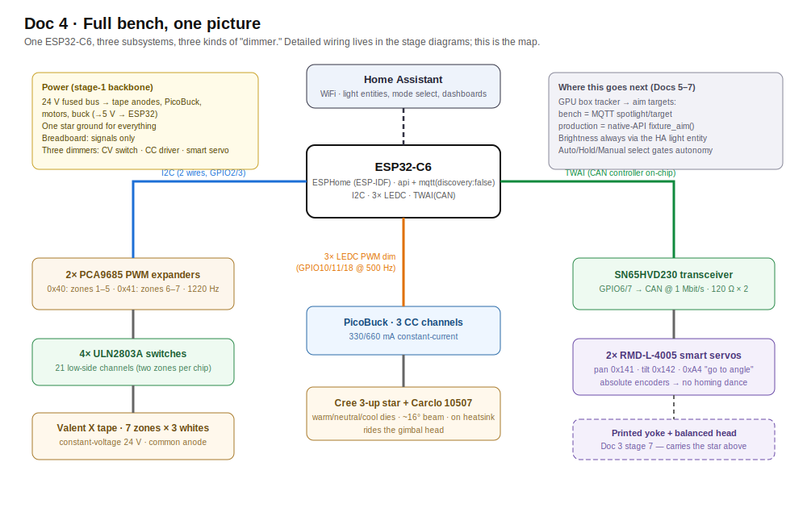
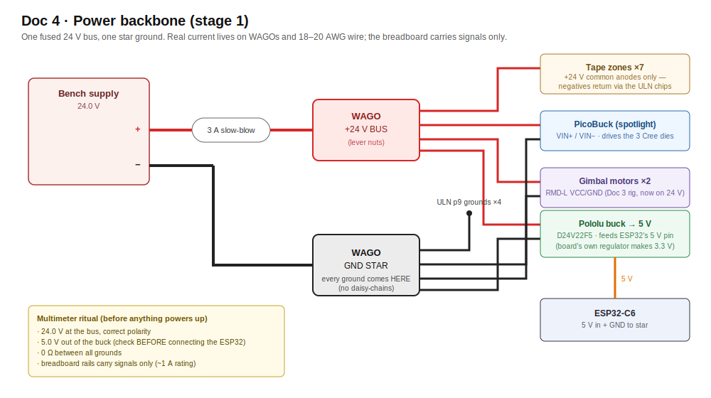
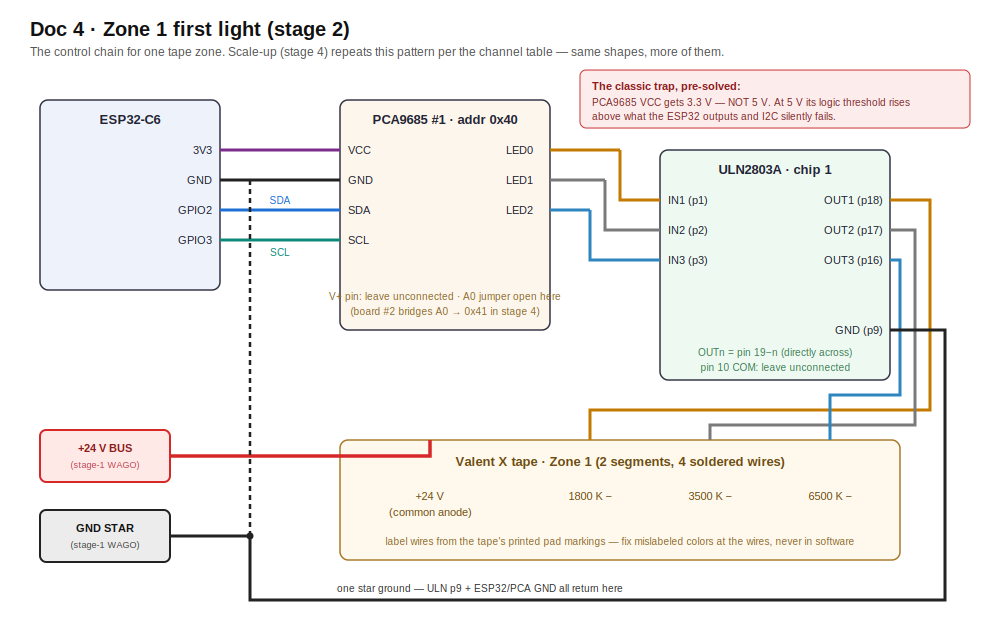

# Doc 4 · Build the Full Fixture Bench — One ESP32, Everything

**Engineered Lighting prototype series · July 2026**
One ESP32-C6 controlling all three fixture subsystems on the bench: **21 channels of Valent X tunable-white tape + the 3-channel Cree spotlight + the CAN gimbal.** Beginner-annotated throughout. Prereq: [Doc 3](03-build-the-gimbal.md) stages 1–6 (motors answering on CAN) — that work slots in at **stage 6**; stage 7's demo scene additionally uses the printed frame from [Doc 3](03-build-the-gimbal.md) stage 7.

> **Before you start — three prerequisites this doc quietly depends on:**
>
> 1. **Home Assistant that can run Add-ons** (Home Assistant OS or Supervised). Running HA in a plain Docker container or Core? The Add-on store won't exist — use the standalone CLI instead (`pip install esphome`; it mirrors everything the Device Builder does, and the AI-partner section below is built around it anyway).
> 2. **An MQTT broker** — install the official **Mosquitto broker** add-on in HA now (Settings → Add-ons). [Doc 3](03-build-the-gimbal.md) stage 9, this doc's stage 6 look-ahead, and all of [Doc 5](05-teach-it-to-aim.md) publish through it.
> 3. **Basic soldering** — a $25–40 iron kit (in the BoM) and three easy jobs: wires onto the tape's big copper pads, one solder-blob jumper on PCA9685 #2, and optionally the PicoBuck current jumper. The tape pads are a forgiving place to learn; tin the pad, tin the wire, touch them together with the iron.

## The whole bench, one picture



*One C6, three subsystems, three kinds of "dimmer" (constant-voltage switches for tape, a constant-current driver for the star, smart servos for aim). Detailed wiring diagrams appear at stages 1 and 2.*

## Bill of Materials — LED side, ~$170–240 (+ Doc 3's gimbal BoM)

| # | Part | Qty | Est. | Where | Notes / traps |
|---|---|---|---|---|---|
| 1 | PCA9685 16-ch PWM breakout (Adafruit #815 or clone) | 2 | $30 / ~$10 clones | Adafruit, Amazon | The PWM expanders: each turns 2 I2C wires into 16 independent dimmer signals (we use 21 of the 32). Bridge the A0 jumper on board #2 so it answers at address 0x41 |
| 2 | ULN2803A driver IC, 18-pin DIP (+ sockets) | 4 (+1 spare) | $10 | Adafruit #970, Amazon | The muscle between logic and tape: each chip is 8 low-side switches that let 3.3 V dimmer signals switch the 24 V tape channels. Four chips = two zones per chip with spare inputs, so wiring stays zone-aligned (stage 4's table). Plugs straight into a breadboard |
| 2b | Soldering iron kit (iron, solder, flux, helping hands) | 1 | $25–40 | Amazon | For the tape-pad wires and PCA9685 #2's address jumper — see the prerequisites box above |
| 3 | SparkFun **PicoBuck** (PRT-13705) | 1 | $17.50 | sparkfun.com | The spotlight's driver: 3 constant-current channels in one screw-terminal module (330 mA/ch; solder jumper → 660 mA), each PWM-dimmable from a 3.3 V pin. Purpose-built for the exact job here — feeding one bare ~3 V LED per channel from a higher-voltage rail |
| 4 | Diode LED **Valent X Tunable White** spool (DI-24V-VLX-TW1865-016, 16.4 ft) | 1 | dealer quote | diodeled.com dealers | 7 short zones ≈ 3.3 ft used; one spool covers everything with spare |
| 5 | Cree 3-up star (XP-G2/XP-L, warm/neutral/cool) + Carclo **10507** narrow-spot optic (~16° beam, clear, 84–89% efficient) | 1 | $15–25 (optics $3 ea) | LEDSupply | The spotlight payload for the gimbal head. 10507 is the tightest 3-up optic made — ~0.4 m spot at 1.5 m, ~0.85 m at 3 m. Also grab a 10508 (medium ~26°) and 10509 (wide ~43°): they snap-swap in seconds, which *is* the beam-width experiment. Brightness headroom is huge: even at the PicoBuck's default 330 mA with 90 CRI dies, expect ~500–1900 lux on target across 1.5–3 m — reading/food-prep practice calls for only 300–800 |
| 6 | Heatsink ≥2"×2" + thermal adhesive | 1 | $8 | Amazon | The star cooks itself bare in under a minute — never run unmounted |
| 7 | WAGO 221 lever-nut assortment | 1 pack | $15 | Amazon, Home Depot | 24 V power distribution — high current stays OFF the breadboard |
| 8 | Inline fuse holder + 3 A slow-blow fuses | 1 | $7 | Amazon | Cheap insurance on the 24 V rail |
| 9 | Pololu **D24V22F5** buck (24 V→5 V, 2.5 A) | 1 | $7.95 | pololu.com/product/2858 | Fixed 5 V, nothing to mis-adjust. (Budget LM2596 works but ships set to a random voltage — verify before connecting) |
| 10 | 10 kΩ resistors, 22–24 AWG signal wire, 18–20 AWG for 24 V runs, extra breadboard | — | $20 | Amazon | Signal wiring lives on the breadboard; the heavier 18–20 AWG carries the 24 V runs between WAGOs |

## Concepts (plain English — read once, everything refers back)

- **PWM / duty cycle:** dimming by blinking faster than the eye sees. 60% brightness = on 60% of each cycle. The **frequency** is cycles/second — high enough and even cameras can't catch flicker.
- **CV vs CC (the two kinds of LED):** LED *tape* is **constant-voltage** — feed it 24 V, it limits its own current; dim it by switching the 24 V rapidly (a $1 switch chip suffices). Bare high-power LEDs (the Cree star) are **constant-current** — they must be fed an exact current or they burn out, which takes a real driver module. Two different dimmers for two different physics.
- **Why a PWM expander:** the C6 has only **6** built-in PWM channels; we need 24. The PCA9685 chip makes 16 each and takes orders over I2C. Your fixture brief anticipated exactly this ("dedicated multi-channel LED-driver ICs").
- **I2C:** a 2-wire party line (SDA data, SCL clock); each chip has an address (0x40, 0x41 = house numbers).
- **Low-side switching & common anode:** the tape's +24 V is always connected (the shared "anode"); each color channel dims by switching its *negative* wire to ground. Our switch is the ULN2803A (8 per chip). Its one cost: it "eats" ~1 V, so tape sees ~23 V — a uniform ~4% dimming, invisible in practice. (The production-faithful upgrade is MOSFETs, ~0.02 V drop.)
- **CCT blending:** the tape has three fixed whites (1800/3500/6500 K). Intermediate color temperatures are *mixes* — cool half of the dial blends 6500↔3500, warm half blends 3500↔1800. That blend is the one real piece of code in this build (stage 3, ~20 lines, provided).
- **ESPHome:** firmware you *configure* (YAML text) instead of program. Declare the hardware; it generates firmware, joins Home Assistant, creates dashboard entities. Since you already run HA, ~90% of this build is configuration. **C6 requires ESPHome's ESP-IDF framework** (its Arduino framework doesn't support C6).

## Your toolchain, explicitly — and exactly how YAML gets onto the board

!!! agent-prompt "🤖 Give this to your agent"

    ```text
    You're my bench agent for the Engineered Lighting full-fixture bench
    (chapter: engineering.engineered.lighting/04-full-fixture-bench/,
    toolchain section). On the bench: an ESP32-C6 that will run the whole
    fixture from a single ESPHome YAML file — flashed over USB once,
    wirelessly ever after.
    Start by proposing a plan and wait for my approval before executing
    anything.
    Task: stand up the ESPHome command-line toolchain. Install the esphome
    CLI with pip and verify it by running "esphome version". Then create
    fixture-bench.yaml in this repo: a starter config for board
    esp32-c6-devkitc-1 using the chapter's config header (variant esp32c6,
    framework type esp-idf — the C6 requires ESP-IDF; ESPHome's Arduino
    framework does not support it), plus esphome, wifi, api, and ota
    sections. Ask me for the WiFi credentials instead of inventing them.
    Prove the toolchain end to end by compiling without flashing
    ("esphome compile fixture-bench.yaml"). Keep the file in git so every
    later edit is reviewable, and remember the one-file rule: this entire
    chapter grows this single YAML file — later stages append under
    existing top-level keys, never duplicate them.
    Done when: "esphome version" prints a version and "esphome compile
    fixture-bench.yaml" finishes with a successful build.
    Report back: the esphome version string, the tail of the compile
    output showing success, and the full fixture-bench.yaml you created.
    ```

    *[How to run this prompt →](00b-ai-native-workflow.md)*

There's no "upload button + code file" here like Arduino; ESPHome *generates* the firmware from your YAML and installs it. The full loop:

<details markdown="1">
<summary>Do it by hand — understand what the agent did</summary>

1. **Install ESPHome Device Builder** (current name of the "ESPHome Dashboard"): Home Assistant → Settings → Add-ons → Add-on Store → search "ESPHome Device Builder" → Install → Start → Open Web UI.
2. **Create the device:** New Device → name it `fixture-bench` → pick **ESP32-C6** → it generates a starter config with your WiFi credentials. Skip the install prompt for now.
3. **Edit the YAML:** click **Edit** on the device's card. Everything in this doc's ```yaml``` blocks gets pasted *into this one file*, beneath the generated header (keep the generated `esphome:`, `wifi:`, `api:`, `ota:` sections; add ours after them). Save.
4. **First install — over USB:** click **Install → "Plug into this computer."** Connect the C6 by USB-C data cable to the machine your *browser* is running on (Chrome/Edge required — flashing uses the browser's serial access), pick the port when prompted, and watch it compile (a few minutes first time) and flash.
5. **Every install after that — wireless:** Install → **"Wirelessly."** The board updates itself over WiFi in ~30 s. You'll never touch the USB cable again unless you brick the WiFi config.
6. **Reading the board's output:** click **Logs** on the device card — a live stream over the network (no cable) of everything the firmware is doing: I2C devices found, light state changes, CAN frames, and the all-important `Component ... took a long time` performance warnings. This is your Serial-Monitor equivalent, and it works from anywhere in the house.
7. **VS Code + the official ESPHome extension** is the nicer editor once the YAML grows (validation + autocomplete as you type); the Device Builder's built-in editor is fine to start. **Arduino IDE 2.x** stays for [Doc 3](03-build-the-gimbal.md)'s interactive motor console only.

</details>

Config header every stage assumes:

```yaml
esp32:
  board: esp32-c6-devkitc-1
  variant: esp32c6
  framework:
    type: esp-idf
```

### AI as your lab partner (ESPHome edition)

ESPHome is unusually AI-friendly because the entire toolchain is drivable from a command line, and all the board's output is network-streamed text:

- **Paste-level help (zero setup):** ESPHome's validation errors are verbose and precise — paste the full error plus your YAML into Claude and the fix is usually one round trip. Same for the Logs stream when a light misbehaves.
- **Agentic loop (Claude Code + the ESPHome CLI):** `pip install esphome` gives a command-line twin of the Device Builder. `esphome run fixture-bench.yaml` validates, compiles, uploads (USB or OTA), and streams logs in one command; `esphome logs fixture-bench.yaml` attaches to a running board over the network — **no cable, from any machine on the LAN**. That means a coding agent can own the whole iterate loop: edit YAML → `esphome run` → read the validation or runtime output → fix → repeat. Keep the YAML in git so its edits are reviewable. Example ask: *"Add zones 2–7 following the zone-1 pattern, flash it OTA, then watch the logs for two minutes and report any 'took a long time' warnings."*
- **Telemetry watching:** once MQTT is flowing, `mosquitto_sub -t '#' -v` gives an agent the live state of every light and the gimbal — useful for soak tests ("watch for an hour, summarize anything anomalous") that no human wants to babysit.
- **The rule from [Doc 3](03-build-the-gimbal.md) stands:** agents read and flash freely; anything that *moves the gimbal* runs only while you're watching, hand near the supply.

---

## Stage 1 — Power backbone

*Hands-on stage — no agent lane; the level-3 wiring photo check applies.*



This build runs at **24 V** (tape-native; motors accept it too — one rail, like the fixture).

1. Supply + → **3 A slow-blow fuse** → WAGO = the **+24 V bus**. Supply − → WAGO = the **ground star point** (every subsystem grounds *directly* here — daisy-chained grounds cause zone-to-zone brightness mismatch).
2. 24 V → Pololu buck → 5 V → ESP32's 5 V pin (or keep USB power during dev — either way, tie grounds).
3. **Breadboard carries signals only** (I2C, PWM, dim lines — milliamps). All real current (24 V feeds, tape, spotlight, motors) lives on WAGOs and 18–20 AWG wire. Rails die ~1 A; respect that and there are no mystery failures.
4. Multimeter ritual: 24 V at the bus, 5 V from the buck, 0 Ω between all grounds.

**Done when:** one fused 24 V bus, one star ground, 5 V logic rail.

## Stage 2 — First light: one zone, three sliders

!!! agent-prompt "🤖 Give this to your agent"

    ```text
    You're my bench agent for the Engineered Lighting full-fixture bench
    (chapter: engineering.engineered.lighting/04-full-fixture-bench/,
    stage 2). On the bench: one soldered zone of Valent X tunable-white
    tape — three white channels (1800 K, 3500 K, 6500 K) — wired through
    PCA9685 #1 at address 0x40 and a ULN2803A to the ESP32-C6, with +24 V
    on the common anode.
    Start by proposing a plan and wait for my approval before executing
    anything.
    Task: append the stage-2 YAML in the chapter to fixture-bench.yaml —
    i2c on GPIO2/GPIO3 at 400kHz, the pca9685 hub at address 0x40 at
    1220 Hz with phase_balancer none, three pca9685 outputs on channels
    0-2, and the three monochromatic lights (Zone 1 Warm/Neutral/Cool).
    One-file rule: add the entries under my existing top-level keys, never
    a second copy of a key. Before flashing, have me confirm the classic
    wiring trap: PCA9685 VCC is on 3.3 V, not 5 V, and V+ stays
    unconnected. Validate the config with the esphome CLI, flash over USB
    (this first install is wired; every later one is OTA), then watch the
    device logs for the I2C scan finding the chip at 0x40. No motor
    motion is involved in this stage.
    Done when: three HA sliders each drive the correct white,
    flicker-free. Wrong color on a slider = swapped wires — fix the
    wires, keep labels truthful.
    Report back: the validation and flash output, the log lines showing
    the PCA9685 found at 0x40, and the three light entities as they
    appear in HA.
    ```

    *[How to run this prompt →](00b-ai-native-workflow.md)*

Cut one radial zone (2 tape segments = 4.92") at the printed cut lines; solder four wires: +24 V and the three channel negatives — **label them from the tape's printed pad markings** (this is also where you verify the common-anode wiring the spec sheet implies).

Wire the chain (power off):



*The full chain with pin numbers and the 3.3 V trap called out. ASCII version below:*

```
ESP32-C6              PCA9685 #1 (0x40)            ULN2803A #1
--------              -----------------            -----------
3V3 ─────────────────  VCC   (NOT V+)
GND ─────────────────  GND ─────────────────────── GND (pin 9)
GPIO2 (SDA) ─────────  SDA
GPIO3 (SCL) ─────────  SCL
                       LED0 ─────────────────────── IN1 → OUT1 (pin 18) → tape 1800K −
                       LED1 ─────────────────────── IN2 → OUT2 (pin 17) → tape 3500K −
                       LED2 ─────────────────────── IN3 → OUT3 (pin 16) → tape 6500K −
24V bus ── +24 V ─────────────────────────────────── tape +24V (common anode)
ground star ──────────────────────────────────────── ULN GND (pin 9)
```

> **The classic trap, pre-solved:** PCA9685 **VCC gets 3.3 V, not 5 V.** At 5 V the chip's logic threshold rises above what the ESP32 outputs *and* the I2C bus gets pulled past the C6's rated maximum — a silent, maddening failure. 3.3 V makes it correct by construction. V+ (servo power pin) stays unconnected. ULN inputs need no resistors (built in); leave ULN pin 10 (COM) unconnected for LEDs.

```yaml
i2c:
  sda: GPIO2
  scl: GPIO3
  frequency: 400kHz

pca9685:
  - id: pwm1
    address: 0x40
    frequency: 1220 Hz        # near the chip's 1526 Hz max = least visible flicker
    phase_balancer: none      # ESPHome's recommendation for LEDs

output:
  - platform: pca9685
    id: z1_warm              # 1800 K channel
    pca9685_id: pwm1
    channel: 0
  - platform: pca9685
    id: z1_neutral           # 3500 K
    pca9685_id: pwm1
    channel: 1
  - platform: pca9685
    id: z1_cool              # 6500 K
    pca9685_id: pwm1
    channel: 2

light:
  - platform: monochromatic
    name: "Zone 1 Warm 1800K"
    output: z1_warm
  - platform: monochromatic
    name: "Zone 1 Neutral 3500K"
    output: z1_neutral
  - platform: monochromatic
    name: "Zone 1 Cool 6500K"
    output: z1_cool
```

**Done when:** three HA sliders each drive the correct white, flicker-free. Wrong color on a slider = swapped wires — fix the wires, keep labels truthful.
**If stuck:** ESPHome logs say if the PCA9685 isn't found (SDA/SCL swapped or VCC missing). Light on but not dimming = wrong ULN channel. Dead = check tape +24 V.

## Stage 3 — Make it tunable: the tri-white blend

!!! agent-prompt "🤖 Give this to your agent"

    ```text
    You're my bench agent for the Engineered Lighting full-fixture bench
    (chapter: engineering.engineered.lighting/04-full-fixture-bench/,
    stage 3). On the bench: zone 1 lit from stage 2 as three separate
    sliders; this stage turns it into one tunable-white light using the
    tri-white blend — ESPHome has no built-in 3-white light, so the
    supported pattern is a cwww light routed through template outputs
    whose lambda does the 3-channel math.
    Start by proposing a plan and wait for my approval before executing
    anything.
    Task: implement the stage-3 YAML in the chapter in fixture-bench.yaml:
    the z1_cw/z1_ww globals, the z1_apply script whose lambda blends the
    cool half of the dial between 6500 and 3500 K and the warm half
    between 3500 and 1800 K, the two template float outputs (z1_cw_in,
    z1_ww_in) that store state and run the script, and the cwww light
    "Zone 1" with constant_brightness true. Remove stage-2's three
    monochromatic lights as the stage directs, keeping the three pca9685
    outputs. One-file rule: append under my existing output:/light:/
    globals:/script: keys — pasting a duplicate top-level key fails
    validation with a cryptic duplicate-key error. Validate with the
    esphome CLI, flash over the air, then watch the logs while I sweep
    the slider. No motor motion is involved in this stage.
    Done when: "Zone 1" is one light whose CT slider sweeps
    candlelight→daylight smoothly.
    Report back: the validation output, the YAML diff, and a short log
    excerpt from the flash and the first slider sweep.
    ```

    *[How to run this prompt →](00b-ai-native-workflow.md)*

Honest part: **ESPHome has no built-in 3-white light** (its `cwww` blends two; the old "custom component" escape hatch was removed in 2025 — ignore tutorials using it). The supported pattern: a `cwww` light for the UI (brightness + color-temperature slider), routed through **template outputs** whose lambda (C++ snippet in YAML) does the 3-channel math.

> **One-file YAML rule (the classic beginner trap):** this whole doc grows a *single* config file. When a snippet shows a top-level key you already have (`output:`, `light:`, `globals:`, `script:`), append the new entries under your existing key — never paste a second copy of the key itself, or validation fails with a cryptic duplicate-key error. Unsure your file's shape is right? Paste the whole thing into Claude and ask it to check the structure.

```yaml
globals:
  - { id: z1_cw, type: float, initial_value: '0' }   # last cold value (0..1)
  - { id: z1_ww, type: float, initial_value: '0' }   # last warm value

script:
  - id: z1_apply
    then:
      - lambda: |-
          float cw = id(z1_cw), ww = id(z1_ww);
          float b = cw + ww;                      // total brightness
          float w18, w35, w65;
          if (b <= 0.001f) { w18 = w35 = w65 = 0; }
          else {
            float t = ww / b;                     // warmth: 0=6500K .. 1=1800K
            if (t <= 0.5f) { float u = t*2;       // cool half: 6500 <-> 3500
              w65 = b*(1-u); w35 = b*u; w18 = 0; }
            else { float u = (t-0.5f)*2;          // warm half: 3500 <-> 1800
              w65 = 0; w35 = b*(1-u); w18 = b*u; }
          }
          id(z1_warm).set_level(w18);
          id(z1_neutral).set_level(w35);
          id(z1_cool).set_level(w65);

output:   # ADD these; REMOVE stage-2's three monochromatic lights
  - platform: template
    id: z1_cw_in
    type: float
    write_action: [ { lambda: 'id(z1_cw) = state;' }, { script.execute: z1_apply } ]
  - platform: template
    id: z1_ww_in
    type: float
    write_action: [ { lambda: 'id(z1_ww) = state;' }, { script.execute: z1_apply } ]

light:
  - platform: cwww
    name: "Zone 1"
    cold_white: z1_cw_in
    warm_white: z1_ww_in
    cold_white_color_temperature: 6500 K
    warm_white_color_temperature: 1800 K
    constant_brightness: true      # keeps cw+ww ≤ 1 so the math above holds
```

Footnotes: the slider midpoint won't be *exactly* 3500 K (HA works in mireds — calibration is a fixture-phase task with a light meter), and this linear blend is v1 — perceptual refinements are software-only later.

**Done when:** "Zone 1" is one light whose CT slider sweeps candlelight→daylight smoothly.

## Stage 4 — Scale to 7 zones (21 channels)

!!! agent-prompt "🤖 Give this to your agent"

    ```text
    You're my bench agent for the Engineered Lighting full-fixture bench
    (chapter: engineering.engineered.lighting/04-full-fixture-bench/,
    stage 4). On the bench: all 7 zones soldered and labeled (28 wires),
    PCA9685 #2 bridged to address 0x41, ULN chips 2-4 seated — 21 tape
    channels total.
    Start by proposing a plan and wait for my approval before executing
    anything.
    Task: scale zone 1 to all 7 zones. Generate zones 2-7 from the
    zone/channel table in the stage — do not hand-copy. Each table row
    gives one zone's PCA9685 hub and channels (hub1 = 0x40, hub2 = 0x41)
    and its ULN chip and IN/OUT pins, three channels per zone in
    warm/neutral/cool order. Derive the config from that table (a small
    generator script or a systematic expansion), producing z2_ through
    z7_ globals, scripts, template outputs, pca9685 outputs, and cwww
    lights that mirror the stage-3 zone-1 pattern exactly — the stage-4
    YAML in the chapter is precisely this expansion, verbose but
    transparent. Add the second pca9685 hub block at address 0x41, and
    confirm with me that the A0 solder jumper on board #2 is bridged
    before flashing. One-file rule: extend my existing top-level keys,
    never duplicate them. Validate with the esphome CLI, flash over the
    air, then watch the logs for "Component ... took a long time"
    warnings — the single-core C6 telling us it is straining. No motor
    motion is involved in this stage.
    Done when: 7 independent tunable lights; an HA scene "all zones
    2200 K @ 20%" runs smoothly. That's movie mode on a breadboard.
    Report back: the generated YAML diff, the validation and flash
    output, the seven light entities as they appear in HA, and a log
    excerpt from several minutes of runtime noting any
    took-a-long-time warnings.
    ```

    *[How to run this prompt →](00b-ai-native-workflow.md)*

1. Solder the remaining zones (5 radials + the 4-segment bottom ring as one zone). **Label every wire at both ends** — 28 wires now exist.
2. Bridge PCA9685 #2's A0 jumper (→ 0x41); same I2C wires, same 3.3 V. Add ULN chips 2–4.
3. Wire to this table (print it, tape it above the bench). ULN pin geometry: input IN*n* is pin *n*; its output is directly across the chip (OUT*n* = pin 19−*n*). Each row is one zone's three channels in W/N/C order:

| Zone | PCA9685 : channels | ULN chip : IN pins | ULN OUT pins (to tape −) |
|---|---|---|---|
| 1 (radial) | hub1 : 0, 1, 2 | chip1 : 1, 2, 3 | 18, 17, 16 |
| 2 (radial) | hub1 : 3, 4, 5 | chip1 : 4, 5, 6 | 15, 14, 13 |
| 3 (radial) | hub1 : 6, 7, 8 | chip2 : 1, 2, 3 | 18, 17, 16 |
| 4 (radial) | hub1 : 9, 10, 11 | chip2 : 4, 5, 6 | 15, 14, 13 |
| 5 (radial) | hub1 : 12, 13, 14 | chip3 : 1, 2, 3 | 18, 17, 16 |
| 6 (radial) | hub2 : 0, 1, 2 | chip3 : 4, 5, 6 | 15, 14, 13 |
| 7 (bottom ring) | hub2 : 3, 4, 5 | chip4 : 1, 2, 3 | 18, 17, 16 |

Every chip's pin 9 goes to the ground star; pin 10 stays unconnected; every zone's +24 V lead goes to the WAGO bus.

4. Duplicate the stage-3 block per zone (`z2_`…`z7_`). Verbose but transparent — compress with ESPHome "packages" later, not now.
5. After flashing, watch Logs for `Component ... took a long time` — the single-core C6 telling you it's straining. This design computes only on changes, so you shouldn't see it; this is the honest untested territory (nobody has benchmarked 24 PWM + CAN + WiFi on a C6).

**Done when:** 7 independent tunable lights; an HA scene "all zones 2200 K @ 20%" runs smoothly. That's movie mode on a breadboard.

## Stage 5 — The spotlight (constant-current)

!!! agent-prompt "🤖 Give this to your agent"

    ```text
    You're my bench agent for the Engineered Lighting full-fixture bench
    (chapter: engineering.engineered.lighting/04-full-fixture-bench/,
    stage 5). On the bench: the Cree 3-up star mounted on its heatsink,
    fed by the PicoBuck's three constant-current channels, with the dim
    signals coming from native ESP32-C6 pins.
    Start by proposing a plan and wait for my approval before executing
    anything.
    Task: append the stage-5 YAML in the chapter to fixture-bench.yaml:
    three ledc outputs on GPIO10, GPIO11, and GPIO18 at 500 Hz — native
    pins, not the PCA9685, because each PCA9685 runs one frequency for
    all 16 channels and the tape needs ~1.2 kHz+ while CC-driver dim
    inputs typically want 1 kHz or less — plus the two template outputs
    spot_cw_in/spot_ww_in exactly like stage 3's, and the "Spotlight"
    cwww light (5700 K cold, 3000 K warm, constant_brightness true).
    One-file rule: extend my existing top-level keys, never duplicate
    them. Before power-on, have me confirm the star is on its heatsink
    and aimed at the wall — it cooks itself bare in under a minute and
    is painfully bright. Validate with the esphome CLI and flash over
    the air. No motor motion is involved in this stage.
    Done when: the Spotlight entity dims 0→100% on all three dies. CC
    drivers can get twitchy below ~5% duty — note the floor; the
    coordinator respects it in software.
    Report back: the validation and flash output, the YAML diff, the
    Spotlight entity as it appears in HA, and the lowest duty that still
    dims cleanly once we test it together.
    ```

    *[How to run this prompt →](00b-ai-native-workflow.md)*

**Mount the star to its heatsink first** (it dissipates ~3 W in a coin-sized PCB), and aim it at the wall — these are painfully bright point sources.

Wiring: PicoBuck VIN from the 24 V bus/star ground; each output pair to one Cree die (check printed polarity). The three dim signals come from **native ESP32 pins** — GPIO10/11/18:

> **Why native pins, not the PCA9685:** each PCA9685 chip runs ONE frequency for all 16 channels. Tape wants ~1.2 kHz+ (flicker); CC-driver dim inputs typically want ≤1 kHz. Rather than compromise both, the spotlight's 3 signals use the C6's own LEDC channels (6 exist; 3 free after this).

```yaml
output:
  - platform: ledc
    id: spot_warm_pwm
    pin: GPIO10
    frequency: 500 Hz
  - platform: ledc
    id: spot_neutral_pwm
    pin: GPIO11
    frequency: 500 Hz
  - platform: ledc
    id: spot_cool_pwm
    pin: GPIO18
    frequency: 500 Hz
  # + two template outputs spot_cw_in / spot_ww_in, exactly like stage 3

light:
  - platform: cwww
    name: "Spotlight"
    cold_white: spot_cw_in
    warm_white: spot_ww_in
    cold_white_color_temperature: 5700 K   # set to the actual Cree bins
    warm_white_color_temperature: 3000 K   #   (LEDSupply confirms)
    constant_brightness: true
```

**Done when:** the Spotlight entity dims 0→100% on all three dies. CC drivers can get twitchy below ~5% duty — note the floor; the coordinator respects it in software.

## Stage 6 — Gimbal joins the same chip

!!! agent-prompt "🤖 Give this to your agent"

    ```text
    You're my bench agent for the Engineered Lighting full-fixture bench
    (chapter: engineering.engineered.lighting/04-full-fixture-bench/,
    stage 6). On the bench: the gimbal from the previous chapter — motors
    already answering on CAN — joining the same ESP32-C6, with the CAN
    transceiver on GPIO6/GPIO7 and motors at IDs 0x141/0x142.
    Start by proposing a plan and wait for my approval before executing
    anything.
    Task: append the stage-6 YAML in the chapter to fixture-bench.yaml:
    the esp32_can canbus block (tx GPIO6, rx GPIO7, our node's can_id
    0x7F0, bit_rate 1000KBPS) with the on_frame logger for 0x141, the
    "Spot Pan" template number (-170 to 170, step 0.5) whose set_action
    sends the 0xA4 position frame at 30 deg/s, and its "Spot Tilt"
    duplicate on can_id 0x142 with min -90 / max 90. One-file rule:
    extend my existing top-level keys, never duplicate them. Traps from
    the stage: never transmit onto a bus with no powered motor — endless
    retries can watchdog-reboot the node — so confirm with me that the
    gimbal is powered before flashing; and replies may arrive on
    0x241/0x242 depending on protocol version, so if the logs stay
    silent while the motors obey, add those on_frame blocks per my
    shipped protocol PDF. Validate with the esphome CLI, then flash over
    the air.
    SAFETY — non-negotiable: never command motor motion unless I confirm
    I'm watching with a hand near the supply switch. The bench current
    limit stays as set. Announce each motion command before sending it
    and wait for my explicit go.
    Done when: dragging Spot Pan/Tilt sliders in HA moves the physical
    beam.
    Report back: the validation and flash output, the YAML diff, and a
    log excerpt showing frames received from the motors during the
    supervised pan/tilt test.
    ```

    *[How to run this prompt →](00b-ai-native-workflow.md)*

Prereq: [Doc 3](03-build-the-gimbal.md) stages 1–6 done (interactive console is the right place to *learn* motors; this stage ports them into ESPHome). ESPHome's `canbus` officially supports the C6 at 1 Mbps. Wiring: identical to [Doc 3](03-build-the-gimbal.md) (transceiver on GPIO6/7).

```yaml
canbus:
  - platform: esp32_can
    id: gimbal_bus
    tx_pin: GPIO6
    rx_pin: GPIO7
    can_id: 0x7F0              # our node's own id — required field, unused here
    bit_rate: 1000KBPS
    on_frame:
      - can_id: 0x141
        then: [ { lambda: 'ESP_LOGI("gimbal","pan: %02X %02X %02X %02X %02X %02X %02X %02X", x[0],x[1],x[2],x[3],x[4],x[5],x[6],x[7]);' } ]

number:
  - platform: template
    name: "Spot Pan"
    min_value: -170
    max_value: 170
    step: 0.5
    initial_value: 0
    optimistic: true
    set_action:
      - canbus.send:
          canbus_id: gimbal_bus
          can_id: 0x141
          data: !lambda |-
            int32_t p = (int32_t)(x * 100.0f);
            uint16_t v = 30;                     // deg/s — slow & silent for bench
            return {0xA4, 0x00, (uint8_t)(v & 0xFF), (uint8_t)(v >> 8),
                    (uint8_t)(p & 0xFF), (uint8_t)((p >> 8) & 0xFF),
                    (uint8_t)((p >> 16) & 0xFF), (uint8_t)((p >> 24) & 0xFF)};
  # duplicate as "Spot Tilt" with can_id 0x142, min -90 / max 90
```

Footnotes: replies may arrive on 0x141/0x142 or 0x240+ID depending on protocol version — if logs stay silent while motors obey, add blocks for 0x241/0x242 (check your shipped PDF). Never transmit onto a bus with **no powered motor** — endless retries can watchdog-reboot the node.

**Looking ahead ([Doc 5](05-teach-it-to-aim.md)):** HA sliders are the *bench* interface. The follow-me loop will instead publish aim targets ~5–15×/second — subscribe the ESP32 to a raw MQTT topic (**`spotlight/target`** — the same name [Doc 3](03-build-the-gimbal.md) stage 9 and [Doc 5](05-teach-it-to-aim.md) Phase 0 use; ESPHome's `mqtt:` component with an `on_message` trigger; it runs happily alongside the HA `api:`, and the AI-partner workflow above is the right way to scaffold the JSON-to-CAN lambda) and lean on 0xA4's speed-limit field: the motor interpolates between waypoints onboard, so modest update rates still produce continuous motion (this is exactly what dissolves the "steppy PTZ" problem). The full graduation path — an `Auto/Hold/Manual` mode select gating the stream, brightness flowing only through the light entity, `discovery: false` to avoid duplicate entities, and eventually replacing the MQTT lane with a typed native-API action (`api: actions: fixture_aim`) that the GPU box calls directly via aioesphomeapi — is specced in **[Doc 6](06-message-contract.md)** (§1 for the transport, "Living inside Home Assistant" for the entity model). One production gotcha to bank now: once CAN telemetry flows, set `logger: level: INFO` — per-frame DEBUG logging is the documented crash cause on busy ESPHome CAN nodes.

**Done when:** dragging Spot Pan/Tilt sliders in HA moves the physical beam.

## Stage 7 — Integration day + verdict

!!! agent-prompt "🤖 Give this to your agent"

    ```text
    You're my bench agent for the Engineered Lighting full-fixture bench
    (chapter: engineering.engineered.lighting/04-full-fixture-bench/,
    stage 7). On the bench: the finished system — 7 tunable zones, the
    spotlight, and the gimbal on one ESP32-C6 — ready for scenes, the
    checklist, and the verdict.
    Start by proposing a plan and wait for my approval before executing
    anything.
    Task: first help me build the HA dashboard (7 zones, Spotlight,
    pan/tilt) and the two scenes from the stage: Movie (radials 2000 K
    @ 15%, ring off, spot off) and Reading (radials 2700 K @ 40%, spot
    3000 K @ 60%, aimed at the chair — I jog the Spot Pan/Tilt sliders
    until the beam sits on the chair, then we save those numbers into
    the scene). Then work through the stage-7 checklist in the chapter
    item by item with me: CT sweeps and equal-settings matching
    (mismatch = ground star problem, not software), the pencil-wave and
    slow-mo flicker tests, gimbal motion with all 24 channels lit,
    scene-switch speed, the soak, and the worst-case current reading.
    For the 30-minute "everything on" soak, watch the device logs the
    whole time and summarize warnings, resets, and any "took a long
    time" lines; I handle the touch tests and record the worst-case
    24 V current with the meter.
    SAFETY — non-negotiable: never command motor motion unless I confirm
    I'm watching with a hand near the supply switch. The bench current
    limit stays as set. Announce each motion command before sending it
    and wait for my explicit go.
    Done when: every item of the stage-7 checklist in the chapter
    passes.
    Report back: the checklist with pass/fail and evidence per item, the
    30-minute soak-log summary (warnings, resets, took-a-long-time
    counts), and the recorded worst-case 24 V current for the fixture
    power budget.
    ```

    *[How to run this prompt →](00b-ai-native-workflow.md)*

Build an HA dashboard (7 zones, Spotlight, pan/tilt) and two scenes: **Movie** (radials 2000 K @ 15%, ring off, spot off) and **Reading** (radials 2700 K @ 40%, spot 3000 K @ 60%, aimed at the chair — jog the Spot Pan/Tilt sliders until the beam sits on the chair, then save those numbers into the scene). Toggle while watching logs and the tape.

Checklist:

- [ ] All zones sweep CT smoothly; equal settings look equal (mismatch = ground star problem, not software)
- [ ] Flicker: pencil-wave test + phone slow-mo (PCA9685's ~1.2–1.5 kHz is prototype-grade; the production PCB's driver ICs run ~10× higher — don't over-optimize here)
- [ ] Gimbal moves while all 24 channels are lit — no resets, no CAN errors
- [ ] Scene switch feels instant (<300 ms perceived)
- [ ] 30-min soak "everything on": ULNs warm-not-hot, star heatsink warm, no reboots in logs
- [ ] Worst-case 24 V current — record it for the fixture power budget (external design doc: the fixture brief's ~60 W mode-based table)

**What graduates to the fixture PCB:** this architecture as-is — C6 + I2C PWM expansion + low-side drive + CC channels + CAN — with ULNs → MOSFETs/driver ICs at higher PWM frequency, PicoBuck → integrated CC stage, WAGOs → copper.

## Risk register

1. **Single-core C6 under the full load is undocumented territory** — verified piece-by-piece, never benchmarked together. Log-watching in stages 4/7 is the test; worst-case fallback is splitting lighting/gimbal across two C6 nodes (a 20-minute ESPHome change).
2. **The tri-white blend is yours** — no published component exists; stage 3's lambda is the supported pattern, not a library.
3. **Valent X 4-wire layout:** verify printed pad labels before soldering 28 wires.
4. **PicoBuck tops out at 660 mA/ch** — right for the bench; XP-L at 1–3 A is a different driver + heatsink, decided after seeing 330/660 mA in a real room.
5. **Motor protocol drift** ([Doc 3](03-build-the-gimbal.md)): trust the PDF in the box.

## Further reading

ESPHome: esp32 platform & ESP-IDF requirement · pca9685 · ledc (C6 = 6 ch) · canbus/esp32_can · template output · cwww — all at esphome.io · custom-component removal — developers.esphome.io (Feb 19 2025) · PCA9685 datasheet (VIH = 0.7·VDD — the 3.3 V rule) — nxp.com · ULN2803A — Adafruit datasheet · PicoBuck hookup — learn.sparkfun.com · NLDD-H ≥6 V trap — ledsupply.com · Valent X — diodeled.com · D24V22F5 — pololu.com
