# Doc 4a · Wire the Zones For Real — The Supply, the Chain, and the Tape

**Engineered Lighting prototype series · August 2026**

The chapter [Doc 4](04-full-fixture-bench.md) stages 1–4 point at. Those stages' diagrams are *schematics* — they show which signal meets which signal. This is the other half: what those connections look like when you are holding the actual parts, which arrive with no bare wires, no labels you chose, and one terminal block that carries mains.

Four things bite first-time builders here, and none of them are in the schematics:

- The supply is not a lab brick with binding posts. It is the fixture's own **IRM-90-24ST**, and its screw block puts **120 V mains two finger-widths from the 24 V** you came for.
- Two chips do all the work — the PCA9685 and the ULN2803 — and the stages assume you know what they are. You don't have to. This chapter tells you.
- Soldering to LED tape is easy, and ruining LED tape is easier. The difference is wire gauge, strain relief, and practicing on the spool tail first.
- Your multimeter **cannot see through LEDs**, and not knowing that will send you chasing a fault that does not exist.

Everything below is verified against the manufacturers' own datasheets, and every number was measured on this bench before it was printed here.

---

## Your supply, before anything else

Doc 4 [stage 1](04-full-fixture-bench.md#stage-1-power-backbone) says "bench supply" and draws a lab brick. On this bench the supply *is* the **Mean Well IRM-90-24ST** — the exact part [Doc 8](08-build-the-fixture.md) later mounts inside the fixture body. Same rail, same protection, same screw block: run the fixture's own documented supply from day one and the fixture's power chapter validates itself while you build zones.

[Doc 8](08-build-the-fixture.md) describes that block as "L, N, +Vo, −Vo" — which under-describes the thing in front of you. The ST's output side **duplicates its terminals: two +Vo screws and two −Vo screws**, internally one output. Six screws total, and the pair at the **AC/L–AC/N end** is mains — on the mounted unit in the photo below, that end is uppermost.

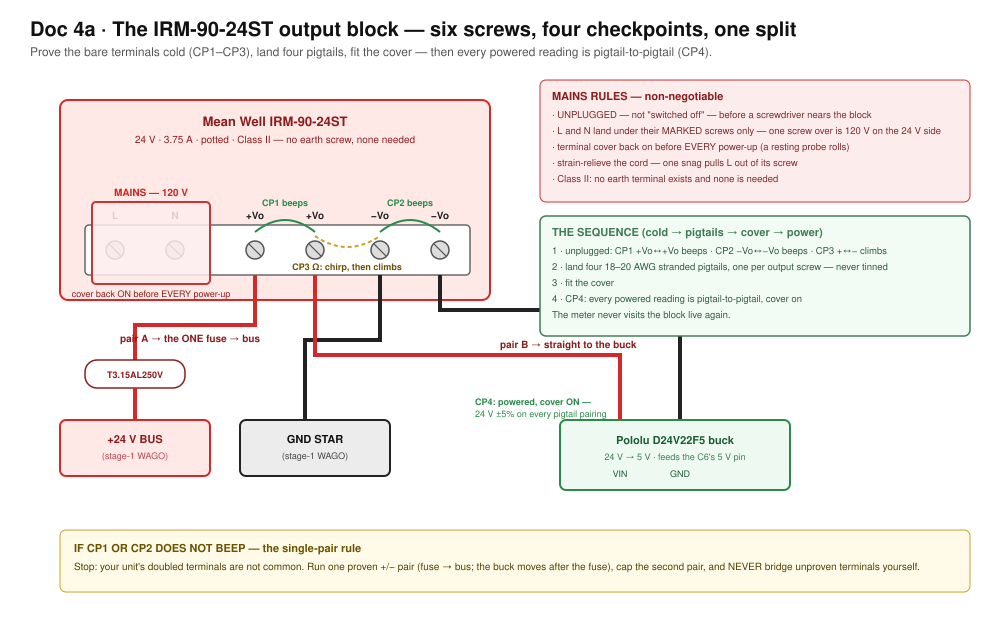

And here is the diagram's subject in the flesh — this build's own unit, already mounted on the fixture frame. It is shown with the terminal cover off **for this photo only**; the rules below put it back:

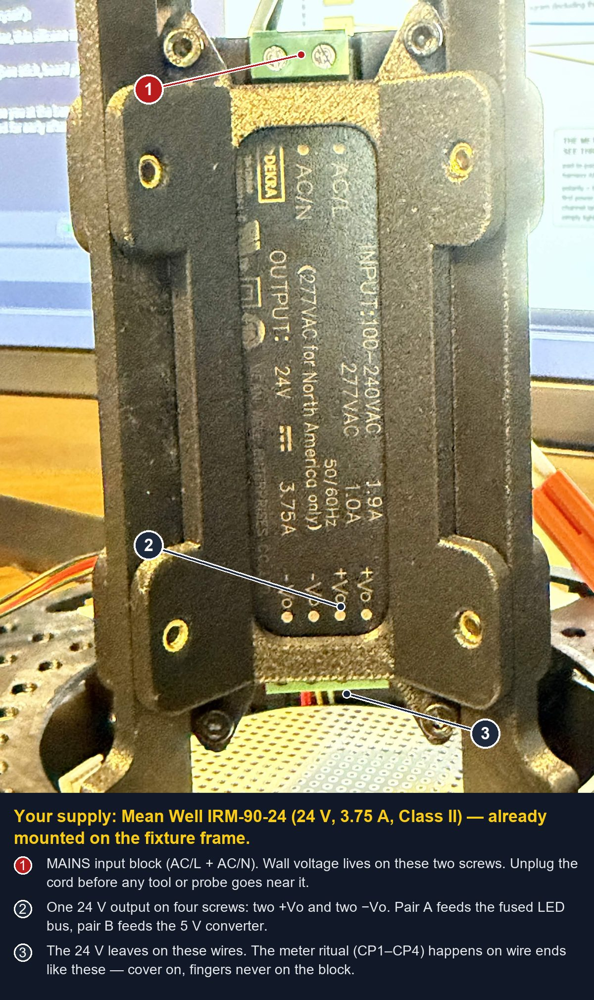{ loading=lazy }

1. **DANGER — the mains block (AC/L + AC/N).** Wall voltage lives on these two screws whenever the cord is plugged in. Unplug — not switched off — before any tool or probe goes near it.
2. **The output block: four screws, two +Vo and two −Vo, internally one 24 V output.** CP1–CP3 happen here — on these bare screws, **unplugged**, *before* any pigtails are landed.
3. **The pigtail ends.** Every *powered* reading (CP4: 24 V ±5% on every +/− pairing) happens out here on wire ends, cover on, fingers never on the block. Pair A → the fuse → the LED bus; pair B → the 5 V buck, deliberately unfused — **after** CP1/CP2 prove the doubled screws are common.

Four rules before a screwdriver goes anywhere near it. Each one is named after the way it fails:

1. **Unplug it — not "switched off."** A power strip's rocker can break the neutral and leave line sitting on the block; its neon lamp proves nothing after the lamp dies. The named failure is a screwdriver landing across L and N on a block you believed dead — at mains that is not a spark, it is an arc that machines the tip and ends the afternoon. Cord out of the wall, in your line of sight, before every touch.
2. **L and N land under their marked screws only.** The named failure is the lead that landed one screw over — a mains wire on +Vo puts 120 V onto the 24 V side and into everything downstream of it. Read the moulded markings, not the wire colors, and look twice before tightening.
3. **The terminal cover goes back on before EVERY power-up.** Not the final one. Every one. The named failure is the probe you left resting on the bench: it rolls, and a live L screw is exactly probe-tip sized. So is a stray strand of stripped copper. So is a knuckle.
4. **Strain relief on the cord.** The named failure is one snag: it pulls L out of its screw and leaves it waving bare inside the bench. Anchor the cord so a tug lands on the anchor, never on the screws.

There is no earth screw on this block, and there is not supposed to be: the IRM is **Class II** — double-insulated. Do not go looking for a ground to add.

### The cord itself — which wire is which

The mains feed on this bench is an **E26 socket-to-wire adapter** — a lamp socket with two 18 AWG leads, black and white. Get this straight once, because guessing it backwards is the most dangerous mistake this chapter can host:

- **Black = LIVE (hot) → lands on AC/L.** In North American wiring, black is never ground. Ever.
- **White = NEUTRAL → lands on AC/N.**
- **There is no ground wire, and this block takes none.** Two leads is correct for a Class II supply. A green or bare wire has no home here.

And then the rule that outranks the colors: **treat both leads as live whenever the adapter is screwed into a powered socket.** A lamp socket can be miswired upstream — shell hot instead of shell neutral — and the adapter's leads inherit whatever the socket does. The colors tell you where each lead *lands*; they never tell you a lead is safe to touch. Unplugged is the only safe.

Landing the leads under L and N — strip, seat, tighten, tug, cover on — is the same screw ritual as the output side, done **first**, cord out of the wall.

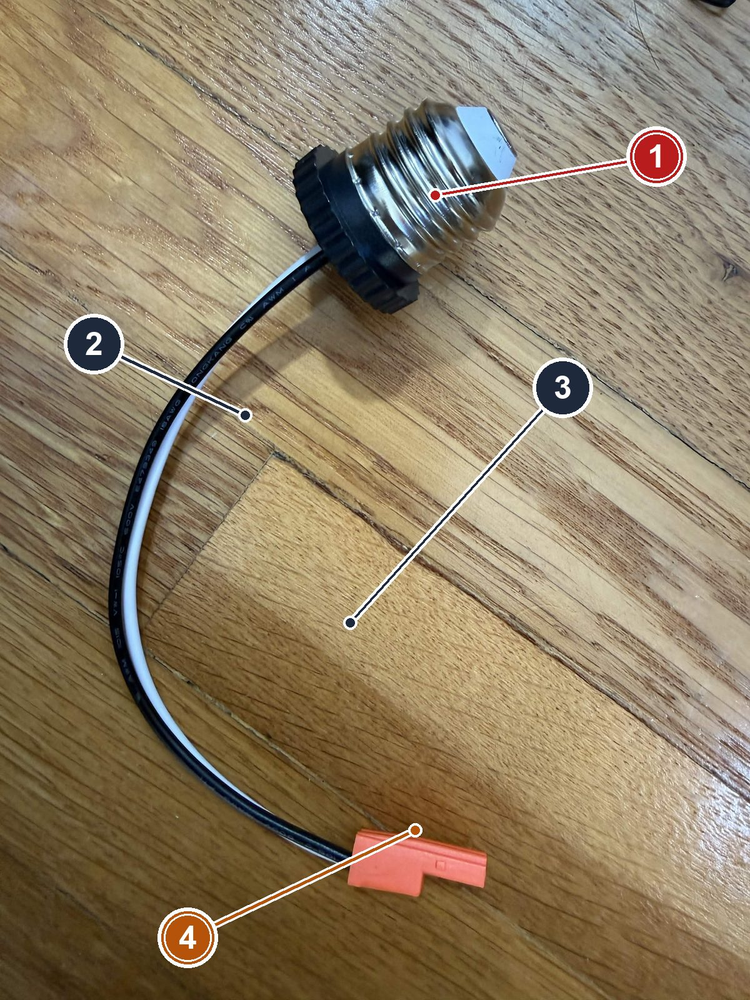{ loading=lazy }

1. **DANGER — the screw base.** Mains the moment it is screwed into a live socket. It goes into the socket **last**, after everything below is landed and covered — and comes out first for any change.
2. **The black lead = LIVE** → lands under **AC/L**.
3. **The white lead = neutral** → lands under **AC/N**.
4. **CAUTION — the factory connector on the ends: cut it off.** It exists for downlights, not for screw blocks. Snip it, strip 7–8 mm of fresh copper on each lead, and land bare stranded wire under the screws — never the connector, never tinned ends.

And the meter that referees every checkpoint from here on — with one honest limitation to know about now:

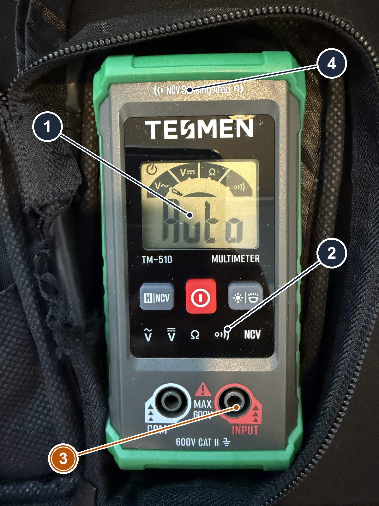{ loading=lazy }

1. **Auto mode** — it picks volts/ohms/continuity by what the probes touch. All the checkpoints in this chapter run in Auto plus the beeper.
2. **The continuity beeper** — CP1, CP2, CP7 through CP11 all live on this icon.
3. **CAUTION — two jacks, volts and ohms only. This meter has NO current range.** Every checkpoint in this chapter that talks about current is therefore a *watch-and-expect* check, not a measurement — see CP12. (The wiring is protected by the fuse and by the supply's own overload hiccup either way.)
4. **NCV** — hold the top edge near a wire and it warns of live mains without touching. A free extra check before fingers go anywhere near the supply end.

### The sequence that makes powered probing safe

The trick is to arrange things so the meter never has to visit the block while it is live. In this order:

1. **Unplugged: prove the bare terminals** — checkpoints CP1–CP3 in [the table](#the-checkpoint-table). Continuity: the two +Vo screws beep to each other (CP1), the two −Vo screws beep to each other (CP2). Then resistance mode across + and −: a short chirp that climbs to tens of kΩ or OL as the output capacitors charge from the meter — that climb is normal (CP3). A beep that never stops is a short; do not plug in.
2. **Land four pigtails** — 18–20 AWG stranded, one per output screw, long enough to reach the WAGOs with slack. Fresh-stripped bare copper under each screw, never tinned ends — solder cold-flows under a screw and the joint quietly loosens ([Doc 3a](03a-wire-the-bench.md) learned this the hard way). Tug each one. If it moves, do it again.
3. **Fit the cover.**
4. From here, **every powered reading is pigtail-to-pigtail, cover on** (CP4): plug in and read 24 V ±5% across every +/− pigtail pairing. The screws stay covered for the rest of the build.

The load split falls out of the pigtails for free: **one +/− pair → the fuse → the WAGO +24 V bus** (its − mate goes to the ground star), and **the other pair → the D24V22F5 buck**. One fuse — the single **T3.15AL250V** on the bus pair's + leg — and only one, which has been the site's law since [stage 1](04-full-fixture-bench.md#stage-1-power-backbone).

Be honest about what that fuse does: **it protects the wiring.** The IRM is a 3.75 A supply that answers overloads by dropping into hiccup mode, so it will never push enough current to blow a 3.15 A time-delay fuse selectively — do not expect the fuse to save a chip or point at a faulted zone. It exists so that if a fault ever feeds the bus past the supply's own protection, the sacrificial weak point is a 50-cent cylinder and not your 18–20 AWG wiring. That is worth $7. It is not worth more.

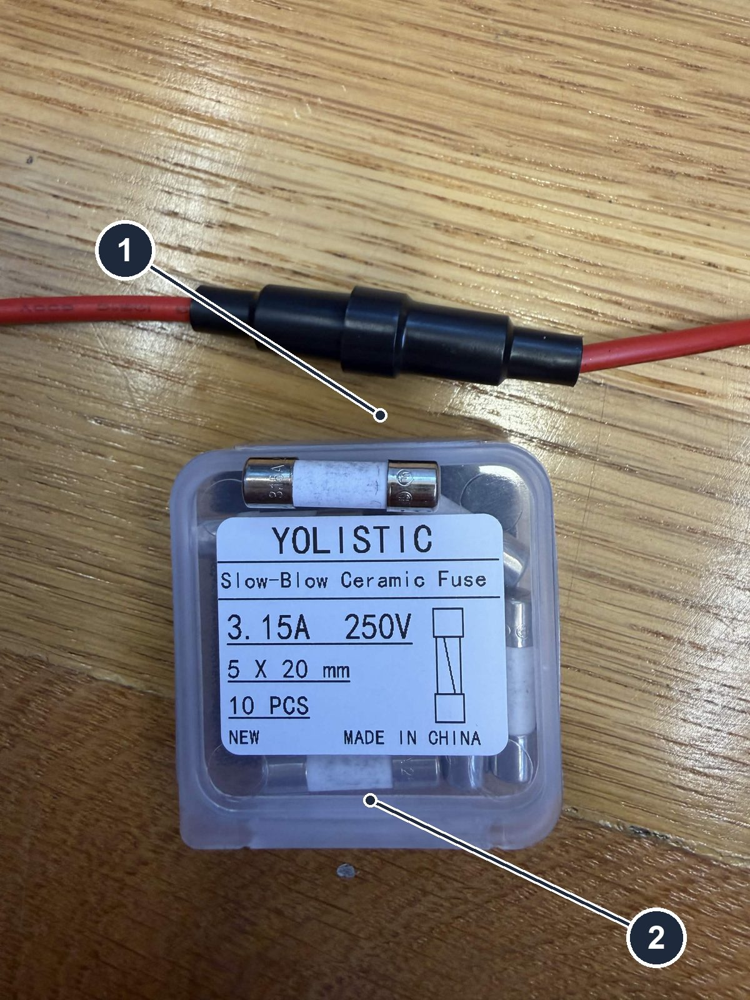{ loading=lazy }

1. **The inline holder** — it unscrews in the middle and the fuse lives inside. It goes in **one place only**: the bus pair's **+** leg, between the pigtail and the +24 V WAGO.
2. **The fuses** — 3.15 A slow-blow ceramic, 5 × 20 mm, ten of them. "Slow-blow" is the property that matters (it rides through power-up inrush); 3.15 is the IEC value that *is* "3 A". One in the holder, the box in the drawer.

!!! trap "If CP1 or CP2 does not beep"
    Stop. Your unit's doubled terminals are not common on that rail, and nothing about this chapter's split is safe to assume anymore. Run **single-pair operation**: one proven +/− pair feeds the fuse and the bus, the buck moves to the bus *after* the fuse (exactly as stage 1's diagram draws it), and the second pair gets capped — insulated, folded back, out of the story. **Never bridge unproven terminals yourself.** A bridge you add to a block you don't understand is a decision the datasheet didn't approve.

---

## The 24 V backbone

[Stage 1's diagram](04-full-fixture-bench.md#stage-1-power-backbone) is already connector-level here — the WAGOs are drawn as WAGOs. What it cannot show is the litany, so here it is, the same one every lever nut on this bench gets:

1. Strip **11 mm** — to the gauge moulded into the block's side, not by eye.
2. Lever fully up. Halfway is a spring pressing on nothing.
3. Insert to the stop.
4. Lever down.
5. **Tug it. If it moves, do it again.**

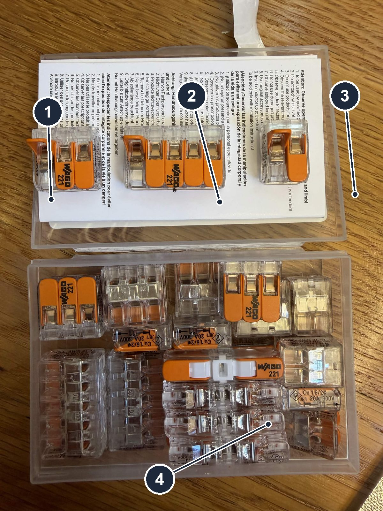{ loading=lazy }

1. **Lever up = open.** This one is ready to take a wire; the litany above closes it.
2. **The five-port blocks** — these become the **+24 V bus** and the **ground star**: one wire in from the supply side, the rest fan out.
3. **Two- and three-port blocks** — joins and taps along the way.
4. **The inline splice** — wire-to-wire, for extending a lead without a block.

The bus pigtail's + lands in the fuse holder; the fuse's far side lands in the **+24 V bus** WAGO. Its − mate lands in the **ground star** WAGO — and that WAGO is the single floor the whole bench measures against. **Every ground goes directly to the star, never chained** device-to-device. The named failure is *zone-to-zone brightness mismatch*: chained grounds turn shared return current into small voltage offsets, and two zones at identical settings visibly disagree — a wiring fault that looks exactly like a software bug and isn't.

The breadboard carries **signals only** — I2C, dimmer lines, milliamps. A breadboard rail gives up around 1 A; tape current through one is how rails melt and mysteries begin. All real current lives on the WAGOs and 18–20 AWG wire.

Three checkpoints close the backbone: 24 V at the bus after the fuse (CP5), 5.0 V at the buck output **measured before the ESP32 is connected** (CP6 — a swapped VIN/GND survives; fix it and re-test), and one resistance sweep proving supply−, the star, the ESP32's GND, and every ULN pin 9 all sit within 1 Ω of each other (CP7).

The buck itself, before it goes anywhere (it ships bare — two wires soldered to IN and GND are all it needs today):

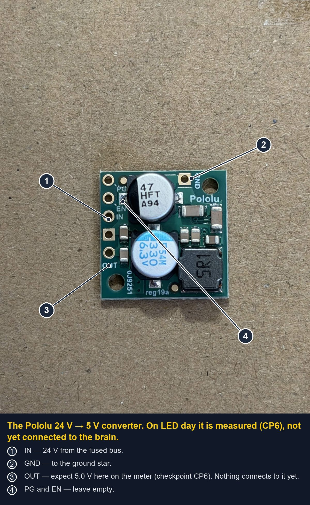{ loading=lazy }

1. **IN** — 24 V from the supply's **pair-B pigtail, straight off the PSU.** Not through the fuse: the single T3.15AL250V guards the LED bus only. (Only in the single-pair fallback does IN come off the fused bus instead.)
2. **GND** — two pads, same net: the corner pad *and* the in-row pad between IN and OUT. Use either; one goes to the ground star.
3. **OUT** — expect **5.0 V** here on the meter. That is CP6, and nothing connects to this pin today.
4. **PG and EN** — the first two holes in the row. Leave both empty.

---

## The chain, demystified

Stage 2's diagram shows the whole chain at once — it stays [where it is](04-full-fixture-bench.md#stage-2-first-light-one-zone-three-sliders); this section is the close-ups. Two part numbers do everything, and neither is an explanation. Here is what each one *is*.

First, triage the parts box. One board in it looks like it belongs in this chain and does not — it drives the *spotlight*, a different milestone with different physics:

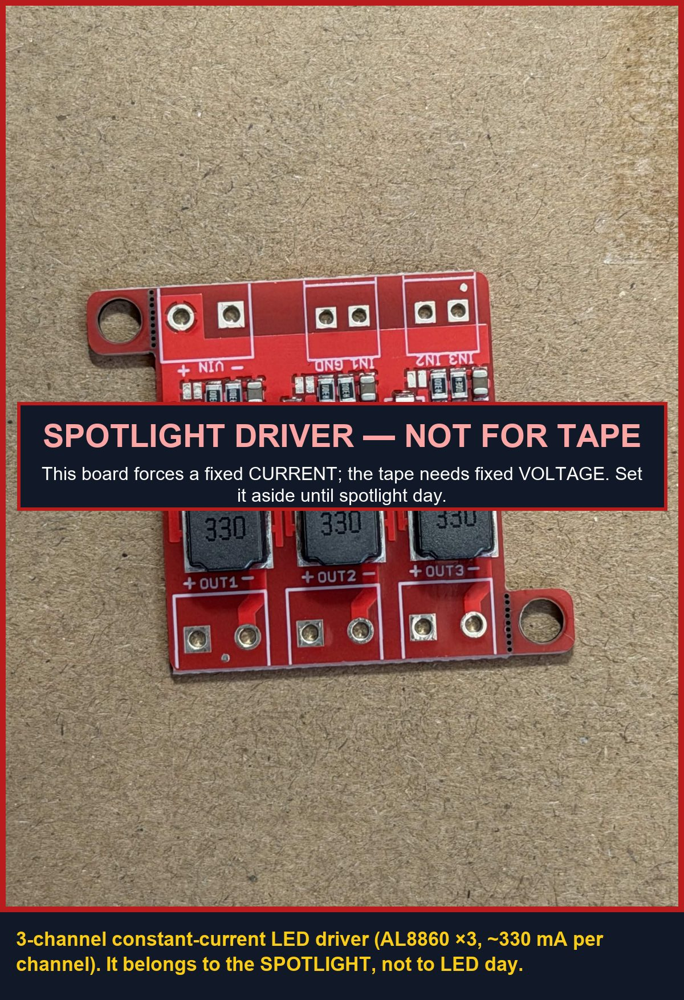{ loading=lazy }

This is the BoM's PicoBuck-class driver (this unit's chips read AL8860; ~330 mA per channel). It forces a fixed **current** through three **separate** outputs — the tape is a fixed-**voltage**, common-anode part with one shared 24 V, so there is nothing here for it to connect to. Set it aside until spotlight day. The same fence runs the other way: the spotlight's bare LED star never touches the 24 V bus.

And a fact both remaining boards share: **they ship bare.** The dimmer hubs and the spare brain all arrive with loose header strips. Solder the headers first — [Doc 8's five rules](08-build-the-fixture.md#soldering-these-boards-five-rules), big forgiving pads, and the best possible warm-up before the tape's small ones.

### Hop 1 — the PCA9685, or: sixteen dimmers on two wires

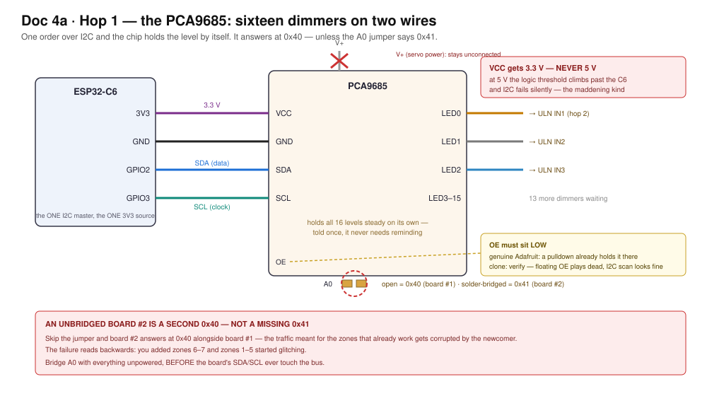

A PCA9685 is a chip that **takes orders over two shared wires and holds sixteen dimmer signals steady by itself**. The ESP32 says "channel 3 to 40%" once, over I2C; the chip keeps channel 3 at exactly 40% forever without being reminded. That is the whole job, and it is why the C6 can run 21 tape channels without breaking a sweat.

The **address is a house number.** Both boards hear every order on the same two wires; the number at the front of the order decides who acts on it. Board #1 answers at **0x40**. Board #2 answers at **0x41 — only after its A0 jumper is bridged with a blob of solder.**

!!! danger "An unbridged board #2 is a second 0x40, not a missing 0x41"
    Skip the jumper and board #2 does not sit quietly waiting to be found. It is a **second device answering at 0x40** — both chips reply at once, and the bus traffic meant for the zones that already work gets corrupted by the newcomer. The failure reads backwards: you added zones 6 and 7 and *zones 1 through 5* started glitching. Bridge A0 with everything unpowered, **before the board's SDA and SCL ever touch the bus.**

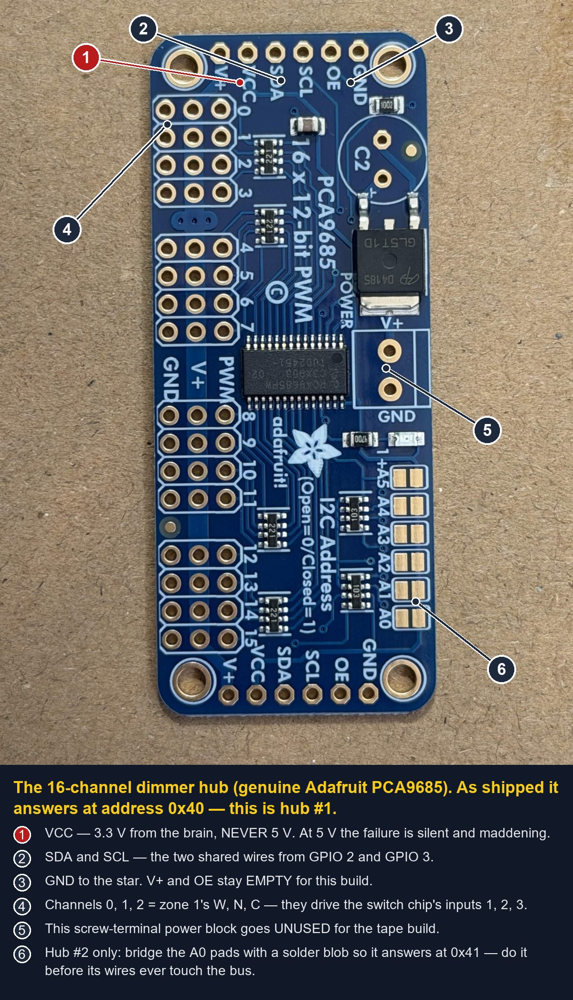{ loading=lazy }

1. **CAUTION — VCC.** Takes **3.3 V from the brain, never 5 V**. This is not just a silent failure: the board's own pull-up resistors tie SDA and SCL to VCC, so 5 V here puts 5 V on the C6's GPIO 2 and 3 — past the chip's 3.6 V absolute maximum. It can kill the brain, quietly.
2. **CAUTION — V+, VCC's next-door neighbour.** Stays **EMPTY**. One position over from the pin you want, and the reason to read the silkscreen letter by letter.
3. **SDA and SCL** — the two shared wires, from GPIO 2 and GPIO 3 respectively.
4. **GND** — to the ground star. (OE, two pins over, also stays empty — a genuine Adafruit board already holds it enabled; on a clone, verify.)
5. **Channel 0** — zone 1's three channels are 0, 1, 2, and the wire comes off the **PWM** hole of each, nothing else. See the close-up below.
6. **The V+/GND terminal footprint** (block supplied loose) — stays unpopulated for the tape build.
7. **The A0 address pads** — hub #2 only: bridge this pair with solder so it answers at 0x41, *before* its bus wires ever land. See the close-up below.

One trap the photo can't show: **both ends of the board carry the same six control pins in mirrored order.** Use the end shown here, and read the silkscreen every time — landing the four wires on the far end in the same left-to-right order swaps SDA with SCL and puts VCC on V+.

The two close-ups that make 5 and 7 unmistakable:

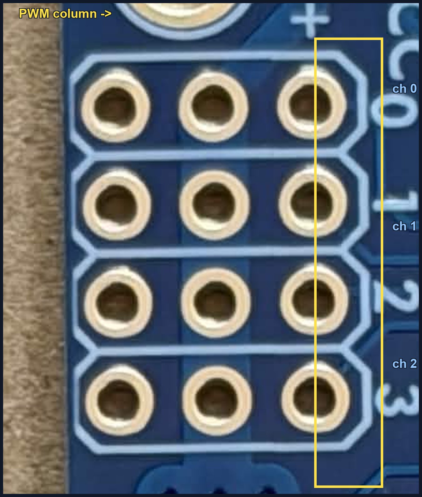{ loading=lazy }

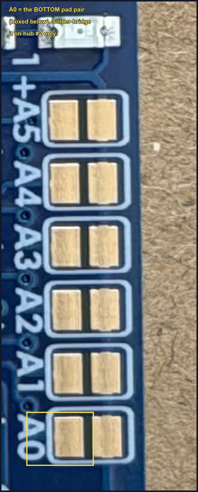{ loading=lazy }

Three traps, all pre-solved in the stage YAML but not in your wiring:

- **VCC gets 3.3 V. Never 5 V.** At 5 V the chip's logic threshold rises above what the C6 outputs and I2C fails *silently* — and worse, the board's pull-ups drag SDA/SCL to VCC, putting 5 V on GPIO pins rated for 3.6 V absolute maximum. The silent failure can also be a dead brain.
- **V+ stays unconnected.** It is servo power for a job this board doesn't have.
- **OE must sit low.** On a genuine Adafruit board a pulldown already holds it there; on a clone, verify — a floating OE tri-states all sixteen outputs, and the board plays dead while the I2C scan looks perfect.

Before power touches the chain, CP8: the wire landing on PCA VCC beeps to the 3V3 rail **and to nothing else**. If it beeps anywhere else, rewire before power.

The other end of those two wires is the brain. This build keeps a spare ESP32-C6 board for exactly this chapter — the whole chain gets proven on the expendable board before the fixture's own brain ever touches it:

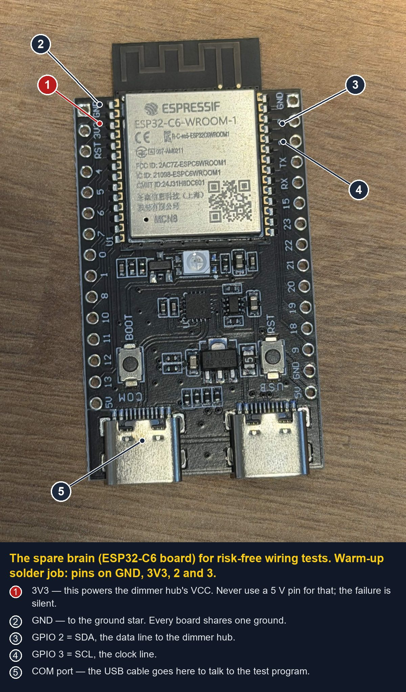{ loading=lazy }

1. **CAUTION — 3V3.** This pin powers the hub's VCC. Never a 5 V pin — see the hub trap above for why that can kill this board.
2. **GND** — to the ground star. Every board shares one floor.
3. **GPIO 2 = SDA.** On the antenna-side header, it is the **first pin below GND** — the close-up below shows the printed digits.
4. **GPIO 3 = SCL** — the second pin below GND.
5. **The left USB-C port, silkscreened COM** — the cable goes here to drive the test program.

Solder the header pins into the **outer round holes** — the inner flat pads are for surface-mounting, and a pin sunk there will not reach a breadboard. Four pins are enough: GND, 3V3, 2, 3.

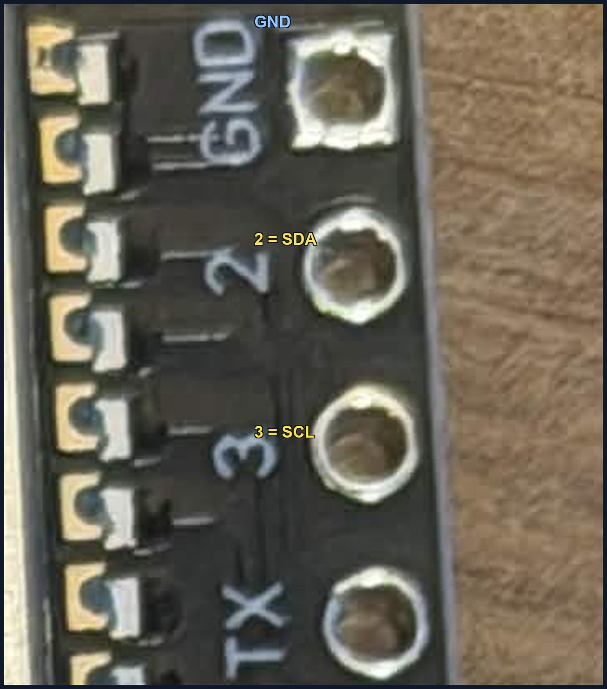{ loading=lazy }

### Hop 2 — the ULN2803, or: eight switches in one chip

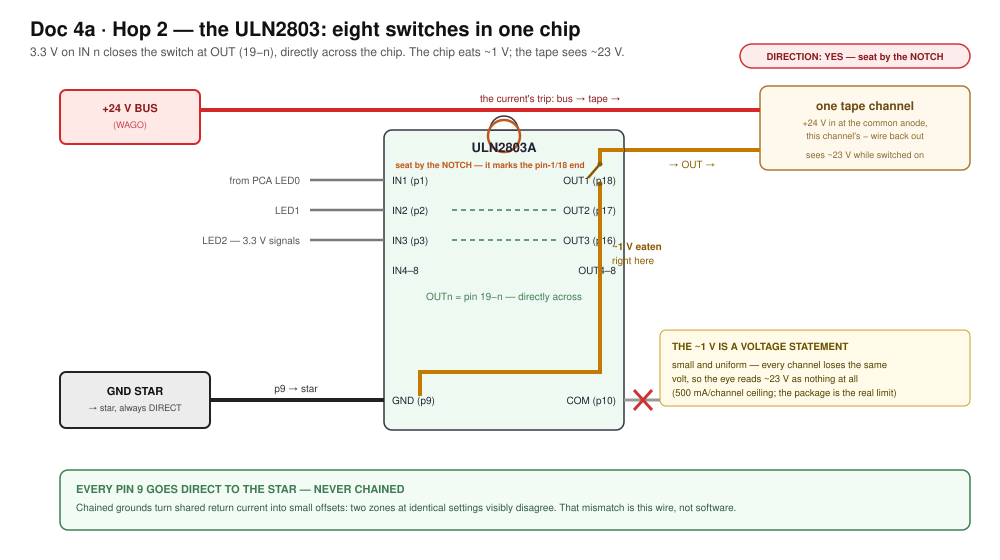

A ULN2803 is **eight electronic switches in one package**. Put 3.3 V on IN *n* and the switch at OUT (19−*n*) — the pin directly across the chip — closes, connecting that tape wire to ground. Current then flows the full loop: 24 V bus → tape → OUT pin → through the chip → pin 9 → the star. The chip **eats about 1 V doing it, so the tape sees ~23 V.** That is a voltage statement, small and uniform — every channel loses the same volt, and the eye reads it as nothing at all.

This is the chip itself, and the one fact about its body that the schematic cannot teach:

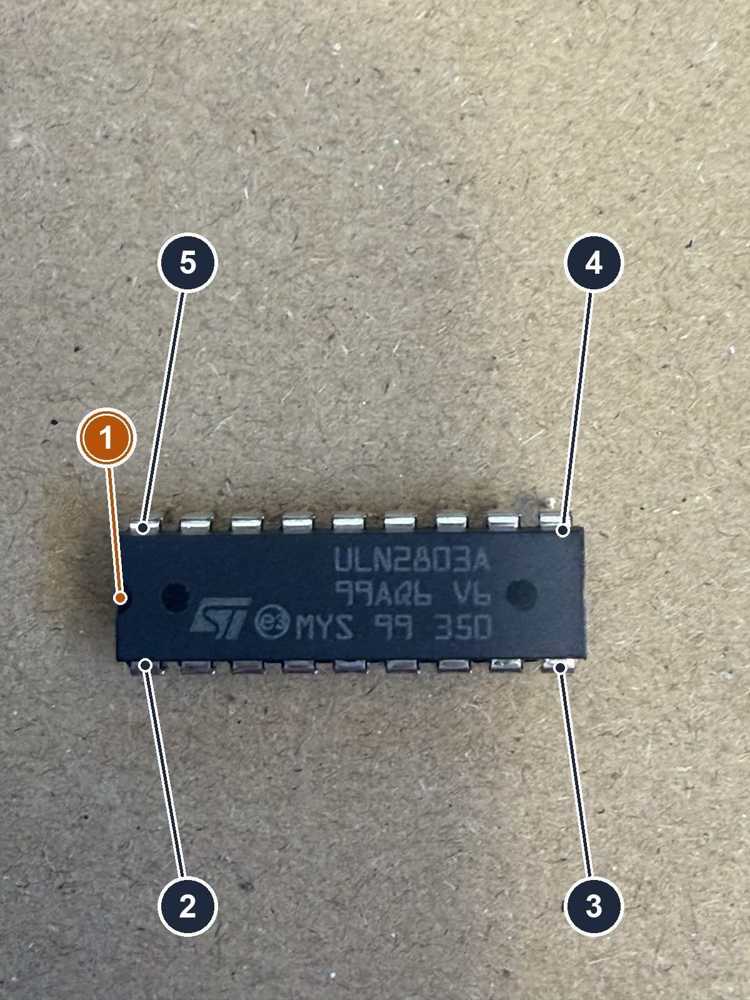{ loading=lazy }

1. **CAUTION — the notch marks the pin-1 end.** Seat every chip so its notch matches the drawing/socket orientation **before** power. A chip seated backwards puts the tape's 24 V returns onto its logic inputs and dies on first power — across four chips and 21 channels if the habit sticks. Count pins from the notch, never from habit.
2. **Pin 1 = IN 1** — bottom-left corner when the printing reads upright.
3. **Pin 9 = GND** — bottom-right corner, straight to the ground star.
4. **Pin 10 = COM** — top-right corner, stays **empty** for LEDs.
5. **Pin 18 = OUT 1** — top-left corner, directly across from IN 1. That is the OUT = 19 − IN rule in the flesh: inputs count up along the bottom, their outputs sit straight across on top.

Pin 9 goes to the star. Pin 10 stays unconnected.

One closing rule for the whole chain: **one I2C master and one 3V3 source on the bus at a time.** The C6 gives the orders and the C6's regulator feeds the logic — wire in a second of either and the bus stops being a party line and becomes a committee.

---

## Tape work

The Valent X spool is the most expensive thing on this bench, and the work in this section is the only work that can damage it. Read all of it before the iron heats up.

**Practice on the spool tail first.** The spool's outer end is scrap the moment you cut your first zone. Make two or three practice joints there before touching a real zone: a lifted pad on the tail costs nothing, and a lifted pad on a cut zone costs one cut-line of tape — not the day, but not free either. Nobody's first tape joint should be one that has to work.

This is your spool at a cut line — the four pads, and the printed letters every wire label copies:

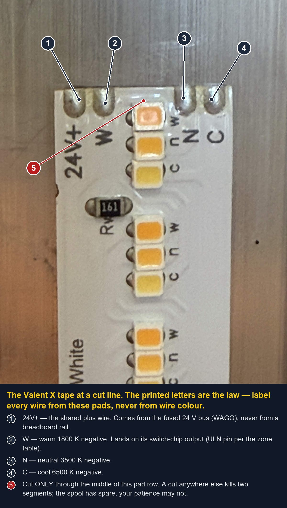{ loading=lazy }

1. **24V+** — the shared plus wire, common to all three channels. Comes from the fused 24 V bus (WAGO), never from a breadboard rail.
2. **W** — the warm channel's negative wire.
3. **N** — the neutral channel's negative. **Nothing to do with mains neutral** — here N is just a color.
4. **C** — the cool channel's negative.
5. **CAUTION — the cut.** The dashed line in the photo is where the printed cut line runs: **straight across the tape, through the centres of all four pads.** Each half-moon becomes a full pad for the segment on its side. Anywhere else kills the segments on both sides of your scissors.

What the letters mean, in the vocabulary every other table on this site uses:

| Pad letter | Channel | Lands on |
|---|---|---|
| W | **1800 K** warm | its own ULN OUT pin |
| N | **3500 K** neutral | its own ULN OUT pin |
| C | **6500 K** cool | its own ULN OUT pin |

Because 24V+ is shared, **a solder bridge between any two pads is a dead short** — CP10's whole job is catching one.

The rules, each with its failure attached:

- **Cut at the printed cut lines.** Anywhere else severs traces mid-segment, and both segments on either side of the cut go dark forever.
- **Label every wire from the tape's printed pad markings.** Never from wire color, and never from any diagram — including ours. Your spool's pad order is the authority; a diagram is somebody else's spool. Write the label on a flag of tape at both ends of the wire before the wire ever meets the iron.
- **Use 24–26 AWG silicone stranded wire for pad wires.** 22 AWG solid is the canonical lifted-pad cause: it works as a lever, and every nudge of the stiff wire pries at a pad held on by adhesive and hope. The floppy stuff can't transmit a snag to the joint.
- **Strip only 2–3 mm for a tape pad** — a bared length that fits *on* the half-moon with nothing hanging over. This is not the WAGO's 11 mm; carry that habit here and the overhang becomes the stray strand CP9 exists to catch.
- **Solder order, tinning, and what a good joint looks like** are [Doc 8's five rules](08-build-the-fixture.md#soldering-these-boards-five-rules) — tin the pad, tin the wire, touch them together with the iron, and expect the tiny volcano, not the blobby ball. They are not repeated here; go read them.
- **Strain-relieve the 4-wire pigtail within ~20 mm of the pads BEFORE the tug test.** Anchor the bundle to the tape's backing so a pull lands on the anchor, not the joints. Do it in this order or the tug test is itself the pad-lift event — you would be testing the pads' adhesive, not your solder.

The wire itself, so the right spool is never a guess:

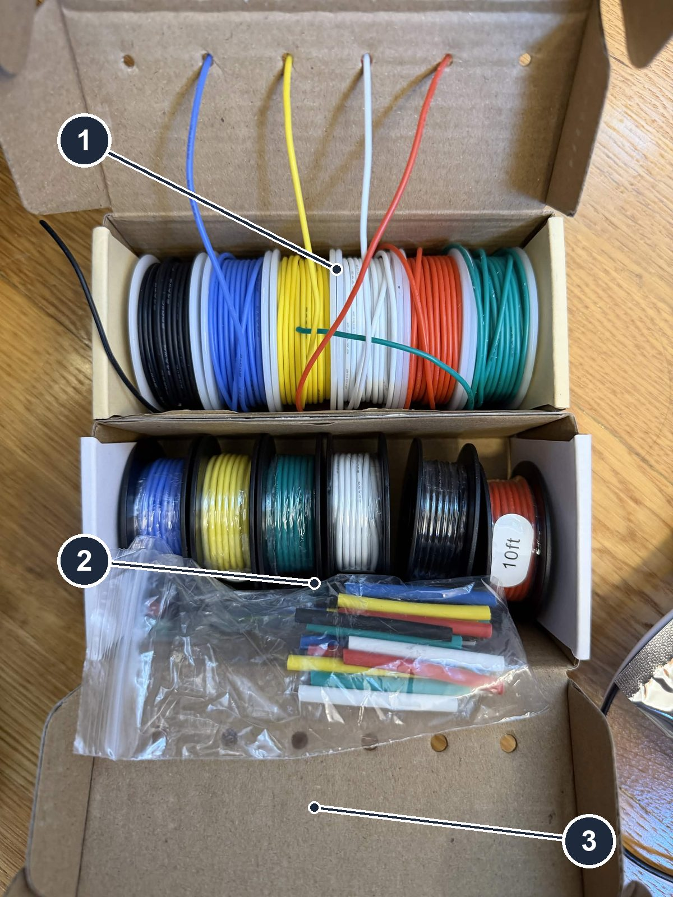{ loading=lazy }

1. **The 24 AWG silicone kit (thin, six colors)** — THE tape-pad wire. Six colors means 24V+, W, N and C can each keep a color for a whole zone.
2. **The 20 AWG kit (thicker)** — the 24 V feed runs: supply pigtails, bus-to-zone feeds.
3. **The heat-shrink bag** — the strain-relief anchor material for the tape pigtails.

The schematic version of the same step, for the wire-flag and solder-order detail:

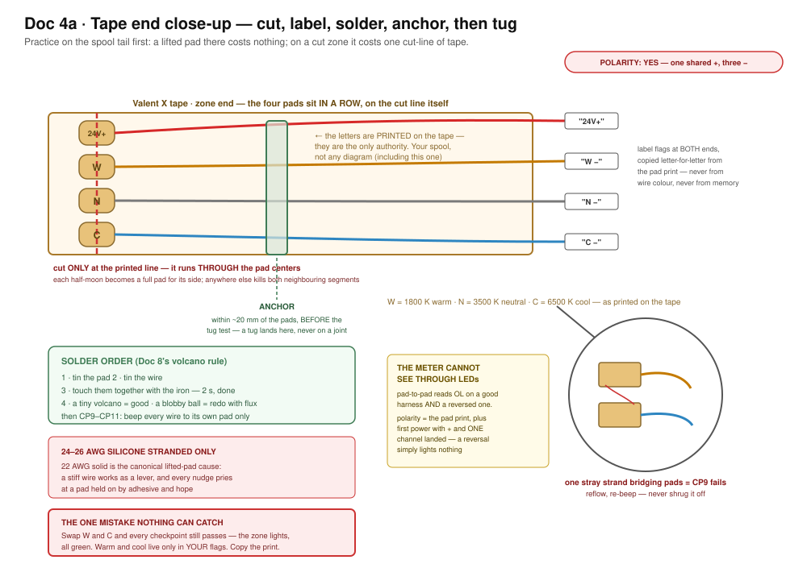

### The meter cannot see through LEDs

Here is the trap that costs beginners an evening: **continuity and diode-test modes source a volt or two, and the tape's LED strings need far more than that to conduct.** Every pad-to-pad reading across a channel therefore reads **OL on a good harness AND on a reversed one.** The meter is not telling you the harness is bad. It is telling you it cannot see through LEDs — and it can't, ever, in either direction.

So polarity is proven two other ways, neither of them a beep: **the pad print** (which you labeled from — see above), and **the first-power test with only + and ONE channel landed.** A reversed connection simply lights nothing; nothing is harmed. Fix it, relight it, then land the rest.

The beep rituals earn their keep proving what they *can* prove:

- **CP9** — each wire beeps to its own pad only, neighbours silent. A stray strand is a reflow and a re-beep, not a shrug.
- **CP10** — the +24 pad to each − pad reads OL, no sustained beep. The LED string blocks the meter, so a solid beep here can only be a solder bridge. Reflow it.
- **CP11** — with the zone chained in and power off, the ULN OUT pin beeps to the tape's − wire, end to end. Open means a break: beep it segment by segment until you find which joint went quiet.

Then the zone's first power is CP12 — and honesty about this bench's meter: the TM-510 has **no current range**, so CP12 is a *watch-and-expect* check, not a reading. One zone landed, power on, and for thirty seconds you watch three things: the supply stays steady (no rhythmic clicking — that hiccup is its overload protection saying *short*), all three whites actually light, and nothing — chip, wire, tape — gets warm. A supply that hiccups is telling you there's a short; find it, don't retry blind.

!!! info "JST-XH is graduation-adjacent"
    The fixture build puts every zone on a JST-XH plug — the site's 3 A law for that connector holds, and a zone's ~80–160 mA clears it by a mile. But that is [Doc 8](08-build-the-fixture.md)'s step. For bench bring-up, soldered tails straight into the WAGOs and breadboard are fine. Don't buy crimping problems before the design is frozen.

---

## Power math, published honestly

Honestly twice over: these figures are **derived from the tape's own rating** (the spool's watts-per-foot, split across the lengths this build cuts), not yet measured — this bench's meter has no current range, so they stand as *expectations* until a current-capable meter visits. They are what the fuse and the supply were sized against:

| Zone | Length | Whole zone, full on | Per channel |
|---|---|---|---|
| Radial (zones 1–6) | 4.92″ — 2 segments | **≈ 80 mA expected** | ~27 mA |
| Bottom ring (zone 7) | 9.84″ — 4 segments | **≈ 160 mA expected** | ~53 mA |

Against the ULN2803's **500 mA per-channel ceiling**, 27 and 53 mA are loafing. But read the ceiling honestly too: it is per channel, **one at a time**. Run channels together and the package's total dissipation becomes the real limit long before any single channel's 500 mA does. At this build's currents that limit never comes close; if you ever scale the tape, the package is the number to check, not the 500.

You will find a watts-per-foot figure printed on the spool box. It is deliberately not printed here, and no per-foot scaling rule is either: these are the two zone lengths this build cuts, they were measured, and measured figures are what the fuse and the supply get sized against.

**Why T3.15AL250V.** Fuse values come from an IEC ladder of preferred sizes, and 3.00 A is not on it — **3.15 A is the value that *is* "3 A."** Decode the letters once and the part number stops being noise: **T** is time-delay (it rides through inrush instead of dying at every power-up), **L** is low breaking capacity (fine at 24 V), **250 V** is the rating ceiling, not a requirement. And the day you run twice the tape, step to **T4AL250V** — the BoM has stocked that fuse beside the 3.15 since Doc 4, for exactly that day.

---

## Graduating off the breadboard

The gate is [Doc 8's](08-build-the-fixture.md) and it is one sentence: **[stage 7's checklist](04-full-fixture-bench.md#stage-7-integration-day-verdict) passes on the breadboard first.** Solder freezes a *validated* design — never an aspirational one. Every hour spent soldering an unproven chain is an hour of desoldering you scheduled for later.

When the checklist passes and the iron comes out, the technique chapter is already written: [Doc 8's five soldering rules](08-build-the-fixture.md#soldering-these-boards-five-rules). They are not duplicated here. Rule 4 — beep everything before power — is this chapter's CP9–CP11 wearing work clothes.

One part in the drawer already belongs to that chapter, not this one:

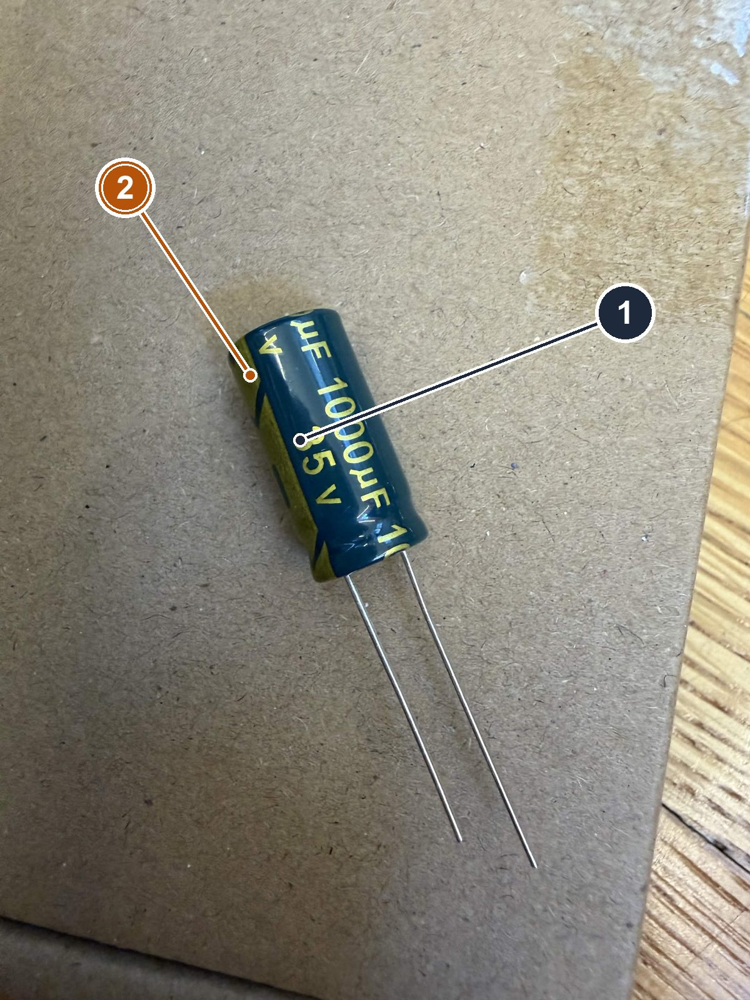{ loading=lazy }

1. The **1000 µF 35 V bulk capacitor** — [Doc 8](08-build-the-fixture.md)'s power-board part. It waits in the drawer today; the breadboard build doesn't use it.
2. **CAUTION — the stripe marks the NEGATIVE leg.** Electrolytics installed backwards fail loudly and sometimes wetly. When its day comes: stripe to ground, always.

---

## When a zone is dark

Work the ladder top-down. Each rung is a witness, and each failure names exactly who it indicts — never skip a rung, because every rung you pass clears a suspect.

Rung 2's far end is the radio the commands travel through. It lives in the Home Assistant box, never gets a wire from this bench, and pairing happens on HA's screen:

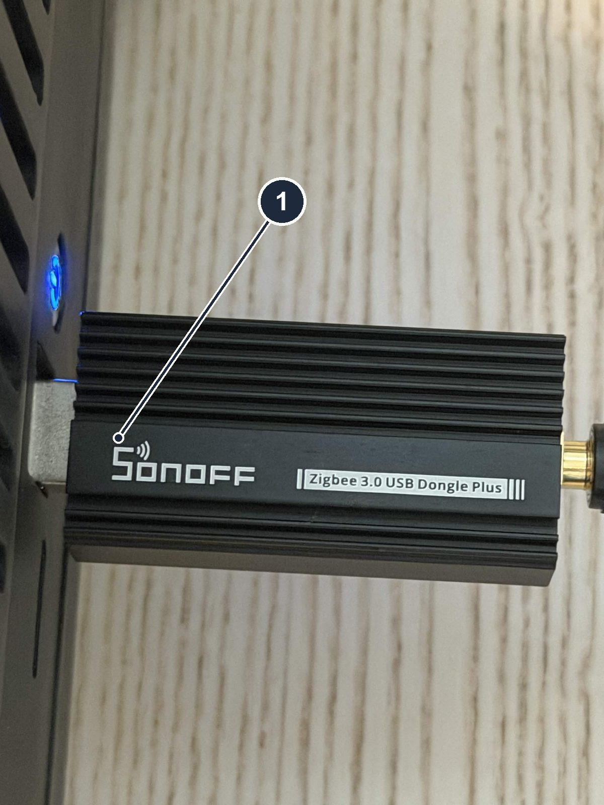{ loading=lazy }

1. Stays plugged in exactly as it is — on the day, you open **Add device** in Home Assistant and the fixture pairs to this.

| Rung | Witness | Healthy reading | A failure here indicts |
|---|---|---|---|
| 1 | Tap the zone in the app | It lights | Nothing. Go home. |
| 2 | The zone's serial line in the console: `ZB zone=1 on=1 level=255` | The line prints as you tap | Line missing → the command never reached the board — the network/app side, not one wire of yours |
| 3 | The hub ACK witness: `ZB pca hub=0x40 present=1` | `present=1` | `present=0` → the I2C hop: SDA/SCL seating **or swapped**, VCC on 3.3 V, the address jumper |
| 4 | **CP13** — DMM on the zone's PCA LED pin, zone commanded **100%** | ~3.3 V (the pin's average is duty × 3.3 V) | 0.00 V at 100% with the hub ACK good → the PCA output or OE |
| 5 | **CP14** — DMM on the zone's ULN OUT pin | ~1 V commanded on; commanded off it reads **high and unstable, ~8–24 V** through the LED string — that instability is normal | ~1 V while commanded **off** → a stuck ULN channel |
| 6 | **CP15** — across the lit channel, tape +24 pad to that channel's − | ~23 V | 23 V present and still dark → the tape itself: a joint past the probe, a dead cut, or a reversed pad |
| 7 | Nothing anywhere | — | Back to the stage-1 ritual numbers: bus, buck, grounds |

One meter honesty note for rung 4: **a DMM averages PWM.** At 40% it reads ~1.3 V, at 70% ~2.3 V — numbers that look like faults and aren't. Never probe at partial level; command 100% and expect ~3.3 V, or learn nothing.

---

## The checkpoint table

Every CP this chapter has named, in one place. Print it; tape it above the bench next to stage 4's zone table.

| CP | Setup | Measure | Healthy | If not |
|---|---|---|---|---|
| CP1 | Supply **unplugged**, continuity | +Vo ↔ +Vo | Beeps | Isolated outputs → single-pair rule; never bridge unproven terminals |
| CP2 | Same | −Vo ↔ −Vo | Beeps | Same branch as CP1 |
| CP3 | Same, **resistance** mode | + ↔ − | Short chirp, then climbs to tens of kΩ/OL (output caps charging — normal) | A beep that never stops = short — **do not plug in** |
| CP4 | Pigtails landed, cover **ON**, powered | Every pigtail pairing | 24 V ±5% on all | One pair differs → isolated outputs, single-pair rule |
| CP5 | Backbone | The bus, after the fuse | 24 V | Fuse seat, holder side, leads |
| CP6 | Backbone | Buck output, **not** connected to the ESP32 | 5.0 V | VIN/GND swapped — survives; fix, retest |
| CP7 | Backbone, Ω | Supply− ↔ star ↔ ESP32 GND ↔ every ULN pin 9 | < 1 Ω | A ground is chained or missing |
| CP8 | Chain, power off | The wire landing on PCA VCC | Beeps to the 3V3 rail and to nothing else | Rewire before power |
| CP9 | After soldering | Each wire to each pad | Beeps to its **own** pad only, neighbours silent | Stray strand → reflow, re-beep |
| CP10 | Same | +24 pad ↔ each − pad | OL / no sustained beep (the LED string blocks the meter; a solid beep = solder bridge) | Reflow |
| CP11 | Zone chained, off | ULN OUT pin ↔ tape − wire | Beeps | Open → beep segment by segment |
| CP12 | First power, one zone — watch for 30 s (this meter has no current range) | Supply steady, all three whites lit, nothing warm | No hiccup clicking; three colors visible; everything cool | Hiccup/trip → find the short, don't retry blind |
| CP13 | Zone commanded **100%** | The zone's PCA LED pin | ~3.3 V (duty × 3.3 V; a DMM averages PWM — never probe at partial level) | 0.00 V at 100% with hub ACK → PCA output/OE |
| CP14 | Zone commanded on, then off | The zone's ULN OUT pin | ~1 V on; off = high and unstable, ~8–24 V through the LED string (normal) | ~1 V while commanded **off** → stuck channel |
| CP15 | Zone lit | Across the lit channel | ~23 V | Dark with 23 V present → the tape or the joints |

---

## Before you switch on

- [ ] CP1–CP3 passed on the bare terminals, **unplugged**
- [ ] Four pigtails landed — bare stranded copper under every screw, none tinned, all tugged
- [ ] The terminal cover is **on** (and goes back on before every power-up after this one)
- [ ] One fuse — T3.15AL250V on the bus pair's + leg — and only one
- [ ] Every ground runs direct to the star; nothing chained
- [ ] PCA VCC beeps to the 3V3 rail and to nothing else (CP8); V+ empty; A0 on board #2 bridged before its bus wires land
- [ ] Every tape wire beeps to its own pad only (CP9); +24 to − pads all read OL (CP10)
- [ ] The 4-wire pigtail is strain-relieved within ~20 mm of the pads — and was before the tug test
- [ ] First power-up watched, not walked away from: supply steady, all three whites lit, nothing warm (CP12)

**Done when:** the supply is identified and pigtailed, every pad beeps to its own wire and nothing else, and you can point at the single place every ground meets.

Then go back to [Doc 4 stage 2](04-full-fixture-bench.md#stage-2-first-light-one-zone-three-sliders), power up, and put three sliders on one zone. [Stage 4](04-full-fixture-bench.md#stage-4-scale-to-7-zones-21-channels) scales it to seven.

---

## Sources

Verified against primary documents rather than forum lore:

- **Diode LED Valent X Tunable White** product page and spec sheet — 24 V common anode, printed cut lines and pad markings
- **NXP PCA9685 datasheet** — 16-channel PWM over I2C, the address pins, OE behavior, and VIH = 0.7·VDD (the 3.3 V rule)
- **TI ULN2803A datasheet** — Darlington saturation (the ~1 V), the 500 mA per-channel and package-dissipation limits, pin geometry
- **Pololu D24V22F5** product page — fixed 5 V, 2.5 A, nothing to mis-adjust
- **WAGO 221 series** documentation — the 11 mm strip gauge and lever litany
- **JST XH series datasheet** — the 3 A rating behind the connector law
- **Mean Well IRM-90 series datasheet** — the ST screw-terminal block, Class II construction, 3.75 A rating, and hiccup-mode protection

Where a reading here disagrees with a datasheet's ideal — the ~1 V, the ~23 V, the ~80 mA — the bench number is the one printed, and the section that measured it says how.
