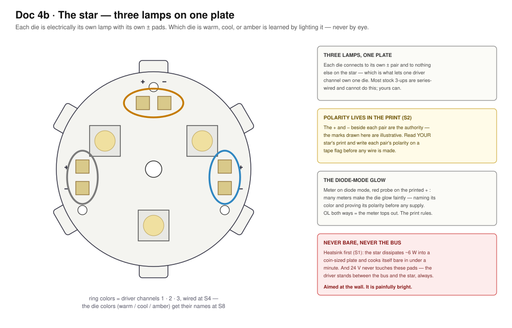
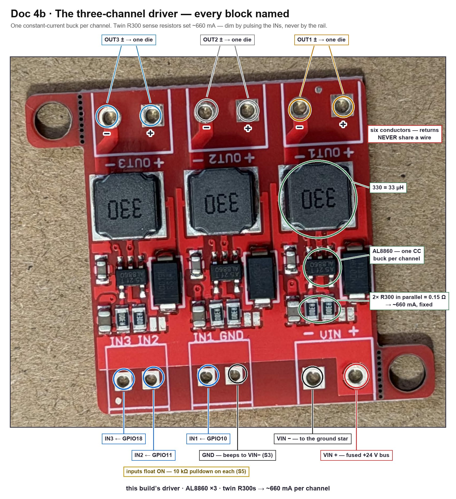
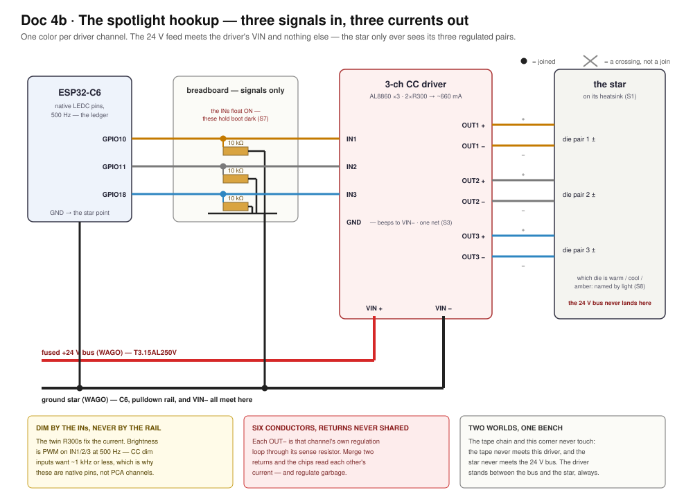

# Doc 4b · Wire the Spotlight For Real — The Star, the Driver, and Constant Current

**Engineered Lighting prototype series · August 2026**

The chapter [Doc 4 stage 5](04-full-fixture-bench.md#stage-5-the-spotlight-constant-current) points at. Stage 5's wiring is one paragraph, and it is a correct paragraph — but it assumes you already know what a constant-current driver is, which die is which on an unlit star, and why the habits [Doc 4a](04a-wire-the-zones.md) just taught you must all be *unlearned* at this bench corner. This chapter is that other half, for the parts in your hands.

Five things bite first-time builders here, and the first one is the frame for all the rest:

- **The driver is a different species.** Everything on the tape side holds *voltage* steady and lets the load draw what it wants. This board holds *current* steady and applies whatever voltage that takes. Most of the tape chapter's instincts quietly reverse here — this chapter marks each reversal where it happens.
- **The star is three separate lamps that look almost identical unlit.** Which die is warm, which is cool, and which is amber is learned by lighting them, never by squinting at phosphor.
- **The driver's inputs float ON.** Without a pulldown on each one, the star blasts full-bright at every power-up while the C6 is still booting.
- **The star cooks itself bare in under a minute, and it is painfully bright.** The heatsink is step zero, and the beam aims at the wall — never at your face.
- **A reversed die is no longer the harmless mistake it was on the tape.** [Doc 4a](04a-wire-the-zones.md#the-meter-cannot-see-through-leds) taught you to prove tape polarity by lighting one channel and shrugging if it stayed dark. Here that shrug can cost a die — polarity gets proven **cold**, and this chapter shows how.

Everything below is verified against the parts on this bench — the LuxDrive SJX-1 star and this build's AL8860 three-channel driver — and against the manufacturers' own datasheets.

??? info "Words this chapter uses — open this if any of them are new"
    [Doc 4a's vocabulary](04a-wire-the-zones.md) still applies — continuity, OL, bus, star, rail, silkscreen, tinned. These are the new ones.

    | Word | What it means here |
    |---|---|
    | **CC vs CV** | Constant-current vs constant-voltage. The tape is CV: feed it 24 V, it limits its own current. A bare LED die is CC territory: it must be *fed* an exact current, or it runs away and burns. Two kinds of dimmer for two kinds of physics — [Doc 4's concepts](04-full-fixture-bench.md#concepts-plain-english-read-once-everything-refers-back) introduced this; today it becomes wiring. |
    | **Die** | One bare LED emitter. The star carries three, each electrically its own lamp. |
    | **Forward voltage (Vf)** | The voltage an LED happens to drop while conducting — for these dies, around 3 V. On the tape you *supplied* a voltage; here the driver supplies current and the ~3 V simply appears across the die. You never set it. |
    | **Buck driver** | A switching circuit that steps 24 V down efficiently. This board's version switches on and off thousands of times a second, watching the current and correcting it continuously. |
    | **Sense resistor** | How the driver knows the current: a tiny resistor in the loop that the chip holds 0.1 V across. This board carries **two, marked R300** (0.30 Ω), side by side per channel — in parallel that is 0.15 Ω, and 0.1 V ÷ 0.15 Ω ≈ **660 mA**. The current is a property of the board, not a knob. |
    | **MCPCB** | Metal-core PCB — the star's aluminum plate. Its whole job is moving heat from the dies into your heatsink. It is also why the star must never run bare. |
    | **Thermal adhesive** | The glue between star and heatsink. It conducts heat; air does not. Full-face contact, thin layer. |
    | **Duty floor** | The low end of PWM dimming where a CC driver's regulation gets twitchy — typically below ~5%. You will measure yours and write it down. |

!!! abstract "The order this happens in"
    Same rule as [Doc 4a](04a-wire-the-zones.md): sections are grouped by subject; on the day, work this sequence, and finish each step before the next.

    | # | What you do | Section | Ends when |
    |---|---|---|---|
    | 1 | Mount the star on its heatsink; prove polarity and (maybe) meet the dies | [The star](#the-star-demystified) | S1–S2 pass |
    | 2 | Identify the driver, solder its leads, ring it out | [The driver](#the-driver-demystified) | S3 passes |
    | 3 | Harness: outputs to dies, inputs + pulldowns, power | [Wire it](#wire-it) | S4–S6 pass |
    | 4 | First power — the boot-dark proof, before any logic exists | [First power](#first-power-and-first-light) | S7 passes |
    | 5 | First light, one die at a time — name them | [First power](#first-power-and-first-light) | S8 passes |
    | 6 | Sweep each channel; find the duty floor; soak | [First power](#first-power-and-first-light) | S9–S10 pass |

    Nothing on this page touches the tape chain, and the rule from [Doc 4a](04a-wire-the-zones.md#the-chain-demystified) runs both ways: **the tape never meets this driver, and the star never meets the 24 V bus.** The driver stands between the bus and the star, always.

---

## The star, demystified

*Hands-on stage — no agent lane; the level-3 wiring photo check applies.*

The LuxDrive SJX-1 is **three separate lamps sharing one aluminum plate**. Each die has its own **+ and − pad pair**, electrically connected to nothing else on the star — which is precisely the property [Doc 4's BoM](04-full-fixture-bench.md#bill-of-materials-led-side-170240-doc-3s-gimbal-bom) demanded when it warned that most stock 3-up stars are series-wired and cannot be driven per channel. Yours can. One die per driver channel, three channels, and the fixture's tunable spotlight falls out of the wiring.

This build's dies are **warm-white XP-E2, cool-white XP-E2, and PC Amber** — the maker's own star, per the [Doc 6 addendum](06-message-contract.md#the-spot-light-engine-is-one-entity-not-three). Unlit, the two whites are nearly indistinguishable and the amber is only a shade deeper. Do not decide from phosphor color. The naming happens at [S8](#first-power-and-first-light), by light.

**S1 — the heatsink, before anything else.** Thermal adhesive, thin and full-face, star centered on the ≥2″×2″ heatsink from the BoM. Let it cure per its own instructions. At this build's driver current the star dissipates **~6 W** into a coin-sized plate — twice the reference build's ~3 W, because the driver runs ~660 mA per channel (below) — and bare, it climbs past safe junction temperature in well under a minute. There is no bare-star test, not even a one-second one.

**S2 — polarity, proven cold.** Two witnesses, in order:

1. **The silkscreen.** Each pad pair carries printed **+** and **−** marks beside the pads. Write each pair's polarity on a tape flag *now* — the same flag ritual as [the tape pads](04a-wire-the-zones.md#tape-work), and for the same reason: the print on the part is the authority, and the flag is how it survives into the harness.
2. **The diode-mode glow.** A single die's ~3 V forward voltage sits right at the edge of what a meter's diode mode can source. Probes across one pair, red on the printed **+**: many meters will make the die glow faintly — which proves polarity *and* tells you that die's color, before any supply exists. If yours reads OL both ways and nothing glows, that's fine — the meter tops out below Vf, and witness 1 already settled it.

!!! danger "Why polarity is proven cold here, when the tape got to shrug"
    On the tape, a reversed channel simply stayed dark: 24 V spread across a whole string of junctions, nothing exceeded, fix and relight. **A bare die on a constant-current output has no such forgiveness.** A CC driver with no conducting path lets its output float toward the rail — which puts reverse voltage across a die rated for about 5 V of it. So: flags from the silkscreen, the glow if your meter offers it, and the ring-out at S4. The first time a die sees the driver live, its polarity is already a settled fact.

---

## The driver, demystified

{ loading=lazy }

This is the board [Doc 4a told you to set aside until spotlight day](04a-wire-the-zones.md#the-chain-demystified). Spotlight day is today. What it is: **three independent constant-current buck converters on one PCB** — an AL8860 driver chip, a 33 µH inductor (the chunky "330" squares), and the sense resistors per channel. The chip holds 0.1 V across the sense, so the sense sets the current — and here the board has a correction to offer the site: **each channel carries *two* R300 resistors side by side**, and the parallel pair reads 0.15 Ω, so each channel forces **~660 mA** — not the ~330 mA an earlier read of this board assumed from a single R300 ([Doc 4a's line has the correction](04a-wire-the-zones.md#the-chain-demystified)). Brightness is not set by voltage and not set by the load — it is set by those resistors, and dimmed by pulsing the channel's input.

!!! warning "~660 mA and the amber die — the margin worth knowing"
    The white XP-E2 dies are rated to 1 A, so ~660 mA leaves them a third of headroom. **PC Amber's absolute ceiling is 700 mA** — this driver sits under it by barely 6%. Inside rating, but with that margin S1's thermal path and S10's soak are load-bearing, not ceremonial: the number that keeps the amber die honest is the heatsink's temperature, and you check it, not hope it.

Three pad groups, three jobs:

- **VIN block** — `VIN+` and `VIN−`. The 24 V feed, from the fused bus and the ground star. This is the *only* place 24 V touches this corner of the bench.
- **IN block** — `IN1`, `IN2`, `IN3`, and a `GND`. Logic-level dimming inputs: 3.3 V PWM from the C6, one pin per channel. The site's pin ledger reserves **GPIO10 → IN1, GPIO11 → IN2, GPIO18 → IN3**, at **500 Hz** — CC dim inputs want ~1 kHz or less, which is exactly why [Doc 4 stage 5](04-full-fixture-bench.md#stage-5-the-spotlight-constant-current) put these three signals on native pins instead of the PCA9685.
- **OUT blocks** — `OUT1±`, `OUT2±`, `OUT3±`. One ± pair per die. **Six conductors, and the returns never share a wire** — each OUT− is that channel's own regulation loop back through its sense resistor; merge two returns and the chips read each other's current and regulate garbage.

!!! note "This unit vs. the reference PicoBuck"
    Doc 4's BoM names the SparkFun PicoBuck; the board on this bench is the same animal with different markings — AL8860s instead of AL8805s, same three-channel CC buck, same block layout, same wiring story. One difference matters: **the PicoBuck ships at 330 mA with a solder jumper to reach 660 — this board has no jumper because it is, in effect, permanently jumpered.** Its twin R300s fix ~660 mA per channel, full stop. Everything the reference docs say about "the 330/660 decision" is already decided on this board, in hardware.

!!! trap "The inputs float ON"
    Leave an IN pin unconnected and that channel runs at full current. The C6's pins also float while it boots. Both facts together are [Doc 8's pulldown law](08-build-the-fixture.md#step-5-the-spotlight), inherited here at birth: **a 10 kΩ resistor from each IN to ground**, so the resting state of the whole spotlight is *dark*, and light only ever happens because firmware asked for it. S7 proves the pulldowns before the C6 is even powered — read it before you wire.

**S3 — identify and ring out, unpowered.** Confirm you are holding the CC driver and not something from the tape chain: three AL8860s, three 330 inductors, a side-by-side pair of R300s per channel. The board ships with bare pads — solder its leads now, per [Doc 8's five rules](08-build-the-fixture.md#soldering-these-boards-five-rules): **solid-core 22 AWG stubs on the IN block** (they land in the breadboard, and solid is what breadboard clips grip — [Doc 3a's lesson](03a-wire-the-bench.md#where-wires-may-split-and-how)), **stranded silicone on VIN and the three OUT pairs** (they get handled, and they carry the current). Then one beep that buys a simpler bench: **VIN− ↔ the IN block's GND.** On this board they beep — one ground net — so a single ground wire to the star point serves both power return and logic reference. If your board's don't beep, wire the IN GND to the ground star separately, and trust the meter over this paragraph.

---

## Wire it

*Hands-on stage — no agent lane; the level-3 wiring photo check applies.*

The whole hookup, in the order that keeps every step checkable:

1. **Outputs first, power last.** Solder or terminate the three OUT pairs to the star's three pad pairs — **+ to +, − to − per the S2 flags**, one pair per die, six conductors total. Keep them short on the bench; in the fixture these six become service loops across the gimbal joints ([Doc 8 step 5](08-build-the-fixture.md#step-5-the-spotlight)), but today short and tidy beats droopy.
2. **S4 — ring out the pairs.** Each driver OUT+ beeps to exactly one star + pad, its own; each OUT− to its own − pad; neighbours silent. A single crossed pair here is the difference between a working spotlight and a mystery at S8.
3. **Inputs.** Each IN stub lands in its own breadboard row. Into each row: a **10 kΩ to the ground rail**, and a jumper to its GPIO — **10 → IN1, 11 → IN2, 18 → IN3**. Signals only on the breadboard, same law as always.
4. **S5 — beep the logic.** Each IN row beeps to its own GPIO wire and to its 10 kΩ, and to nothing else. Each 10 kΩ's far side beeps to ground.
5. **Power.** Fused +24 V bus → `VIN+`; `VIN−` → the ground star — the same star every ground on this bench already meets, C6 included ([CP7](04a-wire-the-zones.md#the-checkpoint-table) is the precedent). **S6:** 24 V across the VIN pads with the supply on and the star aimed at the wall — but do not power up until the checklist below.

- [ ] Star on its heatsink, cured, aimed at the wall (S1)
- [ ] Polarity flags written from the star's own silkscreen (S2)
- [ ] OUT pairs rung out — each lead to its own pad, + to +, neighbours silent (S4)
- [ ] All three 10 kΩ pulldowns in place and beeped (S5)
- [ ] VIN from the fused bus; every ground at the one star; the C6's ground among them
- [ ] Nothing from the tape chain anywhere on this corner of the bench
- [ ] Nobody's eyes on the beam line

---

## First power, and first light

**S7 — the boot-dark proof, before logic exists.** Power the 24 V rail with the **C6 unpowered**. The pulldowns hold all three INs low, so all three dies stay dark for a slow thirty seconds, nothing warming. This is the proof that no future firmware state, crash, or boot transient can blast the beam — the resting state of the hardware itself is dark. Then power the C6: still dark through boot. If anything lit in either half, a pulldown is missing or miswired — fix it before firmware ever gets a say.

!!! warning "The flash lane, honestly — same status as Doc 4's"
    [Doc 4's warning box](04-full-fixture-bench.md) applies unchanged: the fixture's C6 runs the Arduino Zigbee image, and the spotlight's photometric lane — LEDC PWM on GPIO10/11/18 behind the existing `gimbal-spotlight` entity — is firmware still to come, taken from the bench console when it lands. The wiring on this page is current and complete without it. For first light today, any 3.3 V PWM source on those three pins does the job — the spare C6 with a throwaway sketch is the sanctioned bench path, and the deployed fixture never needs to be touched for it.

**S8 — first light, one die at a time, and the naming ritual.** Drive one channel to 100%. One die lights — painfully bright, wall-aimed. **Now name it**: warm white, cool white, or amber, judged by the light on the wall, never by the phosphor. Write the color on that channel's OUT-pair flag and note the GPIO that lit it. Repeat for the other two. Three channels, three names, written down — this map is what firmware will encode, and the flags are its source of truth. (Wrong color on a slider later = the map was guessed, not lit. Same law as the tape's: [labels stay truthful](04a-wire-the-zones.md#tape-work).)

**S9 — the sweep, and the duty floor.** Sweep each channel 0 → 100%. Smooth through the top and middle; somewhere below ~5% duty expect the dimming to get twitchy — steps, flicker, or a refusal to go lower. **Note the floor per channel and write it down**: [Doc 4 stage 5](04-full-fixture-bench.md#stage-5-the-spotlight-constant-current) already promised the coordinator respects it in software, and the number it respects is the one you record today.

**S10 — the soak.** All three channels at 100% for ten minutes: heatsink warm-not-hot, joints intact, nothing drifting. That is the spotlight's whole thermal story on the bench, and the number to remember when [Doc 8](08-build-the-fixture.md#step-5-the-spotlight) puts the same star inside a body.

**Done when:** boot is dark twice over, three dies have names written on their flags, each channel dims to its recorded floor, and the ten-minute soak stays cool.

---

## When a die is dark

Work it top-down; every rung you pass clears a suspect, and the swap-test on rung 3 is the one that splits the world in half.

| Rung | Symptom | Says | Do |
|---|---|---|---|
| 1 | **All three blast ON at power-up** | A pulldown is missing, miswired, or its IN wire is on the wrong row | Back to S5 — this is the one failure the boot-dark proof exists to catch |
| 2 | **Everything dead, all channels** | The 24 V never arrived | 24 V across the VIN pads (fuse seat, WAGO, leads); then the S3 ground beep |
| 3 | **One die never lights** | Logic side or output side — split them | Swap-test at the driver: move a *working* channel's IN wire onto the suspect IN. Die lights → the fault is logic-side (GPIO wire, pulldown row, firmware map). Stays dark → output side: that pair's polarity (S2 flags), a crossed pair (S4), or the die |
| 4 | **Lights, won't dim cleanly** | PWM frequency or the floor | Confirm ~500 Hz on the pin; below your S9 floor, twitchy is the part's honest behavior — the floor is a number to respect, not a fault to fix |
| 5 | **Meter says the IN is "only 1.3 V"** | You probed at partial duty | A DMM averages PWM — [Doc 4a's CP13 note](04a-wire-the-zones.md#the-checkpoint-table), same physics. Command 100% and expect ~3.3 V, or learn nothing |

And the one reframe worth keeping: **dark at boot is not a fault.** It is the pulldowns doing the only job they have. The spotlight resting dark is the design working.

---

## The S-checkpoint table

| S | Setup | Measure / do | Healthy | If not |
|---|---|---|---|---|
| S1 | Before anything | Star mounted on heatsink, adhesive cured, full-face | No bare star, ever | Mount it now — there is no bare-star test |
| S2 | Star, cold | Polarity flags from silkscreen; diode-mode glow if the meter can | Flags written; glow (if any) matches the printed + | No glow both ways = meter tops out — the print still rules |
| S3 | Driver, unpowered | Identify (3× AL8860, 330s, twin R300s); leads soldered; VIN− ↔ IN-GND | Beeps — one ground net | No beep = wire IN GND to the star separately |
| S4 | Harness, unpowered | Each OUT lead ↔ its own star pad, + to + | Own pad beeps, neighbours silent | A crossed pair — fix it cold |
| S5 | Inputs, unpowered | Each IN row ↔ its GPIO wire and its 10 kΩ | Own wires only; 10 kΩ far side to ground | Rewire before power |
| S6 | Supply on, C6 off | 24 V across VIN pads | 24 V, star aimed at wall | Fuse, WAGO, leads |
| S7 | Same — then C6 on | The boot-dark proof, both halves, 30 s each | Dark throughout, nothing warm | Rung 1 of the ladder |
| S8 | One channel at 100% | Light it, name it, flag it — ×3 | Three named channels | Rung 3's swap-test |
| S9 | Each channel | Sweep 0→100%; find the duty floor | Smooth above the floor; floor recorded | Rung 4 |
| S10 | All on, 10 min | Heatsink and joints | Warm-not-hot, nothing drifting | Thermal path — recheck S1's contact |

---

## Sources

Verified against primary documents rather than forum lore:

- **Diodes Inc. AL8860 datasheet** — hysteretic buck LED driver: the 0.1 V mean sense threshold (with this board's twin R300s in parallel → ~660 mA), input voltage range, and PWM dimming behavior on the control pin
- **Cree XLamp XP-E2 datasheet** — forward voltage ~3 V class, and the ~5 V reverse-voltage ceiling behind this chapter's prove-polarity-cold rule
- **LuxDrive / LEDdynamics SJX-1** 20 mm star — three electrically isolated die positions, per-die ± pads
- **SparkFun PicoBuck hookup guide** — the reference board Doc 4's BoM names: same block layout, and the floats-ON behavior the pulldown law answers
- Site cross-references: [Doc 4 stage 5](04-full-fixture-bench.md#stage-5-the-spotlight-constant-current) (the stage this chapter unpacks) · [Doc 4a](04a-wire-the-zones.md) (the tape-side habits this page reverses) · [Doc 8 step 5](08-build-the-fixture.md#step-5-the-spotlight) (the same wiring made permanent) · [Doc 6's addendum](06-message-contract.md#the-spot-light-engine-is-one-entity-not-three) (why three dies present as one light)

Where this board and the reference PicoBuck disagree — the chip marking and the absent 660 mA jumper — this chapter describes the board on the bench.
