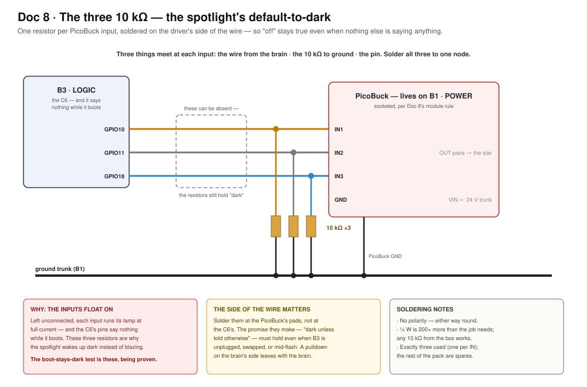
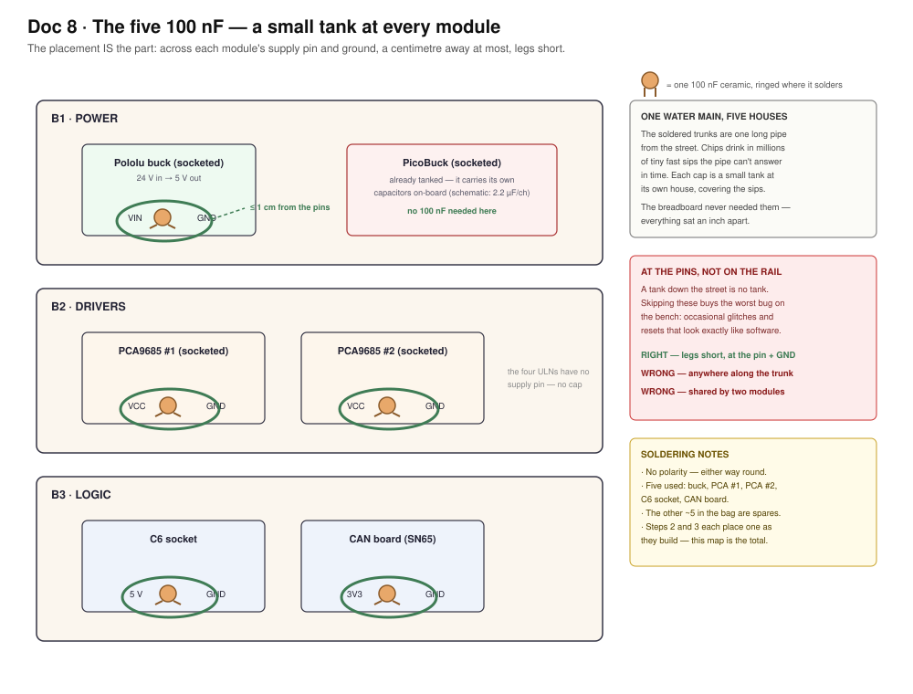
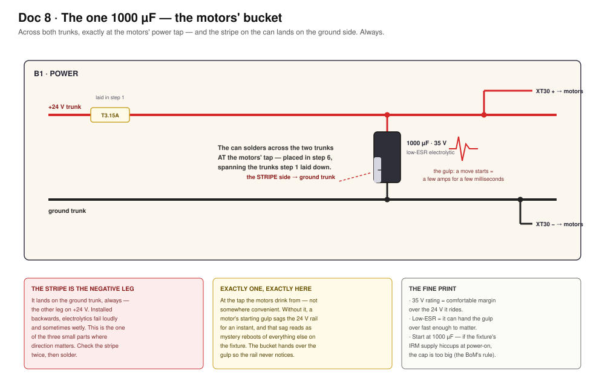
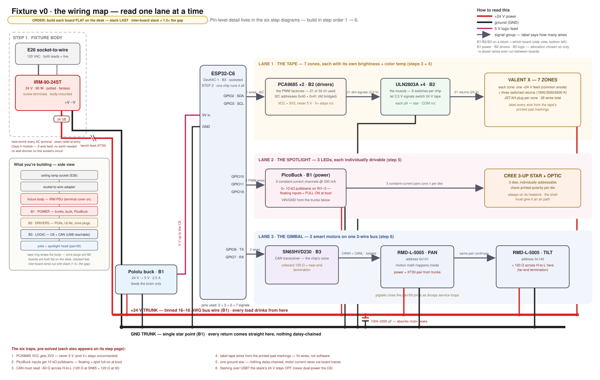
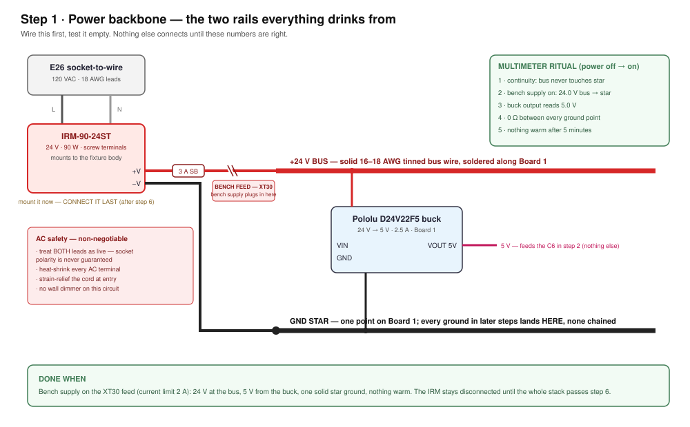
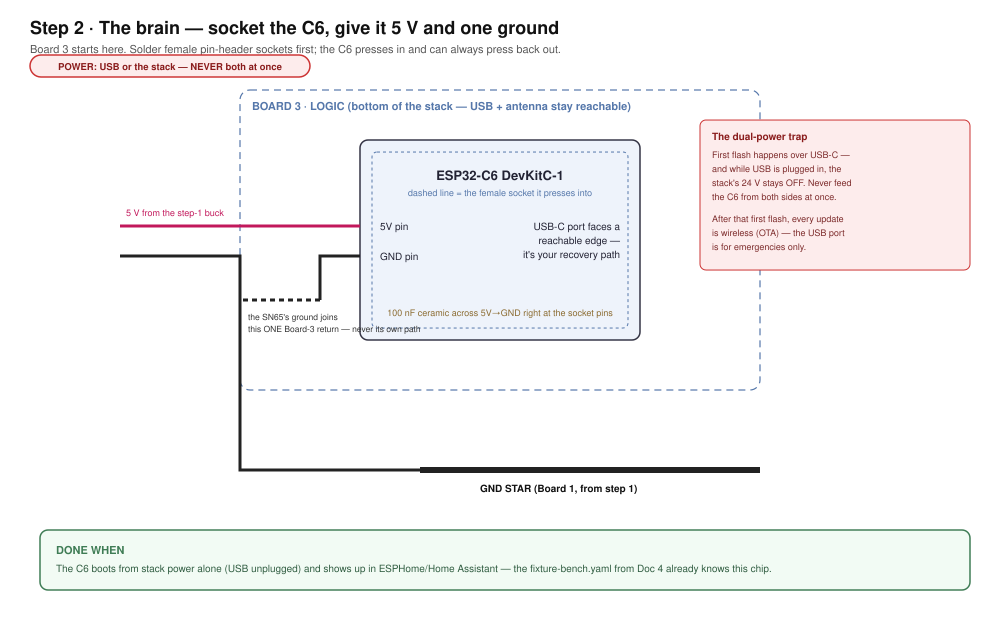
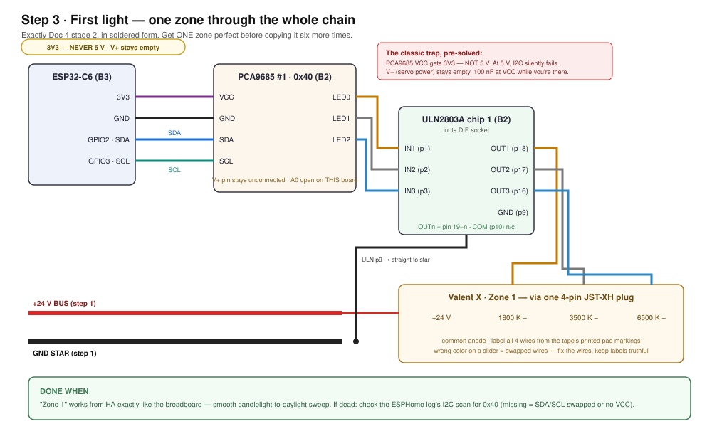
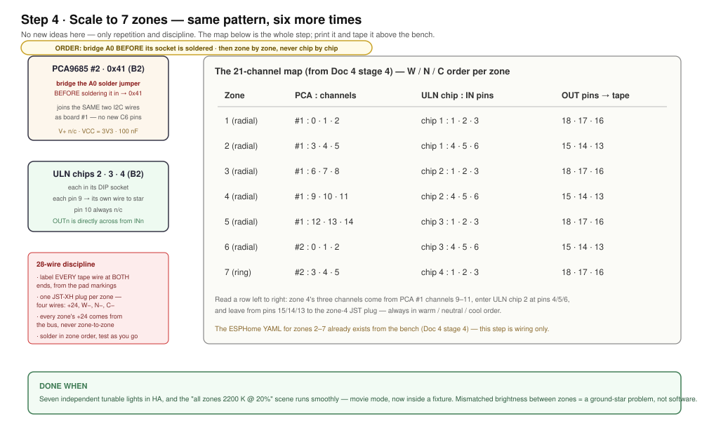
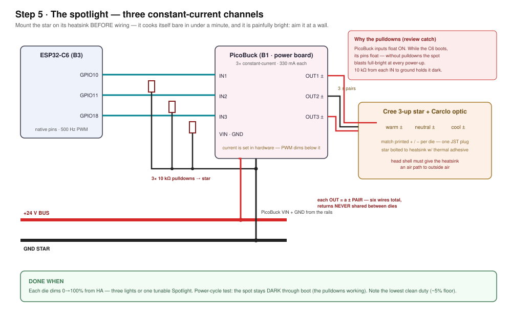
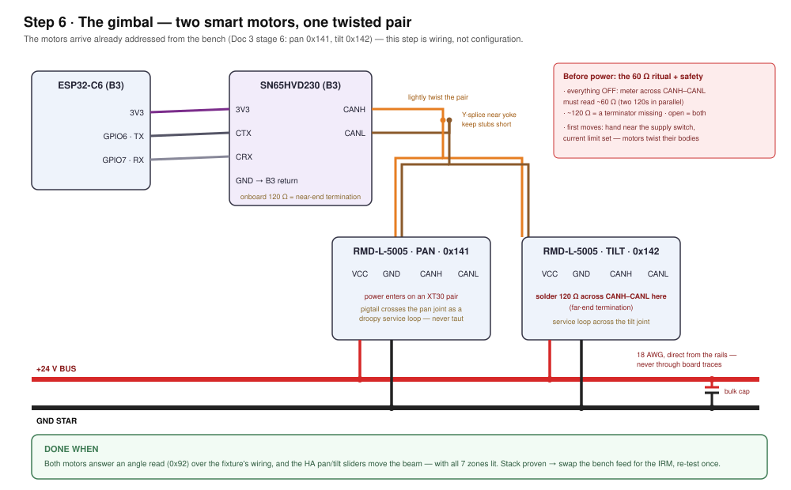

# Doc 8 · Build the Fixture — From Breadboard to a Thing That Screws In

**Engineered Lighting prototype series · July 2026**
The bench taught the architecture; this chapter makes it permanent. Nothing
new runs here — the YAML, the entities, and the scenes come along unchanged
from [Doc 4](04-full-fixture-bench.md). Every load ends in a plug and every
module sits in a socket, so nothing in this build is a one-way door.

> **The one gate before you start:** [Doc 4](04-full-fixture-bench.md)
> stage 7's checklist passes on the breadboard. Solder freezes a *validated*
> design.

## Concepts (plain English)

- **Trunk:** one thick solid wire soldered along a board that everything taps
  into. This build has exactly two — +24 V and ground.
- **Star ground:** every ground wire runs *directly* to one point, never
  chained device-to-device. Chained grounds are why zones mismatch.
- **Socketed module:** a board that presses into female pin-headers. A dead
  module becomes a 10-second swap, not a desoldering job.
- **Pigtail & header:** the load's short lead ending in a plug (pigtail); the
  board carries the matching socket (header). Board = header, load = plug.
- **JST-XH vs XT30:** small white plugs for signals and LEDs (3 A) vs chunky
  yellow plugs for power (30 A). Tape and spot ride JST; motors ride XT30.
- **Bulk cap:** a big capacitor that acts like a tiny local battery — it
  feeds the motors' split-second current spikes so the PSU never sees them.
- **Hiccup mode:** how the IRM protects itself. Overloaded, it drops the rail
  and retries. Good protection, confusing symptom: "the whole fixture blinks."
- **Service loop:** slack wire crossing a moving joint in a droop, never taut
  ([Doc 1](01-how-we-got-here.md)'s rule, still in force).
- **Y-splice:** three wire ends twisted, soldered, and covered by one sleeve
  of heat-shrink — how one CAN pair feeds two motors.
- **Standoffs:** the threaded nylon pillars that hold stacked boards apart.

## What you're building

The map below has a side-view panel: **lamp socket → adapter → PSU → three
stacked boards → gimbal head.** The tape ring wraps the body at the middle
board's height. Each board has one job:

- **B1 · POWER** (top, nearest the PSU) — the two trunks, fuse, bench-feed
  XT30, buck, bulk cap, motor XT30s, and the PicoBuck.
- **B2 · DRIVERS** (middle) — both PCA9685s, all four ULNs, and the seven
  zone plugs.
- **B3 · LOGIC** (bottom) — the C6 and the CAN board, so the USB port, WiFi
  antenna, and CAN pair all live at the serviceable end.

The PCAs live *with* the ULNs on purpose: the 21 dim signals never leave
their board, and only about a dozen wires ever cross between boards.

!!! info "The fixture body is its own design track — this chapter builds everything that goes inside it"

    The *body* — the enclosure that holds PSU, stack, tape ring, and gimbal
    together and actually screws in — is being designed separately, as its
    own CAD project, with the real parts in hand for measuring. Nothing
    below waits on it: steps 1–6 build and test the whole stack clamped to
    a bench plate, and step 7 is where electronics and body meet. What the
    body design owes the electronics is exactly this interface list:

    - **PSU mount** — a flat spot for the IRM-90-24ST brick, 109 × 52 ×
      33.5 mm plus finger room for its screw-terminal cover, placed away
      from the LED star's heat.
    - **Cord entry** — a strain-relieved hole where the E26 adapter's two
      leads enter.
    - **Stack mounts** — three M3 standoff points for the 72 mm board
      stack, with a vent path past the boards.
    - **Tape ring at Board 2's height** — the seven zone pigtails are
      short; the tape lives where they reach.
    - **Gimbal clearance** — full pan/tilt travel, plus room for the droopy
      service loops that cross the joints.
    - **Heat path** — the star's heatsink reaches outside air, or the
      step-7 soak proves it doesn't have to.
    - **USB window** — Board 3's USB-C stays reachable, so reflashing never
      means opening the fixture.

    Build the stack first, measure the real thing, then freeze the body —
    the same measure-then-print logic as [Doc 3b](03b-print-the-frame.md)'s
    coupon-first frame.

Three assembly rules:

1. Build each board **flat on the desk**. Stack last.
2. Cut every inter-board wire with slack — **1.5× the gap it crosses**.
3. Route between-board wires past the board edges, never through the middle.

## Soldering these boards (five rules)

Tools out: iron, solder + flux, multimeter, wire strippers, flush cutters,
heat-shrink + a lighter. The rounds have no power rails — just 593 plated
holes — so technique is the whole game:

1. **Sockets: tack ONE pin, look, then finish.** Solder a single corner pin,
   check the strip sits flat, reflow if tilted, then do the rest.
2. **A good joint looks like a tiny volcano.** Heat pad *and* lead ~2
   seconds, feed solder to the joint (not the iron), let it flow, leave.
   Blobby ball = cold joint. Redo it with flux.
3. **Trunks are laid, not drawn.** Strip a length of bus wire, lay it along a
   row of holes, tack it every 4–5 holes. Taps solder straight onto it.
4. **Beep everything before power.** Meter on continuity: every joint you
   made beeps; every *neighboring* pad stays silent. This habit replaces
   most debugging.
5. **Never crimp.** The JST kits come pre-crimped — you solder the bare
   tails. Board side gets the header, load side gets the plug. XT30s: the
   half with recessed metal goes on the live side.

## Bill of Materials — buy this, ~$105 (+ ~$15 of tools)

*"Est." = total for the quantity shown. Prices verified July 2026 —
re-check when ordering.*

| # | Part | Qty | Est. | Where | Notes / traps |
|---|---|---|---|---|---|
| 1 | Round prototyping PCB, 2.84" (72 mm), 593 plated holes, 0.1" pitch | 1 pack of 4 | $15 | [Etsy](https://www.etsy.com/listing/1785807382/vegetable-can-round-prototyping-pcb-w593) | All three get used — B1 power, B2 drivers, B3 logic — plus a spare. No power rails on these boards, which is why the trunk rule exists |
| 2 | Mean Well **IRM-90-24ST** (24 V · 3.75 A · potted · fanless · screw terminals) | 1 | ~$25 | [Bravo Electro](https://www.bravoelectro.com/irm-90-24.html), DigiKey, Mouser | The fixture's PSU. ST variant on purpose: the plain IRM outspans a 72 mm round, so this one mounts to the body — which also keeps the heaviest part off solder joints. Hiccup floor ~103 W clears the ~75 W worst transient |
| 3 | E26 socket-to-wire adapter (660 W rated, 18 AWG leads) | 1 (+1 spare) | $8–12 | Amazon, hardware store | The entire AC feed (~0.6–0.9 A at 120 V). Treat both leads as live; no wall dimmer on that circuit |
| 4 | Female pin-header socket strips, 2.54 mm break-away | 1 kit | $7 | Amazon | Socket every module — C6, both PCAs, CAN board, buck. Dead module = 10-second swap |
| 5 | JST-XH connector kit, **pre-crimped leads** (2/3/4-pin) | 1 kit | $12 | Amazon | 7 tape zones (4-pin each) + the spot (3 ± pairs = six conductors, returns never shared). You solder the tails — never crimp |
| 6 | XT30 connector pairs | 3 pairs | $8 | Amazon | Motor power (one pair per motor) + the bench-feed break. JST-XH is a 3 A part; motor peaks hit 5–8 A |
| 7 | 100 nF ceramic capacitors | ~10 | $6 | Amazon | One at every module's supply pins — long soldered rails need what the breadboard never did |
| 8 | Electrolytic bulk cap, 1000 µF / 35 V, low-ESR | 1 | $3 | Amazon, DigiKey | Rides the motors' millisecond slew peaks. Start at 1000 µF: the IRM publishes no max capacitive load, so if it hiccups at power-on, the cap is too big |
| 9 | Nylon M3 standoff kit | 1 | $9 | Amazon | Stack spacing + a vent path; nylon can't short against pad-side joints |
| 10 | Tinned solid bus wire, 16–18 AWG | 1 roll | $8 | Amazon | Becomes the two trunks |
| 11 | Wire strippers + flush cutters *(if not owned)* | 1 each | ~$15 | Amazon | Never in an earlier BoM — the bench got by, but 100+ soldered joints won't |
| 12 | Silicone stranded wire 22–24 AWG + heat-shrink *(if not owned)* | — | ~$17 | Amazon | The service loops across the pan/tilt joints want the floppiest wire available |

**Carries over from Docs [3](03-build-the-gimbal.md)–[4](04-full-fixture-bench.md) — $0:**
both RMD-L-5005 motors (unit 3 stays the permanent bench spare), the C6
devkit, the SN65HVD230, both PCA9685s (#2 keeps its bridged 0x41 jumper),
4× ULN2803A with their DIP sockets, the PicoBuck, the Cree star + Carclo
optics + heatsink, the Valent X spool (one spool covers even 2× length), the
Pololu buck, the fuse holder + 3 A slow-blow (**step to 4 A if you 2× the
tape** — ~3.1 A sustained nuisance-blows a 3 A), the screw assortment, and
the wire + 10 kΩ resistor stock (three of those 10 ks become the PicoBuck
pulldowns). The bench supply, multimeter, soldering kit, USB-CAN adapter, and
calipers stay on the bench as tools. **Retired:** the breadboards and the
WAGOs — their jobs go to soldered trunks and pluggable pigtails.

## The three small parts, and where every one goes

Three rows of the BoM are easy to buy and then lose track of: the 10 kΩ
resistors, the 100 nF ceramics, and the single big electrolytic. None of them
existed on the breadboard — which is exactly why it can be unclear where they
belong now. They are one idea at three speeds — **hold things steady when
something changes faster than the answer can arrive** — and each has an exact
address:

| Part | How many | Where, exactly | Direction? |
|---|---|---|---|
| 10 kΩ ¼ W resistor | **3** | PicoBuck IN1 / IN2 / IN3, each to the ground trunk — at the driver's pads on B1 (step 5) | no |
| 100 nF ceramic | **5** | one across each socketed module's supply pin and GND: buck, PCA #1, PCA #2, C6 socket, CAN board (steps 2–4) | no |
| 1000 µF / 35 V electrolytic | **1** | across both trunks at the motors' XT30 tap, on B1 (step 6) | **yes — stripe to ground** |



The resistors are the spotlight's "dark unless told otherwise" — the
[floats-ON trap](04b-wire-the-spotlight.md#the-driver-demystified) is the why.
The figure's one rule is the where: at the **PicoBuck's** pads, so the promise
holds even with B3 unplugged, swapped, or mid-flash. Step 5's
boot-stays-dark check is these three being proven.



The ceramics are placement, not mystery: across each socketed module's supply
pin and ground, a centimetre away at most, legs short. Steps 2 and 3 each
place one as they build — this map is the full count of five, including the
two no step spells out (the CAN board and the buck). The PicoBuck sits this
one out: it carries its own capacitors on-board.



The electrolytic is the only one of the three with a direction — **stripe to
ground, always** — and the only one with a single address: across the trunks
at the motors' tap, placed in step 6, spanning the copper step 1 laid down.

## The map — read one lane at a time



One chip runs everything on **seven signal pins**: 2 wires of I²C (21 tape
channels via the PCA9685s), 3 PWM pins (spotlight), 2 CAN pins (both motors,
by address). Power is two trunks on B1. Then build in order — each step is
one bench session, and each has its own diagram below:

| Step | What | Rough time |
|---|---|---|
| 1 | Power backbone | 1–2 h |
| 2 | The brain | 30–45 min |
| 3 | First light (zone 1) | 1–2 h |
| 4 | Scale to 7 zones | an afternoon — it's 28 wires |
| 5 | Spotlight | ~1 h |
| 6 | Gimbal | 1–2 h |
| 7 | Real PSU + verdict | ~1 h + a 30-min soak |

## Step 1 — Power backbone

*Hands-on stage — no agent lane; the level-3 wiring photo check applies.*



**What's happening:** you're building the two rails everything else drinks
from — and testing them empty.

**Do this:**

1. Set the IRM aside — it mounts to the body at step 7 and stays
   disconnected until then. Everything until then runs from the bench
   supply.
2. Lay the +24 V trunk and the ground trunk along B1 (rule 3).
3. Solder in the fuse holder, then the bench-feed XT30 in the +24 V run.
4. Mount the buck; wire VIN and GND to the trunks.
5. Beep-test every connection (rule 4), then clip the bench supply to the
   bench-feed, current limit at 2 A.

**Done when:** 24 V at the bus, 5 V from the buck, one solid star ground,
nothing warm after five minutes.

**If stuck:** no 24 V = fuse not seated or supply leads reversed. Buck reads
0 V = VIN/GND swapped — it survives that; fix and re-test.

## Step 2 — The brain



**What's happening:** B3 gets its socket, the C6 presses in, and the fixture
gains a computer.

**Do this:**

1. Solder female socket strips for the C6 (rule 1 — tack one pin first).
2. Point the USB-C port at the serviceable end; keep the antenna end away
   from the ground trunk.
3. Run 5 V and GND up from B1. Add a 100 nF cap right at the socket's power
   pins.
4. Press the C6 in.

**Done when:** the C6 boots from stack power alone (USB unplugged) and shows
up in Home Assistant.

**If stuck:** measure 5.0 V *at the C6's socket pins*, not at the buck — a
tilted socket or dry joint drops it on the way.

!!! trap "The dual-power trap"

    First flash happens over USB — and while USB is plugged in, the stack's
    24 V stays OFF. Never feed the C6 from both sides at once. After that
    first flash, every update is wireless.

## Step 3 — First light

*Hands-on stage — no agent lane; the level-3 wiring photo check applies.*



**What's happening:** one zone travels the whole chain — C6 → PCA #1 → ULN
chip 1 → plug → tape. Get ONE zone perfect before copying it six times.

**Do this:**

1. On B2: solder the PCA #1 socket and the ULN chip-1 DIP socket.
2. Run four wires up from B3: 3V3, GND, SDA (GPIO2), SCL (GPIO3).
3. Wire PCA LED0/1/2 to ULN IN1/2/3; OUT18/17/16 to a 4-pin zone header.
   Counting those pins for the first time? [Doc 4a's ULN pin
   map](04a-wire-the-zones.md#hop-2-the-uln2803-or-eight-switches-in-one-chip)
   numbers every one of them on the real chip, and [its zone-1
   figure](04a-wire-the-zones.md#the-fan-out-which-channel-drives-which-zone)
   photographs this whole step, hub hole to tape pad.
4. Solder the zone-1 pigtail to the tape: +24 V and three channel negatives,
   labeled from the tape's printed pad markings.
5. Run the zone's +24 V wire from the trunk; ULN pin 9 goes straight to star.
6. Beep-test, power up, test from HA.

**Done when:** "Zone 1" sweeps candlelight→daylight from HA, exactly like the
breadboard.

**If stuck:** the ESPHome log's I2C scan says whether 0x40 was found (missing
= SDA/SCL swapped or no VCC). Found but dark = beep the LED0→IN1 and
OUT1→plug runs.

!!! trap "The classic trap, pre-solved"

    PCA9685 VCC gets **3V3 — never 5 V** (at 5 V, I2C fails silently). V+
    stays empty. Drop a 100 nF at VCC while you're there.

## Step 4 — Scale to seven



**What's happening:** nothing new — six repeats of step 3, driven by the
channel map on the diagram. Print it; tape it above the bench.

**Do this:**

1. Bridge PCA #2's A0 jumper **before** soldering its socket → it answers at
   0x41 on the same two I2C wires. [Doc 4a photographs those pads open and
   bridged](04a-wire-the-zones.md#the-second-hub-two-boards-the-same-two-wires),
   with the meter reading each one must give — a blob can look bridged and
   touch only one pad.
2. Seat ULN chips 2–4 in their sockets.
3. Work zone by zone from the map: three channels in, three out, one plug.
   Test each zone as its plug lands — unwired zones just sit dark in HA.
4. Label all 28 wires at both ends. Every zone's +24 V comes from the trunk,
   never from a neighboring zone.

**Done when:** seven independent tunable lights, and the "all zones 2200 K @
20%" scene runs — movie mode, now inside a fixture.

**If stuck:** one zone dead? The sockets are your superpower — swap ULN
chip 1 and chip 2. Problem follows the chip → chip; stays with the zone →
wiring. Wrong colors = swapped wires at the plug. Fix wires, not YAML.

## Step 5 — The spotlight



**What's happening:** three PWM wires dim three constant-current channels,
one per LED die. Each die is individually drivable — one tunable Spotlight or
three separate lights is firmware's choice, not wiring's. Meeting the driver
or the bare star for the first time here? [Doc 4b](04b-wire-the-spotlight.md)
is the bench version of this exact step — the same blocks demystified, the
S-checkpoints, and the which-die-is-which naming ritual whose flags this
step's wiring should already carry.

**Do this:**

1. Mount the star on its heatsink **first** and aim it at a wall — it cooks
   itself bare in under a minute and it is painfully bright.
2. Run GPIO10/11/18 from B3 to the PicoBuck's IN1/2/3 on B1.
3. Solder a 10 kΩ pulldown from each IN to ground — [the small-parts
   figure](#the-three-small-parts-and-where-every-one-goes) draws the exact
   node: wire, resistor, and pin, all meeting at the driver's pad.
4. Wire PicoBuck VIN/GND to the trunks.
5. Wire the three outputs to the three dies: **each output is a ± pair — six
   conductors total — and the returns never share a wire.** Match the printed
   +/− on each die.

**Done when:** every die dims cleanly from HA, and a power-cycle stays dark
through boot.

**If stuck:** one die dark = that pair's polarity, or two wires swapped with
a neighbor's pair. All dark = pulldowns shorted or PWM lines on the wrong
GPIOs.

!!! trap "Why the pulldowns"

    PicoBuck inputs float ON, and the C6's pins float while it boots —
    without pulldowns the spot blasts full-bright at every power-up. The
    boot-stays-dark test in the done-when is these resistors earning their
    keep.

## Step 6 — The gimbal

*Hands-on stage — no agent lane; the level-3 wiring photo check applies.*



**What's happening:** the motors keep their bench addresses (pan 0x141, tilt
0x142 — set in [Doc 3](03-build-the-gimbal.md) stage 6), so this is wiring,
not configuration.

**Do this:**

1. Wire the SN65 on B3: 3V3, GND to the B3 return, CTX←GPIO6, CRX←GPIO7.
2. Lightly twist the CANH/CANL pair; run it toward the yoke.
3. Y-splice the pair (three ends, one joint, one sleeve of shrink) — short
   stubs to each motor's CANH/CANL.
4. Solder a 120 Ω resistor across CANH–CANL at the **tilt** motor.
5. Motor power: one XT30 pair per motor, 18 AWG straight from the trunks;
   the bulk cap sits at that tap — stripe to the ground trunk, per [the
   small-parts figure](#the-three-small-parts-and-where-every-one-goes).
   Pigtails cross each joint as droopy service loops.
6. Everything OFF: meter across CANH–CANL must read **~60 Ω**. (~120 = a
   terminator missing; open = both.)
7. Raise the bench supply's limit toward **3 A** — two motors plus every LED
   can clip a 2 A limit and sag the rail, which reads as mystery resets.

**Done when:** both motors answer an angle read over the fixture's own
wiring, and the HA pan/tilt sliders move the beam — with all seven zones lit.

**If stuck:** no reply = the [Doc 3](03-build-the-gimbal.md) stage-4 ladder,
in order: 60 Ω check → common ground → CANH/CANL swapped → motor unpowered.
Replies but no motion = you're in Hold/Manual mode, not a wiring problem.

!!! trap "Motors are watched, always"

    First moves happen with your hand near the supply switch and the current
    limit set. A commanded motor twists its own body as hard as its shaft.

## Step 7 — Swap in the real PSU, then the verdict

This is where the fixture body enters: mount the IRM to it, give the E26
adapter's cord a strain-relieved entry, and give the star's heatsink its air
path. (The body arrives from its own design track — the interface list up
top is exactly what this step needs it to provide.)

**Do this:**

1. Disconnect the bench feed.
2. Land the E26 adapter's leads and the trunk wires on the IRM's screw
   terminals — L, N, +Vo, −Vo; there is no earth terminal and none is needed
   (Class II). As built, the ST's output block duplicates its terminals —
   two +Vo screws and two −Vo screws, internally one output — land the
   pigtails one per screw. Fit the terminal cover; screw blocks can't be
   heat-shrunk.
3. Strain-relieve the adapter leads where they enter the body.
4. Screw it into a socket and re-run the short version of everything.

!!! agent-prompt "🤖 Give this to your agent"

    ```text
    You're my bench agent for the Engineered Lighting fixture build
    (chapter: engineering.engineered.lighting/08-build-the-fixture/,
    step 7 — the verdict soak). The hand-soldered fixture is assembled and
    running on its internal IRM-90-24ST; Home Assistant sees all 7 zones,
    the Spotlight, and the pan/tilt controls. Start by proposing a plan
    and wait for my approval before executing anything. Then run the
    verdict with me: walk me through each checklist item in the chapter,
    and for the 30-minute everything-on soak, watch the ESPHome device
    logs the whole time and summarize warnings, resets, and any
    "took a long time" lines; I handle the touch tests and read the
    worst-case current from the meter at the bench-feed point before we
    switch to the IRM.
    SAFETY — non-negotiable: never command motor motion unless I confirm
    I'm watching with a hand near the supply switch. Announce each motion
    command before sending it and wait for my explicit go.
    Done when: every checklist item passes on IRM power.
    Report back: the checklist with pass/fail and evidence per item, and
    the soak-log summary.
    ```

    *[How to run this prompt →](00b-ai-native-workflow.md)*

- [ ] All 7 zones + spotlight + gimbal work on IRM power
- [ ] Power-cycle at the wall switch: the fixture wakes knowing its angles (no homing), and the spot stays dark through boot
- [ ] 30-minute soak, everything on: ULNs warm-not-hot, star heatsink warm, IRM case warm-not-hot, no reboots in the logs
- [ ] Worst-case 24 V current recorded — compare against the ~60 W budget

## Risk register

- **Protoboard joints under vibration** — the gimbal shakes its own house.
  Strain-relieve pigtails at each board edge; the socketed modules are the
  serviceable insurance.
- **Heat in an enclosure** — the soak test is the truth. The star's heatsink
  needs an air path through the shell; the IRM sits away from the LED
  thermal mass.
- **Inter-board wiring is where beginner builds die** — hence the board
  allocation that keeps it to ~a dozen wires, the slack rule, and
  build-flat-stack-last.
- **Supply substitutions** — if the IRM-90-24ST drifts out of stock, the
  sizing logic is the spec, not the part number: steady ~25–40 W, transients
  +30–40 W, and the replacement's hiccup floor must clear the sum.
