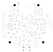

# Doc 9 · Understand the PCB — LIGHT v0.2, the Integrated Board

**Engineered Lighting prototype series · September 2026**

[Open the PCB build shopping checklist →](09a-pcb-build-bom.md){ .md-button }

Order the remaining parts for two fixtures: motors, optics, diffuser, mounting supplies and exact cable-side connectors. Check off purchases as you order; selection notes identify the items still needing a fit or specification decision.

Everything the bench proved and [Doc 8](08-build-the-fixture.md) hand-soldered has been drawn as one
circuit board: a 76.2 × 75.1 mm disc with a flat under the antenna, eight copper layers, and parts on
both faces. One ESP32-C6 module, two PWM expanders, 21 ambient channels, three constant-current
spotlight drivers, a CAN transceiver for the motors, and a protected 24 V supply feeding all of it.

This chapter is for understanding that board before it exists in your hands. Turn it over, click any
part and find out what it does *there* — not what a resistor does in general, but what this resistor
does on this net. The schematic, the parts list and the actual KiCad files are all here too.

!!! info "Where this sits after Doc 8"

    [Doc 8](08-build-the-fixture.md) is the *previous* stage: the bench architecture hand-soldered onto
    three round protoboards, with a dev-kit ESP32, PCA9685 breakouts, ULN2803 arrays and a PicoBuck
    driver, fed by an internal 24 V supply. It works, and it is how the design was learned.

    This board is the next stage, and it is not the same machine. The switching is done by 21 discrete
    MOSFETs rather than Darlington arrays; the spotlights get three independent constant-current
    drivers rather than one shared board; the power path gains an electronic breaker, a supervisor and
    a physical ARM interlock. **Doc 8's parts, wiring and ESPHome examples are not this board's
    implementation**, and the bench measurements in Docs [3](03-build-the-gimbal.md) and
    [4](04-full-fixture-bench.md) are not measurements of this PCB.

!!! warning "Status as of 8 September 2026 — designed, not built"

    This page shows the latest **grouped arm connectors and branding** revision, `cbb8d9fc`,
    submitted to PCBWay for quotation and engineering review with **241 fitted parts per assembled board**.
    The request is five fabricated main boards: **two fully assembled on both sides with sourced
    components**, and three supplied bare. Earlier main revisions were also submitted to JLCPCB.
    No payment, procurement or production release is authorized. Supplier stack, stencil, via treatment,
    final capacitor installation and substitutions remain open.

    **No LIGHT v0.2 PCB has been powered.** Current DRC and native/export preservation checks bind the
    branded board to the electrically reviewed `80195efd` baseline. That baseline has ERC, pin-parity,
    connectivity and independent CAM evidence. Those checks are not physical tests or a new simulation.

    [Doc 10](10-the-flex-circuits.md) covers the unchanged three flex circuits. The static gimbal has
    a PCBWay inquiry, as do the upper and lower LED flexes: two of each for two fixture prototypes.
    The quote-form copper and upper-tail support/finish placeholders require engineering correction;
    they do not change the specified construction. Assembly inspection settings also await correction.
    Their geometry and hashes have not been revised for this update.

## Latest changes: arm connectors and branding

The three two-pin spotlight sockets became **one six-pin J9** beside the separate **J13 tilt**
connection. Pins **1/2, 3/4 and 5/6** carry spotlight channels 1, 2 and 3. Their LED-minus wires remain
independent driver returns: sharing a connector does not make them ground. **J12 pan** remains a
separate edge connection because its cable terminates at the pan motor.

Wires link J9 and J13 to the static arm flex. The wire service loop must accommodate pan motion of
180 degrees each way; the static flex itself is not qualified as a repeatedly bending hinge.

The underside now carries the small orbit logo, **engineered lighting**, the website and the Louis
Kahn quotation. This branding changed only back silkscreen. Black substrate, white ink, metallic
pads and the overhanging ESP32 depiction remain illustrative viewer materials, not an as-built photo.

The revision sequence is `9c42ff8d` (central LED interface), `80195efd` (grouped arm connectors), then
`cbb8d9fc` (back-side branding). The upper insertion tail and lower/gimbal boards are unchanged.

??? info "Words this chapter uses — open this if any of them are new"

    | Word | What it means here |
    |---|---|
    | **Schematic** | The drawing of what connects to what. It says nothing about where parts sit. |
    | **Layout** | The drawing of where everything physically goes. This page's viewer shows the layout. |
    | **Reference designator** | A part's address on this design: `U1`, `R101`, `J14`. The letter hints at the kind of part (R resistor, C capacitor, U integrated circuit, Q transistor, D diode, L inductor, F fuse, J connector, S switch, TP test point, H mounting hole), and the number identifies the instance. It is not the part's value, and the prefix alone never explains what a part does. |
    | **Net** | One electrical connection, everything joined to it. `GND` is a net; so is `ZONE1_W`. |
    | **Trace** | The physical copper that implements part of a net. A schematic line is a *connection*, not a scale drawing of a wire — one line can become a trace that crosses three layers. |
    | **Rail** | A net that distributes power: `+3V3`, `+5V`, `V24_BUS`. |
    | **Ground** | The circuit's voltage reference and return path. It is not automatically an earth connection. |
    | **Pin vs GPIO** | A chip's physical pin number and its software name are different things. On this board, module pad 25 is the serial transmit line the firmware calls GPIO16. |
    | **Layer** | One sheet of copper inside the board. This one has eight, with insulating material between them. |
    | **Via** | A small plated hole that carries a net from one layer to another. |
    | **Pad** | Exposed copper a part's pin solders to. A pad belongs to the board, not to the part. |
    | **No-connect** | A pin deliberately left unconnected, marked so the design tools know it is intentional. This board has 29 of them. |
    | **Silkscreen** | Printed ink labels. Ink, not copper, and not a connection. |
    | **Solder mask** | The insulating coating over the copper. Its artwork describes the **openings** where copper is left exposed — so a "mask" view shows holes in the coating, not the coating. |
    | **Fab / assembly outline** | A drawing layer showing component bodies and orientation for assembly. Not electrical. |
    | **Courtyard** | The clearance a part reserves around itself so neighbours can be placed and soldered. Nothing physical. |
    | **BOM** | Bill of materials: the parts list. Distinct from *fabrication outputs* (Gerbers, drill files), which describe the bare board itself. |
    | **Bare PCB vs PCBA** | A bare PCB is the board alone. PCB assembly (PCBA) is that board with the parts fitted and soldered. They are quoted, priced and ordered separately. |
    | **ERC / DRC** | Electrical-rule and design-rule checks: automated checks that the schematic and the layout obey stated rules. They do not run the circuit. |

    One more, because it matters on this page: an animated path showing where current *would* flow is
    an explanation. It is not a live electrical measurement.

## The board { #the-board }

Start with **U1** at the top — the radio module, the part that overhangs the flat edge. Then find
**J1** on the left, where the 24 V supply lands. Hover or tap any part to see what it does; use **Flip
face** to see the underside, where the power section and the big capacitor live. The reference
labels here are the same ones used in the schematic and in the parts list.

<div id="el-pcb" class="el-pcb" data-base="../assets/pcb/light-v0.1/" data-state="nojs" data-face="F" data-preset="components" data-selected="" markdown="0">
<div class="el-pcb-fallback">
<p><strong>The interactive viewer needs JavaScript.</strong> Without it, use the <a href="#assembly-references">assembly drawings</a>, the <a href="#parts-index">parts index</a> and the <a href="#connectors">connector pinmaps</a> below, or the <a href="../assets/pcb/light-v0.1/downloads/schematic.pdf">complete schematic PDF</a>. Every part on this page is explained in the parts index whether or not the viewer runs.</p>
<figure></figure>
<noscript></noscript>
</div>
</div>

??? info "What this view shows — and what it does not"

    The default **Components** view is an *assembly-outline* view: real positions, real body outlines
    from the board's own fabrication layer, real land shapes from its pad data, and the actual
    reference labels. It is not a photograph and not a 3D render. The project includes references to KiCad library 3D models, but no assembled model of this board has been produced or verified, and
    none is published here.

    The black ground is the **specified** solder-mask colour of a board that has not been
    manufactured. Layer colours are view colours chosen for contrast — copper is not orange, and the
    inner layers are not green and pink. The **mask** views show the *openings* where copper stays
    exposed, not the coating. **Courtyard** is placement clearance, not a physical feature.

    Some parts overhang the board edge on purpose: the radio module past the flat, the USB connector
    at the bottom and one connector on the right. They are drawn unclipped, because that is where they
    really are. Turning the board over mirrors the whole geometry once about the board's centre line,
    so what you see is the physical back face, not a mirror image of the front.

    **Inspecting a part.** Hovering one opens a short summary. Clicking or tapping it *pins* that
    summary, so it stays put and gains its own buttons: jump to the part's row in the parts list, open
    its schematic sheet, or drop to the full explanation. Nothing moves the page until you press one of
    those buttons — which is what makes this usable on a phone, where there is no hover and where the
    parts list is a long way down. The pinned summary closes with its **×**, with <kbd>Esc</kbd>, or by
    tapping bare board; the selection itself survives all three.

    **Getting around:** drag to pan, scroll or pinch to zoom, double-click to zoom in. The toolbar has
    zoom, fit and flip buttons for anyone not using a mouse. With the viewer focused, the arrow keys
    pan, <kbd>+</kbd> and <kbd>-</kbd> zoom, <kbd>0</kbd> fits the board and <kbd>f</kbd> flips it. The
    search box finds any of the 262 features by reference, name, value, part number or net — that is
    the fastest route on a phone, and the keyboard-friendly one.

    On a phone, one finger scrolls the page as usual and two fingers pan and zoom the board. If you
    would rather drag the board with one finger, press **Lock board for panning**.

## Earlier changes: the central LED interface { #revision-history }

The first published layout was LIGHT v0.1 (`c046202e`). This page now shows LIGHT
v0.2 (`cbb8d9fc`), paired with upper flex v0.3 (`0af25f8f`). Lower flex and the
static arm ribbon remain v0.2: their native board bytes did not change.

Six radial LED sockets have become **one locking Molex 2005280300 at J2**, on the
left side of the front face. J3–J7 have been removed. The upper flex's tail is the
plug itself; no twenty-four-wire solder harness is needed between it and the main
board. Thirty contacts provide twenty-four distinct connections: each zone gets
two positive contacts and its own warm, neutral and cool switched returns.
**Sharing a connector does not join the six fused positive rails.** Zone 7 still
uses J8 on the underside. Motor, spotlight, USB, ARM and expansion interfaces and
the four M3 mounting holes remain.

Routing this interface required local part moves and new signal paths on In2,
which also carries 24 V copper. The reviewed ground references remain, but they
are not uninterrupted sheets. PWM03 crosses a **1.465544 mm** interruption caused
by the inherited PCA_OE routing on In3. The adjacent/reference copper was reviewed;
edge noise and coupling still need measurements on the prototype. An autorouter's
completed connection is not proof of a good high-frequency return path.

The earlier audit corrections are included too: U5 is now **74HCS08PWJ** with
Schmitt inputs, R526–R528 are **910 Ω**, and C504 has a provisional custom land
without paste. Its one-reflow limit requires final factory installation. These
changes explain why old timing or power calculations cannot simply acquire the
new board hash. The source now has 262 features, 241 fitted packages, 71 BOM rows
and 20 schematic sheets, including the shared interface sheet.

Flip to the back to see the white orbit logo, **engineered lighting**, website and quotation.
The black-and-white finish is a fabrication request, not a photo of a built board.

## How the circuit works

Each heading below names the parts involved; select any reference to jump to it on the board. Facts
are tagged so you can tell a design intention from a CAD result from an open question.

### 24 V in, and what guards it

External 24 V arrives at **J1** — pin 1 positive, pin 2 return — and meets **F1**, a 6.3 A backup
fuse. **D500** clamps incoming spikes. **Q500** is a reverse-blocking transistor: connect the supply
backwards and nothing downstream sees it. **U12** is the real protection: an electronic breaker that
limits current, ramps its output up gently, watches for over- and undervoltage and reports what it
sees. Its behaviour is set by the resistors around it, not by software.

The mains supply is a separate unit. Mains never enters this PCB.

### The protected bus, and the branches off it

Past the breaker the rail is `V24_BUS`. **C504**, the 1000 µF can on the back, is the local energy
store that absorbs the motors' current spikes. **U501** clamps transients close to where they arrive,
and **J16** taps the protected bus for a brake that has not been designed yet.

Every branch leaves through its own fuse: **F2** and **F3** for the two motors, **F4**–**F10** for
the seven ambient zones, **F11** for the logic branch. A fuse rating protects the wiring; it is not a
statement about what the copper can carry, and it is not a current limit.

### Making 5 V and 3.3 V

**U10** converts 24 V to 5 V through **L500**; **U11** converts 5 V to 3.3 V through **L501**. Both
are switching converters, which chop their input and let an inductor average the result — far more
efficient than burning off the difference as heat. The 5 V budget is about **0.8 A in total**,
counting the 3.3 V converter's own draw and the CAN transceiver. That is not 0.8 A of spare
accessory power.

### The controller

**U1** is an ESP32-C6 module: chip, flash, crystal and printed antenna, pre-certified as a unit.
**R1** and **C1** hold it in reset while 3.3 V rises; **S1** restarts it and **S2** selects its
download mode; **J15** is the serial console. Its pad numbers are not GPIO numbers — read the map,
do not count pins.

### The 21 ambient channels

Two PWM expanders, **U2** at address 0x40 and **U3** at 0x41, generate the dimming waveforms. Each of
the 21 channels is the same four parts: a 220 Ω gate resistor, a 100 kΩ pull-down, a 2.2 kΩ pull-up
to the switched gate-bias rail, and an AO3422 MOSFET that completes the LED circuit to ground.

Two details decide whether firmware works on the first try. The expander outputs are **open-drain**:
they can only pull down, so releasing an output is what turns a channel *on*, and the optical duty is
the complement of what you write. And the second expander's outputs are **remapped by routing** —
logical channel 18 is its output 13, logical channel 20 is its output 12. Never subtract 16.

<!-- el-pcb:generated channels start -->

<div class="el-pcb-scroll">
<table class="el-pcb-table">
<thead><tr>
<th>Logical channel</th><th>Zone and colour</th><th>Expander output</th><th>Package pin</th><th>Gate resistor</th><th>Switch</th><th>Leaves at</th><th>Fused by</th>
</tr></thead>
<tbody>
<tr><td>1</td><td>Zone 1 warm</td><td>U2 output 0</td><td>6</td><td><span class="el-pcb-ref" data-pcb-ref="R101">R101</span></td><td><span class="el-pcb-ref" data-pcb-ref="Q101">Q101</span></td><td><span class="el-pcb-ref" data-pcb-ref="J2">J2</span> contact 18</td><td><span class="el-pcb-ref" data-pcb-ref="F4">F4</span></td></tr>
<tr><td>2</td><td>Zone 1 neutral</td><td>U2 output 1</td><td>7</td><td><span class="el-pcb-ref" data-pcb-ref="R102">R102</span></td><td><span class="el-pcb-ref" data-pcb-ref="Q102">Q102</span></td><td><span class="el-pcb-ref" data-pcb-ref="J2">J2</span> contact 19</td><td><span class="el-pcb-ref" data-pcb-ref="F4">F4</span></td></tr>
<tr><td>3</td><td>Zone 1 cool</td><td>U2 output 2</td><td>8</td><td><span class="el-pcb-ref" data-pcb-ref="R103">R103</span></td><td><span class="el-pcb-ref" data-pcb-ref="Q103">Q103</span></td><td><span class="el-pcb-ref" data-pcb-ref="J2">J2</span> contact 20</td><td><span class="el-pcb-ref" data-pcb-ref="F4">F4</span></td></tr>
<tr><td>4</td><td>Zone 2 warm</td><td>U2 output 3</td><td>9</td><td><span class="el-pcb-ref" data-pcb-ref="R104">R104</span></td><td><span class="el-pcb-ref" data-pcb-ref="Q104">Q104</span></td><td><span class="el-pcb-ref" data-pcb-ref="J2">J2</span> contact 23</td><td><span class="el-pcb-ref" data-pcb-ref="F5">F5</span></td></tr>
<tr><td>5</td><td>Zone 2 neutral</td><td>U2 output 4</td><td>10</td><td><span class="el-pcb-ref" data-pcb-ref="R105">R105</span></td><td><span class="el-pcb-ref" data-pcb-ref="Q105">Q105</span></td><td><span class="el-pcb-ref" data-pcb-ref="J2">J2</span> contact 24</td><td><span class="el-pcb-ref" data-pcb-ref="F5">F5</span></td></tr>
<tr><td>6</td><td>Zone 2 cool</td><td>U2 output 5</td><td>11</td><td><span class="el-pcb-ref" data-pcb-ref="R106">R106</span></td><td><span class="el-pcb-ref" data-pcb-ref="Q106">Q106</span></td><td><span class="el-pcb-ref" data-pcb-ref="J2">J2</span> contact 25</td><td><span class="el-pcb-ref" data-pcb-ref="F5">F5</span></td></tr>
<tr><td>7</td><td>Zone 3 warm</td><td>U2 output 6</td><td>12</td><td><span class="el-pcb-ref" data-pcb-ref="R107">R107</span></td><td><span class="el-pcb-ref" data-pcb-ref="Q107">Q107</span></td><td><span class="el-pcb-ref" data-pcb-ref="J2">J2</span> contact 28</td><td><span class="el-pcb-ref" data-pcb-ref="F6">F6</span></td></tr>
<tr><td>8</td><td>Zone 3 neutral</td><td>U2 output 7</td><td>13</td><td><span class="el-pcb-ref" data-pcb-ref="R108">R108</span></td><td><span class="el-pcb-ref" data-pcb-ref="Q108">Q108</span></td><td><span class="el-pcb-ref" data-pcb-ref="J2">J2</span> contact 29</td><td><span class="el-pcb-ref" data-pcb-ref="F6">F6</span></td></tr>
<tr><td>9</td><td>Zone 3 cool</td><td>U2 output 8</td><td>15</td><td><span class="el-pcb-ref" data-pcb-ref="R109">R109</span></td><td><span class="el-pcb-ref" data-pcb-ref="Q109">Q109</span></td><td><span class="el-pcb-ref" data-pcb-ref="J2">J2</span> contact 30</td><td><span class="el-pcb-ref" data-pcb-ref="F6">F6</span></td></tr>
<tr><td>10</td><td>Zone 4 warm</td><td>U2 output 9</td><td>16</td><td><span class="el-pcb-ref" data-pcb-ref="R110">R110</span></td><td><span class="el-pcb-ref" data-pcb-ref="Q110">Q110</span></td><td><span class="el-pcb-ref" data-pcb-ref="J2">J2</span> contact 3</td><td><span class="el-pcb-ref" data-pcb-ref="F7">F7</span></td></tr>
<tr><td>11</td><td>Zone 4 neutral</td><td>U2 output 10</td><td>17</td><td><span class="el-pcb-ref" data-pcb-ref="R111">R111</span></td><td><span class="el-pcb-ref" data-pcb-ref="Q111">Q111</span></td><td><span class="el-pcb-ref" data-pcb-ref="J2">J2</span> contact 4</td><td><span class="el-pcb-ref" data-pcb-ref="F7">F7</span></td></tr>
<tr><td>12</td><td>Zone 4 cool</td><td>U2 output 11</td><td>18</td><td><span class="el-pcb-ref" data-pcb-ref="R112">R112</span></td><td><span class="el-pcb-ref" data-pcb-ref="Q112">Q112</span></td><td><span class="el-pcb-ref" data-pcb-ref="J2">J2</span> contact 5</td><td><span class="el-pcb-ref" data-pcb-ref="F7">F7</span></td></tr>
<tr><td>13</td><td>Zone 5 warm</td><td>U2 output 12</td><td>19</td><td><span class="el-pcb-ref" data-pcb-ref="R113">R113</span></td><td><span class="el-pcb-ref" data-pcb-ref="Q113">Q113</span></td><td><span class="el-pcb-ref" data-pcb-ref="J2">J2</span> contact 8</td><td><span class="el-pcb-ref" data-pcb-ref="F8">F8</span></td></tr>
<tr><td>14</td><td>Zone 5 neutral</td><td>U2 output 13</td><td>20</td><td><span class="el-pcb-ref" data-pcb-ref="R114">R114</span></td><td><span class="el-pcb-ref" data-pcb-ref="Q114">Q114</span></td><td><span class="el-pcb-ref" data-pcb-ref="J2">J2</span> contact 9</td><td><span class="el-pcb-ref" data-pcb-ref="F8">F8</span></td></tr>
<tr><td>15</td><td>Zone 5 cool</td><td>U2 output 14</td><td>21</td><td><span class="el-pcb-ref" data-pcb-ref="R115">R115</span></td><td><span class="el-pcb-ref" data-pcb-ref="Q115">Q115</span></td><td><span class="el-pcb-ref" data-pcb-ref="J2">J2</span> contact 10</td><td><span class="el-pcb-ref" data-pcb-ref="F8">F8</span></td></tr>
<tr><td>16</td><td>Zone 6 warm</td><td>U3 output 0</td><td>6</td><td><span class="el-pcb-ref" data-pcb-ref="R116">R116</span></td><td><span class="el-pcb-ref" data-pcb-ref="Q116">Q116</span></td><td><span class="el-pcb-ref" data-pcb-ref="J2">J2</span> contact 13</td><td><span class="el-pcb-ref" data-pcb-ref="F9">F9</span></td></tr>
<tr><td>17</td><td>Zone 6 neutral</td><td>U3 output 1</td><td>7</td><td><span class="el-pcb-ref" data-pcb-ref="R117">R117</span></td><td><span class="el-pcb-ref" data-pcb-ref="Q117">Q117</span></td><td><span class="el-pcb-ref" data-pcb-ref="J2">J2</span> contact 14</td><td><span class="el-pcb-ref" data-pcb-ref="F9">F9</span></td></tr>
<tr><td>18</td><td>Zone 6 cool</td><td>U3 output 13 (remapped)</td><td>20</td><td><span class="el-pcb-ref" data-pcb-ref="R118">R118</span></td><td><span class="el-pcb-ref" data-pcb-ref="Q118">Q118</span></td><td><span class="el-pcb-ref" data-pcb-ref="J2">J2</span> contact 15</td><td><span class="el-pcb-ref" data-pcb-ref="F9">F9</span></td></tr>
<tr><td>19</td><td>Zone 7 warm</td><td>U3 output 3</td><td>9</td><td><span class="el-pcb-ref" data-pcb-ref="R119">R119</span></td><td><span class="el-pcb-ref" data-pcb-ref="Q119">Q119</span></td><td><span class="el-pcb-ref" data-pcb-ref="J8">J8</span> contact 2</td><td><span class="el-pcb-ref" data-pcb-ref="F10">F10</span></td></tr>
<tr><td>20</td><td>Zone 7 neutral</td><td>U3 output 12 (remapped)</td><td>19</td><td><span class="el-pcb-ref" data-pcb-ref="R120">R120</span></td><td><span class="el-pcb-ref" data-pcb-ref="Q120">Q120</span></td><td><span class="el-pcb-ref" data-pcb-ref="J8">J8</span> contact 3</td><td><span class="el-pcb-ref" data-pcb-ref="F10">F10</span></td></tr>
<tr><td>21</td><td>Zone 7 cool</td><td>U3 output 5</td><td>11</td><td><span class="el-pcb-ref" data-pcb-ref="R121">R121</span></td><td><span class="el-pcb-ref" data-pcb-ref="Q121">Q121</span></td><td><span class="el-pcb-ref" data-pcb-ref="J8">J8</span> contact 4</td><td><span class="el-pcb-ref" data-pcb-ref="F10">F10</span></td></tr>
</tbody></table></div>

<!-- el-pcb:generated channels end -->

Warm, neutral and cool in one zone share a positive wire, so their duties are scheduled not to
overlap: `d_warm + d_neutral + d_cool ≤ 1` per zone, in non-overlapping slots.

### The three spotlights

**U14** gates the spotlight supply, and **U7**, **U8** and **U9** each regulate one LED pair to a
nominal **333 mA** — a calculation from a 0.300 Ω sense resistor and the driver's sense window, not a
measurement. Each channel's LED-minus returns through **its own inductor**. It is not ground, and
joining two of them together breaks the regulation.

### ARM, the supervisor, and SAFE

Nothing lights unless three things agree. The firmware raises `LIGHT_ENABLE`; the physical **ARM**
switch on **J17** must be closed; and **U18**, a supply supervisor, must confirm the 3.3 V rail is
genuinely up. **U5** ANDs the first two, **U19** ANDs that with the supervisor, and the result —
`LIGHT_ENABLE_SAFE` — powers the gate-bias switch **U13**, releases the spotlight supply and, inverted
by **U6**, enables the expanders' outputs.

**SAFE gates lighting only.** It does not remove motor power, and it is not a watchdog on the
controller. After a supply fault the firmware must reinitialise and be armed again; no lighting
command may be silently restored.

### CAN and the motors

**U4** turns the controller's logic-level CAN into the differential pair that reaches both motors
through **J12** and **J13**, each with its own fused 24 V feed. **R22** and the open solder jumper
**JP1** are the optional bus terminator — close it only if this board is one of the bus's two ends.
This PCB powers the smart motors and talks to them; it does not implement their internal drive
electronics.

### The USB island

**J14** is USB-C for programming and the serial console, and it needs external 24 V present: USB
powers only a small sensing and isolation island, never the controller. **U17** parks the
controller's data lines on grounded resistors until the supervisor says the 3.3 V rail is qualified,
and only then connects the host.

### Temperature, expansion, and the mechanics

**U20** measures **local PCB temperature** at I²C address 0x48. It is a digital sensor, not a
thermistor, and it is not an overtemperature cutoff. **J18** is seven bare pads — 3.3 V, ground and
five spare GPIOs — with no header fitted and no spare power budget implied. **TP13**–**TP15** are
boot-strap probes, not expansion pins.

Four M3 holes form a **trapezoid**, so the board fits its mounts one way round. "Up" and "down" for
the connectors mean perpendicular to the board's faces, not toward any edge: **J1** mates upward from
the front; the motor, spotlight and seventh-zone sockets mate downward from the back.

## Connectors and pinmaps { #connectors }

Contact numbers below are **PCB contact numbers**, not a left-to-right view of a cable plug — a
wire-entry view reverses a mating-face view. Use the numbered lands and the manufacturer's cavity
drawing when making harnesses.

<!-- el-pcb:generated connectors start -->

<div class="el-pcb-scroll">
<table class="el-pcb-table">
<thead><tr>
<th>Port</th><th>What plugs in</th><th>Face</th><th>How it mates</th><th>Contacts in numeric order</th><th>Mating hardware</th>
</tr></thead>
<tbody>
<tr data-pcb-row="J1"><td><span class="el-pcb-ref" data-pcb-ref="J1">J1</span></td><td>the only power inlet: 24 V from the external supply</td><td>front</td><td>mates upward, out of the front face</td><td>1 = VIN24_RAW, 2 = GND</td><td>Phoenix 1771091 top-entry spring terminal -- wires go straight in, there is no mating plug. 0.5 mm2 / AWG20 conductors, 6 mm strip length.</td></tr>
<tr data-pcb-row="J2"><td><span class="el-pcb-ref" data-pcb-ref="J2">J2</span></td><td>all six radial zones, separately fused</td><td>front</td><td>locking direct-insertion tail, gold facing the main board</td><td>1 = ZONE4_24V, 2 = ZONE4_24V, 3 = ZONE4_W, 4 = ZONE4_N, 5 = ZONE4_C, 6 = ZONE5_24V, 7 = ZONE5_24V, 8 = ZONE5_W, 9 = ZONE5_N, 10 = ZONE5_C, 11 = ZONE6_24V, 12 = ZONE6_24V, 13 = ZONE6_W, 14 = ZONE6_N, 15 = ZONE6_C, 16 = ZONE1_24V, 17 = ZONE1_24V, 18 = ZONE1_W, 19 = ZONE1_N, 20 = ZONE1_C, 21 = ZONE2_24V, 22 = ZONE2_24V, 23 = ZONE2_W, 24 = ZONE2_N, 25 = ZONE2_C, 26 = ZONE3_24V, 27 = ZONE3_24V, 28 = ZONE3_W, 29 = ZONE3_N, 30 = ZONE3_C</td><td>Molex 2005280300, bottom-contact Front Flip, 30 contacts at 1 mm pitch. Upper flex J100 inserts directly; total insertion thickness 0.30 +/-0.05 mm. No solder on the fingers.</td></tr>
<tr data-pcb-row="J8"><td><span class="el-pcb-ref" data-pcb-ref="J8">J8</span></td><td>ambient zone 7 (the bottom ring)</td><td>back</td><td>mates downward, out of the back face</td><td>1 = ZONE7_24V, 2 = ZONE7_W, 3 = ZONE7_N, 4 = ZONE7_C</td><td>JST GH 4-way vertical BM04B-GHS-TBT, mating GHR-04V-S</td></tr>
<tr data-pcb-row="J9"><td><span class="el-pcb-ref" data-pcb-ref="J9">J9</span></td><td>all three independent spotlight LED pairs</td><td>back</td><td>mates downward beside the tilt harness</td><td>1 = SPOT1_LED_PLUS, 2 = SPOT1_LED_MINUS, 3 = SPOT2_LED_PLUS, 4 = SPOT2_LED_MINUS, 5 = SPOT3_LED_PLUS, 6 = SPOT3_LED_MINUS</td><td>JST GH 6-way vertical BM06B-GHS-TBT, mating GHR-06V-S; pins 1/2, 3/4 and 5/6 are separate channel pairs</td></tr>
<tr data-pcb-row="J12"><td><span class="el-pcb-ref" data-pcb-ref="J12">J12</span></td><td>motor 1: 24 V, ground and the CAN pair</td><td>back</td><td>mates downward, out of the back face</td><td>1 = V24_MOTOR1, 2 = GND, 3 = CAN_H, 4 = CAN_L</td><td>JST PA BM04B-PASS-TFT, mating PAP-04V-S with SPHD-001T-P0.5 contacts; AWG22 for the power leads, CAN_H and CAN_L kept as a twisted pair</td></tr>
<tr data-pcb-row="J13"><td><span class="el-pcb-ref" data-pcb-ref="J13">J13</span></td><td>motor 2: 24 V, ground and the CAN pair</td><td>back</td><td>mates downward, out of the back face</td><td>1 = V24_MOTOR2, 2 = GND, 3 = CAN_H, 4 = CAN_L</td><td>JST PA BM04B-PASS-TFT, mating PAP-04V-S with SPHD-001T-P0.5 contacts; AWG22 for the power leads, CAN_H and CAN_L kept as a twisted pair</td></tr>
<tr data-pcb-row="J14"><td><span class="el-pcb-ref" data-pcb-ref="J14">J14</span></td><td>USB-C for programming and serial, alongside external 24 V</td><td>front</td><td>mates sideways, into the front-face edge</td><td>A1, A12, B1, B12 and the shell = GND; A4, A9, B4, B9 = USB_VBUS; A5 = USB_CC1; B5 = USB_CC2; A6, B6 = USB_DP_HOST; A7, B7 = USB_DM_HOST; A8, B8 unused</td><td>GCT USB4105-GF-A: 16 contacts plus four soldered through-hole shield stakes</td></tr>
<tr data-pcb-row="J15"><td><span class="el-pcb-ref" data-pcb-ref="J15">J15</span></td><td>3.3 V UART service port</td><td>front</td><td>side-entry across the front face</td><td>1 = +3V3, 2 = GND, 3 = UART_TX, 4 = UART_RX</td><td>JST SH 4-way SM04B-SRSS-TB -- deliberately a different size from the GH ambient ports so a strip cable cannot be plugged in here</td></tr>
<tr data-pcb-row="J16"><td><span class="el-pcb-ref" data-pcb-ref="J16">J16</span></td><td>a tap on the protected bus for a separately designed brake</td><td>front</td><td>side-entry across the front face</td><td>1 = V24_BUS, 2 = GND</td><td>Molex Pico-Lock 2053380002</td></tr>
<tr data-pcb-row="J17"><td><span class="el-pcb-ref" data-pcb-ref="J17">J17</span></td><td>the physical ARM switch</td><td>front</td><td>vertical mating from the front face</td><td>1 = +3V3, 2 = ARM</td><td>JST PH 2-way B2B-PH-SM4-TB, mating PHR-2 with SPH-002T-P0.5S -- ships open, which means disarmed</td></tr>
<tr data-pcb-row="J18"><td><span class="el-pcb-ref" data-pcb-ref="J18">J18</span></td><td>five spare GPIOs plus 3.3 V and ground</td><td>back</td><td>bare pads on the back face; no header is fitted</td><td>1 = +3V3, 2 = GND, 3 = GPIO19, 4 = GPIO20, 5 = GPIO21, 6 = GPIO22, 7 = GPIO23</td><td>no connector: 0.85 mm solder lands on 1.27 mm pitch</td></tr>
</tbody></table></div>

<!-- el-pcb:generated connectors end -->

## The parts list { #bom }

One row is one exact part **and** footprint, so the same part number can appear on more than one row
where the land pattern differs. Selecting a part on the board marks its row here without moving the
page — use **Show in parts list** in the part's summary to actually jump to it. Going the other way,
**Locate all** on a row highlights every place that part goes on the board.

**Per board** is the count for one PCB. **For two boards** doubles it, because PCBWay was asked to
populate two of the five quoted boards — the other three would arrive bare. Bare pads, test points,
mounting holes and the solder jumper are made *with* the PCB and are not purchased; they are listed
separately below. No price or stock is claimed here, and every row of the source CSV carries the same
status: *quote only, exact source, quantity and process not confirmed*.

<!-- el-pcb:generated bom start -->

<div class="el-pcb-scroll">
<table class="el-pcb-table">
<thead><tr>
<th>Row</th><th>References</th><th>Per board</th><th>For two boards</th><th>Value / description</th><th>Part number</th><th>Package</th><th>Notes</th><th>Source</th>
</tr></thead>
<tbody>
<tr data-item="1"><td>1</td><td><span class="el-pcb-ref" data-pcb-ref="U1">U1</span></td><td>1</td><td>2</td><td>ESP32-C6-WROOM-1-N8</td><td>ESP32-C6-WROOM-1-N8</td><td>castellated radio module with a ground pad under the body</td><td>3.3V supply; antenna keepout and peak-current/decoupling verification required</td><td><a href="https://documentation.espressif.com/esp32-c6-wroom-1_wroom-1u_datasheet_en.pdf">datasheet</a></td></tr>
<tr data-item="2"><td>2</td><td><span class="el-pcb-ref" data-pcb-ref="R1">R1</span> <span class="el-pcb-ref" data-pcb-ref="R2">R2</span> <span class="el-pcb-ref" data-pcb-ref="R3">R3</span> <span class="el-pcb-ref" data-pcb-ref="R4">R4</span> <span class="el-pcb-ref" data-pcb-ref="R5">R5</span> <span class="el-pcb-ref" data-pcb-ref="R6">R6</span> <span class="el-pcb-ref" data-pcb-ref="R20">R20</span> <span class="el-pcb-ref" data-pcb-ref="R21">R21</span> <span class="el-pcb-ref" data-pcb-ref="R36">R36</span> <span class="el-pcb-ref" data-pcb-ref="R40">R40</span> <span class="el-pcb-ref" data-pcb-ref="R41">R41</span> <span class="el-pcb-ref" data-pcb-ref="R502">R502</span> <span class="el-pcb-ref" data-pcb-ref="R504">R504</span> <span class="el-pcb-ref" data-pcb-ref="R506">R506</span> <span class="el-pcb-ref" data-pcb-ref="R507">R507</span> <span class="el-pcb-ref" data-pcb-ref="R508">R508</span> <span class="el-pcb-ref" data-pcb-ref="R509">R509</span> <span class="el-pcb-ref" data-pcb-ref="R512">R512</span> <span class="el-pcb-ref" data-pcb-ref="R513">R513</span> <span class="el-pcb-ref" data-pcb-ref="R518">R518</span> <span class="el-pcb-ref" data-pcb-ref="R519">R519</span> <span class="el-pcb-ref" data-pcb-ref="R520">R520</span></td><td>22</td><td>44</td><td>10k</td><td>RC0603FR-0710KL</td><td>0603 chip resistor (1.6 x 0.8 mm)</td><td>0.1W0603 or0.125W0805 at70C; exact value/code checked; assembler must confirm available quantity</td><td><a href="https://www.yageogroup.com/component-documentation/download/specsheet/RC0603FR-0710KL">datasheet</a></td></tr>
<tr data-item="3"><td>3</td><td><span class="el-pcb-ref" data-pcb-ref="R526">R526</span> <span class="el-pcb-ref" data-pcb-ref="R527">R527</span> <span class="el-pcb-ref" data-pcb-ref="R528">R528</span></td><td>3</td><td>6</td><td>910 ohm 1%</td><td>RC0603FR-07910RL</td><td>0603 chip resistor (1.6 x 0.8 mm)</td><td>Required with U5 Schmitt replacement; do not fit the old 10k on R526-R528.</td><td><a href="https://www.yageogroup.com/component-documentation/download/specsheet/RC0603FR-07910RL">datasheet</a></td></tr>
<tr data-item="4"><td>4</td><td><span class="el-pcb-ref" data-pcb-ref="C1">C1</span> <span class="el-pcb-ref" data-pcb-ref="C22">C22</span> <span class="el-pcb-ref" data-pcb-ref="C42">C42</span> <span class="el-pcb-ref" data-pcb-ref="C43">C43</span> <span class="el-pcb-ref" data-pcb-ref="C508">C508</span></td><td>5</td><td>10</td><td>1u / 1uF 25V X7R</td><td>C1608X7R1E105K080AB</td><td>0603 chip capacitor (1.6 x 0.8 mm)</td><td></td><td><a href="https://product.tdk.com/en/search/capacitor/ceramic/mlcc/info?part_no=C1608X7R1E105K080AB">datasheet</a></td></tr>
<tr data-item="5"><td>5</td><td><span class="el-pcb-ref" data-pcb-ref="R7">R7</span> <span class="el-pcb-ref" data-pcb-ref="R8">R8</span> <span class="el-pcb-ref" data-pcb-ref="R301">R301</span> <span class="el-pcb-ref" data-pcb-ref="R302">R302</span> <span class="el-pcb-ref" data-pcb-ref="R303">R303</span> <span class="el-pcb-ref" data-pcb-ref="R304">R304</span> <span class="el-pcb-ref" data-pcb-ref="R305">R305</span> <span class="el-pcb-ref" data-pcb-ref="R306">R306</span> <span class="el-pcb-ref" data-pcb-ref="R307">R307</span> <span class="el-pcb-ref" data-pcb-ref="R308">R308</span> <span class="el-pcb-ref" data-pcb-ref="R309">R309</span> <span class="el-pcb-ref" data-pcb-ref="R310">R310</span> <span class="el-pcb-ref" data-pcb-ref="R311">R311</span> <span class="el-pcb-ref" data-pcb-ref="R312">R312</span> <span class="el-pcb-ref" data-pcb-ref="R313">R313</span> <span class="el-pcb-ref" data-pcb-ref="R314">R314</span> <span class="el-pcb-ref" data-pcb-ref="R315">R315</span> <span class="el-pcb-ref" data-pcb-ref="R316">R316</span> <span class="el-pcb-ref" data-pcb-ref="R317">R317</span> <span class="el-pcb-ref" data-pcb-ref="R318">R318</span> <span class="el-pcb-ref" data-pcb-ref="R319">R319</span> <span class="el-pcb-ref" data-pcb-ref="R320">R320</span> <span class="el-pcb-ref" data-pcb-ref="R321">R321</span></td><td>23</td><td>46</td><td>2.2k</td><td>RC0603FR-072K2L</td><td>0603 chip resistor (1.6 x 0.8 mm)</td><td>0.1W0603 or0.125W0805 at70C; exact value/code checked; assembler must confirm available quantity</td><td><a href="https://www.yageogroup.com/component-documentation/download/specsheet/RC0603FR-072K2L">datasheet</a></td></tr>
<tr data-item="6"><td>6</td><td><span class="el-pcb-ref" data-pcb-ref="R9">R9</span> <span class="el-pcb-ref" data-pcb-ref="R10">R10</span> <span class="el-pcb-ref" data-pcb-ref="R11">R11</span> <span class="el-pcb-ref" data-pcb-ref="R34">R34</span> <span class="el-pcb-ref" data-pcb-ref="R35">R35</span> <span class="el-pcb-ref" data-pcb-ref="R201">R201</span> <span class="el-pcb-ref" data-pcb-ref="R202">R202</span> <span class="el-pcb-ref" data-pcb-ref="R203">R203</span> <span class="el-pcb-ref" data-pcb-ref="R204">R204</span> <span class="el-pcb-ref" data-pcb-ref="R205">R205</span> <span class="el-pcb-ref" data-pcb-ref="R206">R206</span> <span class="el-pcb-ref" data-pcb-ref="R207">R207</span> <span class="el-pcb-ref" data-pcb-ref="R208">R208</span> <span class="el-pcb-ref" data-pcb-ref="R209">R209</span> <span class="el-pcb-ref" data-pcb-ref="R210">R210</span> <span class="el-pcb-ref" data-pcb-ref="R211">R211</span> <span class="el-pcb-ref" data-pcb-ref="R212">R212</span> <span class="el-pcb-ref" data-pcb-ref="R213">R213</span> <span class="el-pcb-ref" data-pcb-ref="R214">R214</span> <span class="el-pcb-ref" data-pcb-ref="R215">R215</span> <span class="el-pcb-ref" data-pcb-ref="R216">R216</span> <span class="el-pcb-ref" data-pcb-ref="R217">R217</span> <span class="el-pcb-ref" data-pcb-ref="R218">R218</span> <span class="el-pcb-ref" data-pcb-ref="R219">R219</span> <span class="el-pcb-ref" data-pcb-ref="R220">R220</span> <span class="el-pcb-ref" data-pcb-ref="R221">R221</span> <span class="el-pcb-ref" data-pcb-ref="R510">R510</span></td><td>27</td><td>54</td><td>100k</td><td>RC0603FR-07100KL</td><td>0603 chip resistor (1.6 x 0.8 mm)</td><td>0.1W0603 or0.125W0805 at70C; exact value/code checked; assembler must confirm available quantity</td><td><a href="https://www.yageogroup.com/component-documentation/download/specsheet/RC0603FR-07100KL">datasheet</a></td></tr>
<tr data-item="7"><td>7</td><td><span class="el-pcb-ref" data-pcb-ref="C2">C2</span> <span class="el-pcb-ref" data-pcb-ref="C4">C4</span> <span class="el-pcb-ref" data-pcb-ref="C5">C5</span> <span class="el-pcb-ref" data-pcb-ref="C20">C20</span> <span class="el-pcb-ref" data-pcb-ref="C21">C21</span> <span class="el-pcb-ref" data-pcb-ref="C30">C30</span> <span class="el-pcb-ref" data-pcb-ref="C31">C31</span> <span class="el-pcb-ref" data-pcb-ref="C40">C40</span> <span class="el-pcb-ref" data-pcb-ref="C41">C41</span> <span class="el-pcb-ref" data-pcb-ref="C44">C44</span> <span class="el-pcb-ref" data-pcb-ref="C45">C45</span> <span class="el-pcb-ref" data-pcb-ref="C46">C46</span> <span class="el-pcb-ref" data-pcb-ref="C500">C500</span> <span class="el-pcb-ref" data-pcb-ref="C502">C502</span> <span class="el-pcb-ref" data-pcb-ref="C503">C503</span> <span class="el-pcb-ref" data-pcb-ref="C505">C505</span> <span class="el-pcb-ref" data-pcb-ref="C509">C509</span> <span class="el-pcb-ref" data-pcb-ref="C514">C514</span> <span class="el-pcb-ref" data-pcb-ref="C515">C515</span> <span class="el-pcb-ref" data-pcb-ref="C517">C517</span> <span class="el-pcb-ref" data-pcb-ref="C518">C518</span></td><td>21</td><td>42</td><td>100n / 100nF 100V X7R</td><td>GRM188R72A104KA35D</td><td>0603 chip capacitor (1.6 x 0.8 mm)</td><td></td><td><a href="https://www.murata.com/products/productdetail?partno=GRM188R72A104KA35%23">datasheet</a></td></tr>
<tr data-item="8"><td>8</td><td><span class="el-pcb-ref" data-pcb-ref="C3">C3</span> <span class="el-pcb-ref" data-pcb-ref="C510">C510</span> <span class="el-pcb-ref" data-pcb-ref="C511">C511</span> <span class="el-pcb-ref" data-pcb-ref="C512">C512</span> <span class="el-pcb-ref" data-pcb-ref="C513">C513</span></td><td>5</td><td>10</td><td>22uF 25V X7R</td><td>GRM32ER71E226KE15L</td><td>1210 chip capacitor (3.2 x 2.5 mm)</td><td>Nominal voltage/package checked; exact DC-bias effective capacitance and temperature/tolerance still required <span class="el-pcb-note-update">Update: Historical screen recorded with LIGHT v0.1 (c046202e), not rerun for this layout. The row's note still asks for DC-bias characterisation. For these two references that work was completed: both were changed to a 22 uF 25 V X7R in a 1210 package after a capacitance review, and the screens passed on characterised sample data plus an engineering reserve. The other references on this row were not part of that screen.</span></td><td><a href="https://search.murata.co.jp/Ceramy/image/img/A01X/G101/ENG/GRM32ER71E226KE15-01.pdf">datasheet</a></td></tr>
<tr data-item="9"><td>9</td><td><span class="el-pcb-ref" data-pcb-ref="S1">S1</span> <span class="el-pcb-ref" data-pcb-ref="S2">S2</span></td><td>2</td><td>4</td><td>RESET / BOOT</td><td>TL3305AF160QG</td><td>surface-mount tactile button</td><td>50mA12V; operating temperature -20 to70C; momentary reset/boot</td><td><a href="https://www.e-switch.com/wp-content/uploads/2023/01/TL3305.pdf">datasheet</a></td></tr>
<tr data-item="10"><td>10</td><td><span class="el-pcb-ref" data-pcb-ref="J17">J17</span></td><td>1</td><td>2</td><td>ARM SWITCH</td><td>B2B-PH-SM4-TB(LF)(SN)</td><td>JST PH 2-way vertical socket</td><td>JST PH vertical SMD ARM connector, public PH catalogue p2 land pattern. Contact 1 3V3, contact 2 ARM.</td><td><a href="https://www.jst-mfg.com/product/pdf/eng/ePH.pdf">datasheet</a></td></tr>
<tr data-item="11"><td>11</td><td><span class="el-pcb-ref" data-pcb-ref="J15">J15</span></td><td>1</td><td>2</td><td>UART DEBUG</td><td>SM04B-SRSS-TB(LF)(SN)</td><td>JST SH 4-way side-entry socket (1 mm pitch)</td><td>3.3V UART service; SH housing/crimp required; external adapter must not drive power pin1</td><td><a href="https://www.jst-mfg.com/product/pdf/eng/eSH.pdf">datasheet</a></td></tr>
<tr data-item="12"><td>12</td><td><span class="el-pcb-ref" data-pcb-ref="U5">U5</span></td><td>1</td><td>2</td><td>74HCS08PWJ Schmitt-input quad AND</td><td>74HCS08PWJ</td><td>TSSOP-14 on 0.65 mm pitch</td><td>Audit candidate: Schmitt-input quad AND. Use with 910-ohm R526/R527/R528. 12NC 935691991118. See review control report for bounded drive and partial-power limitations.</td><td><a href="https://assets.nexperia.com/documents/data-sheet/74HCS08.pdf">datasheet</a></td></tr>
<tr data-item="13"><td>13</td><td><span class="el-pcb-ref" data-pcb-ref="U6">U6</span></td><td>1</td><td>2</td><td>SN74LVC1G04DBVR</td><td>SN74LVC1G04DBVR</td><td>SOT-23-5</td><td>3.3V inverter driving PCA OE; default-high OE pullup</td><td><a href="https://www.ti.com/lit/ds/symlink/sn74lvc1g04.pdf">datasheet</a></td></tr>
<tr data-item="14"><td>14</td><td><span class="el-pcb-ref" data-pcb-ref="U4">U4</span></td><td>1</td><td>2</td><td>TCAN1042HGVDRQ1</td><td>TCAN1042HGVDRQ1</td><td>SOIC-8</td><td>5V VCC/3.3V VIO; device bus-fault rating does not rate the complete terminated/protected port</td><td><a href="https://www.ti.com/lit/ds/symlink/tcan1042h-q1.pdf">datasheet</a></td></tr>
<tr data-item="15"><td>15</td><td><span class="el-pcb-ref" data-pcb-ref="U16">U16</span></td><td>1</td><td>2</td><td>NUP2105LT1G</td><td>NUP2105LT1G</td><td>SOT-23, three leads</td><td>24V working standoff; transient clamp only; no complete-port continuous high-voltage fault guarantee</td><td><a href="https://www.onsemi.com/download/data-sheet/pdf/nup2105l-d.pdf">datasheet</a></td></tr>
<tr data-item="16"><td>16</td><td><span class="el-pcb-ref" data-pcb-ref="R22">R22</span></td><td>1</td><td>2</td><td>120</td><td>RC0805FR-07120RL</td><td>0805 chip resistor (2.0 x 1.25 mm)</td><td>0.1W0603 or0.125W0805 at70C; exact value/code checked; assembler must confirm available quantity; termination0.125W, no24V across120ohm fault-survival claim</td><td><a href="https://www.yageogroup.com/component-documentation/download/specsheet/RC0805FR-07120RL">datasheet</a></td></tr>
<tr data-item="17"><td>17</td><td><span class="el-pcb-ref" data-pcb-ref="J14">J14</span></td><td>1</td><td>2</td><td>USB DATA /24V REQUIRED</td><td>USB4105-GF-A</td><td>USB-C receptacle: 16 contacts plus four through-hole shield stakes</td><td>USB data only,24V external power required; connector high-power headline does not rate this board</td><td><a href="https://gct.co/files/drawings/usb4105.pdf">datasheet</a></td></tr>
<tr data-item="18"><td>18</td><td><span class="el-pcb-ref" data-pcb-ref="R30">R30</span> <span class="el-pcb-ref" data-pcb-ref="R31">R31</span></td><td>2</td><td>4</td><td>5.1k</td><td>RC0603FR-075K1L</td><td>0603 chip resistor (1.6 x 0.8 mm)</td><td>0.1W0603 or0.125W0805 at70C; exact value/code checked; assembler must confirm available quantity</td><td><a href="https://www.yageogroup.com/component-documentation/download/specsheet/RC0603FR-075K1L">datasheet</a></td></tr>
<tr data-item="19"><td>19</td><td><span class="el-pcb-ref" data-pcb-ref="R32">R32</span> <span class="el-pcb-ref" data-pcb-ref="R33">R33</span></td><td>2</td><td>4</td><td>0</td><td>RC0603JR-070RL</td><td>0603 chip resistor (1.6 x 0.8 mm)</td><td>0.1W0603 or0.125W0805 at70C; exact value/code checked; assembler must confirm available quantity</td><td><a href="https://www.yageogroup.com/component-documentation/download/specsheet/RC0603JR-070RL">datasheet</a></td></tr>
<tr data-item="20"><td>20</td><td><span class="el-pcb-ref" data-pcb-ref="U15">U15</span></td><td>1</td><td>2</td><td>ESDS302</td><td>ESDS302DBVR</td><td>SOT-23-5</td><td>Ground-only dataTVS; pins1/3 NC; no rail clamp feed.</td><td><a href="https://www.ti.com/lit/ds/symlink/esds302.pdf">datasheet</a></td></tr>
<tr data-item="21"><td>21</td><td><span class="el-pcb-ref" data-pcb-ref="D30">D30</span></td><td>1</td><td>2</td><td>TPD1E10B06DYAR</td><td>TPD1E10B06DYAR</td><td>SOD-523 miniature diode</td><td>DYA SOD523 bidirectional 5.5V working limit; dedicated USB VBUS ESD</td><td><a href="https://www.ti.com/lit/ds/symlink/tpd1e10b06.pdf">datasheet</a></td></tr>
<tr data-item="22"><td>22</td><td><span class="el-pcb-ref" data-pcb-ref="Q30">Q30</span></td><td>1</td><td>2</td><td>MMBT3904</td><td>MMBT3904-7-F</td><td>SOT-23, three leads</td><td>SOT23 B1/E2/C3; USB sense only, no host power to logic supply</td><td><a href="https://www.diodes.com/datasheet/download/MMBT3904.pdf">datasheet</a></td></tr>
<tr data-item="23"><td>23</td><td><span class="el-pcb-ref" data-pcb-ref="U2">U2</span> <span class="el-pcb-ref" data-pcb-ref="U3">U3</span></td><td>2</td><td>4</td><td>PCA9685PW,118</td><td>PCA9685PW,118</td><td>TSSOP-28 on 0.65 mm pitch</td><td>3.3V TSSOP28; open-drain output with switchable bias; firmware duty polarity must follow external-transistor mode</td><td><a href="https://www.nxp.com/docs/en/data-sheet/PCA9685.pdf">datasheet</a></td></tr>
<tr data-item="24"><td>24</td><td><span class="el-pcb-ref" data-pcb-ref="Q101">Q101</span> <span class="el-pcb-ref" data-pcb-ref="Q102">Q102</span> <span class="el-pcb-ref" data-pcb-ref="Q103">Q103</span> <span class="el-pcb-ref" data-pcb-ref="Q104">Q104</span> <span class="el-pcb-ref" data-pcb-ref="Q105">Q105</span> <span class="el-pcb-ref" data-pcb-ref="Q106">Q106</span> <span class="el-pcb-ref" data-pcb-ref="Q107">Q107</span> <span class="el-pcb-ref" data-pcb-ref="Q108">Q108</span> <span class="el-pcb-ref" data-pcb-ref="Q109">Q109</span> <span class="el-pcb-ref" data-pcb-ref="Q110">Q110</span> <span class="el-pcb-ref" data-pcb-ref="Q111">Q111</span> <span class="el-pcb-ref" data-pcb-ref="Q112">Q112</span> <span class="el-pcb-ref" data-pcb-ref="Q113">Q113</span> <span class="el-pcb-ref" data-pcb-ref="Q114">Q114</span> <span class="el-pcb-ref" data-pcb-ref="Q115">Q115</span> <span class="el-pcb-ref" data-pcb-ref="Q116">Q116</span> <span class="el-pcb-ref" data-pcb-ref="Q117">Q117</span> <span class="el-pcb-ref" data-pcb-ref="Q118">Q118</span> <span class="el-pcb-ref" data-pcb-ref="Q119">Q119</span> <span class="el-pcb-ref" data-pcb-ref="Q120">Q120</span> <span class="el-pcb-ref" data-pcb-ref="Q121">Q121</span></td><td>21</td><td>42</td><td>AO3422</td><td>AO3422</td><td>SOT-23, three leads</td><td>55V VDS;0.200ohm max at2.5Vgate25C; hot operating and short-circuit limits require verification</td><td><a href="https://www.aosmd.com/res/data_sheets/AO3422.pdf">datasheet</a></td></tr>
<tr data-item="25"><td>25</td><td><span class="el-pcb-ref" data-pcb-ref="R101">R101</span> <span class="el-pcb-ref" data-pcb-ref="R102">R102</span> <span class="el-pcb-ref" data-pcb-ref="R103">R103</span> <span class="el-pcb-ref" data-pcb-ref="R104">R104</span> <span class="el-pcb-ref" data-pcb-ref="R105">R105</span> <span class="el-pcb-ref" data-pcb-ref="R106">R106</span> <span class="el-pcb-ref" data-pcb-ref="R107">R107</span> <span class="el-pcb-ref" data-pcb-ref="R108">R108</span> <span class="el-pcb-ref" data-pcb-ref="R109">R109</span> <span class="el-pcb-ref" data-pcb-ref="R110">R110</span> <span class="el-pcb-ref" data-pcb-ref="R111">R111</span> <span class="el-pcb-ref" data-pcb-ref="R112">R112</span> <span class="el-pcb-ref" data-pcb-ref="R113">R113</span> <span class="el-pcb-ref" data-pcb-ref="R114">R114</span> <span class="el-pcb-ref" data-pcb-ref="R115">R115</span> <span class="el-pcb-ref" data-pcb-ref="R116">R116</span> <span class="el-pcb-ref" data-pcb-ref="R117">R117</span> <span class="el-pcb-ref" data-pcb-ref="R118">R118</span> <span class="el-pcb-ref" data-pcb-ref="R119">R119</span> <span class="el-pcb-ref" data-pcb-ref="R120">R120</span> <span class="el-pcb-ref" data-pcb-ref="R121">R121</span></td><td>21</td><td>42</td><td>220</td><td>RC0603FR-07220RL</td><td>0603 chip resistor (1.6 x 0.8 mm)</td><td>0.1W0603 or0.125W0805 at70C; exact value/code checked; assembler must confirm available quantity</td><td><a href="https://www.yageogroup.com/component-documentation/download/specsheet/RC0603FR-07220RL">datasheet</a></td></tr>
<tr data-item="26"><td>26</td><td><span class="el-pcb-ref" data-pcb-ref="J8">J8</span></td><td>1</td><td>2</td><td>ZONE 7</td><td>BM04B-GHS-TBT(LF)(SN)</td><td>JST GH 4-way vertical socket</td><td>JST GH vertical SMD. Public GH catalogue p2 land pattern. 1.25 mm pitch; preserve contact numbering when making harness.</td><td><a href="https://www.jst-mfg.com/product/pdf/eng/eGH.pdf">datasheet</a></td></tr>
<tr data-item="27"><td>27</td><td><span class="el-pcb-ref" data-pcb-ref="U17">U17</span></td><td>1</td><td>2</td><td>TMUXHS221F</td><td>TMUXHS221FRSWR</td><td>UQFN-10, 1.4 x 1.8 mm on 0.4 mm pitch -- the finest-pitch part on the board</td><td>Host-VBUS interface supply only; default data parking; exact custom land pattern.</td><td><a href="https://www.ti.com/lit/ds/symlink/tmuxhs221f.pdf">datasheet</a></td></tr>
<tr data-item="28"><td>28</td><td><span class="el-pcb-ref" data-pcb-ref="R37">R37</span> <span class="el-pcb-ref" data-pcb-ref="R38">R38</span> <span class="el-pcb-ref" data-pcb-ref="R42">R42</span></td><td>3</td><td>6</td><td>1k</td><td>RC0603FR-071KL</td><td>0603 chip resistor (1.6 x 0.8 mm)</td><td>1%0603 resistor; assembler must confirm sourcing.</td><td><a href="https://www.yageogroup.com/component-documentation/download/specsheet/RC0603FR-071KL">datasheet</a></td></tr>
<tr data-item="29"><td>29</td><td><span class="el-pcb-ref" data-pcb-ref="R39">R39</span></td><td>1</td><td>2</td><td>33k</td><td>RC0603FR-0733KL</td><td>0603 chip resistor (1.6 x 0.8 mm)</td><td>1%0603 resistor; assembler must confirm sourcing.</td><td><a href="https://www.yageogroup.com/component-documentation/download/specsheet/RC0603FR-0733KL">datasheet</a></td></tr>
<tr data-item="30"><td>30</td><td><span class="el-pcb-ref" data-pcb-ref="U18">U18</span></td><td>1</td><td>2</td><td>TPS3808G33</td><td>TPS3808G33DBVR</td><td>SOT-23-6</td><td>3.07V supervisor; qualified reset timing and protected first-hardware checks remain.</td><td><a href="https://www.ti.com/lit/ds/symlink/tps3808.pdf">datasheet</a></td></tr>
<tr data-item="31"><td>31</td><td><span class="el-pcb-ref" data-pcb-ref="U19">U19</span></td><td>1</td><td>2</td><td>SN74LVC1G97 AND Schmitt</td><td>SN74LVC1G97DBVR</td><td>SOT-23-6</td><td>Pin1=GND IN1, pin3=IN0; avoids slow-RC standard-CMOS input violation.</td><td><a href="https://www.ti.com/lit/ds/symlink/sn74lvc1g97.pdf">datasheet</a></td></tr>
<tr data-item="32"><td>32</td><td><span class="el-pcb-ref" data-pcb-ref="U20">U20</span></td><td>1</td><td>2</td><td>TMP112AIDRLR</td><td>TMP112AIDRLR</td><td>SOT-563, 1.6 x 1.2 mm -- the smallest logic package here</td><td>TMP112AIDRLR SOT-563, DRL pin map. 3.3 V I2C at 0x48; ADD0 to GND, unused ALERT explicitly NC. Local PCB temperature only; no extra I2C pullups.</td><td><a href="https://www.ti.com/lit/ds/symlink/tmp112.pdf">datasheet</a></td></tr>
<tr data-item="33"><td>33</td><td><span class="el-pcb-ref" data-pcb-ref="U12">U12</span></td><td>1</td><td>2</td><td>24V input eFuse / 4.5A nominal</td><td>TPS26630RGER</td><td>VQFN-24, 4 x 4 mm on 0.5 mm pitch, with a thermal pad</td><td></td><td><a href="https://www.ti.com/lit/ds/symlink/tps2663.pdf">datasheet</a></td></tr>
<tr data-item="34"><td>34</td><td><span class="el-pcb-ref" data-pcb-ref="Q500">Q500</span></td><td>1</td><td>2</td><td>100V reverse blocking MOSFET</td><td>CSD19537Q3</td><td>VSON-8 power package with a large exposed drain</td><td></td><td><a href="https://www.ti.com/lit/ds/symlink/csd19537q3.pdf">datasheet</a></td></tr>
<tr data-item="35"><td>35</td><td><span class="el-pcb-ref" data-pcb-ref="Q501">Q501</span></td><td>1</td><td>2</td><td>fast reverse gate pull-down</td><td>2N7002BK,215</td><td>SOT-23, three leads</td><td></td><td><a href="https://assets.nexperia.com/documents/data-sheet/2N7002BK.pdf">datasheet</a></td></tr>
<tr data-item="36"><td>36</td><td><span class="el-pcb-ref" data-pcb-ref="D500">D500</span></td><td>1</td><td>2</td><td>SMBJ33CA 33V bidirectional TVS</td><td>SMBJ33CA</td><td>SMB surface-mount diode</td><td></td><td><a href="https://www.littelfuse.com/~/media/electronics/datasheets/tvs_diodes/littelfuse_tvs_diode_smbj_datasheet.pdf.pdf">datasheet</a></td></tr>
<tr data-item="37"><td>37</td><td><span class="el-pcb-ref" data-pcb-ref="F1">F1</span></td><td>1</td><td>2</td><td>6.3A backup fuse</td><td>045106.3MRL</td><td>surface-mount fuse clips</td><td></td><td><a href="https://www.littelfuse.com/assetdocs/fuse-451-and-453-datasheet?assetguid=533cd5cc-956c-4243-867f-6ab5a62f6ba1">datasheet</a></td></tr>
<tr data-item="38"><td>38</td><td><span class="el-pcb-ref" data-pcb-ref="F2">F2</span> <span class="el-pcb-ref" data-pcb-ref="F3">F3</span></td><td>2</td><td>4</td><td>1A motor branch fuse</td><td>0451001.MRL</td><td>Nano2 surface-mount cartridge fuse</td><td></td><td><a href="https://www.littelfuse.com/assetdocs/fuse-451-and-453-datasheet?assetguid=533cd5cc-956c-4243-867f-6ab5a62f6ba1">datasheet</a></td></tr>
<tr data-item="39"><td>39</td><td><span class="el-pcb-ref" data-pcb-ref="F4">F4</span> <span class="el-pcb-ref" data-pcb-ref="F5">F5</span> <span class="el-pcb-ref" data-pcb-ref="F6">F6</span> <span class="el-pcb-ref" data-pcb-ref="F7">F7</span> <span class="el-pcb-ref" data-pcb-ref="F8">F8</span> <span class="el-pcb-ref" data-pcb-ref="F9">F9</span> <span class="el-pcb-ref" data-pcb-ref="F10">F10</span></td><td>7</td><td>14</td><td>0.75A ambient zone fuse</td><td>0451.750MRL</td><td>Nano2 surface-mount cartridge fuse</td><td></td><td><a href="https://www.littelfuse.com/assetdocs/fuse-451-and-453-datasheet?assetguid=533cd5cc-956c-4243-867f-6ab5a62f6ba1">datasheet</a></td></tr>
<tr data-item="40"><td>40</td><td><span class="el-pcb-ref" data-pcb-ref="F11">F11</span></td><td>1</td><td>2</td><td>0.5A logic branch fuse</td><td>0451.500MRL</td><td>Nano2 surface-mount cartridge fuse</td><td></td><td><a href="https://www.littelfuse.com/assetdocs/fuse-451-and-453-datasheet?assetguid=533cd5cc-956c-4243-867f-6ab5a62f6ba1">datasheet</a></td></tr>
<tr data-item="41"><td>41</td><td><span class="el-pcb-ref" data-pcb-ref="R500">R500</span></td><td>1</td><td>2</td><td>4.02k</td><td>RC0603FR-074K02L</td><td>0603 chip resistor (1.6 x 0.8 mm)</td><td>0.1W0603 or0.125W0805 at70C; exact value/code checked; assembler must confirm available quantity</td><td><a href="https://www.yageogroup.com/component-documentation/download/specsheet/RC0603FR-0710KL">datasheet</a></td></tr>
<tr data-item="42"><td>42</td><td><span class="el-pcb-ref" data-pcb-ref="R501">R501</span></td><td>1</td><td>2</td><td>140k</td><td>RC0603FR-07140KL</td><td>0603 chip resistor (1.6 x 0.8 mm)</td><td>0.1W0603 or0.125W0805 at70C; exact value/code checked; assembler must confirm available quantity</td><td><a href="https://www.yageogroup.com/component-documentation/download/specsheet/RC0603FR-07140KL">datasheet</a></td></tr>
<tr data-item="43"><td>43</td><td><span class="el-pcb-ref" data-pcb-ref="R503">R503</span> <span class="el-pcb-ref" data-pcb-ref="R517">R517</span></td><td>2</td><td>4</td><td>210k</td><td>RC0603FR-07210KL</td><td>0603 chip resistor (1.6 x 0.8 mm)</td><td>0.1W0603 or0.125W0805 at70C; exact value/code checked; assembler must confirm available quantity</td><td><a href="https://www.yageogroup.com/component-documentation/download/specsheet/RC0603FR-0710KL">datasheet</a></td></tr>
<tr data-item="44"><td>44</td><td><span class="el-pcb-ref" data-pcb-ref="R505">R505</span></td><td>1</td><td>2</td><td>165k</td><td>RC0603FR-07165KL</td><td>0603 chip resistor (1.6 x 0.8 mm)</td><td>0.1W0603 or0.125W0805 at70C; exact value/code checked; assembler must confirm available quantity</td><td><a href="https://www.yageogroup.com/component-documentation/download/specsheet/RC0603FR-0710KL">datasheet</a></td></tr>
<tr data-item="45"><td>45</td><td><span class="el-pcb-ref" data-pcb-ref="C501">C501</span></td><td>1</td><td>2</td><td>1uF 100V X7R</td><td>C3216X7R2A105K160AA</td><td>1206 chip capacitor (3.2 x 1.6 mm)</td><td></td><td><a href="https://product.tdk.com/en/search/capacitor/ceramic/mlcc/info?part_no=C3216X7R2A105K160AA">datasheet</a></td></tr>
<tr data-item="46"><td>46</td><td><span class="el-pcb-ref" data-pcb-ref="C504">C504</span></td><td>1</td><td>2</td><td>1000uF 50V low ESR</td><td>AFK108M50P44T-F</td><td>16 mm can electrolytic on provisional engineering-derived lands</td><td>1000uF50V caseP; factory controlled final installation after normal two-sided reflows; no stencil paste; provisional lands need approval;230C peak5s, &gt;=200C20s, one reflow limit; confirm assembler process; Assembler process acknowledgement required</td><td><a href="https://www.cde.com/resources/catalogs/AFK.pdf">datasheet</a></td></tr>
<tr data-item="47"><td>47</td><td><span class="el-pcb-ref" data-pcb-ref="U10">U10</span></td><td>1</td><td>2</td><td>24V to 5V 1A buck</td><td>LMR36510ADDAR</td><td>SO PowerPAD-8: eight leads plus a thermal pad with eight vias under the body</td><td>0.125mm stencil basis; EP mask/paste 2.71x3.40mm, copper 2.95x4.90mm. Four thermal holes under paste require declared factory via treatment; no silent stencil-thickness change.</td><td><a href="https://www.ti.com/lit/ds/symlink/lmr36510.pdf">datasheet</a></td></tr>
<tr data-item="48"><td>48</td><td><span class="el-pcb-ref" data-pcb-ref="L500">L500</span></td><td>1</td><td>2</td><td>22uH 2.5A RMS 5.5A sat</td><td>SRP7050TA-220M</td><td>7 x 7 mm shielded power inductor</td><td></td><td><a href="https://www.bourns.com/docs/Product-Datasheets/SRP7050TA.pdf">datasheet</a></td></tr>
<tr data-item="49"><td>49</td><td><span class="el-pcb-ref" data-pcb-ref="C506">C506</span> <span class="el-pcb-ref" data-pcb-ref="C519">C519</span> <span class="el-pcb-ref" data-pcb-ref="C520">C520</span> <span class="el-pcb-ref" data-pcb-ref="C521">C521</span> <span class="el-pcb-ref" data-pcb-ref="C522">C522</span> <span class="el-pcb-ref" data-pcb-ref="C523">C523</span> <span class="el-pcb-ref" data-pcb-ref="C524">C524</span></td><td>7</td><td>14</td><td>10uF 50V X7R</td><td>GRM32ER71H106KA12L</td><td>1210 chip capacitor (3.2 x 2.5 mm)</td><td>Nominal voltage/package checked; exact DC-bias effective capacitance and temperature/tolerance still required</td><td><a href="https://search.murata.co.jp/Ceramy/image/img/A01X/G101/ENG/GRM32ER71H106KA12-04A.pdf">datasheet</a></td></tr>
<tr data-item="50"><td>50</td><td><span class="el-pcb-ref" data-pcb-ref="C507">C507</span></td><td>1</td><td>2</td><td>220nF 50V X7R</td><td>C2012X7R1H224K125AA</td><td>0805 chip capacitor (2.0 x 1.25 mm)</td><td></td><td><a href="https://product.tdk.com/en/search/capacitor/ceramic/mlcc/info?part_no=C2012X7R1H224K125AA">datasheet</a></td></tr>
<tr data-item="51"><td>51</td><td><span class="el-pcb-ref" data-pcb-ref="R511">R511</span></td><td>1</td><td>2</td><td>24.9k</td><td>RC0603FR-0724K9L</td><td>0603 chip resistor (1.6 x 0.8 mm)</td><td>0.1W0603 or0.125W0805 at70C; exact value/code checked; assembler must confirm available quantity</td><td><a href="https://www.yageogroup.com/component-documentation/download/specsheet/RC0603FR-0724K9L">datasheet</a></td></tr>
<tr data-item="52"><td>52</td><td><span class="el-pcb-ref" data-pcb-ref="U11">U11</span></td><td>1</td><td>2</td><td>5V to 3.3V 1A fixed buck</td><td>TPS62162DSGR</td><td>WSON-8, 2 x 2 mm, with a thermal pad</td><td></td><td><a href="https://www.ti.com/lit/ds/symlink/tps62160.pdf">datasheet</a></td></tr>
<tr data-item="53"><td>53</td><td><span class="el-pcb-ref" data-pcb-ref="L501">L501</span></td><td>1</td><td>2</td><td>2.2uH 2.9A RMS 3A sat</td><td>SRN4018-2R2M</td><td>4 x 4 mm shielded power inductor</td><td></td><td><a href="https://www.bourns.com/docs/product-datasheets/srn4018.pdf">datasheet</a></td></tr>
<tr data-item="54"><td>54</td><td><span class="el-pcb-ref" data-pcb-ref="U13">U13</span></td><td>1</td><td>2</td><td>switched ambient gate bias</td><td>TPS22919DCKR</td><td>SC-70-6</td><td></td><td><a href="https://www.ti.com/lit/ds/symlink/tps22919.pdf">datasheet</a></td></tr>
<tr data-item="55"><td>55</td><td><span class="el-pcb-ref" data-pcb-ref="R514">R514</span></td><td>1</td><td>2</td><td>4.7k</td><td>RC0603FR-074K7L</td><td>0603 chip resistor (1.6 x 0.8 mm)</td><td>1%0603 resistor; assembler must confirm sourcing.</td><td><a href="https://yageogroup.com/component-documentation/download/specsheet/RC0603FR-074K7L">datasheet</a></td></tr>
<tr data-item="56"><td>56</td><td><span class="el-pcb-ref" data-pcb-ref="U14">U14</span></td><td>1</td><td>2</td><td>spot branch gated eFuse 0.494A nominal</td><td>TPS26600PWPR</td><td>HTSSOP-16 with a thermal pad and six vias under the body</td><td></td><td><a href="https://www.ti.com/lit/ds/symlink/tps2660.pdf">datasheet</a></td></tr>
<tr data-item="57"><td>57</td><td><span class="el-pcb-ref" data-pcb-ref="R515">R515</span></td><td>1</td><td>2</td><td>24.3k</td><td>RC0603FR-0724K3L</td><td>0603 chip resistor (1.6 x 0.8 mm)</td><td>0.1W0603 or0.125W0805 at70C; exact value/code checked; assembler must confirm available quantity</td><td><a href="https://www.yageogroup.com/component-documentation/download/specsheet/RC0603FR-0710KL">datasheet</a></td></tr>
<tr data-item="58"><td>58</td><td><span class="el-pcb-ref" data-pcb-ref="R516">R516</span></td><td>1</td><td>2</td><td>402k</td><td>RC0603FR-07402KL</td><td>0603 chip resistor (1.6 x 0.8 mm)</td><td>0.1W0603 or0.125W0805 at70C; exact value/code checked; assembler must confirm available quantity</td><td><a href="https://www.yageogroup.com/component-documentation/download/specsheet/RC0603FR-0710KL">datasheet</a></td></tr>
<tr data-item="59"><td>59</td><td><span class="el-pcb-ref" data-pcb-ref="R521">R521</span></td><td>1</td><td>2</td><td>47k</td><td>RC0603FR-0747KL</td><td>0603 chip resistor (1.6 x 0.8 mm)</td><td>0.1W0603 or0.125W0805 at70C; exact value/code checked; assembler must confirm available quantity</td><td><a href="https://www.yageogroup.com/component-documentation/download/specsheet/RC0603FR-0747KL">datasheet</a></td></tr>
<tr data-item="60"><td>60</td><td><span class="el-pcb-ref" data-pcb-ref="C516">C516</span></td><td>1</td><td>2</td><td>47nF 50V X7R</td><td>C1608X7R1H473K080AA</td><td>0603 chip capacitor (1.6 x 0.8 mm)</td><td></td><td><a href="https://product.tdk.com/en/search/capacitor/ceramic/mlcc/info?part_no=C1608X7R1H473K080AA">datasheet</a></td></tr>
<tr data-item="61"><td>61</td><td><span class="el-pcb-ref" data-pcb-ref="D501">D501</span> <span class="el-pcb-ref" data-pcb-ref="D502">D502</span> <span class="el-pcb-ref" data-pcb-ref="D503">D503</span> <span class="el-pcb-ref" data-pcb-ref="D504">D504</span></td><td>4</td><td>8</td><td>60V output negative transient Schottky / 60V 1A flyback Schottky</td><td>B160-13-F</td><td>SMA surface-mount diode</td><td></td><td><a href="https://www.diodes.com/datasheet/download/B130.pdf">datasheet</a></td></tr>
<tr data-item="62"><td>62</td><td><span class="el-pcb-ref" data-pcb-ref="U7">U7</span> <span class="el-pcb-ref" data-pcb-ref="U8">U8</span> <span class="el-pcb-ref" data-pcb-ref="U9">U9</span></td><td>3</td><td>6</td><td>333mA spotlight CC driver</td><td>AL8860WT-7</td><td>TSOT-23-5</td><td>TSOT25 exactWT code;0.300ohm333mA nominal;220uH; local TVS/cutoff included; actual emitter and thermal limits pending</td><td><a href="https://www.diodes.com/datasheet/download/AL8860.pdf">datasheet</a></td></tr>
<tr data-item="63"><td>63</td><td><span class="el-pcb-ref" data-pcb-ref="R523">R523</span> <span class="el-pcb-ref" data-pcb-ref="R524">R524</span> <span class="el-pcb-ref" data-pcb-ref="R525">R525</span></td><td>3</td><td>6</td><td>0.300ohm 1% 0.125W</td><td>ERJ-6RQFR30V</td><td>0805 chip resistor (2.0 x 1.25 mm)</td><td></td><td><a href="https://industrial.panasonic.com/ww/products/pt/current-sensing-chip-resistors/models/ERJ6RQFR30V">datasheet</a></td></tr>
<tr data-item="64"><td>64</td><td><span class="el-pcb-ref" data-pcb-ref="L502">L502</span> <span class="el-pcb-ref" data-pcb-ref="L503">L503</span> <span class="el-pcb-ref" data-pcb-ref="L504">L504</span></td><td>3</td><td>6</td><td>220uH +/-20%, .6A RMS .7A saturation</td><td>SRN6045-221M</td><td>6 x 6 mm shielded power inductor</td><td>220uH,0.6A RMS,0.7A saturation at30%drop,1.18ohm max;250C maxreflow; hot ripple/thermal test pending</td><td><a href="https://www.bourns.com/docs/Product-Datasheets/SRN6045.pdf">datasheet</a></td></tr>
<tr data-item="65"><td>65</td><td><span class="el-pcb-ref" data-pcb-ref="D505">D505</span></td><td>1</td><td>2</td><td>60V 5A output negative transient Schottky</td><td>B560C-13-F</td><td>SMC surface-mount diode</td><td></td><td><a href="https://www.diodes.com/datasheet/download/B520C.pdf">datasheet</a></td></tr>
<tr data-item="66"><td>66</td><td><span class="el-pcb-ref" data-pcb-ref="U500">U500</span> <span class="el-pcb-ref" data-pcb-ref="U501">U501</span></td><td>2</td><td>4</td><td>27V flat-clamp transient protector</td><td>TVS2700DRVR</td><td>WSON-6, 2 x 2 mm, with a thermal pad</td><td>27V standoff; specified pulse-clamp35Vmax;12mA DC breakdown absolute limit; not continuous regeneration brake</td><td><a href="https://www.ti.com/lit/ds/symlink/tvs2700.pdf">datasheet</a></td></tr>
<tr data-item="67"><td>67</td><td><span class="el-pcb-ref" data-pcb-ref="J1">J1</span></td><td>1</td><td>2</td><td>24V INPUT</td><td>1771091</td><td>Phoenix PTSM top-entry spring terminal</td><td>Phoenix 1771091: upward SMD spring terminal; 6 A IEC rating, 0.5 mm2 / AWG20 PSU leads recommended, 6 mm strip; harness strain relief required. Exact availability and solder process require factory confirmation. <span class="el-pcb-note-update">Update: This terminal takes stripped wire directly; there is no mating plug to order.</span></td><td><a href="https://www.phoenixcontact.com/en-us/products/printed-circuit-board-terminal-ptsm-05-2-25-v-smd-r44-1771091">datasheet</a></td></tr>
<tr data-item="68"><td>68</td><td><span class="el-pcb-ref" data-pcb-ref="J16">J16</span></td><td>1</td><td>2</td><td>24V INPUT / BRAKE / BUS</td><td>2053380002</td><td>Molex Pico-Lock 2-way socket</td><td>2-circuit input/brake;6.5A at20AWG fully loaded under specified rise; thermal/harness limits apply</td><td><a href="https://www.molex.com/content/dam/molex/molex-dot-com/products/automated/en-us/productspecificationpdf/205/205341/2053410000-PS-000.pdf">datasheet</a></td></tr>
<tr data-item="69"><td>69</td><td><span class="el-pcb-ref" data-pcb-ref="J12">J12</span> <span class="el-pcb-ref" data-pcb-ref="J13">J13</span></td><td>2</td><td>4</td><td>MOTOR 1</td><td>BM04B-PASS-TFT(LF)(SN)</td><td>JST PA 4-way vertical socket (2 mm pitch)</td><td>JST PA vertical SMD, no boss, TFT pickup packaging. Public PA drawing pp4/11; custom land geometry reviewed. 3 A with AWG22 rating; initial motor supply envelope 0.75 A each. Confirm mating housing/crimps and contact-1 orientation.</td><td><a href="https://www.jst-mfg.com/product/pdf/eng/ePA-F.pdf">datasheet</a></td></tr>
<tr data-item="70"><td>70</td><td><span class="el-pcb-ref" data-pcb-ref="J9">J9</span></td><td>1</td><td>2</td><td>SPOTLIGHT 3 PAIRS</td><td>BM06B-GHS-TBT(LF)(SN)</td><td>JST GH six-contact vertical socket</td><td>Six independent contacts: 1/2 SPOT1 +/-, 3/4 SPOT2 +/-, 5/6 SPOT3 +/-. No LED return or positive is merged. Vertical mating axis on underside; match GHR-06V-S housing and SSHL-002T-P0.2 contacts, AWG26 for rated 1 A. Keep wire service-loop strain off connector and flex pads.</td><td><a href="https://www.jst-mfg.com/product/pdf/eng/eGH.pdf">datasheet</a></td></tr>
<tr data-item="71"><td>71</td><td><span class="el-pcb-ref" data-pcb-ref="J2">J2</span></td><td>1</td><td>2</td><td>2005280300 / 6-ZONE FLEX</td><td>2005280300</td><td>Molex 30-contact 1 mm locking flex socket</td><td>30 contacts; 1 mm pitch; bottom contact / Front Flip. Do not wash. Maximum two reflows; connector faces upward in second reflow. Preserve actuator access. Mate B-side gold flex fingers, total insertion thickness 0.30 +/-0.05 mm.</td><td><a href="https://www.molex.com/en-us/products/part-detail/2005280300">datasheet</a></td></tr>
</tbody></table></div>

<!-- el-pcb:generated bom end -->

### Board features, which are not purchased parts

<!-- el-pcb:generated features start -->

<div class="el-pcb-scroll">
<table class="el-pcb-table">
<thead><tr>
<th>Feature</th><th>What it is</th><th>Why it is not in the parts list</th>
</tr></thead>
<tbody>
<tr><td><span class="el-pcb-ref" data-pcb-ref="H1">H1</span></td><td>3.2 mm unplated M3 hole</td><td>Made with the PCB itself -- copper, a hole or bare pads -- so it is not a purchased package.</td></tr>
<tr><td><span class="el-pcb-ref" data-pcb-ref="H2">H2</span></td><td>3.2 mm unplated M3 hole</td><td>Made with the PCB itself -- copper, a hole or bare pads -- so it is not a purchased package.</td></tr>
<tr><td><span class="el-pcb-ref" data-pcb-ref="H3">H3</span></td><td>3.2 mm unplated M3 hole</td><td>Made with the PCB itself -- copper, a hole or bare pads -- so it is not a purchased package.</td></tr>
<tr><td><span class="el-pcb-ref" data-pcb-ref="H4">H4</span></td><td>3.2 mm unplated M3 hole</td><td>Made with the PCB itself -- copper, a hole or bare pads -- so it is not a purchased package.</td></tr>
<tr><td><span class="el-pcb-ref" data-pcb-ref="J18">J18</span></td><td>seven bare solder lands on 1.27 mm pitch</td><td>Made with the PCB itself -- copper, a hole or bare pads -- so it is not a purchased package.</td></tr>
<tr><td><span class="el-pcb-ref" data-pcb-ref="JP1">JP1</span></td><td>two-pad solder jumper, open as manufactured</td><td>Made with the PCB itself -- copper, a hole or bare pads -- so it is not a purchased package.</td></tr>
<tr><td><span class="el-pcb-ref" data-pcb-ref="TP1">TP1</span></td><td>1 mm bare probe pad</td><td>Made with the PCB itself -- copper, a hole or bare pads -- so it is not a purchased package.</td></tr>
<tr><td><span class="el-pcb-ref" data-pcb-ref="TP2">TP2</span></td><td>1 mm bare probe pad</td><td>Made with the PCB itself -- copper, a hole or bare pads -- so it is not a purchased package.</td></tr>
<tr><td><span class="el-pcb-ref" data-pcb-ref="TP3">TP3</span></td><td>1 mm bare probe pad</td><td>Made with the PCB itself -- copper, a hole or bare pads -- so it is not a purchased package.</td></tr>
<tr><td><span class="el-pcb-ref" data-pcb-ref="TP4">TP4</span></td><td>1 mm bare probe pad</td><td>Made with the PCB itself -- copper, a hole or bare pads -- so it is not a purchased package.</td></tr>
<tr><td><span class="el-pcb-ref" data-pcb-ref="TP5">TP5</span></td><td>1 mm bare probe pad</td><td>Made with the PCB itself -- copper, a hole or bare pads -- so it is not a purchased package.</td></tr>
<tr><td><span class="el-pcb-ref" data-pcb-ref="TP6">TP6</span></td><td>1 mm bare probe pad</td><td>Made with the PCB itself -- copper, a hole or bare pads -- so it is not a purchased package.</td></tr>
<tr><td><span class="el-pcb-ref" data-pcb-ref="TP7">TP7</span></td><td>1 mm bare probe pad</td><td>Made with the PCB itself -- copper, a hole or bare pads -- so it is not a purchased package.</td></tr>
<tr><td><span class="el-pcb-ref" data-pcb-ref="TP8">TP8</span></td><td>1 mm bare probe pad</td><td>Made with the PCB itself -- copper, a hole or bare pads -- so it is not a purchased package.</td></tr>
<tr><td><span class="el-pcb-ref" data-pcb-ref="TP9">TP9</span></td><td>1 mm bare probe pad</td><td>Made with the PCB itself -- copper, a hole or bare pads -- so it is not a purchased package.</td></tr>
<tr><td><span class="el-pcb-ref" data-pcb-ref="TP10">TP10</span></td><td>1 mm bare probe pad</td><td>Made with the PCB itself -- copper, a hole or bare pads -- so it is not a purchased package.</td></tr>
<tr><td><span class="el-pcb-ref" data-pcb-ref="TP11">TP11</span></td><td>1 mm bare probe pad</td><td>Made with the PCB itself -- copper, a hole or bare pads -- so it is not a purchased package.</td></tr>
<tr><td><span class="el-pcb-ref" data-pcb-ref="TP12">TP12</span></td><td>1 mm bare probe pad</td><td>Made with the PCB itself -- copper, a hole or bare pads -- so it is not a purchased package.</td></tr>
<tr><td><span class="el-pcb-ref" data-pcb-ref="TP13">TP13</span></td><td>1 mm bare probe pad</td><td>Made with the PCB itself -- copper, a hole or bare pads -- so it is not a purchased package.</td></tr>
<tr><td><span class="el-pcb-ref" data-pcb-ref="TP14">TP14</span></td><td>1 mm bare probe pad</td><td>Made with the PCB itself -- copper, a hole or bare pads -- so it is not a purchased package.</td></tr>
<tr><td><span class="el-pcb-ref" data-pcb-ref="TP15">TP15</span></td><td>1 mm bare probe pad</td><td>Made with the PCB itself -- copper, a hole or bare pads -- so it is not a purchased package.</td></tr>
</tbody></table></div>

<!-- el-pcb:generated features end -->

??? info "Bare PCB versus PCB assembly"

    A **bare PCB** is the board on its own: fibreglass, copper, mask and silkscreen, made from the
    fabrication outputs. A **PCB assembly (PCBA)** is that board with all the parts sourced, placed and
    soldered. They are quoted separately, priced separately and can be ordered separately — which is
    why "five boards, two assembled" is a coherent request rather than a contradiction.

    The parts list on this page is the assembly side of that: what would be fitted to the two
    populated boards. The [fabrication reference](#fabrication) is the bare-board side.

??? info "What PCB assembly has to handle here — acknowledgement pending"

    These are **factory process items**, not hand-soldering tasks. Some inspection requests have been
    acknowledged, but the revised board still needs an accepted process and stack:

    - **U10** and **U14** have thermal pads with vias underneath, some directly beneath the paste. A
      qualified filling or capping process is required; ordinary mask tenting is not evidence of a
      sealed, solderable surface.
    - **C504**, the 1000 µF can, sits on provisional engineering-derived lands with no paste apertures
      and tolerates one reflow at 230 °C peak for at most 5 s. It needs controlled final installation
      after ordinary two-sided reflow.
    - **J14**'s four shield stakes are plated through-hole slots that must be soldered and must not be
      filled or capped. Zero through-hole *packages* does not mean zero through-hole *joints*.
    - **U17** is a 0.4 mm-pitch UQFN, 1.4 × 1.8 mm. Its mask webs and stencil registration need review,
      and its lands must not be silently modified.
    - **J2** is a no-wash connector, with at most two reflows and the connector upward in the second pass.
      Its latch needs opening clearance; the upper tail needs the correct total insertion thickness.
    - No substitution is pre-approved. Matching a value, voltage and footprint is not sufficient.

??? info "Hand soldering — optional rework only"

    Hand assembly is **not** the plan for these boards, and this design was never redesigned to be
    iron-only. If you are considering rework, these are the limits worth knowing: the board is
    two-sided with 0603 passives throughout; several parts have pads underneath the body that an iron
    cannot reach; **U17** is 0.4 mm pitch; **U20** is a 1.6 × 1.2 mm package. Suitable hot-air or
    reflow equipment changes what is feasible — a soldering iron alone does not.

## The schematic — 20 sheets { #schematic }

The schematic says how the circuit is connected and why it works. It does not say where anything
sits. Matching net labels mean those points are connected even when they appear on different sheets,
and a tiny crossed mark is a **deliberate** no-connect, not a broken route.

Start with sheet 1, the hierarchy map: it has no parts of its own, and each box on it is one of the
other 19 sheets. Selecting a part on the board offers its sheet.

<div id="el-sch" class="el-sch" data-base="../assets/pcb/light-v0.1/schematic/" data-state="nojs" markdown="0">
<div class="el-sch-fallback">
<p><strong>The sheet browser needs JavaScript.</strong> Every sheet is linked in the table below, and the <a href="../assets/pcb/light-v0.1/downloads/schematic.pdf">complete 19-page schematic PDF</a> has the same pages in the same order.</p>
</div>
</div>

<!-- el-pcb:generated sheets start -->

<div class="el-pcb-scroll">
<table class="el-pcb-table">
<thead><tr>
<th>Sheet</th><th>Title</th><th>Parts</th><th>View</th><th>Native file</th><th>What is on it</th>
</tr></thead>
<tbody>
<tr><td>1</td><td>Integrated lighting controller</td><td>0</td><td><a href="../assets/pcb/light-v0.1/schematic/engineered-lighting-rev-a.svg">open the drawing</a></td><td><a href="../assets/pcb/light-v0.1/kicad/engineered-lighting-rev-a.kicad_sch">engineered-lighting-rev-a.kicad_sch</a></td><td>The hierarchy map. It has no components of its own -- each box is one of the other 19 sheets, labelled with its file name.</td></tr>
<tr><td>2</td><td>Controller</td><td>23</td><td><a href="../assets/pcb/light-v0.1/schematic/engineered-lighting-rev-a-controller.svg">open the drawing</a></td><td><a href="../assets/pcb/light-v0.1/kicad/controller.kicad_sch">controller.kicad_sch</a></td><td>The controller: the radio module, its reset and boot circuitry, the UART service port and the ARM input.</td></tr>
<tr><td>3</td><td>Power Sequence</td><td>5</td><td><a href="../assets/pcb/light-v0.1/schematic/engineered-lighting-rev-a-power_sequence.svg">open the drawing</a></td><td><a href="../assets/pcb/light-v0.1/kicad/power_sequence.kicad_sch">power_sequence.kicad_sch</a></td><td>The power sequence: the supervisor and the gate that decides when lighting is allowed.</td></tr>
<tr><td>4</td><td>Can</td><td>11</td><td><a href="../assets/pcb/light-v0.1/schematic/engineered-lighting-rev-a-can.svg">open the drawing</a></td><td><a href="../assets/pcb/light-v0.1/kicad/can.kicad_sch">can.kicad_sch</a></td><td>CAN: the transceiver, its protection, the termination option and both motor connectors.</td></tr>
<tr><td>5</td><td>Usb</td><td>19</td><td><a href="../assets/pcb/light-v0.1/schematic/engineered-lighting-rev-a-usb.svg">open the drawing</a></td><td><a href="../assets/pcb/light-v0.1/kicad/usb.kicad_sch">usb.kicad_sch</a></td><td>The USB-C island: connector, protection, presence sensing and the data multiplexer.</td></tr>
<tr><td>6</td><td>Pwm</td><td>6</td><td><a href="../assets/pcb/light-v0.1/schematic/engineered-lighting-rev-a-pwm.svg">open the drawing</a></td><td><a href="../assets/pcb/light-v0.1/kicad/pwm.kicad_sch">pwm.kicad_sch</a></td><td>The two PWM expanders and the I2C bus that reaches them.</td></tr>
<tr><td>7</td><td>Zone 1</td><td>12</td><td><a href="../assets/pcb/light-v0.1/schematic/engineered-lighting-rev-a-zone_1.svg">open the drawing</a></td><td><a href="../assets/pcb/light-v0.1/kicad/zone_1.kicad_sch">zone_1.kicad_sch</a></td><td>Ambient zone 1 low-side W/N/C switches; outputs now reach the shared J2 interface on sheet 20.</td></tr>
<tr><td>8</td><td>Zone 2</td><td>12</td><td><a href="../assets/pcb/light-v0.1/schematic/engineered-lighting-rev-a-zone_2.svg">open the drawing</a></td><td><a href="../assets/pcb/light-v0.1/kicad/zone_2.kicad_sch">zone_2.kicad_sch</a></td><td>Ambient zone 2 low-side W/N/C switches; outputs now reach the shared J2 interface on sheet 20.</td></tr>
<tr><td>9</td><td>Zone 3</td><td>12</td><td><a href="../assets/pcb/light-v0.1/schematic/engineered-lighting-rev-a-zone_3.svg">open the drawing</a></td><td><a href="../assets/pcb/light-v0.1/kicad/zone_3.kicad_sch">zone_3.kicad_sch</a></td><td>Ambient zone 3 low-side W/N/C switches; outputs now reach the shared J2 interface on sheet 20.</td></tr>
<tr><td>10</td><td>Zone 4</td><td>12</td><td><a href="../assets/pcb/light-v0.1/schematic/engineered-lighting-rev-a-zone_4.svg">open the drawing</a></td><td><a href="../assets/pcb/light-v0.1/kicad/zone_4.kicad_sch">zone_4.kicad_sch</a></td><td>Ambient zone 4 low-side W/N/C switches; outputs now reach the shared J2 interface on sheet 20.</td></tr>
<tr><td>11</td><td>Zone 5</td><td>12</td><td><a href="../assets/pcb/light-v0.1/schematic/engineered-lighting-rev-a-zone_5.svg">open the drawing</a></td><td><a href="../assets/pcb/light-v0.1/kicad/zone_5.kicad_sch">zone_5.kicad_sch</a></td><td>Ambient zone 5 low-side W/N/C switches; outputs now reach the shared J2 interface on sheet 20.</td></tr>
<tr><td>12</td><td>Zone 6</td><td>12</td><td><a href="../assets/pcb/light-v0.1/schematic/engineered-lighting-rev-a-zone_6.svg">open the drawing</a></td><td><a href="../assets/pcb/light-v0.1/kicad/zone_6.kicad_sch">zone_6.kicad_sch</a></td><td>Ambient zone 6 low-side W/N/C switches; outputs now reach the shared J2 interface on sheet 20.</td></tr>
<tr><td>13</td><td>Zone 7</td><td>13</td><td><a href="../assets/pcb/light-v0.1/schematic/engineered-lighting-rev-a-zone_7.svg">open the drawing</a></td><td><a href="../assets/pcb/light-v0.1/kicad/zone_7.kicad_sch">zone_7.kicad_sch</a></td><td>Ambient zone 7 -- the bottom ring. Its connector mates downward from the back face.</td></tr>
<tr><td>14</td><td>Test</td><td>12</td><td><a href="../assets/pcb/light-v0.1/schematic/engineered-lighting-rev-a-test.svg">open the drawing</a></td><td><a href="../assets/pcb/light-v0.1/kicad/test.kicad_sch">test.kicad_sch</a></td><td>The test points: every pad bring-up expects to probe.</td></tr>
<tr><td>15</td><td>Power 1</td><td>31</td><td><a href="../assets/pcb/light-v0.1/schematic/engineered-lighting-rev-a-power_1.svg">open the drawing</a></td><td><a href="../assets/pcb/light-v0.1/kicad/power_1.kicad_sch">power_1.kicad_sch</a></td><td>Power, part 1: the input protection chain and the branch fuses.</td></tr>
<tr><td>16</td><td>Power 2</td><td>24</td><td><a href="../assets/pcb/light-v0.1/schematic/engineered-lighting-rev-a-power_2.svg">open the drawing</a></td><td><a href="../assets/pcb/light-v0.1/kicad/power_2.kicad_sch">power_2.kicad_sch</a></td><td>Power, part 2: the 24 V input terminal and the two switching converters.</td></tr>
<tr><td>17</td><td>Spot 1</td><td>30</td><td><a href="../assets/pcb/light-v0.1/schematic/engineered-lighting-rev-a-spot_1.svg">open the drawing</a></td><td><a href="../assets/pcb/light-v0.1/kicad/spot_1.kicad_sch">spot_1.kicad_sch</a></td><td>Spotlight, part 1: the gated supply and the three constant-current driver cells.</td></tr>
<tr><td>18</td><td>Spot 2</td><td>5</td><td><a href="../assets/pcb/light-v0.1/schematic/engineered-lighting-rev-a-spot_2.svg">open the drawing</a></td><td><a href="../assets/pcb/light-v0.1/kicad/spot_2.kicad_sch">spot_2.kicad_sch</a></td><td>Spotlight, part 2: the driver outputs and their connectors.</td></tr>
<tr><td>19</td><td>Monitor Expansion</td><td>10</td><td><a href="../assets/pcb/light-v0.1/schematic/engineered-lighting-rev-a-monitor_expansion.svg">open the drawing</a></td><td><a href="../assets/pcb/light-v0.1/kicad/monitor_expansion.kicad_sch">monitor_expansion.kicad_sch</a></td><td>Monitoring and expansion: the temperature sensor, the expansion pads, the boot-strap probes and the mounting holes.</td></tr>
<tr><td>20</td><td>Central six-zone LED flex interface</td><td>1</td><td><a href="../assets/pcb/light-v0.1/schematic/engineered-lighting-rev-a-central_led_interface.svg">open the drawing</a></td><td><a href="../assets/pcb/light-v0.1/kicad/central_led_interface.kicad_sch">central_led_interface.kicad_sch</a></td><td>One locking 30-contact interface for the six radial zones; paired positive contacts keep each fused zone separate.</td></tr>
</tbody></table></div>

<!-- el-pcb:generated sheets end -->

!!! info "Why the drawings still say “Rev A”"

    The project keeps the original `engineered-lighting-rev-a` file name. Most inherited
    sheets still have their 6 September *Rev: A draft* title blocks; the new central
    interface sheet says *LIGHT v0.2 candidate*, dated 8 September. The full hash in
    [provenance](#provenance), rather than a retained drawing title, identifies this snapshot.

## All 262 features, by circuit family { #parts-index }

Every physical feature on the board, grouped by what it does. This index works without JavaScript,
and it is what the search box searches.

<!-- el-pcb:generated parts-index start -->

<div class="el-pcb-index">
<details>
<summary>Ambient channel switch <span class="el-pcb-count">21</span></summary>
<div class="el-pcb-scroll">
<table class="el-pcb-table">
<thead><tr>
<th>Reference</th><th>What it is</th><th>Value</th><th>Part number</th><th>Face</th><th>Sheet</th><th>Parts list</th>
</tr></thead>
<tbody>
<tr><td><span class="el-pcb-ref" data-pcb-ref="Q101">Q101</span></td><td>Zone 1 warm channel switch</td><td>AO3422</td><td>AO3422</td><td>front</td><td>7</td><td>row 24</td></tr>
<tr><td><span class="el-pcb-ref" data-pcb-ref="Q102">Q102</span></td><td>Zone 1 neutral channel switch</td><td>AO3422</td><td>AO3422</td><td>front</td><td>7</td><td>row 24</td></tr>
<tr><td><span class="el-pcb-ref" data-pcb-ref="Q103">Q103</span></td><td>Zone 1 cool channel switch</td><td>AO3422</td><td>AO3422</td><td>front</td><td>7</td><td>row 24</td></tr>
<tr><td><span class="el-pcb-ref" data-pcb-ref="Q104">Q104</span></td><td>Zone 2 warm channel switch</td><td>AO3422</td><td>AO3422</td><td>front</td><td>8</td><td>row 24</td></tr>
<tr><td><span class="el-pcb-ref" data-pcb-ref="Q105">Q105</span></td><td>Zone 2 neutral channel switch</td><td>AO3422</td><td>AO3422</td><td>front</td><td>8</td><td>row 24</td></tr>
<tr><td><span class="el-pcb-ref" data-pcb-ref="Q106">Q106</span></td><td>Zone 2 cool channel switch</td><td>AO3422</td><td>AO3422</td><td>front</td><td>8</td><td>row 24</td></tr>
<tr><td><span class="el-pcb-ref" data-pcb-ref="Q107">Q107</span></td><td>Zone 3 warm channel switch</td><td>AO3422</td><td>AO3422</td><td>front</td><td>9</td><td>row 24</td></tr>
<tr><td><span class="el-pcb-ref" data-pcb-ref="Q108">Q108</span></td><td>Zone 3 neutral channel switch</td><td>AO3422</td><td>AO3422</td><td>front</td><td>9</td><td>row 24</td></tr>
<tr><td><span class="el-pcb-ref" data-pcb-ref="Q109">Q109</span></td><td>Zone 3 cool channel switch</td><td>AO3422</td><td>AO3422</td><td>front</td><td>9</td><td>row 24</td></tr>
<tr><td><span class="el-pcb-ref" data-pcb-ref="Q110">Q110</span></td><td>Zone 4 warm channel switch</td><td>AO3422</td><td>AO3422</td><td>front</td><td>10</td><td>row 24</td></tr>
<tr><td><span class="el-pcb-ref" data-pcb-ref="Q111">Q111</span></td><td>Zone 4 neutral channel switch</td><td>AO3422</td><td>AO3422</td><td>front</td><td>10</td><td>row 24</td></tr>
<tr><td><span class="el-pcb-ref" data-pcb-ref="Q112">Q112</span></td><td>Zone 4 cool channel switch</td><td>AO3422</td><td>AO3422</td><td>front</td><td>10</td><td>row 24</td></tr>
<tr><td><span class="el-pcb-ref" data-pcb-ref="Q113">Q113</span></td><td>Zone 5 warm channel switch</td><td>AO3422</td><td>AO3422</td><td>front</td><td>11</td><td>row 24</td></tr>
<tr><td><span class="el-pcb-ref" data-pcb-ref="Q114">Q114</span></td><td>Zone 5 neutral channel switch</td><td>AO3422</td><td>AO3422</td><td>front</td><td>11</td><td>row 24</td></tr>
<tr><td><span class="el-pcb-ref" data-pcb-ref="Q115">Q115</span></td><td>Zone 5 cool channel switch</td><td>AO3422</td><td>AO3422</td><td>front</td><td>11</td><td>row 24</td></tr>
<tr><td><span class="el-pcb-ref" data-pcb-ref="Q116">Q116</span></td><td>Zone 6 warm channel switch</td><td>AO3422</td><td>AO3422</td><td>front</td><td>12</td><td>row 24</td></tr>
<tr><td><span class="el-pcb-ref" data-pcb-ref="Q117">Q117</span></td><td>Zone 6 neutral channel switch</td><td>AO3422</td><td>AO3422</td><td>front</td><td>12</td><td>row 24</td></tr>
<tr><td><span class="el-pcb-ref" data-pcb-ref="Q118">Q118</span></td><td>Zone 6 cool channel switch</td><td>AO3422</td><td>AO3422</td><td>front</td><td>12</td><td>row 24</td></tr>
<tr><td><span class="el-pcb-ref" data-pcb-ref="Q119">Q119</span></td><td>Zone 7 warm channel switch</td><td>AO3422</td><td>AO3422</td><td>front</td><td>13</td><td>row 24</td></tr>
<tr><td><span class="el-pcb-ref" data-pcb-ref="Q120">Q120</span></td><td>Zone 7 neutral channel switch</td><td>AO3422</td><td>AO3422</td><td>front</td><td>13</td><td>row 24</td></tr>
<tr><td><span class="el-pcb-ref" data-pcb-ref="Q121">Q121</span></td><td>Zone 7 cool channel switch</td><td>AO3422</td><td>AO3422</td><td>front</td><td>13</td><td>row 24</td></tr>
</tbody></table></div>
</details>
<details>
<summary>Ambient gate pull-down <span class="el-pcb-count">21</span></summary>
<div class="el-pcb-scroll">
<table class="el-pcb-table">
<thead><tr>
<th>Reference</th><th>What it is</th><th>Value</th><th>Part number</th><th>Face</th><th>Sheet</th><th>Parts list</th>
</tr></thead>
<tbody>
<tr><td><span class="el-pcb-ref" data-pcb-ref="R201">R201</span></td><td>Zone 1 warm gate pull-down</td><td>100k</td><td>RC0603FR-07100KL</td><td>back</td><td>7</td><td>row 6</td></tr>
<tr><td><span class="el-pcb-ref" data-pcb-ref="R202">R202</span></td><td>Zone 1 neutral gate pull-down</td><td>100k</td><td>RC0603FR-07100KL</td><td>back</td><td>7</td><td>row 6</td></tr>
<tr><td><span class="el-pcb-ref" data-pcb-ref="R203">R203</span></td><td>Zone 1 cool gate pull-down</td><td>100k</td><td>RC0603FR-07100KL</td><td>front</td><td>7</td><td>row 6</td></tr>
<tr><td><span class="el-pcb-ref" data-pcb-ref="R204">R204</span></td><td>Zone 2 warm gate pull-down</td><td>100k</td><td>RC0603FR-07100KL</td><td>back</td><td>8</td><td>row 6</td></tr>
<tr><td><span class="el-pcb-ref" data-pcb-ref="R205">R205</span></td><td>Zone 2 neutral gate pull-down</td><td>100k</td><td>RC0603FR-07100KL</td><td>back</td><td>8</td><td>row 6</td></tr>
<tr><td><span class="el-pcb-ref" data-pcb-ref="R206">R206</span></td><td>Zone 2 cool gate pull-down</td><td>100k</td><td>RC0603FR-07100KL</td><td>front</td><td>8</td><td>row 6</td></tr>
<tr><td><span class="el-pcb-ref" data-pcb-ref="R207">R207</span></td><td>Zone 3 warm gate pull-down</td><td>100k</td><td>RC0603FR-07100KL</td><td>back</td><td>9</td><td>row 6</td></tr>
<tr><td><span class="el-pcb-ref" data-pcb-ref="R208">R208</span></td><td>Zone 3 neutral gate pull-down</td><td>100k</td><td>RC0603FR-07100KL</td><td>back</td><td>9</td><td>row 6</td></tr>
<tr><td><span class="el-pcb-ref" data-pcb-ref="R209">R209</span></td><td>Zone 3 cool gate pull-down</td><td>100k</td><td>RC0603FR-07100KL</td><td>back</td><td>9</td><td>row 6</td></tr>
<tr><td><span class="el-pcb-ref" data-pcb-ref="R210">R210</span></td><td>Zone 4 warm gate pull-down</td><td>100k</td><td>RC0603FR-07100KL</td><td>back</td><td>10</td><td>row 6</td></tr>
<tr><td><span class="el-pcb-ref" data-pcb-ref="R211">R211</span></td><td>Zone 4 neutral gate pull-down</td><td>100k</td><td>RC0603FR-07100KL</td><td>back</td><td>10</td><td>row 6</td></tr>
<tr><td><span class="el-pcb-ref" data-pcb-ref="R212">R212</span></td><td>Zone 4 cool gate pull-down</td><td>100k</td><td>RC0603FR-07100KL</td><td>front</td><td>10</td><td>row 6</td></tr>
<tr><td><span class="el-pcb-ref" data-pcb-ref="R213">R213</span></td><td>Zone 5 warm gate pull-down</td><td>100k</td><td>RC0603FR-07100KL</td><td>back</td><td>11</td><td>row 6</td></tr>
<tr><td><span class="el-pcb-ref" data-pcb-ref="R214">R214</span></td><td>Zone 5 neutral gate pull-down</td><td>100k</td><td>RC0603FR-07100KL</td><td>back</td><td>11</td><td>row 6</td></tr>
<tr><td><span class="el-pcb-ref" data-pcb-ref="R215">R215</span></td><td>Zone 5 cool gate pull-down</td><td>100k</td><td>RC0603FR-07100KL</td><td>back</td><td>11</td><td>row 6</td></tr>
<tr><td><span class="el-pcb-ref" data-pcb-ref="R216">R216</span></td><td>Zone 6 warm gate pull-down</td><td>100k</td><td>RC0603FR-07100KL</td><td>back</td><td>12</td><td>row 6</td></tr>
<tr><td><span class="el-pcb-ref" data-pcb-ref="R217">R217</span></td><td>Zone 6 neutral gate pull-down</td><td>100k</td><td>RC0603FR-07100KL</td><td>back</td><td>12</td><td>row 6</td></tr>
<tr><td><span class="el-pcb-ref" data-pcb-ref="R218">R218</span></td><td>Zone 6 cool gate pull-down</td><td>100k</td><td>RC0603FR-07100KL</td><td>back</td><td>12</td><td>row 6</td></tr>
<tr><td><span class="el-pcb-ref" data-pcb-ref="R219">R219</span></td><td>Zone 7 warm gate pull-down</td><td>100k</td><td>RC0603FR-07100KL</td><td>back</td><td>13</td><td>row 6</td></tr>
<tr><td><span class="el-pcb-ref" data-pcb-ref="R220">R220</span></td><td>Zone 7 neutral gate pull-down</td><td>100k</td><td>RC0603FR-07100KL</td><td>back</td><td>13</td><td>row 6</td></tr>
<tr><td><span class="el-pcb-ref" data-pcb-ref="R221">R221</span></td><td>Zone 7 cool gate pull-down</td><td>100k</td><td>RC0603FR-07100KL</td><td>back</td><td>13</td><td>row 6</td></tr>
</tbody></table></div>
</details>
<details>
<summary>Ambient gate pull-up <span class="el-pcb-count">21</span></summary>
<div class="el-pcb-scroll">
<table class="el-pcb-table">
<thead><tr>
<th>Reference</th><th>What it is</th><th>Value</th><th>Part number</th><th>Face</th><th>Sheet</th><th>Parts list</th>
</tr></thead>
<tbody>
<tr><td><span class="el-pcb-ref" data-pcb-ref="R301">R301</span></td><td>Zone 1 warm gate pull-up</td><td>2.2k</td><td>RC0603FR-072K2L</td><td>back</td><td>7</td><td>row 5</td></tr>
<tr><td><span class="el-pcb-ref" data-pcb-ref="R302">R302</span></td><td>Zone 1 neutral gate pull-up</td><td>2.2k</td><td>RC0603FR-072K2L</td><td>back</td><td>7</td><td>row 5</td></tr>
<tr><td><span class="el-pcb-ref" data-pcb-ref="R303">R303</span></td><td>Zone 1 cool gate pull-up</td><td>2.2k</td><td>RC0603FR-072K2L</td><td>back</td><td>7</td><td>row 5</td></tr>
<tr><td><span class="el-pcb-ref" data-pcb-ref="R304">R304</span></td><td>Zone 2 warm gate pull-up</td><td>2.2k</td><td>RC0603FR-072K2L</td><td>back</td><td>8</td><td>row 5</td></tr>
<tr><td><span class="el-pcb-ref" data-pcb-ref="R305">R305</span></td><td>Zone 2 neutral gate pull-up</td><td>2.2k</td><td>RC0603FR-072K2L</td><td>back</td><td>8</td><td>row 5</td></tr>
<tr><td><span class="el-pcb-ref" data-pcb-ref="R306">R306</span></td><td>Zone 2 cool gate pull-up</td><td>2.2k</td><td>RC0603FR-072K2L</td><td>back</td><td>8</td><td>row 5</td></tr>
<tr><td><span class="el-pcb-ref" data-pcb-ref="R307">R307</span></td><td>Zone 3 warm gate pull-up</td><td>2.2k</td><td>RC0603FR-072K2L</td><td>back</td><td>9</td><td>row 5</td></tr>
<tr><td><span class="el-pcb-ref" data-pcb-ref="R308">R308</span></td><td>Zone 3 neutral gate pull-up</td><td>2.2k</td><td>RC0603FR-072K2L</td><td>back</td><td>9</td><td>row 5</td></tr>
<tr><td><span class="el-pcb-ref" data-pcb-ref="R309">R309</span></td><td>Zone 3 cool gate pull-up</td><td>2.2k</td><td>RC0603FR-072K2L</td><td>back</td><td>9</td><td>row 5</td></tr>
<tr><td><span class="el-pcb-ref" data-pcb-ref="R310">R310</span></td><td>Zone 4 warm gate pull-up</td><td>2.2k</td><td>RC0603FR-072K2L</td><td>back</td><td>10</td><td>row 5</td></tr>
<tr><td><span class="el-pcb-ref" data-pcb-ref="R311">R311</span></td><td>Zone 4 neutral gate pull-up</td><td>2.2k</td><td>RC0603FR-072K2L</td><td>back</td><td>10</td><td>row 5</td></tr>
<tr><td><span class="el-pcb-ref" data-pcb-ref="R312">R312</span></td><td>Zone 4 cool gate pull-up</td><td>2.2k</td><td>RC0603FR-072K2L</td><td>back</td><td>10</td><td>row 5</td></tr>
<tr><td><span class="el-pcb-ref" data-pcb-ref="R313">R313</span></td><td>Zone 5 warm gate pull-up</td><td>2.2k</td><td>RC0603FR-072K2L</td><td>back</td><td>11</td><td>row 5</td></tr>
<tr><td><span class="el-pcb-ref" data-pcb-ref="R314">R314</span></td><td>Zone 5 neutral gate pull-up</td><td>2.2k</td><td>RC0603FR-072K2L</td><td>back</td><td>11</td><td>row 5</td></tr>
<tr><td><span class="el-pcb-ref" data-pcb-ref="R315">R315</span></td><td>Zone 5 cool gate pull-up</td><td>2.2k</td><td>RC0603FR-072K2L</td><td>back</td><td>11</td><td>row 5</td></tr>
<tr><td><span class="el-pcb-ref" data-pcb-ref="R316">R316</span></td><td>Zone 6 warm gate pull-up</td><td>2.2k</td><td>RC0603FR-072K2L</td><td>back</td><td>12</td><td>row 5</td></tr>
<tr><td><span class="el-pcb-ref" data-pcb-ref="R317">R317</span></td><td>Zone 6 neutral gate pull-up</td><td>2.2k</td><td>RC0603FR-072K2L</td><td>back</td><td>12</td><td>row 5</td></tr>
<tr><td><span class="el-pcb-ref" data-pcb-ref="R318">R318</span></td><td>Zone 6 cool gate pull-up</td><td>2.2k</td><td>RC0603FR-072K2L</td><td>back</td><td>12</td><td>row 5</td></tr>
<tr><td><span class="el-pcb-ref" data-pcb-ref="R319">R319</span></td><td>Zone 7 warm gate pull-up</td><td>2.2k</td><td>RC0603FR-072K2L</td><td>back</td><td>13</td><td>row 5</td></tr>
<tr><td><span class="el-pcb-ref" data-pcb-ref="R320">R320</span></td><td>Zone 7 neutral gate pull-up</td><td>2.2k</td><td>RC0603FR-072K2L</td><td>back</td><td>13</td><td>row 5</td></tr>
<tr><td><span class="el-pcb-ref" data-pcb-ref="R321">R321</span></td><td>Zone 7 cool gate pull-up</td><td>2.2k</td><td>RC0603FR-072K2L</td><td>back</td><td>13</td><td>row 5</td></tr>
</tbody></table></div>
</details>
<details>
<summary>Ambient gate series resistor <span class="el-pcb-count">21</span></summary>
<div class="el-pcb-scroll">
<table class="el-pcb-table">
<thead><tr>
<th>Reference</th><th>What it is</th><th>Value</th><th>Part number</th><th>Face</th><th>Sheet</th><th>Parts list</th>
</tr></thead>
<tbody>
<tr><td><span class="el-pcb-ref" data-pcb-ref="R101">R101</span></td><td>Zone 1 warm gate resistor</td><td>220</td><td>RC0603FR-07220RL</td><td>front</td><td>7</td><td>row 25</td></tr>
<tr><td><span class="el-pcb-ref" data-pcb-ref="R102">R102</span></td><td>Zone 1 neutral gate resistor</td><td>220</td><td>RC0603FR-07220RL</td><td>front</td><td>7</td><td>row 25</td></tr>
<tr><td><span class="el-pcb-ref" data-pcb-ref="R103">R103</span></td><td>Zone 1 cool gate resistor</td><td>220</td><td>RC0603FR-07220RL</td><td>front</td><td>7</td><td>row 25</td></tr>
<tr><td><span class="el-pcb-ref" data-pcb-ref="R104">R104</span></td><td>Zone 2 warm gate resistor</td><td>220</td><td>RC0603FR-07220RL</td><td>front</td><td>8</td><td>row 25</td></tr>
<tr><td><span class="el-pcb-ref" data-pcb-ref="R105">R105</span></td><td>Zone 2 neutral gate resistor</td><td>220</td><td>RC0603FR-07220RL</td><td>front</td><td>8</td><td>row 25</td></tr>
<tr><td><span class="el-pcb-ref" data-pcb-ref="R106">R106</span></td><td>Zone 2 cool gate resistor</td><td>220</td><td>RC0603FR-07220RL</td><td>front</td><td>8</td><td>row 25</td></tr>
<tr><td><span class="el-pcb-ref" data-pcb-ref="R107">R107</span></td><td>Zone 3 warm gate resistor</td><td>220</td><td>RC0603FR-07220RL</td><td>front</td><td>9</td><td>row 25</td></tr>
<tr><td><span class="el-pcb-ref" data-pcb-ref="R108">R108</span></td><td>Zone 3 neutral gate resistor</td><td>220</td><td>RC0603FR-07220RL</td><td>front</td><td>9</td><td>row 25</td></tr>
<tr><td><span class="el-pcb-ref" data-pcb-ref="R109">R109</span></td><td>Zone 3 cool gate resistor</td><td>220</td><td>RC0603FR-07220RL</td><td>front</td><td>9</td><td>row 25</td></tr>
<tr><td><span class="el-pcb-ref" data-pcb-ref="R110">R110</span></td><td>Zone 4 warm gate resistor</td><td>220</td><td>RC0603FR-07220RL</td><td>front</td><td>10</td><td>row 25</td></tr>
<tr><td><span class="el-pcb-ref" data-pcb-ref="R111">R111</span></td><td>Zone 4 neutral gate resistor</td><td>220</td><td>RC0603FR-07220RL</td><td>front</td><td>10</td><td>row 25</td></tr>
<tr><td><span class="el-pcb-ref" data-pcb-ref="R112">R112</span></td><td>Zone 4 cool gate resistor</td><td>220</td><td>RC0603FR-07220RL</td><td>front</td><td>10</td><td>row 25</td></tr>
<tr><td><span class="el-pcb-ref" data-pcb-ref="R113">R113</span></td><td>Zone 5 warm gate resistor</td><td>220</td><td>RC0603FR-07220RL</td><td>front</td><td>11</td><td>row 25</td></tr>
<tr><td><span class="el-pcb-ref" data-pcb-ref="R114">R114</span></td><td>Zone 5 neutral gate resistor</td><td>220</td><td>RC0603FR-07220RL</td><td>front</td><td>11</td><td>row 25</td></tr>
<tr><td><span class="el-pcb-ref" data-pcb-ref="R115">R115</span></td><td>Zone 5 cool gate resistor</td><td>220</td><td>RC0603FR-07220RL</td><td>front</td><td>11</td><td>row 25</td></tr>
<tr><td><span class="el-pcb-ref" data-pcb-ref="R116">R116</span></td><td>Zone 6 warm gate resistor</td><td>220</td><td>RC0603FR-07220RL</td><td>front</td><td>12</td><td>row 25</td></tr>
<tr><td><span class="el-pcb-ref" data-pcb-ref="R117">R117</span></td><td>Zone 6 neutral gate resistor</td><td>220</td><td>RC0603FR-07220RL</td><td>front</td><td>12</td><td>row 25</td></tr>
<tr><td><span class="el-pcb-ref" data-pcb-ref="R118">R118</span></td><td>Zone 6 cool gate resistor</td><td>220</td><td>RC0603FR-07220RL</td><td>front</td><td>12</td><td>row 25</td></tr>
<tr><td><span class="el-pcb-ref" data-pcb-ref="R119">R119</span></td><td>Zone 7 warm gate resistor</td><td>220</td><td>RC0603FR-07220RL</td><td>front</td><td>13</td><td>row 25</td></tr>
<tr><td><span class="el-pcb-ref" data-pcb-ref="R120">R120</span></td><td>Zone 7 neutral gate resistor</td><td>220</td><td>RC0603FR-07220RL</td><td>front</td><td>13</td><td>row 25</td></tr>
<tr><td><span class="el-pcb-ref" data-pcb-ref="R121">R121</span></td><td>Zone 7 cool gate resistor</td><td>220</td><td>RC0603FR-07220RL</td><td>front</td><td>13</td><td>row 25</td></tr>
</tbody></table></div>
</details>
<details>
<summary>Ambient zone connector <span class="el-pcb-count">2</span></summary>
<div class="el-pcb-scroll">
<table class="el-pcb-table">
<thead><tr>
<th>Reference</th><th>What it is</th><th>Value</th><th>Part number</th><th>Face</th><th>Sheet</th><th>Parts list</th>
</tr></thead>
<tbody>
<tr><td><span class="el-pcb-ref" data-pcb-ref="J2">J2</span></td><td>Six-zone locking flex interface</td><td>2005280300 / 6-ZONE FLEX</td><td>2005280300</td><td>front</td><td>20</td><td>row 71</td></tr>
<tr><td><span class="el-pcb-ref" data-pcb-ref="J8">J8</span></td><td>Ambient zone 7 connector</td><td>ZONE 7</td><td>BM04B-GHS-TBT(LF)(SN)</td><td>back</td><td>13</td><td>row 26</td></tr>
</tbody></table></div>
</details>
<details>
<summary>Ambient zone fuse <span class="el-pcb-count">7</span></summary>
<div class="el-pcb-scroll">
<table class="el-pcb-table">
<thead><tr>
<th>Reference</th><th>What it is</th><th>Value</th><th>Part number</th><th>Face</th><th>Sheet</th><th>Parts list</th>
</tr></thead>
<tbody>
<tr><td><span class="el-pcb-ref" data-pcb-ref="F4">F4</span></td><td>Ambient zone 1 fuse</td><td>0.75A ambient zone fuse</td><td>0451.750MRL</td><td>front</td><td>15</td><td>row 39</td></tr>
<tr><td><span class="el-pcb-ref" data-pcb-ref="F5">F5</span></td><td>Ambient zone 2 fuse</td><td>0.75A ambient zone fuse</td><td>0451.750MRL</td><td>front</td><td>15</td><td>row 39</td></tr>
<tr><td><span class="el-pcb-ref" data-pcb-ref="F6">F6</span></td><td>Ambient zone 3 fuse</td><td>0.75A ambient zone fuse</td><td>0451.750MRL</td><td>front</td><td>15</td><td>row 39</td></tr>
<tr><td><span class="el-pcb-ref" data-pcb-ref="F7">F7</span></td><td>Ambient zone 4 fuse</td><td>0.75A ambient zone fuse</td><td>0451.750MRL</td><td>front</td><td>15</td><td>row 39</td></tr>
<tr><td><span class="el-pcb-ref" data-pcb-ref="F8">F8</span></td><td>Ambient zone 5 fuse</td><td>0.75A ambient zone fuse</td><td>0451.750MRL</td><td>front</td><td>15</td><td>row 39</td></tr>
<tr><td><span class="el-pcb-ref" data-pcb-ref="F9">F9</span></td><td>Ambient zone 6 fuse</td><td>0.75A ambient zone fuse</td><td>0451.750MRL</td><td>front</td><td>15</td><td>row 39</td></tr>
<tr><td><span class="el-pcb-ref" data-pcb-ref="F10">F10</span></td><td>Ambient zone 7 fuse</td><td>0.75A ambient zone fuse</td><td>0451.750MRL</td><td>front</td><td>15</td><td>row 39</td></tr>
</tbody></table></div>
</details>
<details>
<summary>Boot-strap probe pad <span class="el-pcb-count">3</span></summary>
<div class="el-pcb-scroll">
<table class="el-pcb-table">
<thead><tr>
<th>Reference</th><th>What it is</th><th>Value</th><th>Part number</th><th>Face</th><th>Sheet</th><th>Parts list</th>
</tr></thead>
<tbody>
<tr><td><span class="el-pcb-ref" data-pcb-ref="TP13">TP13</span></td><td>Boot-strap probe pad (GPIO4_STRAP)</td><td>GPIO4 STRAP</td><td>PCB FEATURE</td><td>front</td><td>19</td><td>PCB feature</td></tr>
<tr><td><span class="el-pcb-ref" data-pcb-ref="TP14">TP14</span></td><td>Boot-strap probe pad (GPIO5_STRAP)</td><td>GPIO5 STRAP</td><td>PCB FEATURE</td><td>front</td><td>19</td><td>PCB feature</td></tr>
<tr><td><span class="el-pcb-ref" data-pcb-ref="TP15">TP15</span></td><td>Boot-strap probe pad (GPIO15_STRAP)</td><td>GPIO15 STRAP</td><td>PCB FEATURE</td><td>front</td><td>19</td><td>PCB feature</td></tr>
</tbody></table></div>
</details>
<details>
<summary>Bulk reservoir capacitor <span class="el-pcb-count">9</span></summary>
<div class="el-pcb-scroll">
<table class="el-pcb-table">
<thead><tr>
<th>Reference</th><th>What it is</th><th>Value</th><th>Part number</th><th>Face</th><th>Sheet</th><th>Parts list</th>
</tr></thead>
<tbody>
<tr><td><span class="el-pcb-ref" data-pcb-ref="C1">C1</span></td><td>MCU_EN reservoir</td><td>1u</td><td>C1608X7R1E105K080AB</td><td>back</td><td>2</td><td>row 4</td></tr>
<tr><td><span class="el-pcb-ref" data-pcb-ref="C3">C3</span></td><td>+3V3 reservoir</td><td>22uF 25V X7R</td><td>GRM32ER71E226KE15L</td><td>back</td><td>2</td><td>row 8</td></tr>
<tr><td><span class="el-pcb-ref" data-pcb-ref="C501">C501</span></td><td>VIN24_FUSED reservoir</td><td>1uF 100V X7R</td><td>C3216X7R2A105K160AA</td><td>back</td><td>15</td><td>row 45</td></tr>
<tr><td><span class="el-pcb-ref" data-pcb-ref="C506">C506</span></td><td>V24_LOGIC reservoir</td><td>10uF 50V X7R</td><td>GRM32ER71H106KA12L</td><td>back</td><td>16</td><td>row 49</td></tr>
<tr><td><span class="el-pcb-ref" data-pcb-ref="C508">C508</span></td><td>BUCK5_VCC reservoir</td><td>1uF 25V X7R</td><td>C1608X7R1E105K080AB</td><td>back</td><td>16</td><td>row 4</td></tr>
<tr><td><span class="el-pcb-ref" data-pcb-ref="C510">C510</span></td><td>+5V reservoir</td><td>22uF 25V X7R</td><td>GRM32ER71E226KE15L</td><td>back</td><td>16</td><td>row 8</td></tr>
<tr><td><span class="el-pcb-ref" data-pcb-ref="C511">C511</span></td><td>+5V reservoir</td><td>22uF 25V X7R</td><td>GRM32ER71E226KE15L</td><td>back</td><td>16</td><td>row 8</td></tr>
<tr><td><span class="el-pcb-ref" data-pcb-ref="C512">C512</span></td><td>+5V reservoir</td><td>22uF 25V X7R</td><td>GRM32ER71E226KE15L</td><td>back</td><td>16</td><td>row 8</td></tr>
<tr><td><span class="el-pcb-ref" data-pcb-ref="C513">C513</span></td><td>+3V3 reservoir</td><td>22uF 25V X7R</td><td>GRM32ER71E226KE15L</td><td>back</td><td>16</td><td>row 8</td></tr>
</tbody></table></div>
</details>
<details>
<summary>Decoupling capacitor <span class="el-pcb-count">23</span></summary>
<div class="el-pcb-scroll">
<table class="el-pcb-table">
<thead><tr>
<th>Reference</th><th>What it is</th><th>Value</th><th>Part number</th><th>Face</th><th>Sheet</th><th>Parts list</th>
</tr></thead>
<tbody>
<tr><td><span class="el-pcb-ref" data-pcb-ref="C2">C2</span></td><td>U1 decoupling capacitor</td><td>100n</td><td>GRM188R72A104KA35D</td><td>front</td><td>2</td><td>row 7</td></tr>
<tr><td><span class="el-pcb-ref" data-pcb-ref="C4">C4</span></td><td>U5 decoupling capacitor</td><td>100n</td><td>GRM188R72A104KA35D</td><td>front</td><td>2</td><td>row 7</td></tr>
<tr><td><span class="el-pcb-ref" data-pcb-ref="C5">C5</span></td><td>U6 decoupling capacitor</td><td>100n</td><td>GRM188R72A104KA35D</td><td>front</td><td>2</td><td>row 7</td></tr>
<tr><td><span class="el-pcb-ref" data-pcb-ref="C20">C20</span></td><td>U4 decoupling capacitor</td><td>100n</td><td>GRM188R72A104KA35D</td><td>back</td><td>4</td><td>row 7</td></tr>
<tr><td><span class="el-pcb-ref" data-pcb-ref="C21">C21</span></td><td>U4 decoupling capacitor</td><td>100n</td><td>GRM188R72A104KA35D</td><td>front</td><td>4</td><td>row 7</td></tr>
<tr><td><span class="el-pcb-ref" data-pcb-ref="C22">C22</span></td><td>U4 decoupling capacitor</td><td>1u</td><td>C1608X7R1E105K080AB</td><td>front</td><td>4</td><td>row 4</td></tr>
<tr><td><span class="el-pcb-ref" data-pcb-ref="C30">C30</span></td><td>J14 decoupling capacitor</td><td>100n</td><td>GRM188R72A104KA35D</td><td>front</td><td>5</td><td>row 7</td></tr>
<tr><td><span class="el-pcb-ref" data-pcb-ref="C31">C31</span></td><td>U17 decoupling capacitor</td><td>100n</td><td>GRM188R72A104KA35D</td><td>back</td><td>5</td><td>row 7</td></tr>
<tr><td><span class="el-pcb-ref" data-pcb-ref="C40">C40</span></td><td>U2 decoupling capacitor</td><td>100n</td><td>GRM188R72A104KA35D</td><td>front</td><td>6</td><td>row 7</td></tr>
<tr><td><span class="el-pcb-ref" data-pcb-ref="C41">C41</span></td><td>U3 decoupling capacitor</td><td>100n</td><td>GRM188R72A104KA35D</td><td>front</td><td>6</td><td>row 7</td></tr>
<tr><td><span class="el-pcb-ref" data-pcb-ref="C42">C42</span></td><td>U2 decoupling capacitor</td><td>1u</td><td>C1608X7R1E105K080AB</td><td>front</td><td>6</td><td>row 4</td></tr>
<tr><td><span class="el-pcb-ref" data-pcb-ref="C43">C43</span></td><td>U3 decoupling capacitor</td><td>1u</td><td>C1608X7R1E105K080AB</td><td>front</td><td>6</td><td>row 4</td></tr>
<tr><td><span class="el-pcb-ref" data-pcb-ref="C44">C44</span></td><td>U18 decoupling capacitor</td><td>100n</td><td>GRM188R72A104KA35D</td><td>back</td><td>3</td><td>row 7</td></tr>
<tr><td><span class="el-pcb-ref" data-pcb-ref="C45">C45</span></td><td>U19 decoupling capacitor</td><td>100n</td><td>GRM188R72A104KA35D</td><td>back</td><td>3</td><td>row 7</td></tr>
<tr><td><span class="el-pcb-ref" data-pcb-ref="C46">C46</span></td><td>U20 decoupling capacitor</td><td>100n</td><td>GRM188R72A104KA35D</td><td>back</td><td>19</td><td>row 7</td></tr>
<tr><td><span class="el-pcb-ref" data-pcb-ref="C500">C500</span></td><td>F1 decoupling capacitor</td><td>100nF 100V X7R</td><td>GRM188R72A104KA35D</td><td>back</td><td>15</td><td>row 7</td></tr>
<tr><td><span class="el-pcb-ref" data-pcb-ref="C502">C502</span></td><td>Q500 decoupling capacitor</td><td>100nF 100V X7R</td><td>GRM188R72A104KA35D</td><td>back</td><td>15</td><td>row 7</td></tr>
<tr><td><span class="el-pcb-ref" data-pcb-ref="C505">C505</span></td><td>U12 decoupling capacitor</td><td>100nF 100V X7R</td><td>GRM188R72A104KA35D</td><td>back</td><td>15</td><td>row 7</td></tr>
<tr><td><span class="el-pcb-ref" data-pcb-ref="C507">C507</span></td><td>U10 decoupling capacitor</td><td>220nF 50V X7R</td><td>C2012X7R1H224K125AA</td><td>back</td><td>16</td><td>row 50</td></tr>
<tr><td><span class="el-pcb-ref" data-pcb-ref="C514">C514</span></td><td>U13 decoupling capacitor</td><td>100nF 100V X7R</td><td>GRM188R72A104KA35D</td><td>front</td><td>16</td><td>row 7</td></tr>
<tr><td><span class="el-pcb-ref" data-pcb-ref="C515">C515</span></td><td>U13 decoupling capacitor</td><td>100nF 100V X7R</td><td>GRM188R72A104KA35D</td><td>front</td><td>16</td><td>row 7</td></tr>
<tr><td><span class="el-pcb-ref" data-pcb-ref="C517">C517</span></td><td>U14 decoupling capacitor</td><td>100nF 100V X7R</td><td>GRM188R72A104KA35D</td><td>back</td><td>17</td><td>row 7</td></tr>
<tr><td><span class="el-pcb-ref" data-pcb-ref="C518">C518</span></td><td>U14 decoupling capacitor</td><td>100nF 100V X7R</td><td>GRM188R72A104KA35D</td><td>back</td><td>17</td><td>row 7</td></tr>
</tbody></table></div>
</details>
<details>
<summary>Expansion solder pads <span class="el-pcb-count">1</span></summary>
<div class="el-pcb-scroll">
<table class="el-pcb-table">
<thead><tr>
<th>Reference</th><th>What it is</th><th>Value</th><th>Part number</th><th>Face</th><th>Sheet</th><th>Parts list</th>
</tr></thead>
<tbody>
<tr><td><span class="el-pcb-ref" data-pcb-ref="J18">J18</span></td><td>Expansion solder pads</td><td>GPIO EXPANSION 3V3</td><td>PCB FEATURE</td><td>back</td><td>19</td><td>PCB feature</td></tr>
</tbody></table></div>
</details>
<details>
<summary>Input backup fuse <span class="el-pcb-count">1</span></summary>
<div class="el-pcb-scroll">
<table class="el-pcb-table">
<thead><tr>
<th>Reference</th><th>What it is</th><th>Value</th><th>Part number</th><th>Face</th><th>Sheet</th><th>Parts list</th>
</tr></thead>
<tbody>
<tr><td><span class="el-pcb-ref" data-pcb-ref="F1">F1</span></td><td>Input backup fuse</td><td>6.3A backup fuse</td><td>045106.3MRL</td><td>front</td><td>15</td><td>row 37</td></tr>
</tbody></table></div>
</details>
<details>
<summary>Logic branch fuse <span class="el-pcb-count">1</span></summary>
<div class="el-pcb-scroll">
<table class="el-pcb-table">
<thead><tr>
<th>Reference</th><th>What it is</th><th>Value</th><th>Part number</th><th>Face</th><th>Sheet</th><th>Parts list</th>
</tr></thead>
<tbody>
<tr><td><span class="el-pcb-ref" data-pcb-ref="F11">F11</span></td><td>Logic branch fuse</td><td>0.5A logic branch fuse</td><td>0451.500MRL</td><td>back</td><td>15</td><td>row 40</td></tr>
</tbody></table></div>
</details>
<details>
<summary>Motor branch fuse <span class="el-pcb-count">2</span></summary>
<div class="el-pcb-scroll">
<table class="el-pcb-table">
<thead><tr>
<th>Reference</th><th>What it is</th><th>Value</th><th>Part number</th><th>Face</th><th>Sheet</th><th>Parts list</th>
</tr></thead>
<tbody>
<tr><td><span class="el-pcb-ref" data-pcb-ref="F2">F2</span></td><td>Motor 1 fuse</td><td>1A motor branch fuse</td><td>0451001.MRL</td><td>front</td><td>15</td><td>row 38</td></tr>
<tr><td><span class="el-pcb-ref" data-pcb-ref="F3">F3</span></td><td>Motor 2 fuse</td><td>1A motor branch fuse</td><td>0451001.MRL</td><td>front</td><td>15</td><td>row 38</td></tr>
</tbody></table></div>
</details>
<details>
<summary>Mounting hole <span class="el-pcb-count">4</span></summary>
<div class="el-pcb-scroll">
<table class="el-pcb-table">
<thead><tr>
<th>Reference</th><th>What it is</th><th>Value</th><th>Part number</th><th>Face</th><th>Sheet</th><th>Parts list</th>
</tr></thead>
<tbody>
<tr><td><span class="el-pcb-ref" data-pcb-ref="H1">H1</span></td><td>M3 mounting hole</td><td>M3 / 3.2mm NPTH</td><td>PCB FEATURE</td><td>front</td><td>19</td><td>PCB feature</td></tr>
<tr><td><span class="el-pcb-ref" data-pcb-ref="H2">H2</span></td><td>M3 mounting hole</td><td>M3 / 3.2mm NPTH</td><td>PCB FEATURE</td><td>front</td><td>19</td><td>PCB feature</td></tr>
<tr><td><span class="el-pcb-ref" data-pcb-ref="H3">H3</span></td><td>M3 mounting hole</td><td>M3 / 3.2mm NPTH</td><td>PCB FEATURE</td><td>front</td><td>19</td><td>PCB feature</td></tr>
<tr><td><span class="el-pcb-ref" data-pcb-ref="H4">H4</span></td><td>M3 mounting hole</td><td>M3 / 3.2mm NPTH</td><td>PCB FEATURE</td><td>front</td><td>19</td><td>PCB feature</td></tr>
</tbody></table></div>
</details>
<details>
<summary>Named part <span class="el-pcb-count">41</span></summary>
<div class="el-pcb-scroll">
<table class="el-pcb-table">
<thead><tr>
<th>Reference</th><th>What it is</th><th>Value</th><th>Part number</th><th>Face</th><th>Sheet</th><th>Parts list</th>
</tr></thead>
<tbody>
<tr><td><span class="el-pcb-ref" data-pcb-ref="C503">C503</span></td><td>eFuse output ramp capacitor</td><td>100nF 100V X7R</td><td>GRM188R72A104KA35D</td><td>back</td><td>15</td><td>row 7</td></tr>
<tr><td><span class="el-pcb-ref" data-pcb-ref="C504">C504</span></td><td>Bulk capacitor on the protected bus</td><td>1000uF 50V low ESR</td><td>AFK108M50P44T-F</td><td>back</td><td>15</td><td>row 46</td></tr>
<tr><td><span class="el-pcb-ref" data-pcb-ref="C509">C509</span></td><td>Bootstrap capacitor</td><td>100nF 100V X7R</td><td>GRM188R72A104KA35D</td><td>back</td><td>16</td><td>row 7</td></tr>
<tr><td><span class="el-pcb-ref" data-pcb-ref="C516">C516</span></td><td>Spotlight eFuse ramp capacitor</td><td>47nF 50V X7R</td><td>C1608X7R1H473K080AA</td><td>back</td><td>17</td><td>row 60</td></tr>
<tr><td><span class="el-pcb-ref" data-pcb-ref="D30">D30</span></td><td>USB bus-voltage protection</td><td>TPD1E10B06DYAR</td><td>TPD1E10B06DYAR</td><td>front</td><td>5</td><td>row 21</td></tr>
<tr><td><span class="el-pcb-ref" data-pcb-ref="D500">D500</span></td><td>Input transient suppressor</td><td>SMBJ33CA 33V bidirectional TVS</td><td>SMBJ33CA</td><td>back</td><td>15</td><td>row 36</td></tr>
<tr><td><span class="el-pcb-ref" data-pcb-ref="D501">D501</span></td><td>Spotlight rail negative-transient diode</td><td>60V output negative transient Schottky</td><td>B160-13-F</td><td>back</td><td>17</td><td>row 61</td></tr>
<tr><td><span class="el-pcb-ref" data-pcb-ref="D505">D505</span></td><td>Bus negative-transient diode</td><td>60V 5A output negative transient Schottky</td><td>B560C-13-F</td><td>back</td><td>16</td><td>row 65</td></tr>
<tr><td><span class="el-pcb-ref" data-pcb-ref="J1">J1</span></td><td>24 V input terminal</td><td>24V INPUT</td><td>1771091</td><td>front</td><td>16</td><td>row 67</td></tr>
<tr><td><span class="el-pcb-ref" data-pcb-ref="J12">J12</span></td><td>Motor 1 connector</td><td>MOTOR 1</td><td>BM04B-PASS-TFT(LF)(SN)</td><td>back</td><td>4</td><td>row 69</td></tr>
<tr><td><span class="el-pcb-ref" data-pcb-ref="J13">J13</span></td><td>Motor 2 connector</td><td>MOTOR 2</td><td>BM04B-PASS-TFT(LF)(SN)</td><td>back</td><td>4</td><td>row 69</td></tr>
<tr><td><span class="el-pcb-ref" data-pcb-ref="J14">J14</span></td><td>USB-C connector</td><td>USB DATA /24V REQUIRED</td><td>USB4105-GF-A</td><td>front</td><td>5</td><td>row 17</td></tr>
<tr><td><span class="el-pcb-ref" data-pcb-ref="J15">J15</span></td><td>UART service port</td><td>UART DEBUG</td><td>SM04B-SRSS-TB(LF)(SN)</td><td>front</td><td>2</td><td>row 11</td></tr>
<tr><td><span class="el-pcb-ref" data-pcb-ref="J16">J16</span></td><td>Protected-bus service port</td><td>BRAKE / BUS</td><td>2053380002</td><td>front</td><td>16</td><td>row 68</td></tr>
<tr><td><span class="el-pcb-ref" data-pcb-ref="J17">J17</span></td><td>ARM switch connector</td><td>ARM SWITCH</td><td>B2B-PH-SM4-TB(LF)(SN)</td><td>front</td><td>2</td><td>row 10</td></tr>
<tr><td><span class="el-pcb-ref" data-pcb-ref="L500">L500</span></td><td>5 V converter inductor</td><td>22uH 2.5A RMS 5.5A sat</td><td>SRP7050TA-220M</td><td>back</td><td>16</td><td>row 48</td></tr>
<tr><td><span class="el-pcb-ref" data-pcb-ref="L501">L501</span></td><td>3.3 V converter inductor</td><td>2.2uH 2.9A RMS 3A sat</td><td>SRN4018-2R2M</td><td>back</td><td>16</td><td>row 53</td></tr>
<tr><td><span class="el-pcb-ref" data-pcb-ref="Q30">Q30</span></td><td>USB presence sensor</td><td>MMBT3904</td><td>MMBT3904-7-F</td><td>front</td><td>5</td><td>row 22</td></tr>
<tr><td><span class="el-pcb-ref" data-pcb-ref="Q500">Q500</span></td><td>Reverse-blocking transistor</td><td>100V reverse blocking MOSFET</td><td>CSD19537Q3</td><td>back</td><td>15</td><td>row 34</td></tr>
<tr><td><span class="el-pcb-ref" data-pcb-ref="Q501">Q501</span></td><td>Reverse gate pull-down</td><td>fast reverse gate pull-down</td><td>2N7002BK,215</td><td>front</td><td>15</td><td>row 35</td></tr>
<tr><td><span class="el-pcb-ref" data-pcb-ref="S1">S1</span></td><td>RESET button</td><td>RESET</td><td>TL3305AF160QG</td><td>front</td><td>2</td><td>row 9</td></tr>
<tr><td><span class="el-pcb-ref" data-pcb-ref="S2">S2</span></td><td>BOOT button</td><td>BOOT</td><td>TL3305AF160QG</td><td>front</td><td>2</td><td>row 9</td></tr>
<tr><td><span class="el-pcb-ref" data-pcb-ref="U1">U1</span></td><td>ESP32-C6 radio module (the controller)</td><td>ESP32-C6-WROOM-1-N8</td><td>ESP32-C6-WROOM-1-N8</td><td>front</td><td>2</td><td>row 1</td></tr>
<tr><td><span class="el-pcb-ref" data-pcb-ref="U2">U2</span></td><td>PWM expander at address 0x40</td><td>PCA9685PW,118</td><td>PCA9685PW,118</td><td>front</td><td>6</td><td>row 23</td></tr>
<tr><td><span class="el-pcb-ref" data-pcb-ref="U3">U3</span></td><td>PWM expander at address 0x41</td><td>PCA9685PW,118</td><td>PCA9685PW,118</td><td>front</td><td>6</td><td>row 23</td></tr>
<tr><td><span class="el-pcb-ref" data-pcb-ref="U4">U4</span></td><td>CAN transceiver</td><td>TCAN1042HGVDRQ1</td><td>TCAN1042HGVDRQ1</td><td>front</td><td>4</td><td>row 14</td></tr>
<tr><td><span class="el-pcb-ref" data-pcb-ref="U5">U5</span></td><td>Schmitt-input spotlight permission gate</td><td>74HCS08PWJ</td><td>74HCS08PWJ</td><td>front</td><td>2</td><td>row 12</td></tr>
<tr><td><span class="el-pcb-ref" data-pcb-ref="U6">U6</span></td><td>Inverter for the expanders' output-enable</td><td>SN74LVC1G04DBVR</td><td>SN74LVC1G04DBVR</td><td>front</td><td>2</td><td>row 13</td></tr>
<tr><td><span class="el-pcb-ref" data-pcb-ref="U10">U10</span></td><td>24 V to 5 V converter</td><td>24V to 5V 1A buck</td><td>LMR36510ADDAR</td><td>back</td><td>16</td><td>row 47</td></tr>
<tr><td><span class="el-pcb-ref" data-pcb-ref="U11">U11</span></td><td>5 V to 3.3 V converter</td><td>5V to 3.3V 1A fixed buck</td><td>TPS62162DSGR</td><td>back</td><td>16</td><td>row 52</td></tr>
<tr><td><span class="el-pcb-ref" data-pcb-ref="U12">U12</span></td><td>24 V eFuse (the main protection chip)</td><td>24V input eFuse / 4.5A nominal</td><td>TPS26630RGER</td><td>back</td><td>15</td><td>row 33</td></tr>
<tr><td><span class="el-pcb-ref" data-pcb-ref="U13">U13</span></td><td>Gate-bias load switch</td><td>switched ambient gate bias</td><td>TPS22919DCKR</td><td>front</td><td>16</td><td>row 54</td></tr>
<tr><td><span class="el-pcb-ref" data-pcb-ref="U14">U14</span></td><td>Spotlight supply eFuse</td><td>spot branch gated eFuse 0.494A nominal</td><td>TPS26600PWPR</td><td>back</td><td>17</td><td>row 56</td></tr>
<tr><td><span class="el-pcb-ref" data-pcb-ref="U15">U15</span></td><td>USB data-line protection</td><td>ESDS302</td><td>ESDS302DBVR</td><td>front</td><td>5</td><td>row 20</td></tr>
<tr><td><span class="el-pcb-ref" data-pcb-ref="U16">U16</span></td><td>CAN bus transient clamp</td><td>NUP2105LT1G</td><td>NUP2105LT1G</td><td>front</td><td>4</td><td>row 15</td></tr>
<tr><td><span class="el-pcb-ref" data-pcb-ref="U17">U17</span></td><td>USB data multiplexer</td><td>TMUXHS221F</td><td>TMUXHS221FRSWR</td><td>front</td><td>5</td><td>row 27</td></tr>
<tr><td><span class="el-pcb-ref" data-pcb-ref="U18">U18</span></td><td>3.3 V supply supervisor</td><td>TPS3808G33</td><td>TPS3808G33DBVR</td><td>back</td><td>3</td><td>row 30</td></tr>
<tr><td><span class="el-pcb-ref" data-pcb-ref="U19">U19</span></td><td>Schmitt AND gate: the SAFE decision</td><td>SN74LVC1G97 AND Schmitt</td><td>SN74LVC1G97DBVR</td><td>back</td><td>3</td><td>row 31</td></tr>
<tr><td><span class="el-pcb-ref" data-pcb-ref="U20">U20</span></td><td>Board temperature sensor</td><td>TMP112AIDRLR</td><td>TMP112AIDRLR</td><td>back</td><td>19</td><td>row 32</td></tr>
<tr><td><span class="el-pcb-ref" data-pcb-ref="U500">U500</span></td><td>Flat clamp on the spotlight rail</td><td>27V flat-clamp transient protector</td><td>TVS2700DRVR</td><td>back</td><td>18</td><td>row 66</td></tr>
<tr><td><span class="el-pcb-ref" data-pcb-ref="U501">U501</span></td><td>Flat clamp on the protected bus</td><td>27V flat-clamp transient protector</td><td>TVS2700DRVR</td><td>back</td><td>16</td><td>row 66</td></tr>
</tbody></table></div>
</details>
<details>
<summary>Pull-down resistor <span class="el-pcb-count">15</span></summary>
<div class="el-pcb-scroll">
<table class="el-pcb-table">
<thead><tr>
<th>Reference</th><th>What it is</th><th>Value</th><th>Part number</th><th>Face</th><th>Sheet</th><th>Parts list</th>
</tr></thead>
<tbody>
<tr><td><span class="el-pcb-ref" data-pcb-ref="R4">R4</span></td><td>LIGHT_ENABLE pull-down</td><td>10k</td><td>RC0603FR-0710KL</td><td>front</td><td>2</td><td>row 2</td></tr>
<tr><td><span class="el-pcb-ref" data-pcb-ref="R5">R5</span></td><td>ARM pull-down</td><td>10k</td><td>RC0603FR-0710KL</td><td>front</td><td>2</td><td>row 2</td></tr>
<tr><td><span class="el-pcb-ref" data-pcb-ref="R9">R9</span></td><td>SPOT1_PWM pull-down</td><td>100k</td><td>RC0603FR-07100KL</td><td>front</td><td>2</td><td>row 6</td></tr>
<tr><td><span class="el-pcb-ref" data-pcb-ref="R10">R10</span></td><td>SPOT2_PWM pull-down</td><td>100k</td><td>RC0603FR-07100KL</td><td>back</td><td>2</td><td>row 6</td></tr>
<tr><td><span class="el-pcb-ref" data-pcb-ref="R11">R11</span></td><td>SPOT3_PWM pull-down</td><td>100k</td><td>RC0603FR-07100KL</td><td>front</td><td>2</td><td>row 6</td></tr>
<tr><td><span class="el-pcb-ref" data-pcb-ref="R21">R21</span></td><td>CAN_STB pull-down</td><td>10k</td><td>RC0603FR-0710KL</td><td>front</td><td>4</td><td>row 2</td></tr>
<tr><td><span class="el-pcb-ref" data-pcb-ref="R30">R30</span></td><td>USB_CC1 pull-down</td><td>5.1k</td><td>RC0603FR-075K1L</td><td>front</td><td>5</td><td>row 18</td></tr>
<tr><td><span class="el-pcb-ref" data-pcb-ref="R31">R31</span></td><td>USB_CC2 pull-down</td><td>5.1k</td><td>RC0603FR-075K1L</td><td>front</td><td>5</td><td>row 18</td></tr>
<tr><td><span class="el-pcb-ref" data-pcb-ref="R37">R37</span></td><td>USB_DP_PARK pull-down</td><td>1k</td><td>RC0603FR-071KL</td><td>back</td><td>5</td><td>row 28</td></tr>
<tr><td><span class="el-pcb-ref" data-pcb-ref="R38">R38</span></td><td>USB_DM_PARK pull-down</td><td>1k</td><td>RC0603FR-071KL</td><td>front</td><td>5</td><td>row 28</td></tr>
<tr><td><span class="el-pcb-ref" data-pcb-ref="R40">R40</span></td><td>USB_VBUS pull-down</td><td>10k</td><td>RC0603FR-0710KL</td><td>back</td><td>5</td><td>row 2</td></tr>
<tr><td><span class="el-pcb-ref" data-pcb-ref="R507">R507</span></td><td>EFUSE_IMON pull-down</td><td>10k</td><td>RC0603FR-0710KL</td><td>back</td><td>15</td><td>row 2</td></tr>
<tr><td><span class="el-pcb-ref" data-pcb-ref="R514">R514</span></td><td>LIGHT_ENABLE_SAFE pull-down</td><td>4.7k</td><td>RC0603FR-074K7L</td><td>back</td><td>16</td><td>row 55</td></tr>
<tr><td><span class="el-pcb-ref" data-pcb-ref="R519">R519</span></td><td>SPOT_EFUSE_IMON pull-down</td><td>10k</td><td>RC0603FR-0710KL</td><td>back</td><td>17</td><td>row 2</td></tr>
<tr><td><span class="el-pcb-ref" data-pcb-ref="R521">R521</span></td><td>V24_SPOT pull-down</td><td>47k</td><td>RC0603FR-0747KL</td><td>back</td><td>17</td><td>row 59</td></tr>
</tbody></table></div>
</details>
<details>
<summary>Pull-up resistor <span class="el-pcb-count">13</span></summary>
<div class="el-pcb-scroll">
<table class="el-pcb-table">
<thead><tr>
<th>Reference</th><th>What it is</th><th>Value</th><th>Part number</th><th>Face</th><th>Sheet</th><th>Parts list</th>
</tr></thead>
<tbody>
<tr><td><span class="el-pcb-ref" data-pcb-ref="R1">R1</span></td><td>MCU_EN pull-up</td><td>10k</td><td>RC0603FR-0710KL</td><td>front</td><td>2</td><td>row 2</td></tr>
<tr><td><span class="el-pcb-ref" data-pcb-ref="R2">R2</span></td><td>BOOT_GPIO9 pull-up</td><td>10k</td><td>RC0603FR-0710KL</td><td>front</td><td>2</td><td>row 2</td></tr>
<tr><td><span class="el-pcb-ref" data-pcb-ref="R3">R3</span></td><td>BOOT_GPIO8 pull-up</td><td>10k</td><td>RC0603FR-0710KL</td><td>back</td><td>2</td><td>row 2</td></tr>
<tr><td><span class="el-pcb-ref" data-pcb-ref="R6">R6</span></td><td>PCA_OE pull-up</td><td>10k</td><td>RC0603FR-0710KL</td><td>front</td><td>2</td><td>row 2</td></tr>
<tr><td><span class="el-pcb-ref" data-pcb-ref="R7">R7</span></td><td>I2C_SDA pull-up</td><td>2.2k</td><td>RC0603FR-072K2L</td><td>front</td><td>2</td><td>row 5</td></tr>
<tr><td><span class="el-pcb-ref" data-pcb-ref="R8">R8</span></td><td>I2C_SCL pull-up</td><td>2.2k</td><td>RC0603FR-072K2L</td><td>front</td><td>2</td><td>row 5</td></tr>
<tr><td><span class="el-pcb-ref" data-pcb-ref="R20">R20</span></td><td>CAN_TX pull-up</td><td>10k</td><td>RC0603FR-0710KL</td><td>front</td><td>4</td><td>row 2</td></tr>
<tr><td><span class="el-pcb-ref" data-pcb-ref="R36">R36</span></td><td>USB_PRESENT_N pull-up</td><td>10k</td><td>RC0603FR-0710KL</td><td>front</td><td>5</td><td>row 2</td></tr>
<tr><td><span class="el-pcb-ref" data-pcb-ref="R508">R508</span></td><td>EFUSE_FLT_N pull-up</td><td>10k</td><td>RC0603FR-0710KL</td><td>back</td><td>15</td><td>row 2</td></tr>
<tr><td><span class="el-pcb-ref" data-pcb-ref="R509">R509</span></td><td>EFUSE_PGOOD pull-up</td><td>10k</td><td>RC0603FR-0710KL</td><td>back</td><td>15</td><td>row 2</td></tr>
<tr><td><span class="el-pcb-ref" data-pcb-ref="R512">R512</span></td><td>BUCK5_PGOOD pull-up</td><td>10k</td><td>RC0603FR-0710KL</td><td>back</td><td>16</td><td>row 2</td></tr>
<tr><td><span class="el-pcb-ref" data-pcb-ref="R513">R513</span></td><td>BUCK3_PGOOD pull-up</td><td>10k</td><td>RC0603FR-0710KL</td><td>back</td><td>16</td><td>row 2</td></tr>
<tr><td><span class="el-pcb-ref" data-pcb-ref="R520">R520</span></td><td>SPOT_EFUSE_FLT_N pull-up</td><td>10k</td><td>RC0603FR-0710KL</td><td>back</td><td>17</td><td>row 2</td></tr>
</tbody></table></div>
</details>
<details>
<summary>Resistive divider leg <span class="el-pcb-count">14</span></summary>
<div class="el-pcb-scroll">
<table class="el-pcb-table">
<thead><tr>
<th>Reference</th><th>What it is</th><th>Value</th><th>Part number</th><th>Face</th><th>Sheet</th><th>Parts list</th>
</tr></thead>
<tbody>
<tr><td><span class="el-pcb-ref" data-pcb-ref="R34">R34</span></td><td>Divider leg on USB_SENSE_BASE</td><td>100k</td><td>RC0603FR-07100KL</td><td>front</td><td>5</td><td>row 6</td></tr>
<tr><td><span class="el-pcb-ref" data-pcb-ref="R35">R35</span></td><td>Divider leg on USB_SENSE_BASE</td><td>100k</td><td>RC0603FR-07100KL</td><td>front</td><td>5</td><td>row 6</td></tr>
<tr><td><span class="el-pcb-ref" data-pcb-ref="R39">R39</span></td><td>Divider leg on USB_READY_SELECT</td><td>33k</td><td>RC0603FR-0733KL</td><td>back</td><td>5</td><td>row 29</td></tr>
<tr><td><span class="el-pcb-ref" data-pcb-ref="R41">R41</span></td><td>Divider leg on USB_READY_SELECT</td><td>10k</td><td>RC0603FR-0710KL</td><td>front</td><td>5</td><td>row 2</td></tr>
<tr><td><span class="el-pcb-ref" data-pcb-ref="R501">R501</span></td><td>Divider leg on EFUSE_UVLO</td><td>140k</td><td>RC0603FR-07140KL</td><td>back</td><td>15</td><td>row 42</td></tr>
<tr><td><span class="el-pcb-ref" data-pcb-ref="R502">R502</span></td><td>Divider leg on EFUSE_UVLO</td><td>10k</td><td>RC0603FR-0710KL</td><td>back</td><td>15</td><td>row 2</td></tr>
<tr><td><span class="el-pcb-ref" data-pcb-ref="R503">R503</span></td><td>Divider leg on EFUSE_OVP</td><td>210k</td><td>RC0603FR-07210KL</td><td>back</td><td>15</td><td>row 43</td></tr>
<tr><td><span class="el-pcb-ref" data-pcb-ref="R504">R504</span></td><td>Divider leg on EFUSE_OVP</td><td>10k</td><td>RC0603FR-0710KL</td><td>back</td><td>15</td><td>row 2</td></tr>
<tr><td><span class="el-pcb-ref" data-pcb-ref="R505">R505</span></td><td>Divider leg on EFUSE_PGTH</td><td>165k</td><td>RC0603FR-07165KL</td><td>back</td><td>15</td><td>row 44</td></tr>
<tr><td><span class="el-pcb-ref" data-pcb-ref="R506">R506</span></td><td>Divider leg on EFUSE_PGTH</td><td>10k</td><td>RC0603FR-0710KL</td><td>back</td><td>15</td><td>row 2</td></tr>
<tr><td><span class="el-pcb-ref" data-pcb-ref="R510">R510</span></td><td>Divider leg on BUCK5_FB</td><td>100k</td><td>RC0603FR-07100KL</td><td>back</td><td>16</td><td>row 6</td></tr>
<tr><td><span class="el-pcb-ref" data-pcb-ref="R511">R511</span></td><td>Divider leg on BUCK5_FB</td><td>24.9k</td><td>RC0603FR-0724K9L</td><td>back</td><td>16</td><td>row 51</td></tr>
<tr><td><span class="el-pcb-ref" data-pcb-ref="R517">R517</span></td><td>Divider leg on SPOT_EFUSE_OVP</td><td>210k</td><td>RC0603FR-07210KL</td><td>back</td><td>17</td><td>row 43</td></tr>
<tr><td><span class="el-pcb-ref" data-pcb-ref="R518">R518</span></td><td>Divider leg on SPOT_EFUSE_OVP</td><td>10k</td><td>RC0603FR-0710KL</td><td>back</td><td>17</td><td>row 2</td></tr>
</tbody></table></div>
</details>
<details>
<summary>Setting resistor <span class="el-pcb-count">7</span></summary>
<div class="el-pcb-scroll">
<table class="el-pcb-table">
<thead><tr>
<th>Reference</th><th>What it is</th><th>Value</th><th>Part number</th><th>Face</th><th>Sheet</th><th>Parts list</th>
</tr></thead>
<tbody>
<tr><td><span class="el-pcb-ref" data-pcb-ref="R22">R22</span></td><td>Setting resistor on CAN_TERM</td><td>120</td><td>RC0805FR-07120RL</td><td>front</td><td>4</td><td>row 16</td></tr>
<tr><td><span class="el-pcb-ref" data-pcb-ref="R32">R32</span></td><td>Setting resistor on USB_DM_MCU</td><td>0</td><td>RC0603JR-070RL</td><td>front</td><td>5</td><td>row 19</td></tr>
<tr><td><span class="el-pcb-ref" data-pcb-ref="R33">R33</span></td><td>Setting resistor on USB_DP_MCU</td><td>0</td><td>RC0603JR-070RL</td><td>front</td><td>5</td><td>row 19</td></tr>
<tr><td><span class="el-pcb-ref" data-pcb-ref="R42">R42</span></td><td>Setting resistor on MCU_EN</td><td>1k</td><td>RC0603FR-071KL</td><td>back</td><td>3</td><td>row 28</td></tr>
<tr><td><span class="el-pcb-ref" data-pcb-ref="R500">R500</span></td><td>Setting resistor on EFUSE_ILIM</td><td>4.02k</td><td>RC0603FR-074K02L</td><td>back</td><td>15</td><td>row 41</td></tr>
<tr><td><span class="el-pcb-ref" data-pcb-ref="R515">R515</span></td><td>Setting resistor on SPOT_EFUSE_ILIM</td><td>24.3k</td><td>RC0603FR-0724K3L</td><td>back</td><td>17</td><td>row 57</td></tr>
<tr><td><span class="el-pcb-ref" data-pcb-ref="R516">R516</span></td><td>Setting resistor on SPOT_EFUSE_MODE</td><td>402k</td><td>RC0603FR-07402KL</td><td>back</td><td>17</td><td>row 58</td></tr>
</tbody></table></div>
</details>
<details>
<summary>Solder jumper <span class="el-pcb-count">1</span></summary>
<div class="el-pcb-scroll">
<table class="el-pcb-table">
<thead><tr>
<th>Reference</th><th>What it is</th><th>Value</th><th>Part number</th><th>Face</th><th>Sheet</th><th>Parts list</th>
</tr></thead>
<tbody>
<tr><td><span class="el-pcb-ref" data-pcb-ref="JP1">JP1</span></td><td>CAN termination jumper</td><td>CAN TERMINATION</td><td></td><td>front</td><td>4</td><td>PCB feature</td></tr>
</tbody></table></div>
</details>
<details>
<summary>Spotlight CTRL pull-down <span class="el-pcb-count">3</span></summary>
<div class="el-pcb-scroll">
<table class="el-pcb-table">
<thead><tr>
<th>Reference</th><th>What it is</th><th>Value</th><th>Part number</th><th>Face</th><th>Sheet</th><th>Parts list</th>
</tr></thead>
<tbody>
<tr><td><span class="el-pcb-ref" data-pcb-ref="R526">R526</span></td><td>Spotlight 1 CTRL pull-down</td><td>910</td><td>RC0603FR-07910RL</td><td>back</td><td>17</td><td>row 3</td></tr>
<tr><td><span class="el-pcb-ref" data-pcb-ref="R527">R527</span></td><td>Spotlight 2 CTRL pull-down</td><td>910</td><td>RC0603FR-07910RL</td><td>back</td><td>17</td><td>row 3</td></tr>
<tr><td><span class="el-pcb-ref" data-pcb-ref="R528">R528</span></td><td>Spotlight 3 CTRL pull-down</td><td>910</td><td>RC0603FR-07910RL</td><td>back</td><td>17</td><td>row 3</td></tr>
</tbody></table></div>
</details>
<details>
<summary>Spotlight catch diode <span class="el-pcb-count">3</span></summary>
<div class="el-pcb-scroll">
<table class="el-pcb-table">
<thead><tr>
<th>Reference</th><th>What it is</th><th>Value</th><th>Part number</th><th>Face</th><th>Sheet</th><th>Parts list</th>
</tr></thead>
<tbody>
<tr><td><span class="el-pcb-ref" data-pcb-ref="D502">D502</span></td><td>Spotlight 1 catch diode</td><td>60V 1A flyback Schottky</td><td>B160-13-F</td><td>back</td><td>17</td><td>row 61</td></tr>
<tr><td><span class="el-pcb-ref" data-pcb-ref="D503">D503</span></td><td>Spotlight 2 catch diode</td><td>60V 1A flyback Schottky</td><td>B160-13-F</td><td>back</td><td>17</td><td>row 61</td></tr>
<tr><td><span class="el-pcb-ref" data-pcb-ref="D504">D504</span></td><td>Spotlight 3 catch diode</td><td>60V 1A flyback Schottky</td><td>B160-13-F</td><td>back</td><td>18</td><td>row 61</td></tr>
</tbody></table></div>
</details>
<details>
<summary>Spotlight current-sense resistor <span class="el-pcb-count">3</span></summary>
<div class="el-pcb-scroll">
<table class="el-pcb-table">
<thead><tr>
<th>Reference</th><th>What it is</th><th>Value</th><th>Part number</th><th>Face</th><th>Sheet</th><th>Parts list</th>
</tr></thead>
<tbody>
<tr><td><span class="el-pcb-ref" data-pcb-ref="R523">R523</span></td><td>Spotlight 1 current sense</td><td>0.300ohm 1% 0.125W</td><td>ERJ-6RQFR30V</td><td>back</td><td>17</td><td>row 63</td></tr>
<tr><td><span class="el-pcb-ref" data-pcb-ref="R524">R524</span></td><td>Spotlight 2 current sense</td><td>0.300ohm 1% 0.125W</td><td>ERJ-6RQFR30V</td><td>back</td><td>17</td><td>row 63</td></tr>
<tr><td><span class="el-pcb-ref" data-pcb-ref="R525">R525</span></td><td>Spotlight 3 current sense</td><td>0.300ohm 1% 0.125W</td><td>ERJ-6RQFR30V</td><td>back</td><td>17</td><td>row 63</td></tr>
</tbody></table></div>
</details>
<details>
<summary>Spotlight driver <span class="el-pcb-count">3</span></summary>
<div class="el-pcb-scroll">
<table class="el-pcb-table">
<thead><tr>
<th>Reference</th><th>What it is</th><th>Value</th><th>Part number</th><th>Face</th><th>Sheet</th><th>Parts list</th>
</tr></thead>
<tbody>
<tr><td><span class="el-pcb-ref" data-pcb-ref="U7">U7</span></td><td>Spotlight 1 driver</td><td>333mA spotlight CC driver</td><td>AL8860WT-7</td><td>back</td><td>17</td><td>row 62</td></tr>
<tr><td><span class="el-pcb-ref" data-pcb-ref="U8">U8</span></td><td>Spotlight 2 driver</td><td>333mA spotlight CC driver</td><td>AL8860WT-7</td><td>back</td><td>17</td><td>row 62</td></tr>
<tr><td><span class="el-pcb-ref" data-pcb-ref="U9">U9</span></td><td>Spotlight 3 driver</td><td>333mA spotlight CC driver</td><td>AL8860WT-7</td><td>back</td><td>17</td><td>row 62</td></tr>
</tbody></table></div>
</details>
<details>
<summary>Spotlight driver input capacitor <span class="el-pcb-count">6</span></summary>
<div class="el-pcb-scroll">
<table class="el-pcb-table">
<thead><tr>
<th>Reference</th><th>What it is</th><th>Value</th><th>Part number</th><th>Face</th><th>Sheet</th><th>Parts list</th>
</tr></thead>
<tbody>
<tr><td><span class="el-pcb-ref" data-pcb-ref="C519">C519</span></td><td>Spotlight 1 input capacitor</td><td>10uF 50V X7R</td><td>GRM32ER71H106KA12L</td><td>back</td><td>17</td><td>row 49</td></tr>
<tr><td><span class="el-pcb-ref" data-pcb-ref="C520">C520</span></td><td>Spotlight 1 input capacitor</td><td>10uF 50V X7R</td><td>GRM32ER71H106KA12L</td><td>back</td><td>17</td><td>row 49</td></tr>
<tr><td><span class="el-pcb-ref" data-pcb-ref="C521">C521</span></td><td>Spotlight 2 input capacitor</td><td>10uF 50V X7R</td><td>GRM32ER71H106KA12L</td><td>back</td><td>17</td><td>row 49</td></tr>
<tr><td><span class="el-pcb-ref" data-pcb-ref="C522">C522</span></td><td>Spotlight 2 input capacitor</td><td>10uF 50V X7R</td><td>GRM32ER71H106KA12L</td><td>back</td><td>17</td><td>row 49</td></tr>
<tr><td><span class="el-pcb-ref" data-pcb-ref="C523">C523</span></td><td>Spotlight 3 input capacitor</td><td>10uF 50V X7R</td><td>GRM32ER71H106KA12L</td><td>back</td><td>18</td><td>row 49</td></tr>
<tr><td><span class="el-pcb-ref" data-pcb-ref="C524">C524</span></td><td>Spotlight 3 input capacitor</td><td>10uF 50V X7R</td><td>GRM32ER71H106KA12L</td><td>back</td><td>18</td><td>row 49</td></tr>
</tbody></table></div>
</details>
<details>
<summary>Spotlight inductor <span class="el-pcb-count">3</span></summary>
<div class="el-pcb-scroll">
<table class="el-pcb-table">
<thead><tr>
<th>Reference</th><th>What it is</th><th>Value</th><th>Part number</th><th>Face</th><th>Sheet</th><th>Parts list</th>
</tr></thead>
<tbody>
<tr><td><span class="el-pcb-ref" data-pcb-ref="L502">L502</span></td><td>Spotlight 1 inductor</td><td>220uH +/-20%, .6A RMS .7A saturation</td><td>SRN6045-221M</td><td>back</td><td>17</td><td>row 64</td></tr>
<tr><td><span class="el-pcb-ref" data-pcb-ref="L503">L503</span></td><td>Spotlight 2 inductor</td><td>220uH +/-20%, .6A RMS .7A saturation</td><td>SRN6045-221M</td><td>back</td><td>17</td><td>row 64</td></tr>
<tr><td><span class="el-pcb-ref" data-pcb-ref="L504">L504</span></td><td>Spotlight 3 inductor</td><td>220uH +/-20%, .6A RMS .7A saturation</td><td>SRN6045-221M</td><td>back</td><td>17</td><td>row 64</td></tr>
</tbody></table></div>
</details>
<details>
<summary>Spotlight output connector <span class="el-pcb-count">1</span></summary>
<div class="el-pcb-scroll">
<table class="el-pcb-table">
<thead><tr>
<th>Reference</th><th>What it is</th><th>Value</th><th>Part number</th><th>Face</th><th>Sheet</th><th>Parts list</th>
</tr></thead>
<tbody>
<tr><td><span class="el-pcb-ref" data-pcb-ref="J9">J9</span></td><td>Three-channel spotlight connector</td><td>SPOTLIGHT 3 PAIRS</td><td>BM06B-GHS-TBT(LF)(SN)</td><td>back</td><td>18</td><td>row 70</td></tr>
</tbody></table></div>
</details>
<details>
<summary>Test point <span class="el-pcb-count">12</span></summary>
<div class="el-pcb-scroll">
<table class="el-pcb-table">
<thead><tr>
<th>Reference</th><th>What it is</th><th>Value</th><th>Part number</th><th>Face</th><th>Sheet</th><th>Parts list</th>
</tr></thead>
<tbody>
<tr><td><span class="el-pcb-ref" data-pcb-ref="TP1">TP1</span></td><td>Test point on GND</td><td>GND</td><td></td><td>back</td><td>14</td><td>PCB feature</td></tr>
<tr><td><span class="el-pcb-ref" data-pcb-ref="TP2">TP2</span></td><td>Test point on VIN24_RAW</td><td>VIN24_RAW</td><td></td><td>front</td><td>14</td><td>PCB feature</td></tr>
<tr><td><span class="el-pcb-ref" data-pcb-ref="TP3">TP3</span></td><td>Test point on V24_BUS</td><td>V24_BUS</td><td></td><td>back</td><td>14</td><td>PCB feature</td></tr>
<tr><td><span class="el-pcb-ref" data-pcb-ref="TP4">TP4</span></td><td>Test point on +5V</td><td>+5V</td><td></td><td>back</td><td>14</td><td>PCB feature</td></tr>
<tr><td><span class="el-pcb-ref" data-pcb-ref="TP5">TP5</span></td><td>Test point on +3V3</td><td>+3V3</td><td></td><td>back</td><td>14</td><td>PCB feature</td></tr>
<tr><td><span class="el-pcb-ref" data-pcb-ref="TP6">TP6</span></td><td>Test point on GATE_BIAS</td><td>GATE_BIAS</td><td></td><td>front</td><td>14</td><td>PCB feature</td></tr>
<tr><td><span class="el-pcb-ref" data-pcb-ref="TP7">TP7</span></td><td>Test point on LIGHT_ENABLE_SAFE</td><td>LIGHT_ENABLE_SAFE</td><td></td><td>front</td><td>14</td><td>PCB feature</td></tr>
<tr><td><span class="el-pcb-ref" data-pcb-ref="TP8">TP8</span></td><td>Test point on EFUSE_RESET_N</td><td>EFUSE_RESET_N</td><td></td><td>back</td><td>14</td><td>PCB feature</td></tr>
<tr><td><span class="el-pcb-ref" data-pcb-ref="TP9">TP9</span></td><td>Test point on V24_SPOT</td><td>V24_SPOT</td><td></td><td>back</td><td>14</td><td>PCB feature</td></tr>
<tr><td><span class="el-pcb-ref" data-pcb-ref="TP10">TP10</span></td><td>Test point on I2C_SDA</td><td>I2C_SDA</td><td></td><td>front</td><td>14</td><td>PCB feature</td></tr>
<tr><td><span class="el-pcb-ref" data-pcb-ref="TP11">TP11</span></td><td>Test point on I2C_SCL</td><td>I2C_SCL</td><td></td><td>front</td><td>14</td><td>PCB feature</td></tr>
<tr><td><span class="el-pcb-ref" data-pcb-ref="TP12">TP12</span></td><td>Test point on PCA_OE</td><td>PCA_OE</td><td></td><td>front</td><td>14</td><td>PCB feature</td></tr>
</tbody></table></div>
</details>
</div>

<!-- el-pcb:generated parts-index end -->

## Assembly references { #assembly-references }

These are KiCad's own assembly drawings: component outlines, orientation and reference labels, at a
glance. They are drawn in contrasting plotting colours, which are not the board's colours. Click
either drawing to enlarge it, or open it in a new tab from the link beneath.

{ loading=lazy }

*Front face. [Open the front drawing in a new tab](assets/pcb/light-v0.1/assembly/assembly-top.svg).*

{ loading=lazy }

*Back face, plotted mirrored — as you would see it looking at the back of the board. [Open the back
drawing in a new tab](assets/pcb/light-v0.1/assembly/assembly-bottom.svg).*

The [complete schematic PDF](assets/pcb/light-v0.1/downloads/schematic.pdf) contains the current
20-sheet hierarchy. The former four-page layout review is not offered as a current-revision document.

## Downloads — the actual KiCad sources { #downloads }

**View in browser** opens a generated view of these exact source files. **Download** gives you the
native project to open in KiCad. The browser views are faithful, but they are not a CAD editor.

Two things are worth knowing before you download a single file. The root schematic **links to 19
child sheets** and will not open completely without them. And single sheet files do not carry the
custom symbol and footprint libraries this design uses — only the complete archive does. If you want
to open the design, take the ZIP.

The `.kicad_prl` file, which holds personal editor state, is deliberately not published.

<!-- el-pcb:generated downloads start -->

<div class="el-pcb-scroll">
<table class="el-pcb-table">
<thead><tr>
<th>File</th><th>Format</th><th>Revision</th><th>Size</th><th>SHA-256 (first 12)</th><th>View in browser</th><th>Download</th><th>Notes</th>
</tr></thead>
<tbody>
<tr><td>Complete KiCad project (everything below, plus libraries)</td><td>ZIP archive</td><td>cbb8d9fc</td><td>1.5 MB</td><td><code>b8af46039d91</code></td><td></td><td><a href="../assets/pcb/light-v0.1/downloads/LIGHT-v0.2-cbb8d9fc-KiCad-project.zip">download</a></td><td>Extract the whole archive together and open the project file. The root schematic depends on the 19 child sheets, and the custom symbol and footprint libraries only exist inside this archive.</td></tr>
<tr><td>KiCad project settings</td><td>KiCad project</td><td>cbb8d9fc</td><td>29 kB</td><td><code>8649760bbe1c</code></td><td></td><td><a href="../assets/pcb/light-v0.1/kicad/engineered-lighting-rev-a.kicad_pro">download</a></td><td>Opens the project in KiCad.</td></tr>
<tr><td>PCB layout (the board itself)</td><td>KiCad board</td><td>cbb8d9fc</td><td>6.1 MB</td><td><code>cbb8d9fc060c</code></td><td><a href="#the-board">open in the board viewer</a></td><td><a href="../assets/pcb/light-v0.1/kicad/engineered-lighting-rev-a.kicad_pcb">download</a></td><td>The physical layout this page's board viewer is generated from.</td></tr>
<tr><td>Root schematic sheet</td><td>KiCad schematic</td><td>cbb8d9fc</td><td>18 kB</td><td><code>f4d0c51d47c9</code></td><td><a href="#schematic">open in the sheet browser</a></td><td><a href="../assets/pcb/light-v0.1/kicad/engineered-lighting-rev-a.kicad_sch">download</a></td><td>The root sheet on its own is not the whole design: it links to 19 child sheets, and without them it will not open completely.</td></tr>
<tr><td>Parts list (BOM)</td><td>CSV (UTF-8 with byte-order mark)</td><td>cbb8d9fc</td><td>33 kB</td><td><code>be0bb641b64e</code></td><td><a href="#bom">read the table above</a></td><td><a href="../assets/pcb/light-v0.1/downloads/LIGHT-v0.2-cbb8d9fc-bom.csv">download</a></td><td>The exact part selection for this layout: 71 rows, 241 packages per board.</td></tr>
<tr><td>Complete schematic (20 pages)</td><td>PDF</td><td>cbb8d9fc</td><td>718 kB</td><td><code>22ce254aa3b6</code></td><td><a href="#schematic">open in the sheet browser</a></td><td><a href="../assets/pcb/light-v0.1/downloads/schematic.pdf">download</a></td><td>One page per sheet, in the same order as the sheet chooser above.</td></tr>
<tr><td>Assembly drawing, front</td><td>SVG drawing</td><td>cbb8d9fc</td><td>595 kB</td><td><code>ec19cb8def9e</code></td><td><a href="#assembly-references">see the drawings below</a></td><td><a href="../assets/pcb/light-v0.1/assembly/assembly-top.svg">download</a></td><td>Component outlines and reference labels for the front face.</td></tr>
<tr><td>Assembly drawing, back</td><td>SVG drawing</td><td>cbb8d9fc</td><td>863 kB</td><td><code>503ee3785161</code></td><td><a href="#assembly-references">see the drawings below</a></td><td><a href="../assets/pcb/light-v0.1/assembly/assembly-bottom.svg">download</a></td><td>Component outlines and reference labels for the back face. KiCad plots this one mirrored, as you would see it looking at the back of the board.</td></tr>
<tr><td>Fabrication reference (Gerbers, drills, IPC-D-356)</td><td>ZIP archive</td><td>cbb8d9fc</td><td>1001 kB</td><td><code>c8c4290f366a</code></td><td></td><td><a href="../assets/pcb/light-v0.1/fabrication/LIGHT-v0.2-cbb8d9fc-fabrication-reference.zip">download</a></td><td>Manufacturing outputs of the same source. Not a fabrication release, and not where a beginner edits the design.</td></tr>
<tr><td>Drill map, plated holes</td><td>SVG drawing</td><td>cbb8d9fc</td><td>165 kB</td><td><code>757858f50efc</code></td><td><a href="#fabrication">see the advanced section</a></td><td><a href="../assets/pcb/light-v0.1/fabrication/engineered-lighting-rev-a-PTH-drl_map.svg">download</a></td><td>Every plated hole, by size.</td></tr>
<tr><td>Drill map, unplated holes</td><td>SVG drawing</td><td>cbb8d9fc</td><td>47 kB</td><td><code>893454921f12</code></td><td><a href="#fabrication">see the advanced section</a></td><td><a href="../assets/pcb/light-v0.1/fabrication/engineered-lighting-rev-a-NPTH-drl_map.svg">download</a></td><td>The unplated holes: the four M3 mounts and the two USB locating pegs.</td></tr>
<tr><td>Board outline drawing</td><td>SVG drawing</td><td>cbb8d9fc</td><td>1008 bytes</td><td><code>133d5a0de548</code></td><td><a href="#fabrication">see the advanced section</a></td><td><a href="../assets/pcb/light-v0.1/fabrication/outline-mm.svg">download</a></td><td>The current cut line in a millimetre SVG frame; no dimension annotations.</td></tr>
<tr><td>Drill report</td><td>Text</td><td>cbb8d9fc</td><td>307 bytes</td><td><code>a7ef33047477</code></td><td></td><td><a href="../assets/pcb/light-v0.1/fabrication/drill-report.txt">download</a></td><td>Hole counts for this export; six are unplated mounting/locator holes.</td></tr>
<tr><td>Schematic sheet 2: Controller</td><td>KiCad schematic</td><td>cbb8d9fc</td><td>111 kB</td><td><code>b797f7f753b9</code></td><td><a href="#schematic">open in the sheet browser</a></td><td><a href="../assets/pcb/light-v0.1/kicad/controller.kicad_sch">download</a></td><td>One child sheet. Single sheet files do not carry the project's symbol and footprint libraries -- only the complete archive does.</td></tr>
<tr><td>Schematic sheet 3: Power Sequence</td><td>KiCad schematic</td><td>cbb8d9fc</td><td>28 kB</td><td><code>9959d9f02d9e</code></td><td><a href="#schematic">open in the sheet browser</a></td><td><a href="../assets/pcb/light-v0.1/kicad/power_sequence.kicad_sch">download</a></td><td>One child sheet. Single sheet files do not carry the project's symbol and footprint libraries -- only the complete archive does.</td></tr>
<tr><td>Schematic sheet 4: Can</td><td>KiCad schematic</td><td>cbb8d9fc</td><td>55 kB</td><td><code>b4647849bdc7</code></td><td><a href="#schematic">open in the sheet browser</a></td><td><a href="../assets/pcb/light-v0.1/kicad/can.kicad_sch">download</a></td><td>One child sheet. Single sheet files do not carry the project's symbol and footprint libraries -- only the complete archive does.</td></tr>
<tr><td>Schematic sheet 5: Usb</td><td>KiCad schematic</td><td>cbb8d9fc</td><td>87 kB</td><td><code>1bcb7af753db</code></td><td><a href="#schematic">open in the sheet browser</a></td><td><a href="../assets/pcb/light-v0.1/kicad/usb.kicad_sch">download</a></td><td>One child sheet. Single sheet files do not carry the project's symbol and footprint libraries -- only the complete archive does.</td></tr>
<tr><td>Schematic sheet 6: Pwm</td><td>KiCad schematic</td><td>cbb8d9fc</td><td>55 kB</td><td><code>23eb28335661</code></td><td><a href="#schematic">open in the sheet browser</a></td><td><a href="../assets/pcb/light-v0.1/kicad/pwm.kicad_sch">download</a></td><td>One child sheet. Single sheet files do not carry the project's symbol and footprint libraries -- only the complete archive does.</td></tr>
<tr><td>Schematic sheet 7: Zone 1</td><td>KiCad schematic</td><td>cbb8d9fc</td><td>41 kB</td><td><code>779fac8d76a5</code></td><td><a href="#schematic">open in the sheet browser</a></td><td><a href="../assets/pcb/light-v0.1/kicad/zone_1.kicad_sch">download</a></td><td>One child sheet. Single sheet files do not carry the project's symbol and footprint libraries -- only the complete archive does.</td></tr>
<tr><td>Schematic sheet 8: Zone 2</td><td>KiCad schematic</td><td>cbb8d9fc</td><td>41 kB</td><td><code>76a134a3ba34</code></td><td><a href="#schematic">open in the sheet browser</a></td><td><a href="../assets/pcb/light-v0.1/kicad/zone_2.kicad_sch">download</a></td><td>One child sheet. Single sheet files do not carry the project's symbol and footprint libraries -- only the complete archive does.</td></tr>
<tr><td>Schematic sheet 9: Zone 3</td><td>KiCad schematic</td><td>cbb8d9fc</td><td>41 kB</td><td><code>0e5407daf5be</code></td><td><a href="#schematic">open in the sheet browser</a></td><td><a href="../assets/pcb/light-v0.1/kicad/zone_3.kicad_sch">download</a></td><td>One child sheet. Single sheet files do not carry the project's symbol and footprint libraries -- only the complete archive does.</td></tr>
<tr><td>Schematic sheet 10: Zone 4</td><td>KiCad schematic</td><td>cbb8d9fc</td><td>41 kB</td><td><code>aa0d86d7eec8</code></td><td><a href="#schematic">open in the sheet browser</a></td><td><a href="../assets/pcb/light-v0.1/kicad/zone_4.kicad_sch">download</a></td><td>One child sheet. Single sheet files do not carry the project's symbol and footprint libraries -- only the complete archive does.</td></tr>
<tr><td>Schematic sheet 11: Zone 5</td><td>KiCad schematic</td><td>cbb8d9fc</td><td>41 kB</td><td><code>dff4e2bb0726</code></td><td><a href="#schematic">open in the sheet browser</a></td><td><a href="../assets/pcb/light-v0.1/kicad/zone_5.kicad_sch">download</a></td><td>One child sheet. Single sheet files do not carry the project's symbol and footprint libraries -- only the complete archive does.</td></tr>
<tr><td>Schematic sheet 12: Zone 6</td><td>KiCad schematic</td><td>cbb8d9fc</td><td>41 kB</td><td><code>5566a943be99</code></td><td><a href="#schematic">open in the sheet browser</a></td><td><a href="../assets/pcb/light-v0.1/kicad/zone_6.kicad_sch">download</a></td><td>One child sheet. Single sheet files do not carry the project's symbol and footprint libraries -- only the complete archive does.</td></tr>
<tr><td>Schematic sheet 13: Zone 7</td><td>KiCad schematic</td><td>cbb8d9fc</td><td>44 kB</td><td><code>b2f5d4f31296</code></td><td><a href="#schematic">open in the sheet browser</a></td><td><a href="../assets/pcb/light-v0.1/kicad/zone_7.kicad_sch">download</a></td><td>One child sheet. Single sheet files do not carry the project's symbol and footprint libraries -- only the complete archive does.</td></tr>
<tr><td>Schematic sheet 14: Test</td><td>KiCad schematic</td><td>cbb8d9fc</td><td>39 kB</td><td><code>66d5ab6e2c36</code></td><td><a href="#schematic">open in the sheet browser</a></td><td><a href="../assets/pcb/light-v0.1/kicad/test.kicad_sch">download</a></td><td>One child sheet. Single sheet files do not carry the project's symbol and footprint libraries -- only the complete archive does.</td></tr>
<tr><td>Schematic sheet 15: Power 1</td><td>KiCad schematic</td><td>cbb8d9fc</td><td>117 kB</td><td><code>68c45d514fe4</code></td><td><a href="#schematic">open in the sheet browser</a></td><td><a href="../assets/pcb/light-v0.1/kicad/power_1.kicad_sch">download</a></td><td>One child sheet. Single sheet files do not carry the project's symbol and footprint libraries -- only the complete archive does.</td></tr>
<tr><td>Schematic sheet 16: Power 2</td><td>KiCad schematic</td><td>cbb8d9fc</td><td>99 kB</td><td><code>29fc09860d14</code></td><td><a href="#schematic">open in the sheet browser</a></td><td><a href="../assets/pcb/light-v0.1/kicad/power_2.kicad_sch">download</a></td><td>One child sheet. Single sheet files do not carry the project's symbol and footprint libraries -- only the complete archive does.</td></tr>
<tr><td>Schematic sheet 17: Spot 1</td><td>KiCad schematic</td><td>cbb8d9fc</td><td>108 kB</td><td><code>3c6777d0558a</code></td><td><a href="#schematic">open in the sheet browser</a></td><td><a href="../assets/pcb/light-v0.1/kicad/spot_1.kicad_sch">download</a></td><td>One child sheet. Single sheet files do not carry the project's symbol and footprint libraries -- only the complete archive does.</td></tr>
<tr><td>Schematic sheet 18: Spot 2</td><td>KiCad schematic</td><td>cbb8d9fc</td><td>37 kB</td><td><code>20593035a0a7</code></td><td><a href="#schematic">open in the sheet browser</a></td><td><a href="../assets/pcb/light-v0.1/kicad/spot_2.kicad_sch">download</a></td><td>One child sheet. Single sheet files do not carry the project's symbol and footprint libraries -- only the complete archive does.</td></tr>
<tr><td>Schematic sheet 19: Monitor Expansion</td><td>KiCad schematic</td><td>cbb8d9fc</td><td>41 kB</td><td><code>4f4b5d0c2e76</code></td><td><a href="#schematic">open in the sheet browser</a></td><td><a href="../assets/pcb/light-v0.1/kicad/monitor_expansion.kicad_sch">download</a></td><td>One child sheet. Single sheet files do not carry the project's symbol and footprint libraries -- only the complete archive does.</td></tr>
<tr><td>Schematic sheet 20: Central six-zone LED flex interface</td><td>KiCad schematic</td><td>cbb8d9fc</td><td>37 kB</td><td><code>3c11b0b947c8</code></td><td><a href="#schematic">open in the sheet browser</a></td><td><a href="../assets/pcb/light-v0.1/kicad/central_led_interface.kicad_sch">download</a></td><td>One child sheet. Single sheet files do not carry the project's symbol and footprint libraries -- only the complete archive does.</td></tr>
<tr><td>Component placement, both sides</td><td>CSV</td><td>cbb8d9fc</td><td>20 kB</td><td><code>51579ea014cd</code></td><td></td><td><a href="../assets/pcb/light-v0.1/downloads/positions-all.csv">download</a></td><td>Exact factory placement data; common top-view coordinates on both sides. No second mirror.</td></tr>
<tr><td>current-checks.json</td><td>JSON</td><td>cbb8d9fc / 0af25f8f</td><td>4 kB</td><td><code>99e7fc5bb72b</code></td><td></td><td><a href="../assets/pcb/light-v0.1/history/current-checks.json">download</a></td><td>Revision-bound evidence: read each source hash and scope; historical results are not current simulations.</td></tr>
<tr><td>teaching-v0.1.json</td><td>JSON</td><td>Historical c046202e / earlier</td><td>374 kB</td><td><code>a358647e40b7</code></td><td></td><td><a href="../assets/pcb/light-v0.1/history/teaching-v0.1.json">download</a></td><td>Revision-bound evidence: read each source hash and scope; historical results are not current simulations.</td></tr>
</tbody></table></div>

<!-- el-pcb:generated downloads end -->

## Provenance { #provenance }

Everything on this page is derived from one board file:

```text
engineered-lighting-rev-a.kicad_pcb
SHA-256  cbb8d9fc060c7f2b3e6b27b096a5728e789e816102ddba393c69e91020144abb
```

The layer plots and schematic sheets were exported from that file with KiCad 10.0.3 and published
here with their geometry untouched: only the XML wrapper, the invisible duplicate text and the baked
editor colours were removed, so the page can theme them. Every published file's size and SHA-256 are
recorded in [the manifest](assets/pcb/light-v0.1/downloads/manifest.json), and the derivation is
recorded in [provenance.json](assets/pcb/light-v0.1/provenance.json).

Datasheet and sourcing links are reproduced from the current quote BOM, including inherited sourcing records. They were not
re-checked when this page was built.

Earlier revisions of this design have their own hashes, and the simulations run against them stay
bound to those hashes on this page. They are not relabelled as results for this board. Older wording
in the project's own notes — describing bare boards for local hand assembly — is superseded by the
September quote scope stated at the top.

## Design corrections, and why they happened

Four changes are worth understanding, because each one came from finding that an assumption was
wrong.

**Capacitors lose value under DC bias.** A ceramic capacitor's marked value is measured at almost no
applied voltage; at its working voltage it can lose most of it. Two reservoirs were re-screened
against characterised sample data and moved to 22 µF 25 V X7R parts in larger packages. The screen
used sample data plus an engineering reserve — not guaranteed lifetime minima.

**A protection part fed a rail it should not have.** The original USB data protection had internal
diodes tied to a local 5 V rail, so a host driving the data lines could push current into a supply
that was supposed to be off. It was replaced with a ground-referenced part, and a data multiplexer
now parks the controller's data lines until the supervisor qualifies its rail.

**Ordinary logic cannot be trusted while its own supply collapses.** Lighting enable now goes through
a supervisor and a Schmitt-input gate rather than plain logic, and the pull-down that holds the
enable low was strengthened.

**Clamping at the input is not clamping at the load.** The input suppressor clamps at 53 V, which is
far above what the spotlight drivers tolerate, so flat-clamp devices were added locally on the bus
and on the spotlight rail. They are pulse devices with a 12 mA DC limit — none of them is a brake.

On power: the supply is a **provisional** 24 V / 5 A / 120 W unit, and the initial commissioning
envelope is **4 A for the whole board**. The load model gives about 73 W under constrained colour
mixing; running all three colours at full duty simultaneously is outside that model at about 126.6 W.
Actual strip and motor currents are unmeasured. Commissioning also stays at or below **0.50 A RMS
per radial zone**, conditional on local fuse air at or below **85 °C** and verified strip currents/PWM
limits. The 0.75 A fuse is not a current clamp; the 0.60 A positive / 0.20 A channel stress
cases are not continuous operating ratings.

## What has been checked — and what has not { #validation }

The current digital checks below bind to the exact downloadable board hashes. They were completed for
the electrical baseline; the current snapshot verifies all packaged hashes and records the separate silkscreen-only preservation evidence.
The new viewer export adds identity, geometry and schematic-sheet checks. No hardware simulation was
rerun merely to update this page, and no result is a physical measurement.

<!-- el-pcb:generated validation-passed start -->

<div class="el-pcb-scroll">
<table class="el-pcb-table">
<thead><tr>
<th>Check</th><th>Result on this revision</th><th>What ran it</th>
</tr></thead>
<tbody>
<tr><td>Current branding delta</td><td>Zero current DRC/unconnected items; all non-back-silkscreen native objects identical to electrical baseline 80195efd</td><td>cbb8d9fc branding verification</td></tr>
<tr><td>Board / schematic / BOM parity</td><td>262 features; 241 fitted components; 71 BOM rows; 786 logical pins, 757 assigned and 29 no-connects; 879 physical pad objects</td><td>80195efd baseline parity plus current read-only exporter identity checks</td></tr>
<tr><td>Electrical rules and physical connectivity</td><td>Baseline ERC and physical-pad connectivity passed, including rejected seeded missing copper; preserved exactly by the branding delta</td><td>80195efd FINAL-NATIVE-CHECKS; not a new analogue simulation</td></tr>
<tr><td>Manufacturing export comparison</td><td>Current 14 non-back-silkscreen films and both drill files match baseline; baseline independent CAM compared 12 films and 868 drills</td><td>Fresh cbb8d9fc exports and 80195efd CAM checks</td></tr>
<tr><td>Arm connector change</td><td>J9 combines three independent LED pairs; J10/J11 removed. J13 tilt and J12 pan remain separate. No returns are joined</td><td>Current native schematic, six J9 contacts and matched placement data</td></tr>
<tr><td>Central LED interface preserved</td><td>J2 and the upper tail are unchanged from the reviewed 30-contact interface</td><td>Native preservation; physical mating is unmeasured</td></tr>
</tbody></table></div>

<!-- el-pcb:generated validation-passed end -->

And here is the honest other half. None of this has been done:

<!-- el-pcb:generated validation-open start -->

<ul class="el-pcb-open">
<li>No board has been powered. There is no measurement of any kind on this revision.</li>
<li>No firmware has been built or flashed. The channel map is an integration contract, not code.</li>
<li>The factory stack-up, finished thickness, copper weight and plating are not accepted yet.</li>
<li>The 90 Ohm USB differential geometry is a request to the factory. Historical modelled cases on earlier native geometry are not a current-board impedance guarantee.</li>
<li>No USB certification, enumeration test or electrostatic-discharge test.</li>
<li>The coupled startup of the two switching converters was never qualified; the vendor model would not run.</li>
<li>Real falling-edge timing, reset recovery and inhibit behaviour are hardware observations not yet made.</li>
<li>No EMC, radio or in-enclosure antenna measurement.</li>
<li>Motor regeneration has no qualified path. Nothing on this board is a brake.</li>
<li>No enclosed-temperature measurement or full-board thermal simulation on this revision. Historical copper-solver totals are not current results.</li>
<li>Actual strip and motor currents are unmeasured; the load model is conditional arithmetic.</li>
<li>C504 final factory installation and the no-wash J2 assembly sequence need supplier approval.</li>
</ul>

<!-- el-pcb:generated validation-open end -->

## Advanced — the layer stack and fabrication outputs { #fabrication }

??? info "The stack, the drill maps and the raw manufacturing files"

    **Fabrication targets**, all of them quotation targets rather than accepted facts: 1.6 mm FR-4,
    eight copper layers, 1 oz finished copper per layer, black solder mask and white silkscreen on both
    faces, ENIG finish. The factory-approved stack and the 90 Ω USB geometry are still open.

    The intended layer purposes are: front copper for components, signals and local power; In1 a ground
    reference; In2 24 V distribution **and reviewed signal routes**; In3 a ground reference with an
    inherited PCA_OE route/slot; In4 signals; In5 signals and protected branches; In6
    ground; back copper for components, signals and local power. Those are **explanatory summaries**.
    Look at the real copper in the viewer: the voids are real, and a layer's purpose is not proof that
    every shape on it belongs to one net.

    Gerbers, drill files and an IPC-D-356 netlist describe the **bare board**. They are manufacturing
    outputs, not the place to read or edit a circuit, and browsers do not render them natively — which
    is why the drill maps and the outline drawing are published as SVG companions alongside the raw
    archive. All of them are in the [downloads table](#downloads).

## When the boards arrive { #first-hardware }

!!! info "This checklist is your own bench record"

    Ticking these boxes saves state **in your browser only**. Nothing is sent anywhere, and a ticked
    box on this page is not a project result. The items below are adapted from the project's
    first-hardware checklist, which is a plan: none of it has been carried out.

**Inspect before you power anything.** Confirm the fitted fuse values against the parts list, then
check pin 1 orientation on every IC, the polarity of **C504** and the diodes, and that the connectors
are the ones you expect on the face you expect. Ask the assembler for their inspection results on the
**U10** and **U14** thermal joints and on **J14**'s four shield stakes. Stop for a solder bridge, a
wrong part, a wrong polarity or an unexplained low resistance — correct it and inspect again before
applying power.

**Then, in this order, with a current-limited supply and ARM open:**

- [ ] Rails only: no loads, no USB, ARM open. Log TP2–TP5 and the input current through startup. Set the supply's limit from the actual startup budget — the bulk capacitor alone draws roughly 0.5 A while it charges, so too low a limit prevents normal startup and is not a board fault. Stop on a rail outside its window, on persistent current limiting, or on repeated latch cycles.
- [ ] Outputs disabled: measure TP6, TP7 and TP12 and all 21 gates with ARM open. TP7 must be at most 0.35 V, with 0.30 V as the target. Stop if any gate stays biased on.
- [ ] Reset and recovery: record 3.3 V, READY, MCU_EN and TP7 through startup, a controlled supply decay, repeated power cycling and a manual reset. Confirm that a fresh arming is required afterwards.
- [ ] USB, with 24 V present: check enumeration in both connector orientations, and check that the presence signal and the data parking behave in all four host / 24 V combinations.
- [ ] Unloaded control: verify both expander addresses, the explicit mode initialisation, and every channel's off, on and duty encoding — including the open-drain complement and the two remapped channels. Stop on a swapped channel or an inverted polarity.
- [ ] One optical load at a time, starting with a dummy load. Compare spotlight current against the calculated 0.317–0.350 A band and record ripple, overshoot and inductor temperature.
- [ ] Combined load, increased deliberately, staying inside the 4 A envelope while watching rail minima and temperatures.
- [ ] CAN and motors last, after a separate motion review: check termination and harness polarity unpowered — about 60 Ω across a finished bus — before anything moves.

## Risk register

| Risk | Why it matters | What would settle it |
|---|---|---|
| No board has been powered | Every electrical number on this page is a calculation or a datasheet limit | The bring-up sequence above, on a real board |
| Factory stack and USB impedance not accepted | The 90 Ω differential target is a request; earlier modelled cases are historical, not a current impedance guarantee | The manufacturer's stack proposal and a coupon |
| Assembly process not approved | Thermal-via treatment, the bulk capacitor's installation and the 0.4 mm-pitch part all need a process answer | PCBWay's acknowledgement of the assembly clarifications |
| Motor regeneration has no path | Nothing on this board is a brake, and the clamps are pulse devices | A designed brake and a measured regeneration test |
| Coupled converter startup unqualified | The vendor model would not run; only isolated cases passed | Scope captures of both rails through startup |
| Firmware does not exist | The channel map, the open-drain complement and the two remaps are a contract, not code | A diagnostic build, verified channel by channel |

## Related reading

- [Doc 10 · The Flex Circuits](10-the-flex-circuits.md) — the proposed manufactured wiring that plugs into this board's connectors.
- [Doc 8 · Build the Fixture](08-build-the-fixture.md) — the hand-soldered stage this board replaces.
- [Doc 4 · Build the Full Fixture Bench](04-full-fixture-bench.md) — where the architecture was proven.
- [Doc 6 · The Message Contract](06-message-contract.md) — the interface every part of the system obeys.
